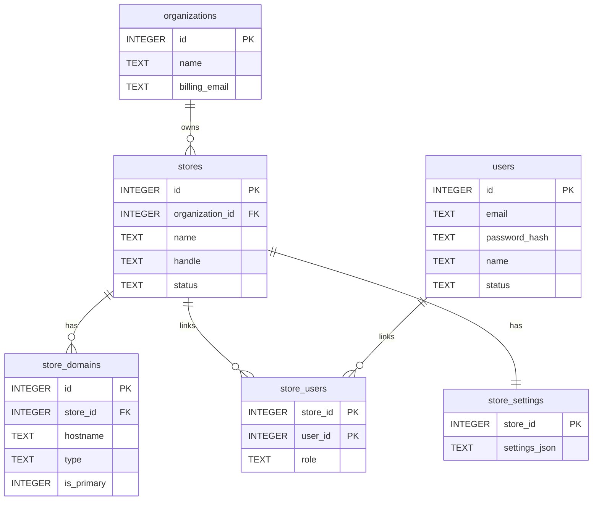
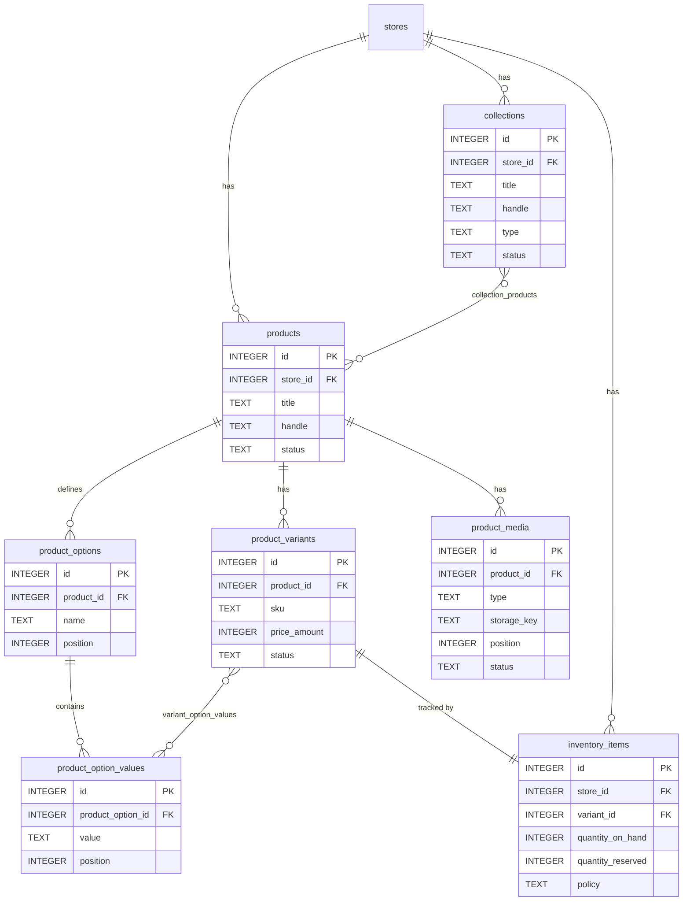
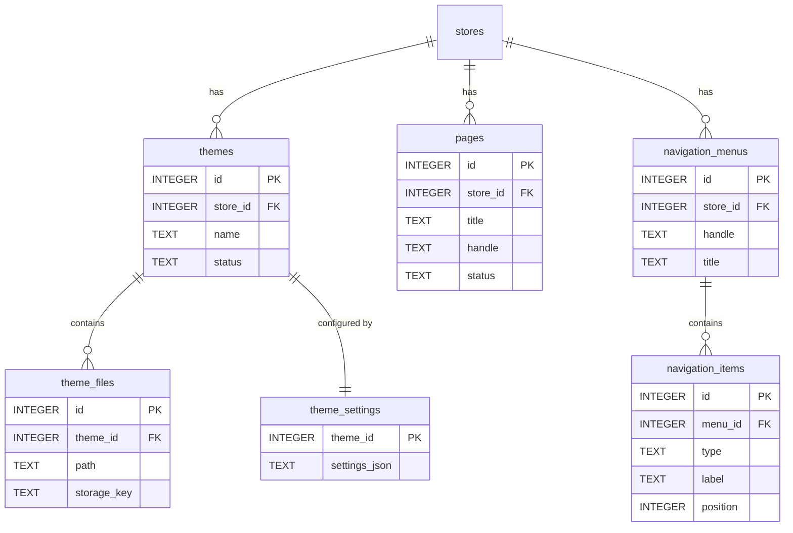
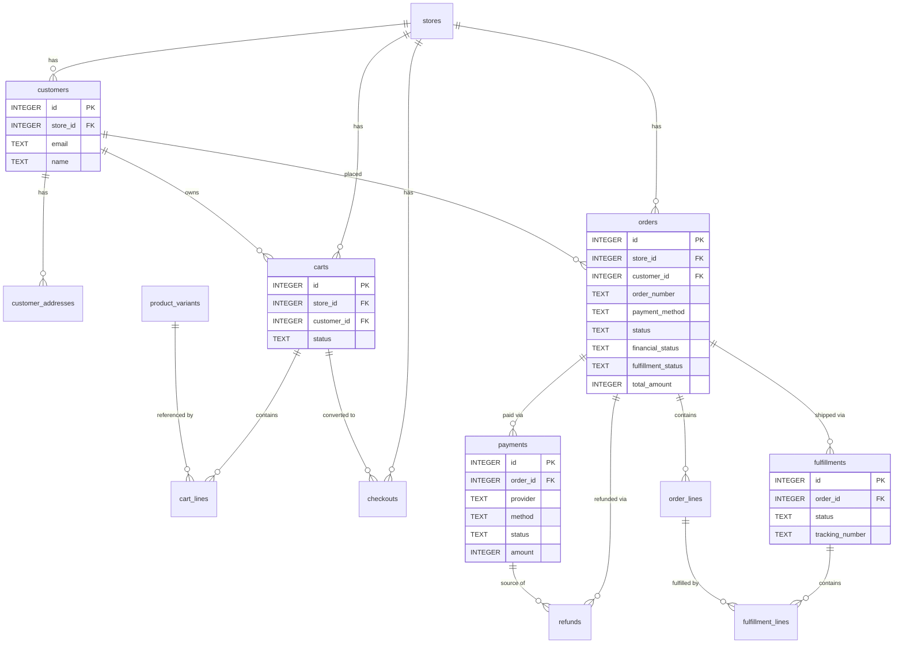
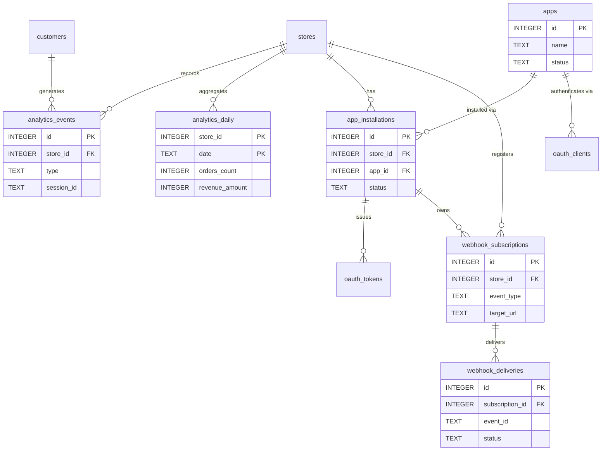

# 01 - Database Schema Specification

> E-commerce platform - SQLite database schema for Laravel 12

---

## Conventions

| Convention | Detail |
|---|---|
| Primary keys | Auto-incrementing integer primary key on every table (column: `id`) |
| Tenant isolation | `store_id` foreign key on every tenant-scoped table |
| Monetary amounts | Stored as **integer in minor units** (cents). Column names end in `_amount`. |
| Booleans | Integer, not null, default 0 (0 = false, 1 = true) |
| JSON data | Text column - Laravel casts to/from JSON at the application layer |
| Enumerations | Check constraints on text columns |
| Timestamps | Text (ISO-8601) via Laravel's `created_at` / `updated_at` |
| Soft deletes | Only where explicitly noted (`deleted_at` text, nullable) |
| Encrypted columns | Suffixed `_encrypted` - encrypted at application layer, stored as text |

---

## Epic 1 - Foundation and Multi-Store Tenancy

### organizations

Billing entity that owns one or more stores.

| Column | Type | Nullable | Default | Constraints | Notes |
|---|---|---|---|---|---|
| id | INTEGER | No | autoincrement | PRIMARY KEY | |
| name | TEXT | No | - | - | Organization display name |
| billing_email | TEXT | No | - | - | Primary billing contact |
| created_at | TEXT | Yes | NULL | - | ISO-8601 timestamp |
| updated_at | TEXT | Yes | NULL | - | ISO-8601 timestamp |

**Indexes:**

- `idx_organizations_billing_email` on (`billing_email`) - Supports lookup by billing email

---

### stores

Individual storefront belonging to an organization.

| Column | Type | Nullable | Default | Constraints | Notes |
|---|---|---|---|---|---|
| id | INTEGER | No | autoincrement | PRIMARY KEY | |
| organization_id | INTEGER | No | - | FK -> organizations(id) ON DELETE CASCADE | Parent organization |
| name | TEXT | No | - | - | Store display name |
| handle | TEXT | No | - | UNIQUE per table | URL-friendly slug |
| status | TEXT | No | 'active' | CHECK IN ('active', 'suspended') | |
| default_currency | TEXT | No | 'USD' | - | ISO 4217 currency code |
| default_locale | TEXT | No | 'en' | - | IETF locale tag |
| timezone | TEXT | No | 'UTC' | - | IANA timezone |
| created_at | TEXT | Yes | NULL | - | ISO-8601 timestamp |
| updated_at | TEXT | Yes | NULL | - | ISO-8601 timestamp |

**Indexes:**

- `idx_stores_handle` UNIQUE on (`handle`) - Ensures globally unique store handles for URL routing
- `idx_stores_organization_id` on (`organization_id`) - FK lookup and listing stores by org
- `idx_stores_status` on (`status`) - Filtering stores by active/suspended status

---

### store_domains

Custom domains attached to a store.

| Column | Type | Nullable | Default | Constraints | Notes |
|---|---|---|---|---|---|
| id | INTEGER | No | autoincrement | PRIMARY KEY | |
| store_id | INTEGER | No | - | FK -> stores(id) ON DELETE CASCADE | Owning store |
| hostname | TEXT | No | - | UNIQUE per table | e.g. "shop.example.com" |
| type | TEXT | No | 'storefront' | CHECK IN ('storefront', 'admin', 'api') | Domain purpose |
| is_primary | INTEGER | No | 0 | - | Boolean: primary domain flag |
| tls_mode | TEXT | No | 'managed' | CHECK IN ('managed', 'bring_your_own') | TLS certificate mode |
| created_at | TEXT | Yes | NULL | - | ISO-8601 timestamp |

**Indexes:**

- `idx_store_domains_hostname` UNIQUE on (`hostname`) - Globally unique hostname for routing
- `idx_store_domains_store_id` on (`store_id`) - FK lookup, listing domains per store
- `idx_store_domains_store_primary` on (`store_id`, `is_primary`) - Quick lookup of a store's primary domain

---

### users

Admin/staff users who manage stores (not storefront customers).

| Column | Type | Nullable | Default | Constraints | Notes |
|---|---|---|---|---|---|
| id | INTEGER | No | autoincrement | PRIMARY KEY | |
| email | TEXT | No | - | UNIQUE per table | Login email |
| password_hash | TEXT | No | - | - | bcrypt/argon2 hash; maps to Laravel's `password` field |
| name | TEXT | No | - | - | Display name |
| status | TEXT | No | 'active' | CHECK IN ('active', 'disabled') | |
| email_verified_at | TEXT | Yes | NULL | - | ISO-8601 timestamp; required for `verified` middleware |
| last_login_at | TEXT | Yes | NULL | - | ISO-8601 timestamp |
| two_factor_secret | TEXT | Yes | NULL | - | TOTP secret |
| two_factor_recovery_codes | TEXT | Yes | NULL | - | JSON array of recovery codes |
| two_factor_confirmed_at | TEXT | Yes | NULL | - | ISO-8601 timestamp |
| remember_token | TEXT | Yes | NULL | - | Laravel remember-me token |
| created_at | TEXT | Yes | NULL | - | ISO-8601 timestamp |
| updated_at | TEXT | Yes | NULL | - | ISO-8601 timestamp |

**Indexes:**

- `idx_users_email` UNIQUE on (`email`) - Enforces unique email, supports login lookup
- `idx_users_status` on (`status`) - Filtering users by active/disabled

**Notes:** The `two_factor_*` columns align with the existing migration `2025_08_14_170933_add_two_factor_columns_to_users_table.php`. The `password_hash` column maps to Laravel's default `password` field internally but stores a bcrypt/argon2 hash.

---

### store_users

Pivot table linking users to stores with a role. Uses composite primary key.

| Column | Type | Nullable | Default | Constraints | Notes |
|---|---|---|---|---|---|
| store_id | INTEGER | No | - | PK (composite), FK -> stores(id) ON DELETE CASCADE | |
| user_id | INTEGER | No | - | PK (composite), FK -> users(id) ON DELETE CASCADE | |
| role | TEXT | No | 'staff' | CHECK IN ('owner', 'admin', 'staff', 'support') | |
| created_at | TEXT | Yes | NULL | - | ISO-8601 timestamp |

**Primary Key:** (`store_id`, `user_id`)

**Indexes:**

- `idx_store_users_user_id` on (`user_id`) - Reverse lookup: find all stores for a user
- `idx_store_users_role` on (`store_id`, `role`) - Listing users by role within a store

---

### store_settings

Single-row-per-store JSON settings bag.

| Column | Type | Nullable | Default | Constraints | Notes |
|---|---|---|---|---|---|
| store_id | INTEGER | No | - | PRIMARY KEY, FK -> stores(id) ON DELETE CASCADE | One-to-one with stores |
| settings_json | TEXT | No | '{}' | - | JSON settings object |
| updated_at | TEXT | Yes | NULL | - | ISO-8601 timestamp |

**Notes:** No additional indexes needed - primary key on `store_id` covers all queries.

---

## Epic 2 - Catalog, Collections, Inventory, and Media

### products

Core product record, scoped to a store.

| Column | Type | Nullable | Default | Constraints | Notes |
|---|---|---|---|---|---|
| id | INTEGER | No | autoincrement | PRIMARY KEY | |
| store_id | INTEGER | No | - | FK -> stores(id) ON DELETE CASCADE | Owning store |
| title | TEXT | No | - | - | Product display title |
| handle | TEXT | No | - | UNIQUE per (store_id, handle) | URL-friendly slug |
| status | TEXT | No | 'draft' | CHECK IN ('draft', 'active', 'archived') | |
| description_html | TEXT | Yes | NULL | - | Rich-text description |
| vendor | TEXT | Yes | NULL | - | Manufacturer/brand |
| product_type | TEXT | Yes | NULL | - | Category classification |
| tags | TEXT | No | '[]' | - | JSON array, e.g. ["summer","sale"] |
| published_at | TEXT | Yes | NULL | - | ISO-8601 timestamp; null = unpublished |
| created_at | TEXT | Yes | NULL | - | ISO-8601 timestamp |
| updated_at | TEXT | Yes | NULL | - | ISO-8601 timestamp |

**Indexes:**

- `idx_products_store_handle` UNIQUE on (`store_id`, `handle`) - Unique handle per store for URL routing
- `idx_products_store_id` on (`store_id`) - FK lookup, listing all products in a store
- `idx_products_store_status` on (`store_id`, `status`) - Filtering products by status within a store
- `idx_products_published_at` on (`store_id`, `published_at`) - Sorting/filtering by publication date
- `idx_products_vendor` on (`store_id`, `vendor`) - Filtering products by vendor
- `idx_products_product_type` on (`store_id`, `product_type`) - Filtering products by type

**Notes:** `tags` is a JSON-encoded array (e.g. `["summer","sale"]`). The `handle` is unique per store, not globally.

---

### product_options

Named option dimensions for a product (e.g. Size, Color).

| Column | Type | Nullable | Default | Constraints | Notes |
|---|---|---|---|---|---|
| id | INTEGER | No | autoincrement | PRIMARY KEY | |
| product_id | INTEGER | No | - | FK -> products(id) ON DELETE CASCADE | Parent product |
| name | TEXT | No | - | - | Option name, e.g. "Size", "Color" |
| position | INTEGER | No | 0 | UNIQUE per (product_id, position) | Display ordering |

**Indexes:**

- `idx_product_options_product_id` on (`product_id`) - FK lookup, listing options per product
- `idx_product_options_product_position` UNIQUE on (`product_id`, `position`) - Enforces unique ordering per product

---

### product_option_values

Individual values within a product option (e.g. "Small", "Medium", "Large").

| Column | Type | Nullable | Default | Constraints | Notes |
|---|---|---|---|---|---|
| id | INTEGER | No | autoincrement | PRIMARY KEY | |
| product_option_id | INTEGER | No | - | FK -> product_options(id) ON DELETE CASCADE | Parent option |
| value | TEXT | No | - | - | Display value, e.g. "Small" |
| position | INTEGER | No | 0 | UNIQUE per (product_option_id, position) | Display ordering |

**Indexes:**

- `idx_product_option_values_option_id` on (`product_option_id`) - FK lookup, listing values per option
- `idx_product_option_values_option_position` UNIQUE on (`product_option_id`, `position`) - Enforces unique ordering per option

---

### product_variants

Purchasable SKU-level variant of a product.

| Column | Type | Nullable | Default | Constraints | Notes |
|---|---|---|---|---|---|
| id | INTEGER | No | autoincrement | PRIMARY KEY | |
| product_id | INTEGER | No | - | FK -> products(id) ON DELETE CASCADE | Parent product |
| sku | TEXT | Yes | NULL | - | Stock keeping unit |
| barcode | TEXT | Yes | NULL | - | UPC/EAN barcode |
| price_amount | INTEGER | No | 0 | - | Price in minor units (cents) |
| compare_at_amount | INTEGER | Yes | NULL | - | Original/compare price in minor units |
| currency | TEXT | No | 'USD' | - | ISO 4217 currency code |
| weight_g | INTEGER | Yes | NULL | - | Weight in grams |
| requires_shipping | INTEGER | No | 1 | - | Boolean: physical product flag |
| is_default | INTEGER | No | 0 | - | Boolean: default variant flag |
| position | INTEGER | No | 0 | - | Display ordering |
| status | TEXT | No | 'active' | CHECK IN ('active', 'archived') | |
| created_at | TEXT | Yes | NULL | - | ISO-8601 timestamp |
| updated_at | TEXT | Yes | NULL | - | ISO-8601 timestamp |

**Indexes:**

- `idx_product_variants_product_id` on (`product_id`) - FK lookup, listing variants per product
- `idx_product_variants_sku` on (`sku`) - SKU lookup across all variants
- `idx_product_variants_barcode` on (`barcode`) - Barcode scanning lookup
- `idx_product_variants_product_position` on (`product_id`, `position`) - Ordered variant listing
- `idx_product_variants_product_default` on (`product_id`, `is_default`) - Quick lookup of default variant

**Notes:** `price_amount` and `compare_at_amount` are in minor currency units (cents). A product always has at least one variant (the default).

---

### variant_option_values

Maps a variant to its chosen option values (e.g. variant #5 = Size:Large + Color:Red). Junction table with composite primary key.

| Column | Type | Nullable | Default | Constraints | Notes |
|---|---|---|---|---|---|
| variant_id | INTEGER | No | - | PK (composite), FK -> product_variants(id) ON DELETE CASCADE | |
| product_option_value_id | INTEGER | No | - | PK (composite), FK -> product_option_values(id) ON DELETE CASCADE | |

**Primary Key:** (`variant_id`, `product_option_value_id`)

**Indexes:**

- `idx_variant_option_values_value_id` on (`product_option_value_id`) - Reverse lookup: find all variants with a given option value

**Notes:** This is a junction table that links variants to the specific option values they represent. Required to resolve which combination of options each variant corresponds to.

---

### inventory_items

Stock tracking per variant per store.

| Column | Type | Nullable | Default | Constraints | Notes |
|---|---|---|---|---|---|
| id | INTEGER | No | autoincrement | PRIMARY KEY | |
| store_id | INTEGER | No | - | FK -> stores(id) ON DELETE CASCADE | Owning store |
| variant_id | INTEGER | No | - | FK -> product_variants(id) ON DELETE CASCADE, UNIQUE | One inventory record per variant |
| quantity_on_hand | INTEGER | No | 0 | - | Total physical stock |
| quantity_reserved | INTEGER | No | 0 | - | Stock allocated to open orders |
| policy | TEXT | No | 'deny' | CHECK IN ('deny', 'continue') | Oversell policy |

**Indexes:**

- `idx_inventory_items_variant_id` UNIQUE on (`variant_id`) - Enforces one inventory record per variant, fast variant lookup
- `idx_inventory_items_store_id` on (`store_id`) - Listing all inventory for a store

**Notes:** `quantity_on_hand` is the total physical stock. `quantity_reserved` is stock allocated to open orders not yet fulfilled. Available = on_hand - reserved. Policy `deny` prevents overselling; `continue` allows selling below zero.

---

### collections

Curated or rule-based product groupings.

| Column | Type | Nullable | Default | Constraints | Notes |
|---|---|---|---|---|---|
| id | INTEGER | No | autoincrement | PRIMARY KEY | |
| store_id | INTEGER | No | - | FK -> stores(id) ON DELETE CASCADE | Owning store |
| title | TEXT | No | - | - | Collection display title |
| handle | TEXT | No | - | UNIQUE per (store_id, handle) | URL-friendly slug |
| description_html | TEXT | Yes | NULL | - | Rich-text description |
| type | TEXT | No | 'manual' | CHECK IN ('manual', 'automated') | Collection type: manual curation or rule-based automation |
| status | TEXT | No | 'active' | CHECK IN ('draft', 'active', 'archived') | |
| created_at | TEXT | Yes | NULL | - | ISO-8601 timestamp |
| updated_at | TEXT | Yes | NULL | - | ISO-8601 timestamp |

**Indexes:**

- `idx_collections_store_handle` UNIQUE on (`store_id`, `handle`) - Unique handle per store for URL routing
- `idx_collections_store_id` on (`store_id`) - FK lookup, listing all collections in a store
- `idx_collections_store_status` on (`store_id`, `status`) - Filtering collections by status

---

### collection_products

Pivot linking products to collections with ordering. Composite primary key.

| Column | Type | Nullable | Default | Constraints | Notes |
|---|---|---|---|---|---|
| collection_id | INTEGER | No | - | PK (composite), FK -> collections(id) ON DELETE CASCADE | |
| product_id | INTEGER | No | - | PK (composite), FK -> products(id) ON DELETE CASCADE | |
| position | INTEGER | No | 0 | - | Display ordering within collection |

**Primary Key:** (`collection_id`, `product_id`)

**Indexes:**

- `idx_collection_products_product_id` on (`product_id`) - Reverse lookup: find all collections containing a product
- `idx_collection_products_position` on (`collection_id`, `position`) - Ordered product listing within a collection

---

### product_media

Images and videos attached to a product.

| Column | Type | Nullable | Default | Constraints | Notes |
|---|---|---|---|---|---|
| id | INTEGER | No | autoincrement | PRIMARY KEY | |
| product_id | INTEGER | No | - | FK -> products(id) ON DELETE CASCADE | Parent product |
| type | TEXT | No | 'image' | CHECK IN ('image', 'video') | Media type |
| storage_key | TEXT | No | - | - | File storage path/key |
| alt_text | TEXT | Yes | NULL | - | Accessibility alt text |
| width | INTEGER | Yes | NULL | - | Pixel width |
| height | INTEGER | Yes | NULL | - | Pixel height |
| mime_type | TEXT | Yes | NULL | - | e.g. "image/jpeg" |
| byte_size | INTEGER | Yes | NULL | - | File size in bytes |
| position | INTEGER | No | 0 | - | Display ordering |
| status | TEXT | No | 'processing' | CHECK IN ('processing', 'ready', 'failed') | Processing status |
| created_at | TEXT | Yes | NULL | - | ISO-8601 timestamp |

**Indexes:**

- `idx_product_media_product_id` on (`product_id`) - FK lookup, listing media per product
- `idx_product_media_product_position` on (`product_id`, `position`) - Ordered media listing
- `idx_product_media_status` on (`status`) - Finding media by processing status

---

## Epic 3 - Themes, Storefront, and Localization

### themes

Storefront theme definitions per store.

| Column | Type | Nullable | Default | Constraints | Notes |
|---|---|---|---|---|---|
| id | INTEGER | No | autoincrement | PRIMARY KEY | |
| store_id | INTEGER | No | - | FK -> stores(id) ON DELETE CASCADE | Owning store |
| name | TEXT | No | - | - | Theme display name |
| version | TEXT | Yes | NULL | - | Semantic version string |
| status | TEXT | No | 'draft' | CHECK IN ('draft', 'published') | |
| published_at | TEXT | Yes | NULL | - | ISO-8601 timestamp |
| created_at | TEXT | Yes | NULL | - | ISO-8601 timestamp |
| updated_at | TEXT | Yes | NULL | - | ISO-8601 timestamp |

**Indexes:**

- `idx_themes_store_id` on (`store_id`) - FK lookup, listing themes per store
- `idx_themes_store_status` on (`store_id`, `status`) - Finding published/draft themes per store

---

### theme_files

Individual files belonging to a theme (templates, assets, snippets).

| Column | Type | Nullable | Default | Constraints | Notes |
|---|---|---|---|---|---|
| id | INTEGER | No | autoincrement | PRIMARY KEY | |
| theme_id | INTEGER | No | - | FK -> themes(id) ON DELETE CASCADE | Parent theme |
| path | TEXT | No | - | UNIQUE per (theme_id, path) | File path within theme |
| storage_key | TEXT | No | - | - | File storage path/key |
| sha256 | TEXT | No | - | - | Content hash for cache busting |
| byte_size | INTEGER | No | 0 | - | File size in bytes |

**Indexes:**

- `idx_theme_files_theme_path` UNIQUE on (`theme_id`, `path`) - Enforces unique file paths per theme
- `idx_theme_files_theme_id` on (`theme_id`) - FK lookup, listing files per theme

---

### theme_settings

Single-row JSON configuration per theme.

| Column | Type | Nullable | Default | Constraints | Notes |
|---|---|---|---|---|---|
| theme_id | INTEGER | No | - | PRIMARY KEY, FK -> themes(id) ON DELETE CASCADE | One-to-one with themes |
| settings_json | TEXT | No | '{}' | - | JSON settings object |
| updated_at | TEXT | Yes | NULL | - | ISO-8601 timestamp |

---

### pages

Static CMS pages (About Us, Contact, etc.).

| Column | Type | Nullable | Default | Constraints | Notes |
|---|---|---|---|---|---|
| id | INTEGER | No | autoincrement | PRIMARY KEY | |
| store_id | INTEGER | No | - | FK -> stores(id) ON DELETE CASCADE | Owning store |
| title | TEXT | No | - | - | Page title |
| handle | TEXT | No | - | UNIQUE per (store_id, handle) | URL-friendly slug |
| body_html | TEXT | Yes | NULL | - | Rich-text content |
| status | TEXT | No | 'draft' | CHECK IN ('draft', 'published', 'archived') | |
| published_at | TEXT | Yes | NULL | - | ISO-8601 timestamp |
| created_at | TEXT | Yes | NULL | - | ISO-8601 timestamp |
| updated_at | TEXT | Yes | NULL | - | ISO-8601 timestamp |

**Indexes:**

- `idx_pages_store_handle` UNIQUE on (`store_id`, `handle`) - Unique handle per store for URL routing
- `idx_pages_store_id` on (`store_id`) - FK lookup, listing pages per store
- `idx_pages_store_status` on (`store_id`, `status`) - Filtering pages by status

---

### navigation_menus

Named menus (e.g. main-menu, footer-menu).

| Column | Type | Nullable | Default | Constraints | Notes |
|---|---|---|---|---|---|
| id | INTEGER | No | autoincrement | PRIMARY KEY | |
| store_id | INTEGER | No | - | FK -> stores(id) ON DELETE CASCADE | Owning store |
| handle | TEXT | No | - | UNIQUE per (store_id, handle) | e.g. "main-menu" |
| title | TEXT | No | - | - | Display title |
| created_at | TEXT | Yes | NULL | - | ISO-8601 timestamp |
| updated_at | TEXT | Yes | NULL | - | ISO-8601 timestamp |

**Indexes:**

- `idx_navigation_menus_store_handle` UNIQUE on (`store_id`, `handle`) - Unique handle per store
- `idx_navigation_menus_store_id` on (`store_id`) - FK lookup, listing menus per store

---

### navigation_items

Individual links within a navigation menu (supports nesting via position).

| Column | Type | Nullable | Default | Constraints | Notes |
|---|---|---|---|---|---|
| id | INTEGER | No | autoincrement | PRIMARY KEY | |
| menu_id | INTEGER | No | - | FK -> navigation_menus(id) ON DELETE CASCADE | Parent menu |
| type | TEXT | No | 'link' | CHECK IN ('link', 'page', 'collection', 'product') | Item type |
| label | TEXT | No | - | - | Display label |
| url | TEXT | Yes | NULL | - | Direct URL (used when type = 'link') |
| resource_id | INTEGER | Yes | NULL | - | FK to pages/collections/products (polymorphic) |
| position | INTEGER | No | 0 | - | Display ordering |

**Indexes:**

- `idx_navigation_items_menu_id` on (`menu_id`) - FK lookup, listing items per menu
- `idx_navigation_items_menu_position` on (`menu_id`, `position`) - Ordered item listing

**Notes:** When `type` is `link`, the `url` field is used directly. When `type` is `page`, `collection`, or `product`, the `resource_id` points to the respective table's `id`. The URL is resolved at render time.

---

## Epic 4 - Search

### search_settings

Per-store search configuration (synonyms, stop words).

| Column | Type | Nullable | Default | Constraints | Notes |
|---|---|---|---|---|---|
| store_id | INTEGER | No | - | PRIMARY KEY, FK -> stores(id) ON DELETE CASCADE | One-to-one with stores |
| synonyms_json | TEXT | No | '[]' | - | JSON array of synonym groups |
| stop_words_json | TEXT | No | '[]' | - | JSON array of stop words |
| updated_at | TEXT | Yes | NULL | - | ISO-8601 timestamp |

---

### search_queries

Search query log for analytics and autocomplete.

| Column | Type | Nullable | Default | Constraints | Notes |
|---|---|---|---|---|---|
| id | INTEGER | No | autoincrement | PRIMARY KEY | |
| store_id | INTEGER | No | - | FK -> stores(id) ON DELETE CASCADE | Owning store |
| query | TEXT | No | - | - | Search query text |
| filters_json | TEXT | Yes | NULL | - | JSON object of applied filters |
| results_count | INTEGER | No | 0 | - | Number of results returned |
| created_at | TEXT | Yes | NULL | - | ISO-8601 timestamp |

**Indexes:**

- `idx_search_queries_store_id` on (`store_id`) - FK lookup
- `idx_search_queries_store_created` on (`store_id`, `created_at`) - Time-range queries per store
- `idx_search_queries_store_query` on (`store_id`, `query`) - Autocomplete and popular search lookups

---

## Epic 5 - Cart, Checkout, Discounts, Shipping, and Taxes

### carts

Shopping cart, optionally linked to a customer.

| Column | Type | Nullable | Default | Constraints | Notes |
|---|---|---|---|---|---|
| id | INTEGER | No | autoincrement | PRIMARY KEY | |
| store_id | INTEGER | No | - | FK -> stores(id) ON DELETE CASCADE | Owning store |
| customer_id | INTEGER | Yes | NULL | FK -> customers(id) ON DELETE SET NULL | Nullable for guest carts |
| currency | TEXT | No | 'USD' | - | ISO 4217 currency code |
| cart_version | INTEGER | No | 1 | - | Optimistic concurrency version counter |
| status | TEXT | No | 'active' | CHECK IN ('active', 'converted', 'abandoned') | |
| created_at | TEXT | Yes | NULL | - | ISO-8601 timestamp |
| updated_at | TEXT | Yes | NULL | - | ISO-8601 timestamp |

**Indexes:**

- `idx_carts_store_id` on (`store_id`) - FK lookup
- `idx_carts_customer_id` on (`customer_id`) - Finding carts by customer
- `idx_carts_store_status` on (`store_id`, `status`) - Filtering carts by status (e.g. abandoned cart recovery)

**Notes:** `cart_version` is incremented on every mutation and used for optimistic concurrency control.

---

### cart_lines

Individual line items within a cart.

| Column | Type | Nullable | Default | Constraints | Notes |
|---|---|---|---|---|---|
| id | INTEGER | No | autoincrement | PRIMARY KEY | |
| cart_id | INTEGER | No | - | FK -> carts(id) ON DELETE CASCADE | Parent cart |
| variant_id | INTEGER | No | - | FK -> product_variants(id) ON DELETE CASCADE | Variant being purchased |
| quantity | INTEGER | No | 1 | - | Number of units |
| unit_price_amount | INTEGER | No | 0 | - | Price per unit in minor units |
| line_subtotal_amount | INTEGER | No | 0 | - | unit_price * quantity |
| line_discount_amount | INTEGER | No | 0 | - | Discount applied to this line |
| line_total_amount | INTEGER | No | 0 | - | subtotal - discount |

**Indexes:**

- `idx_cart_lines_cart_id` on (`cart_id`) - FK lookup, listing lines per cart
- `idx_cart_lines_cart_variant` UNIQUE on (`cart_id`, `variant_id`) - Prevents duplicate variants in the same cart

**Notes:** All `_amount` columns are in minor units (cents). `line_subtotal_amount = unit_price_amount * quantity`. `line_total_amount = line_subtotal_amount - line_discount_amount`.

---

### checkouts

Checkout session progressing through address, shipping, payment steps.

| Column | Type | Nullable | Default | Constraints | Notes |
|---|---|---|---|---|---|
| id | INTEGER | No | autoincrement | PRIMARY KEY | |
| store_id | INTEGER | No | - | FK -> stores(id) ON DELETE CASCADE | Owning store |
| cart_id | INTEGER | No | - | FK -> carts(id) ON DELETE CASCADE | Source cart |
| customer_id | INTEGER | Yes | NULL | FK -> customers(id) ON DELETE SET NULL | Nullable for guest checkout |
| status | TEXT | No | 'started' | CHECK IN ('started', 'addressed', 'shipping_selected', 'payment_selected', 'completed', 'expired') | |
| payment_method | TEXT | Yes | NULL | CHECK IN ('credit_card', 'paypal', 'bank_transfer') | Selected payment method |
| email | TEXT | Yes | NULL | - | Contact email |
| shipping_address_json | TEXT | Yes | NULL | - | JSON address object |
| billing_address_json | TEXT | Yes | NULL | - | JSON address object |
| shipping_method_id | INTEGER | Yes | NULL | - | Selected shipping rate |
| discount_code | TEXT | Yes | NULL | - | Applied discount code |
| tax_provider_snapshot_json | TEXT | Yes | NULL | - | Full tax calculation response for audit |
| totals_json | TEXT | Yes | NULL | - | Snapshot: subtotal, discount, shipping, tax, total |
| expires_at | TEXT | Yes | NULL | - | ISO-8601 expiration timestamp |
| created_at | TEXT | Yes | NULL | - | ISO-8601 timestamp |
| updated_at | TEXT | Yes | NULL | - | ISO-8601 timestamp |

**Indexes:**

- `idx_checkouts_store_id` on (`store_id`) - FK lookup
- `idx_checkouts_cart_id` on (`cart_id`) - Finding checkout for a cart
- `idx_checkouts_customer_id` on (`customer_id`) - Listing checkouts per customer
- `idx_checkouts_status` on (`store_id`, `status`) - Filtering checkouts by status
- `idx_checkouts_expires_at` on (`expires_at`) - Cleanup of expired checkouts

**Notes:** `totals_json` contains a snapshot: `{"subtotal": 5000, "discount": 500, "shipping": 799, "tax": 430, "total": 5729}`. `tax_provider_snapshot_json` stores the full tax calculation response for audit purposes.

---

### shipping_zones

Geographic shipping zones for a store.

| Column | Type | Nullable | Default | Constraints | Notes |
|---|---|---|---|---|---|
| id | INTEGER | No | autoincrement | PRIMARY KEY | |
| store_id | INTEGER | No | - | FK -> stores(id) ON DELETE CASCADE | Owning store |
| name | TEXT | No | - | - | Zone display name |
| countries_json | TEXT | No | '[]' | - | JSON array of ISO 3166-1 alpha-2 codes, e.g. ["US","CA"] |
| regions_json | TEXT | No | '[]' | - | JSON array of region/state codes, e.g. ["US-NY","US-CA"] |

**Indexes:**

- `idx_shipping_zones_store_id` on (`store_id`) - FK lookup, listing zones per store

**Notes:** `countries_json` is an array of ISO 3166-1 alpha-2 codes. `regions_json` is an array of region/state codes.

---

### shipping_rates

Shipping rate options within a zone.

| Column | Type | Nullable | Default | Constraints | Notes |
|---|---|---|---|---|---|
| id | INTEGER | No | autoincrement | PRIMARY KEY | |
| zone_id | INTEGER | No | - | FK -> shipping_zones(id) ON DELETE CASCADE | Parent zone |
| name | TEXT | No | - | - | Rate display name |
| type | TEXT | No | 'flat' | CHECK IN ('flat', 'weight', 'price', 'carrier') | Calculation method |
| config_json | TEXT | No | '{}' | - | Type-dependent configuration (see notes) |
| is_active | INTEGER | No | 1 | - | Boolean: active flag |

**Indexes:**

- `idx_shipping_rates_zone_id` on (`zone_id`) - FK lookup, listing rates per zone
- `idx_shipping_rates_zone_active` on (`zone_id`, `is_active`) - Finding active rates per zone

**Notes:** `config_json` structure depends on `type`:
- Flat: `{"amount": 799}`
- Weight: `{"ranges": [{"min_g": 0, "max_g": 500, "amount": 499}]}`
- Price: `{"ranges": [{"min_amount": 0, "max_amount": 5000, "amount": 799}]}`
- Carrier: `{"carrier": "ups", "service": "ground"}`

---

### tax_settings

Per-store tax configuration.

| Column | Type | Nullable | Default | Constraints | Notes |
|---|---|---|---|---|---|
| store_id | INTEGER | No | - | PRIMARY KEY, FK -> stores(id) ON DELETE CASCADE | One-to-one with stores |
| mode | TEXT | No | 'manual' | CHECK IN ('manual', 'provider') | Tax calculation mode |
| provider | TEXT | No | 'none' | CHECK IN ('stripe_tax', 'none') | External tax provider |
| prices_include_tax | INTEGER | No | 0 | - | Boolean: tax-inclusive pricing |
| config_json | TEXT | No | '{}' | - | Provider-specific config |

---

### discounts

Discount codes and automatic discounts.

| Column | Type | Nullable | Default | Constraints | Notes |
|---|---|---|---|---|---|
| id | INTEGER | No | autoincrement | PRIMARY KEY | |
| store_id | INTEGER | No | - | FK -> stores(id) ON DELETE CASCADE | Owning store |
| type | TEXT | No | 'code' | CHECK IN ('code', 'automatic') | Activation method |
| code | TEXT | Yes | NULL | UNIQUE per (store_id, code) | Discount code (null for automatic) |
| value_type | TEXT | No | - | CHECK IN ('fixed', 'percent', 'free_shipping') | Discount calculation type |
| value_amount | INTEGER | No | 0 | - | See notes for interpretation |
| starts_at | TEXT | No | - | - | ISO-8601 start timestamp |
| ends_at | TEXT | Yes | NULL | - | ISO-8601 end timestamp; null = no expiry |
| usage_limit | INTEGER | Yes | NULL | - | Max redemptions; null = unlimited |
| usage_count | INTEGER | No | 0 | - | Current redemption count |
| rules_json | TEXT | No | '{}' | - | Eligibility rules (min purchase, products, etc.) |
| status | TEXT | No | 'active' | CHECK IN ('draft', 'active', 'expired', 'disabled') | |
| created_at | TEXT | Yes | NULL | - | ISO-8601 timestamp |
| updated_at | TEXT | Yes | NULL | - | ISO-8601 timestamp |

**Indexes:**

- `idx_discounts_store_code` UNIQUE on (`store_id`, `code`) - Unique discount code per store
- `idx_discounts_store_id` on (`store_id`) - FK lookup
- `idx_discounts_store_status` on (`store_id`, `status`) - Filtering discounts by status
- `idx_discounts_store_type` on (`store_id`, `type`) - Filtering by code vs automatic

**Notes:** `value_amount` interpretation depends on `value_type`. For `percent`, it is a whole number (e.g. 15 = 15%). For `fixed`, it is in minor units (cents). For `free_shipping`, it is ignored. `rules_json` may contain minimum purchase amounts, applicable product/collection IDs, customer eligibility, etc.

---

## Epic 6 - Payments, Orders, Fulfillment, and Customers

### customers

Storefront customer accounts, scoped to a store.

| Column | Type | Nullable | Default | Constraints | Notes |
|---|---|---|---|---|---|
| id | INTEGER | No | autoincrement | PRIMARY KEY | |
| store_id | INTEGER | No | - | FK -> stores(id) ON DELETE CASCADE | Owning store |
| email | TEXT | No | - | UNIQUE per (store_id, email) | Customer email |
| password_hash | TEXT | Yes | NULL | - | Nullable for guest checkout customers |
| name | TEXT | Yes | NULL | - | Display name |
| marketing_opt_in | INTEGER | No | 0 | - | Boolean: marketing consent |
| created_at | TEXT | Yes | NULL | - | ISO-8601 timestamp |
| updated_at | TEXT | Yes | NULL | - | ISO-8601 timestamp |

**Indexes:**

- `idx_customers_store_email` UNIQUE on (`store_id`, `email`) - Unique email per store
- `idx_customers_store_id` on (`store_id`) - FK lookup, listing customers per store

**Notes:** `password_hash` is nullable to allow guest checkout customers who may later claim their account. Email is unique per store, not globally.

---

### customer_addresses

Saved addresses for a customer.

| Column | Type | Nullable | Default | Constraints | Notes |
|---|---|---|---|---|---|
| id | INTEGER | No | autoincrement | PRIMARY KEY | |
| customer_id | INTEGER | No | - | FK -> customers(id) ON DELETE CASCADE | Owning customer |
| label | TEXT | Yes | NULL | - | User label, e.g. "Home", "Work" |
| address_json | TEXT | No | '{}' | - | JSON address object (see notes) |
| is_default | INTEGER | No | 0 | - | Boolean: default address flag |

**Indexes:**

- `idx_customer_addresses_customer_id` on (`customer_id`) - FK lookup, listing addresses per customer
- `idx_customer_addresses_default` on (`customer_id`, `is_default`) - Quick lookup of default address

**Notes:** `address_json` structure: `{"first_name": "", "last_name": "", "company": "", "address1": "", "address2": "", "city": "", "province": "", "province_code": "", "country": "", "country_code": "", "zip": "", "phone": ""}`.

---

### orders

Placed orders with financial and fulfillment tracking.

| Column | Type | Nullable | Default | Constraints | Notes |
|---|---|---|---|---|---|
| id | INTEGER | No | autoincrement | PRIMARY KEY | |
| store_id | INTEGER | No | - | FK -> stores(id) ON DELETE CASCADE | Owning store |
| customer_id | INTEGER | Yes | NULL | FK -> customers(id) ON DELETE SET NULL | Nullable for guest orders |
| order_number | TEXT | No | - | UNIQUE per (store_id, order_number) | Human-readable order number |
| payment_method | TEXT | No | - | CHECK IN ('credit_card', 'paypal', 'bank_transfer') | Payment method used for this order |
| status | TEXT | No | 'pending' | CHECK IN ('pending', 'paid', 'fulfilled', 'cancelled', 'refunded') | Overall order status |
| financial_status | TEXT | No | 'pending' | CHECK IN ('pending', 'authorized', 'paid', 'partially_refunded', 'refunded', 'voided') | Payment status |
| fulfillment_status | TEXT | No | 'unfulfilled' | CHECK IN ('unfulfilled', 'partial', 'fulfilled') | Shipping status |
| currency | TEXT | No | 'USD' | - | ISO 4217 currency code |
| subtotal_amount | INTEGER | No | 0 | - | Sum of line items in minor units |
| discount_amount | INTEGER | No | 0 | - | Total discount in minor units |
| shipping_amount | INTEGER | No | 0 | - | Shipping cost in minor units |
| tax_amount | INTEGER | No | 0 | - | Total tax in minor units |
| total_amount | INTEGER | No | 0 | - | Grand total in minor units |
| email | TEXT | Yes | NULL | - | Contact email at time of order |
| billing_address_json | TEXT | Yes | NULL | - | JSON address snapshot |
| shipping_address_json | TEXT | Yes | NULL | - | JSON address snapshot |
| placed_at | TEXT | Yes | NULL | - | ISO-8601 timestamp of placement |
| created_at | TEXT | Yes | NULL | - | ISO-8601 timestamp |
| updated_at | TEXT | Yes | NULL | - | ISO-8601 timestamp |

**Indexes:**

- `idx_orders_store_order_number` UNIQUE on (`store_id`, `order_number`) - Unique order number per store
- `idx_orders_store_id` on (`store_id`) - FK lookup
- `idx_orders_customer_id` on (`customer_id`) - Listing orders per customer
- `idx_orders_store_status` on (`store_id`, `status`) - Filtering by overall status
- `idx_orders_store_financial` on (`store_id`, `financial_status`) - Filtering by payment status
- `idx_orders_store_fulfillment` on (`store_id`, `fulfillment_status`) - Filtering by shipping status
- `idx_orders_placed_at` on (`store_id`, `placed_at`) - Date-range order queries

---

### order_lines

Individual items within an order. Contains snapshots of product data at time of purchase.

| Column | Type | Nullable | Default | Constraints | Notes |
|---|---|---|---|---|---|
| id | INTEGER | No | autoincrement | PRIMARY KEY | |
| order_id | INTEGER | No | - | FK -> orders(id) ON DELETE CASCADE | Parent order |
| product_id | INTEGER | Yes | NULL | FK -> products(id) ON DELETE SET NULL | Nullable: survives product deletion |
| variant_id | INTEGER | Yes | NULL | FK -> product_variants(id) ON DELETE SET NULL | Nullable: survives variant deletion |
| title_snapshot | TEXT | No | - | - | Product title at time of purchase |
| sku_snapshot | TEXT | Yes | NULL | - | SKU at time of purchase |
| quantity | INTEGER | No | 1 | - | Number of units |
| unit_price_amount | INTEGER | No | 0 | - | Price per unit in minor units |
| total_amount | INTEGER | No | 0 | - | Line total in minor units |
| tax_lines_json | TEXT | No | '[]' | - | JSON array of tax line items |
| discount_allocations_json | TEXT | No | '[]' | - | JSON array of discount allocations |

**Indexes:**

- `idx_order_lines_order_id` on (`order_id`) - FK lookup, listing lines per order
- `idx_order_lines_product_id` on (`product_id`) - Finding order lines by product
- `idx_order_lines_variant_id` on (`variant_id`) - Finding order lines by variant

**Notes:** `product_id` and `variant_id` are nullable with SET NULL on delete so that order history survives product deletion. `tax_lines_json` example: `[{"title": "State Tax", "rate": 800, "amount": 400}]` (rate in basis points, e.g. 800 = 8%). `discount_allocations_json` example: `[{"discount_id": 5, "amount": 250}]`.

---

### payments

Payment attempts and captures for an order.

| Column | Type | Nullable | Default | Constraints | Notes |
|---|---|---|---|---|---|
| id | INTEGER | No | autoincrement | PRIMARY KEY | |
| order_id | INTEGER | No | - | FK -> orders(id) ON DELETE CASCADE | Parent order |
| provider | TEXT | No | 'mock' | CHECK IN ('mock') | Payment provider (mock PSP only) |
| method | TEXT | No | - | CHECK IN ('credit_card', 'paypal', 'bank_transfer') | Payment method used |
| provider_payment_id | TEXT | Yes | NULL | - | Mock payment reference ID |
| status | TEXT | No | 'pending' | CHECK IN ('pending', 'captured', 'failed', 'refunded') | |
| amount | INTEGER | No | 0 | - | Payment amount in minor units |
| currency | TEXT | No | 'USD' | - | ISO 4217 currency code |
| raw_json_encrypted | TEXT | Yes | NULL | - | Encrypted provider response (PCI compliance) |
| created_at | TEXT | Yes | NULL | - | ISO-8601 timestamp |

**Indexes:**

- `idx_payments_order_id` on (`order_id`) - FK lookup, listing payments per order
- `idx_payments_provider_id` on (`provider`, `provider_payment_id`) - Payment reconciliation by provider ID
- `idx_payments_method` on (`method`) - Filtering payments by method
- `idx_payments_status` on (`status`) - Filtering payments by status

**Notes:** `raw_json_encrypted` stores the mock payment provider response, encrypted at the application layer. `amount` is in minor units (cents). The `provider` is always `mock` since the platform uses a mock PSP (no real payment gateway integration). The `method` column records which payment method the customer selected (credit_card, paypal, or bank_transfer).

---

### refunds

Refund records linked to an order and payment.

| Column | Type | Nullable | Default | Constraints | Notes |
|---|---|---|---|---|---|
| id | INTEGER | No | autoincrement | PRIMARY KEY | |
| order_id | INTEGER | No | - | FK -> orders(id) ON DELETE CASCADE | Parent order |
| payment_id | INTEGER | No | - | FK -> payments(id) ON DELETE CASCADE | Source payment |
| amount | INTEGER | No | 0 | - | Refund amount in minor units |
| reason | TEXT | Yes | NULL | - | Refund reason |
| status | TEXT | No | 'pending' | CHECK IN ('pending', 'processed', 'failed') | |
| provider_refund_id | TEXT | Yes | NULL | - | External refund ID |
| created_at | TEXT | Yes | NULL | - | ISO-8601 timestamp |

**Indexes:**

- `idx_refunds_order_id` on (`order_id`) - FK lookup, listing refunds per order
- `idx_refunds_payment_id` on (`payment_id`) - Finding refunds per payment
- `idx_refunds_status` on (`status`) - Filtering refunds by status

---

### fulfillments

Shipment tracking for order fulfillment.

| Column | Type | Nullable | Default | Constraints | Notes |
|---|---|---|---|---|---|
| id | INTEGER | No | autoincrement | PRIMARY KEY | |
| order_id | INTEGER | No | - | FK -> orders(id) ON DELETE CASCADE | Parent order |
| status | TEXT | No | 'pending' | CHECK IN ('pending', 'shipped', 'delivered') | |
| tracking_company | TEXT | Yes | NULL | - | Carrier name |
| tracking_number | TEXT | Yes | NULL | - | Tracking number |
| tracking_url | TEXT | Yes | NULL | - | Tracking page URL |
| shipped_at | TEXT | Yes | NULL | - | ISO-8601 timestamp |
| created_at | TEXT | Yes | NULL | - | ISO-8601 timestamp |

**Indexes:**

- `idx_fulfillments_order_id` on (`order_id`) - FK lookup, listing fulfillments per order
- `idx_fulfillments_status` on (`status`) - Filtering fulfillments by status
- `idx_fulfillments_tracking` on (`tracking_company`, `tracking_number`) - Tracking number lookup

---

### fulfillment_lines

Links specific order lines and quantities to a fulfillment.

| Column | Type | Nullable | Default | Constraints | Notes |
|---|---|---|---|---|---|
| id | INTEGER | No | autoincrement | PRIMARY KEY | |
| fulfillment_id | INTEGER | No | - | FK -> fulfillments(id) ON DELETE CASCADE | Parent fulfillment |
| order_line_id | INTEGER | No | - | FK -> order_lines(id) ON DELETE CASCADE | Source order line |
| quantity | INTEGER | No | 1 | - | Units fulfilled from this line |

**Indexes:**

- `idx_fulfillment_lines_fulfillment_id` on (`fulfillment_id`) - FK lookup, listing lines per fulfillment
- `idx_fulfillment_lines_fulfillment_order_line` UNIQUE on (`fulfillment_id`, `order_line_id`) - Prevents duplicate line entries per fulfillment

**Notes:** An order with multiple line items may be partially fulfilled. This table tracks how many units of each line item are included in each shipment.

---

## Epic 7 - Analytics

### analytics_events

Raw event stream for storefront analytics.

| Column | Type | Nullable | Default | Constraints | Notes |
|---|---|---|---|---|---|
| id | INTEGER | No | autoincrement | PRIMARY KEY | |
| store_id | INTEGER | No | - | FK -> stores(id) ON DELETE CASCADE | Owning store |
| type | TEXT | No | - | - | Event type (see notes) |
| session_id | TEXT | Yes | NULL | - | Browser session identifier |
| customer_id | INTEGER | Yes | NULL | FK -> customers(id) ON DELETE SET NULL | Nullable for anonymous visitors |
| properties_json | TEXT | No | '{}' | - | Event-specific data as JSON |
| client_event_id | TEXT | Yes | NULL | UNIQUE per (store_id, client_event_id) | Client-provided idempotency key for deduplication |
| occurred_at | TEXT | Yes | NULL | - | ISO-8601 timestamp of when the event actually occurred on the client |
| created_at | TEXT | Yes | NULL | - | ISO-8601 timestamp |

**Indexes:**

- `idx_analytics_events_store_id` on (`store_id`) - FK lookup
- `idx_analytics_events_store_type` on (`store_id`, `type`) - Filtering events by type per store
- `idx_analytics_events_store_created` on (`store_id`, `created_at`) - Time-range event queries
- `idx_analytics_events_session` on (`session_id`) - Session-based event grouping
- `idx_analytics_events_customer` on (`customer_id`) - Customer activity history
- `idx_analytics_events_client_event` UNIQUE on (`store_id`, `client_event_id`) - Client-side event deduplication

**Notes:** Event types include: `page_view`, `product_view`, `add_to_cart`, `remove_from_cart`, `checkout_started`, `checkout_completed`, `search`. This table will grow fast - consider periodic archiving or partitioning by date for production workloads beyond SQLite.

---

### analytics_daily

Pre-aggregated daily metrics per store. Composite primary key.

| Column | Type | Nullable | Default | Constraints | Notes |
|---|---|---|---|---|---|
| store_id | INTEGER | No | - | PK (composite), FK -> stores(id) ON DELETE CASCADE | |
| date | TEXT | No | - | PK (composite) | ISO-8601 date (YYYY-MM-DD) |
| orders_count | INTEGER | No | 0 | - | Number of orders placed |
| revenue_amount | INTEGER | No | 0 | - | Total revenue in minor units |
| aov_amount | INTEGER | No | 0 | - | Average order value in minor units |
| visits_count | INTEGER | No | 0 | - | Unique sessions |
| add_to_cart_count | INTEGER | No | 0 | - | Add-to-cart events |
| checkout_started_count | INTEGER | No | 0 | - | Checkout-started events |
| checkout_completed_count | INTEGER | No | 0 | - | Checkout-completed events |

**Primary Key:** (`store_id`, `date`)

**Indexes:**

- `idx_analytics_daily_store_date` on (`store_id`, `date`) - Time-range metric queries (covered by PK but explicit for clarity)

**Notes:** `date` is an ISO-8601 date string (YYYY-MM-DD). `revenue_amount` and `aov_amount` (average order value) are in minor units (cents). This table is populated by a scheduled aggregation job.

---

## Epic 8 - Apps and Webhooks

### apps

Third-party or first-party application registry.

| Column | Type | Nullable | Default | Constraints | Notes |
|---|---|---|---|---|---|
| id | INTEGER | No | autoincrement | PRIMARY KEY | |
| name | TEXT | No | - | - | App display name |
| status | TEXT | No | 'active' | CHECK IN ('active', 'disabled') | |
| created_at | TEXT | Yes | NULL | - | ISO-8601 timestamp |

**Indexes:**

- `idx_apps_status` on (`status`) - Filtering apps by status

---

### app_installations

Installation of an app on a specific store.

| Column | Type | Nullable | Default | Constraints | Notes |
|---|---|---|---|---|---|
| id | INTEGER | No | autoincrement | PRIMARY KEY | |
| store_id | INTEGER | No | - | FK -> stores(id) ON DELETE CASCADE | |
| app_id | INTEGER | No | - | FK -> apps(id) ON DELETE CASCADE | |
| scopes_json | TEXT | No | '[]' | - | JSON array of granted permission scopes |
| status | TEXT | No | 'active' | CHECK IN ('active', 'suspended', 'uninstalled') | |
| installed_at | TEXT | Yes | NULL | - | ISO-8601 timestamp |

**Indexes:**

- `idx_app_installations_store_app` UNIQUE on (`store_id`, `app_id`) - One installation per app per store
- `idx_app_installations_store_id` on (`store_id`) - Listing installations per store
- `idx_app_installations_app_id` on (`app_id`) - Finding all stores with an app installed

---

### oauth_clients

OAuth2 client credentials for apps.

| Column | Type | Nullable | Default | Constraints | Notes |
|---|---|---|---|---|---|
| id | INTEGER | No | autoincrement | PRIMARY KEY | |
| app_id | INTEGER | No | - | FK -> apps(id) ON DELETE CASCADE | Parent app |
| client_id | TEXT | No | - | UNIQUE per table | OAuth2 client identifier |
| client_secret_encrypted | TEXT | No | - | - | Encrypted client secret |
| redirect_uris_json | TEXT | No | '[]' | - | JSON array of allowed redirect URIs |

**Indexes:**

- `idx_oauth_clients_client_id` UNIQUE on (`client_id`) - OAuth2 client lookup
- `idx_oauth_clients_app_id` on (`app_id`) - FK lookup, listing clients per app

---

### oauth_tokens

Issued access/refresh tokens for app installations.

| Column | Type | Nullable | Default | Constraints | Notes |
|---|---|---|---|---|---|
| id | INTEGER | No | autoincrement | PRIMARY KEY | |
| installation_id | INTEGER | No | - | FK -> app_installations(id) ON DELETE CASCADE | Parent installation |
| access_token_hash | TEXT | No | - | UNIQUE per table | Hashed access token |
| refresh_token_hash | TEXT | Yes | NULL | - | Hashed refresh token |
| expires_at | TEXT | No | - | - | ISO-8601 expiration timestamp |

**Indexes:**

- `idx_oauth_tokens_installation_id` on (`installation_id`) - FK lookup, listing tokens per installation
- `idx_oauth_tokens_access_hash` UNIQUE on (`access_token_hash`) - Token validation lookup
- `idx_oauth_tokens_expires_at` on (`expires_at`) - Cleanup of expired tokens

---

### webhook_subscriptions

Registered webhook endpoints for event delivery.

| Column | Type | Nullable | Default | Constraints | Notes |
|---|---|---|---|---|---|
| id | INTEGER | No | autoincrement | PRIMARY KEY | |
| store_id | INTEGER | No | - | FK -> stores(id) ON DELETE CASCADE | Owning store |
| app_installation_id | INTEGER | Yes | NULL | FK -> app_installations(id) ON DELETE CASCADE | Nullable for store-level hooks |
| event_type | TEXT | No | - | - | Event to subscribe to |
| target_url | TEXT | No | - | - | Delivery endpoint URL |
| signing_secret_encrypted | TEXT | No | - | - | Encrypted HMAC signing secret |
| status | TEXT | No | 'active' | CHECK IN ('active', 'paused', 'disabled') | |

**Indexes:**

- `idx_webhook_subscriptions_store_id` on (`store_id`) - FK lookup
- `idx_webhook_subscriptions_store_event` on (`store_id`, `event_type`) - Finding subscriptions for a given event
- `idx_webhook_subscriptions_installation` on (`app_installation_id`) - Listing subscriptions per app installation

---

### webhook_deliveries

Delivery log for webhook attempts.

| Column | Type | Nullable | Default | Constraints | Notes |
|---|---|---|---|---|---|
| id | INTEGER | No | autoincrement | PRIMARY KEY | |
| subscription_id | INTEGER | No | - | FK -> webhook_subscriptions(id) ON DELETE CASCADE | Parent subscription |
| event_id | TEXT | No | - | - | Unique event identifier |
| attempt_count | INTEGER | No | 1 | - | Number of delivery attempts |
| status | TEXT | No | 'pending' | CHECK IN ('pending', 'success', 'failed') | |
| last_attempt_at | TEXT | Yes | NULL | - | ISO-8601 timestamp |
| response_code | INTEGER | Yes | NULL | - | HTTP response code |
| response_body_snippet | TEXT | Yes | NULL | - | Truncated response body for debugging |

**Indexes:**

- `idx_webhook_deliveries_subscription_id` on (`subscription_id`) - FK lookup, listing deliveries per subscription
- `idx_webhook_deliveries_event_id` on (`event_id`) - Deduplication and lookup by event
- `idx_webhook_deliveries_status` on (`status`) - Finding pending/failed deliveries for retry
- `idx_webhook_deliveries_last_attempt` on (`last_attempt_at`) - Time-based retry scheduling

---

## Laravel Framework Tables

The following tables are managed by Laravel's built-in migrations and should not be modified.

### sessions

| Column | Type | Nullable | Default | Constraints | Notes |
|---|---|---|---|---|---|
| id | TEXT | No | - | PRIMARY KEY | Session ID |
| user_id | INTEGER | Yes | NULL | - | Associated user |
| ip_address | TEXT | Yes | NULL | - | Client IP |
| user_agent | TEXT | Yes | NULL | - | Client user agent |
| payload | TEXT | No | - | - | Serialized session data |
| last_activity | INTEGER | No | - | - | Unix timestamp |

### cache

| Column | Type | Nullable | Default | Constraints | Notes |
|---|---|---|---|---|---|
| key | TEXT | No | - | PRIMARY KEY | Cache key |
| value | TEXT | No | - | - | Serialized cache value |
| expiration | INTEGER | No | - | - | Unix timestamp |

### cache_locks

| Column | Type | Nullable | Default | Constraints | Notes |
|---|---|---|---|---|---|
| key | TEXT | No | - | PRIMARY KEY | Lock key |
| owner | TEXT | No | - | - | Lock owner identifier |
| expiration | INTEGER | No | - | - | Unix timestamp |

### jobs

| Column | Type | Nullable | Default | Constraints | Notes |
|---|---|---|---|---|---|
| id | INTEGER | No | autoincrement | PRIMARY KEY | |
| queue | TEXT | No | - | - | Queue name |
| payload | TEXT | No | - | - | Serialized job payload |
| attempts | INTEGER | No | - | - | Number of attempts |
| reserved_at | INTEGER | Yes | NULL | - | Unix timestamp |
| available_at | INTEGER | No | - | - | Unix timestamp |
| created_at | INTEGER | No | - | - | Unix timestamp |

### job_batches

| Column | Type | Nullable | Default | Constraints | Notes |
|---|---|---|---|---|---|
| id | TEXT | No | - | PRIMARY KEY | Batch UUID |
| name | TEXT | No | - | - | Batch name |
| total_jobs | INTEGER | No | - | - | Total jobs in batch |
| pending_jobs | INTEGER | No | - | - | Pending count |
| failed_jobs | INTEGER | No | - | - | Failed count |
| failed_job_ids | TEXT | No | - | - | Serialized list of failed IDs |
| options | TEXT | Yes | NULL | - | Serialized batch options |
| cancelled_at | INTEGER | Yes | NULL | - | Unix timestamp |
| created_at | INTEGER | No | - | - | Unix timestamp |
| finished_at | INTEGER | Yes | NULL | - | Unix timestamp |

### failed_jobs

| Column | Type | Nullable | Default | Constraints | Notes |
|---|---|---|---|---|---|
| id | INTEGER | No | autoincrement | PRIMARY KEY | |
| uuid | TEXT | No | - | UNIQUE | Job UUID |
| connection | TEXT | No | - | - | Queue connection name |
| queue | TEXT | No | - | - | Queue name |
| payload | TEXT | No | - | - | Serialized job payload |
| exception | TEXT | No | - | - | Exception trace |
| failed_at | TEXT | No | CURRENT_TIMESTAMP | - | ISO-8601 timestamp |

### personal_access_tokens

| Column | Type | Nullable | Default | Constraints | Notes |
|---|---|---|---|---|---|
| id | INTEGER | No | autoincrement | PRIMARY KEY | |
| tokenable_type | TEXT | No | - | - | Polymorphic type |
| tokenable_id | INTEGER | No | - | - | Polymorphic ID |
| name | TEXT | No | - | - | Token name |
| token | TEXT | No | - | UNIQUE | SHA-256 hash of the token |
| abilities | TEXT | Yes | NULL | - | JSON array of abilities |
| last_used_at | TEXT | Yes | NULL | - | ISO-8601 timestamp |
| expires_at | TEXT | Yes | NULL | - | ISO-8601 timestamp |
| created_at | TEXT | Yes | NULL | - | ISO-8601 timestamp |
| updated_at | TEXT | Yes | NULL | - | ISO-8601 timestamp |

### password_reset_tokens

| Column | Type | Nullable | Default | Constraints | Notes |
|---|---|---|---|---|---|
| email | TEXT | No | - | PRIMARY KEY | Admin user email |
| token | TEXT | No | - | - | Hashed reset token |
| created_at | TEXT | Yes | NULL | - | ISO-8601 timestamp |

---

### customer_password_reset_tokens

| Column | Type | Nullable | Default | Constraints | Notes |
|---|---|---|---|---|---|
| store_id | INTEGER | No | - | FK -> stores(id) ON DELETE CASCADE | Owning store |
| email | TEXT | No | - | - | Customer email |
| token | TEXT | No | - | - | Hashed reset token |
| created_at | TEXT | Yes | NULL | - | ISO-8601 timestamp |

**Primary Key:** (`store_id`, `email`)

---

## Entity Relationship Diagrams

### Epic 1 - Foundation and Tenancy

### Epic 2 - Catalog, Collections, Inventory, and Media

### Epic 3 - Themes, Storefront, and Localization

### Epics 5-6 - Cart, Checkout, Orders, and Payments

### Epics 7-8 - Analytics, Apps, and Webhooks

---

## SQLite-Specific Configuration Requirements

The application requires specific SQLite PRAGMA settings configured in the Laravel database configuration file (`config/database.php`). These settings must be applied for correct and performant operation.

### Required PRAGMA Settings

| Pragma | Value | Purpose |
|---|---|---|
| `foreign_keys` | ON | Enforce referential integrity on every connection. Without this, foreign key constraints are silently ignored by SQLite. |
| `journal_mode` | WAL | Enable Write-Ahead Logging to allow concurrent reads during writes. Critical for web application performance. |
| `busy_timeout` | 5000 | Wait up to 5 seconds for a write lock before throwing an error. Prevents immediate failures under concurrent load. |
| `synchronous` | NORMAL | Balances durability and performance. Safe when used with WAL mode; avoids fsync on every commit. |
| `cache_size` | -20000 | Use up to 20 MB of page cache. Set in AppServiceProvider if needed. Negative value means kilobytes. |

### Laravel Configuration Requirements

- The SQLite driver connection must set `foreign_key_constraints` to `true` so that every new database connection enables foreign key enforcement.
- The `journal_mode` must be set to `wal` (Write-Ahead Logging) for concurrent read support.
- The `busy_timeout` must be set to `5000` (milliseconds) to handle write contention gracefully.
- The `synchronous` mode must be set to `normal` for balanced durability with WAL mode.
- The `transaction_mode` should be set to `DEFERRED` (the default), meaning transactions acquire locks lazily.
- The `cache_size` pragma (set to `-20000` for 20 MB) should be applied via the AppServiceProvider boot method if needed for performance tuning.

---

## Migration Dependency Graph

Migrations must be created in an order that satisfies foreign key dependencies. The following flowchart shows the required sequence grouped into batches. Tables within the same batch have no inter-dependencies and can appear in any order.

```mermaid
flowchart TD
    subgraph "Batch 1 - No Dependencies"
        organizations
        apps
    end

    subgraph "Batch 2 - Depends on Batch 1"
        stores
        users
    end

    subgraph "Batch 3 - Depends on Batch 2"
        store_domains
        store_users
        store_settings
        customers
        themes
        pages
        navigation_menus
        search_settings
        shipping_zones
        tax_settings
        discounts
        products
        collections
        app_installations
        oauth_clients
    end

    subgraph "Batch 4 - Depends on Batch 3"
        product_options
        product_variants
        product_media
        collection_products
        customer_addresses
        carts
        navigation_items
        theme_files
        theme_settings
        search_queries
        shipping_rates
        oauth_tokens
        webhook_subscriptions
    end

    subgraph "Batch 5 - Depends on Batch 4"
        product_option_values
        inventory_items
        cart_lines
        checkouts
        orders
        analytics_events
        analytics_daily
        webhook_deliveries
    end

    subgraph "Batch 6 - Depends on Batch 5"
        variant_option_values
        order_lines
        payments
        fulfillments
    end

    subgraph "Batch 7 - Depends on Batch 6"
        refunds
        fulfillment_lines
    end

    organizations --> stores
    apps --> app_installations
    apps --> oauth_clients
    stores --> store_domains
    stores --> store_users
    users --> store_users
    stores --> store_settings
    stores --> customers
    stores --> themes
    stores --> pages
    stores --> navigation_menus
    stores --> search_settings
    stores --> shipping_zones
    stores --> tax_settings
    stores --> discounts
    stores --> products
    stores --> collections
    stores --> app_installations
    products --> product_options
    products --> product_variants
    products --> product_media
    collections --> collection_products
    products --> collection_products
    customers --> customer_addresses
    stores --> carts
    customers --> carts
    navigation_menus --> navigation_items
    themes --> theme_files
    themes --> theme_settings
    stores --> search_queries
    shipping_zones --> shipping_rates
    app_installations --> oauth_tokens
    stores --> webhook_subscriptions
    app_installations --> webhook_subscriptions
    product_options --> product_option_values
    stores --> inventory_items
    product_variants --> inventory_items
    carts --> cart_lines
    product_variants --> cart_lines
    stores --> checkouts
    carts --> checkouts
    customers --> checkouts
    stores --> orders
    customers --> orders
    stores --> analytics_events
    customers --> analytics_events
    stores --> analytics_daily
    webhook_subscriptions --> webhook_deliveries
    product_variants --> variant_option_values
    product_option_values --> variant_option_values
    orders --> order_lines
    products --> order_lines
    product_variants --> order_lines
    orders --> payments
    orders --> fulfillments
    orders --> refunds
    payments --> refunds
    fulfillments --> fulfillment_lines
    order_lines --> fulfillment_lines
```

### Batch Details

- **Batch 1** (no dependencies): `organizations`, `apps`
- **Batch 2** (depends on Batch 1): `stores` (references organizations), `users` (standalone, but logically grouped here)
- **Batch 3** (depends on Batch 2): `store_domains`, `store_users`, `store_settings`, `customers`, `themes`, `pages`, `navigation_menus`, `search_settings`, `shipping_zones`, `tax_settings`, `discounts`, `products`, `collections`, `app_installations`, `oauth_clients`
- **Batch 4** (depends on Batch 3): `product_options`, `product_variants`, `product_media`, `collection_products`, `customer_addresses`, `carts`, `navigation_items`, `theme_files`, `theme_settings`, `search_queries`, `shipping_rates`, `oauth_tokens`, `webhook_subscriptions`
- **Batch 5** (depends on Batch 4): `product_option_values`, `inventory_items`, `cart_lines`, `checkouts`, `orders`, `analytics_events`, `analytics_daily`, `webhook_deliveries`
- **Batch 6** (depends on Batch 5): `variant_option_values`, `order_lines`, `payments`, `fulfillments`
- **Batch 7** (depends on Batch 6): `refunds`, `fulfillment_lines`

---

## Index Strategy Rationale

1. **Tenant-scoped composite indexes** - Most queries filter by `store_id` first, then by status, handle, or date. Composite indexes like (`store_id`, `status`) and (`store_id`, `handle`) serve these access patterns efficiently.

2. **Unique constraints on business keys** - Handles, codes, email+store, and external identifiers (SKUs, barcodes, hostnames, OAuth client IDs) have unique indexes to enforce data integrity at the database level.

3. **Foreign key indexes** - Every foreign key column has an index to avoid full table scans during JOIN and CASCADE operations. SQLite does not auto-create indexes for foreign keys like some other databases.

4. **Composite primary keys for pivot tables** - Tables like `store_users`, `collection_products`, `variant_option_values`, and `analytics_daily` use composite primary keys to naturally enforce uniqueness and serve as their own covering index for the most common query pattern.

5. **Date-based indexes for time series** - Tables with temporal queries (orders, analytics, search queries, webhook deliveries) include indexes on date/timestamp columns scoped by store for efficient range scans.

6. **Selective indexing** - Not every column is indexed. Columns queried only via their parent's primary key (e.g., `cart_lines` always accessed through `cart_id`) rely on the foreign key index alone. This keeps write overhead and database size manageable.

---

## Table Count Summary

| Epic | Tables | Count |
|---|---|---|
| 1 - Foundation and Multi-Store Tenancy | organizations, stores, store_domains, users, store_users, store_settings | 6 |
| 2 - Catalog, Collections, Inventory, Media | products, product_options, product_option_values, product_variants, variant_option_values, inventory_items, collections, collection_products, product_media | 9 |
| 3 - Themes, Storefront, Localization | themes, theme_files, theme_settings, pages, navigation_menus, navigation_items | 6 |
| 4 - Search | search_settings, search_queries | 2 |
| 5 - Cart, Checkout, Discounts, Shipping, Taxes | carts, cart_lines, checkouts, shipping_zones, shipping_rates, tax_settings, discounts | 7 |
| 6 - Payments, Orders, Fulfillment, Customers | customers, customer_addresses, orders, order_lines, payments, refunds, fulfillments, fulfillment_lines | 8 |
| 7 - Analytics | analytics_events, analytics_daily | 2 |
| 8 - Apps and Webhooks | apps, app_installations, oauth_clients, oauth_tokens, webhook_subscriptions, webhook_deliveries | 6 |
| **Total application tables** | | **46** |
| Laravel framework tables | sessions, cache, cache_locks, jobs, job_batches, failed_jobs, personal_access_tokens, password_reset_tokens, customer_password_reset_tokens | 9 |
| **Grand total** | | **55** |
