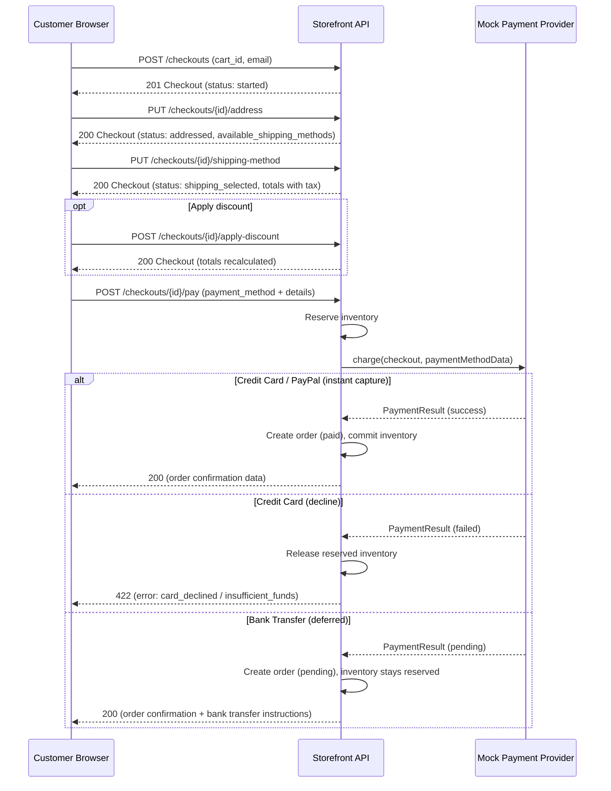
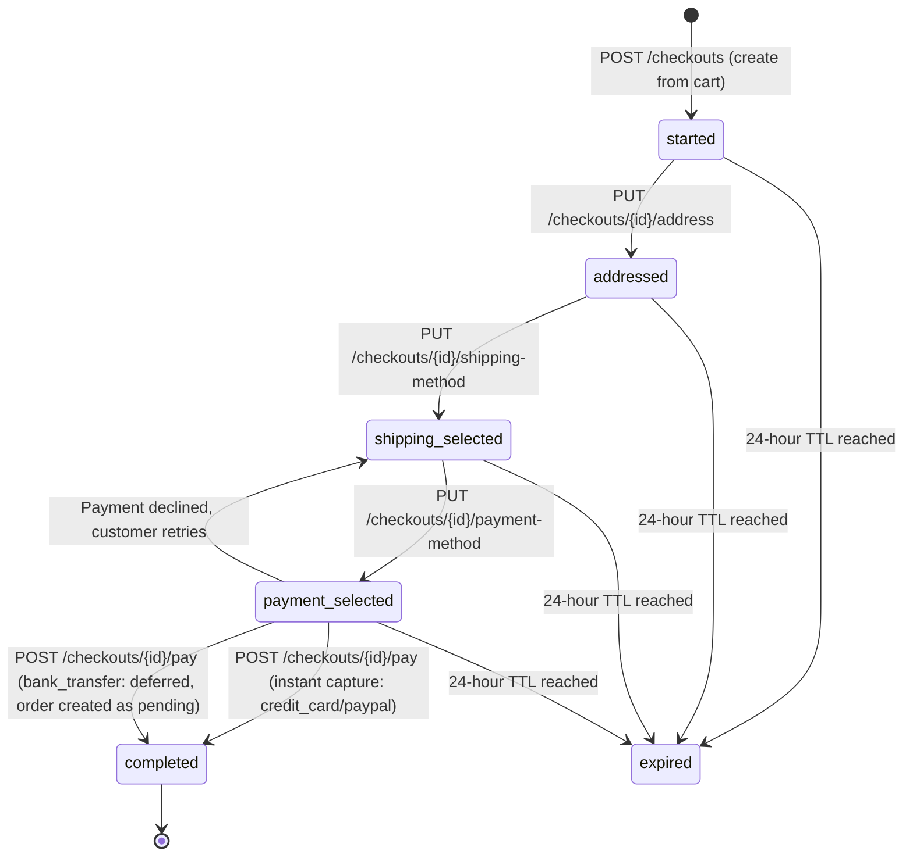

# API and Routing Specification

This document defines every route, endpoint, middleware stack, request/response schema, and rate limit for the e-commerce platform. The admin panel is built with Livewire v4 + Flux UI (server-rendered), while the storefront uses Blade + Livewire. REST API endpoints serve cart/checkout operations and programmatic admin access.

All monetary amounts are stored and transmitted in **minor units** (cents). All IDs are auto-incrementing integers. All monetary amounts are in minor units (cents).

---

## 1. Web Routes (Blade/Livewire Pages)

### 1.1 Admin Auth Routes

No middleware beyond the default `web` group. These routes handle admin login and logout.

| Method | Path | Description | Component / Action |
|--------|------|-------------|--------------------|
| GET | `/admin/login` | Admin login page | `Livewire: Admin\Auth\Login` |
| POST | `/admin/login` | Process admin login | Handled by Livewire action |
| POST | `/admin/logout` | Logout and invalidate session | Handled by Livewire action |
| GET | `/admin/forgot-password` | Show forgot password form | `Livewire: Admin\Auth\ForgotPassword` |
| POST | `/admin/forgot-password` | Send password reset link | Handled by Livewire action |
| GET | `/admin/reset-password/{token}` | Show reset password form | `Livewire: Admin\Auth\ResetPassword` |
| POST | `/admin/reset-password` | Reset password with token | Handled by Livewire action |

Rate limit: `login` tier (5 per minute per IP).

---

### 1.2 Admin Routes

**Prefix:** `/admin`
**Middleware:** `web`, `auth`, `verified`, `store.resolve`, `role.check`

All admin pages render Livewire full-page components. Data mutations happen via Livewire actions (not separate POST endpoints).

> **Note:** The Create and Edit routes render the same Livewire form component (`ProductForm`, `OrderForm`, etc.) in create vs edit mode, following the shared-form pattern defined in Spec 03.

#### Dashboard

| Method | Path | Description | Component |
|--------|------|-------------|-----------|
| GET | `/admin` | Dashboard with KPI tiles, orders chart, conversion funnel | `Admin\Dashboard` |

#### Products

| Method | Path | Description | Component |
|--------|------|-------------|-----------|
| GET | `/admin/products` | Product list - searchable, filterable by status, bulk actions | `Admin\Products\Index` |
| GET | `/admin/products/create` | Create product form | `Admin\Products\Create` |
| GET | `/admin/products/{product}/edit` | Edit product form with variants, media, options | `Admin\Products\Edit` |

#### Inventory

| Method | Path | Description | Component |
|--------|------|-------------|-----------|
| GET | `/admin/inventory` | Inventory management page | `Admin\Inventory\Index` |

#### Collections

| Method | Path | Description | Component |
|--------|------|-------------|-----------|
| GET | `/admin/collections` | Collection list | `Admin\Collections\Index` |
| GET | `/admin/collections/create` | Create collection form | `Admin\Collections\Create` |
| GET | `/admin/collections/{collection}/edit` | Edit collection form | `Admin\Collections\Edit` |

#### Orders

| Method | Path | Description | Component |
|--------|------|-------------|-----------|
| GET | `/admin/orders` | Order list with status filters | `Admin\Orders\Index` |
| GET | `/admin/orders/{order}` | Order detail with timeline, payments, fulfillments | `Admin\Orders\Show` |

#### Customers

| Method | Path | Description | Component |
|--------|------|-------------|-----------|
| GET | `/admin/customers` | Customer list | `Admin\Customers\Index` |
| GET | `/admin/customers/{customer}` | Customer detail with order history, addresses | `Admin\Customers\Show` |

#### Discounts

| Method | Path | Description | Component |
|--------|------|-------------|-----------|
| GET | `/admin/discounts` | Discount list | `Admin\Discounts\Index` |
| GET | `/admin/discounts/create` | Create discount form with rules builder | `Admin\Discounts\Create` |
| GET | `/admin/discounts/{discount}/edit` | Edit discount form | `Admin\Discounts\Edit` |

#### Settings

| Method | Path | Description | Component |
|--------|------|-------------|-----------|
| GET | `/admin/settings` | Store settings (tabs: General, Domains, Shipping, Taxes, Checkout, Notifications) | `Admin\Settings\Index` |
| GET | `/admin/settings/shipping` | Shipping zones and rates configuration | `Admin\Settings\Shipping` |
| GET | `/admin/settings/taxes` | Tax settings - mode, provider config, rates | `Admin\Settings\Taxes` |

#### Themes and Online Store

| Method | Path | Description | Component |
|--------|------|-------------|-----------|
| GET | `/admin/themes` | Theme management - cards with actions (Customize, Preview, Publish, Duplicate, Delete) | `Admin\Themes\Index` |
| GET | `/admin/themes/{theme}/editor` | Theme editor - left panel sections, center preview iframe, right panel settings | `Admin\Themes\Editor` |

#### Pages

| Method | Path | Description | Component |
|--------|------|-------------|-----------|
| GET | `/admin/pages` | Content pages list | `Admin\Pages\Index` |
| GET | `/admin/pages/create` | Create content page | `Admin\Pages\Create` |
| GET | `/admin/pages/{page}/edit` | Edit content page | `Admin\Pages\Edit` |

#### Navigation

| Method | Path | Description | Component |
|--------|------|-------------|-----------|
| GET | `/admin/navigation` | Navigation menus management | `Admin\Navigation\Index` |

#### Apps

| Method | Path | Description | Component |
|--------|------|-------------|-----------|
| GET | `/admin/apps` | Apps directory - list installed and available apps | `Admin\Apps\Index` |
| GET | `/admin/apps/{installation}` | Installed app detail - scopes, webhooks, usage | `Admin\Apps\Show` |

#### Developers

| Method | Path | Description | Component |
|--------|------|-------------|-----------|
| GET | `/admin/developers` | Developer settings - API keys/tokens, webhook management | `Admin\Developers\Index` |

> **Note:** Webhook subscription management (CRUD) is available exclusively through the admin UI at `/admin/developers`. There are no REST API endpoints for programmatic webhook subscription management in the initial implementation.

#### Analytics

| Method | Path | Description | Component |
|--------|------|-------------|-----------|
| GET | `/admin/analytics` | Analytics dashboard - sales, traffic, funnel, exports | `Admin\Analytics\Index` |

#### Search Settings

| Method | Path | Description | Component |
|--------|------|-------------|-----------|
| GET | `/admin/search/settings` | Search settings - synonyms, stopwords, reindex | `Admin\Search\Settings` |

---

### 1.3 Storefront Routes

**Middleware:** `web`, `store.resolve:storefront`

These routes serve the public-facing storefront using Livewire full-page components. All routes in this group are protected by the `store.resolve:storefront` middleware which resolves the store from the request hostname.

**CRITICAL - Acceptance Criteria:**
1. The `GET /` route MUST render the `Storefront\Home` Livewire full-page component. It must NOT return the default Laravel `welcome` view. Ensure `routes/web.php` does NOT contain a catch-all `Route::get('/', function () { return view('welcome'); })` route that overrides the storefront home route.
2. ALL routes below MUST be registered in `routes/web.php` inside a `Route::middleware(['store.resolve:storefront'])` group. Missing any route will result in a 404 for customers.
3. The `store.resolve:storefront` middleware resolves the store from the request hostname via the `store_domains` table. The seeder MUST register the local development domain (`shop.test`) in `store_domains` (see spec 07, Section 3.3).
4. Each Livewire component listed below MUST exist as a PHP class in `app/Livewire/Storefront/` with a corresponding Blade view.

| Method | Path | Description | Component / View |
|--------|------|-------------|------------------|
| GET | `/` | Home page | `Storefront\Home` |
| GET | `/collections` | All collections listing | `Storefront\Collections\Index` |
| GET | `/collections/{handle}` | Single collection page with product grid and filters | `Storefront\Collections\Show` |
| GET | `/products/{handle}` | Product page - gallery, variant selector, add-to-cart | `Storefront\Products\Show` |
| GET | `/cart` | Full cart page - line items, quantity controls, discount input, totals | `Storefront\Cart\Show` |
| GET | `/search` | Search results page with filter panel, sort dropdown, product grid | `Storefront\Search\Index` |
| GET | `/pages/{handle}` | Static content page (About, FAQ, etc.) | `Storefront\Pages\Show` |

#### Customer Account Routes

**Middleware:** `store.resolve:storefront`, `auth.customer`

| Method | Path | Description | Component |
|--------|------|-------------|-----------|
| GET | `/account` | Customer account overview | `Storefront\Account\Dashboard` |
| GET | `/account/orders` | Order history list | `Storefront\Account\Orders\Index` |
| GET | `/account/orders/{orderNumber}` | Order detail | `Storefront\Account\Orders\Show` |
| GET | `/account/addresses` | Address book management | `Storefront\Account\Addresses\Index` |

#### Customer Auth Routes (store.resolve:storefront, no auth required)

| Method | Path | Description | Component |
|--------|------|-------------|-----------|
| GET | `/account/login` | Customer login page | `Storefront\Account\Auth\Login` |
| GET | `/account/register` | Customer registration page | `Storefront\Account\Auth\Register` |
| GET | `/forgot-password` | Forgot password page | `Storefront\Account\Auth\ForgotPassword` |
| POST | `/forgot-password` | Send reset link | Handled by Livewire action |
| GET | `/reset-password/{token}` | Reset password form | `Storefront\Account\Auth\ResetPassword` |
| POST | `/reset-password` | Reset password | Handled by Livewire action |

**Note:** Customer auth routes also need `store.resolve:storefront` middleware because customer authentication is store-scoped. Without store resolution, the login/register forms cannot determine which store the customer belongs to.

---

### 1.4 Checkout Routes

**Middleware:** `web`, `store.resolve:storefront`

**CRITICAL:** Both the Checkout and Confirmation Livewire components MUST be created. The checkout page provides the browser-facing multi-step checkout UI that calls the checkout API endpoints internally.

| Method | Path | Description | Component |
|--------|------|-------------|-----------|
| GET | `/checkout/{checkoutId}` | Checkout page - stepper UI (Contact -> Shipping -> Payment) | `Storefront\Checkout\Show` |
| GET | `/checkout/{checkoutId}/confirmation` | Order confirmation page - order number, items, totals | `Storefront\Checkout\Confirmation` |

---

## 2. Storefront REST API

**Prefix:** `/api/storefront/v1`
**Middleware:** `store.resolve`, `throttle:api.storefront`
**Content-Type:** `application/json`

These endpoints power the interactive storefront experience (cart drawer, checkout flow, search autocomplete, analytics).

---

### 2.1 Cart Endpoints

#### POST /api/storefront/v1/carts

Create a new cart.

- **Authentication:** None (guest) or session-based (logged-in customer)
- **Rate limit:** `api.storefront` (120/min per IP)

**Request body:**

```json
{
  "currency": "EUR"
}
```

| Field | Type | Required | Validation |
|-------|------|----------|------------|
| `currency` | string | No | Valid ISO 4217 code. Defaults to store's `default_currency`. |

**Success response:** `201 Created`

```json
{
  "id": 42,
  "store_id": 1,
  "customer_id": null,
  "currency": "EUR",
  "cart_version": 1,
  "status": "active",
  "lines": [],
  "totals": {
    "subtotal": 0,
    "discount": 0,
    "total": 0,
    "currency": "EUR"
  },
  "created_at": "2026-02-11T10:00:00Z",
  "updated_at": "2026-02-11T10:00:00Z"
}
```

**Error responses:**
- `422` - Validation error (invalid currency)

---

#### GET /api/storefront/v1/carts/{cartId}

Retrieve a cart with all lines and computed totals.

- **Authentication:** None (cart ID acts as token)
- **Rate limit:** `api.storefront` (120/min per IP)

**URL parameters:**

| Parameter | Type | Required | Description |
|-----------|------|----------|-------------|
| `cartId` | integer | Yes | The cart identifier |

**Success response:** `200 OK`

```json
{
  "id": 42,
  "store_id": 1,
  "customer_id": null,
  "currency": "EUR",
  "cart_version": 3,
  "status": "active",
  "lines": [
    {
      "id": 201,
      "variant_id": 101,
      "product_title": "Classic T-Shirt",
      "variant_title": "Blue / Medium",
      "sku": "TSH-BLU-M",
      "quantity": 2,
      "unit_price_amount": 2500,
      "line_subtotal_amount": 5000,
      "line_discount_amount": 0,
      "line_total_amount": 5000,
      "image_url": "https://cdn.example.com/products/tshirt-blue.jpg",
      "requires_shipping": true,
      "available_quantity": 50
    }
  ],
  "totals": {
    "subtotal": 5000,
    "discount": 0,
    "total": 5000,
    "currency": "EUR",
    "line_count": 1,
    "item_count": 2
  },
  "created_at": "2026-02-11T10:00:00Z",
  "updated_at": "2026-02-11T10:05:00Z"
}
```

**Error responses:**
- `404` - Cart not found

---

#### POST /api/storefront/v1/carts/{cartId}/lines

Add a line item to the cart.

- **Authentication:** None
- **Rate limit:** `api.storefront` (120/min per IP)

**Request body:**

```json
{
  "variant_id": 101,
  "quantity": 2
}
```

| Field | Type | Required | Validation |
|-------|------|----------|------------|
| `variant_id` | integer | Yes | Must exist, belong to an active product in the current store |
| `quantity` | integer | Yes | Min: 1, max: 9999. Must not exceed available inventory when policy is `deny`. |

**Success response:** `201 Created`

Returns the full cart object (same schema as GET /carts/{cartId}).

**Error responses:**
- `404` - Cart not found
- `409` - Cart version conflict (concurrent modification, retry with fresh cart_version)
- `422` - Validation error

```json
{
  "message": "The given data was invalid.",
  "errors": {
    "variant_id": ["The selected variant is out of stock."]
  }
}
```

---

#### PUT /api/storefront/v1/carts/{cartId}/lines/{lineId}

Update the quantity of a cart line.

- **Authentication:** None
- **Rate limit:** `api.storefront` (120/min per IP)

**Request body:**

```json
{
  "quantity": 3,
  "cart_version": 3
}
```

| Field | Type | Required | Validation |
|-------|------|----------|------------|
| `quantity` | integer | Yes | Min: 1, max: 9999. Must not exceed available inventory when policy is `deny`. |
| `cart_version` | integer | Yes | Must match current cart version for optimistic concurrency. |

**Success response:** `200 OK`

Returns the full cart object with updated totals.

**Error responses:**
- `404` - Cart or line not found
- `409` - Version conflict
- `422` - Validation error (e.g., exceeds inventory)

---

#### DELETE /api/storefront/v1/carts/{cartId}/lines/{lineId}

Remove a line item from the cart.

- **Authentication:** None
- **Rate limit:** `api.storefront` (120/min per IP)

**Request body:**

```json
{
  "cart_version": 3
}
```

| Field | Type | Required | Validation |
|-------|------|----------|------------|
| `cart_version` | integer | Yes | Must match current cart version. |

**Success response:** `200 OK`

Returns the full cart object.

**Error responses:**
- `404` - Cart or line not found
- `409` - Version conflict

---

### 2.2 Checkout Endpoints

#### Checkout Flow Sequence Diagram



#### POST /api/storefront/v1/checkouts

Create a checkout from a cart.

- **Authentication:** None or session-based
- **Rate limit:** `checkout` (10/min per session)

**Request body:**

```json
{
  "cart_id": 42,
  "email": "customer@example.com"
}
```

| Field | Type | Required | Validation |
|-------|------|----------|------------|
| `cart_id` | integer | Yes | Must reference an active cart with at least one line. |
| `email` | string | Yes | Valid email address. |

**Success response:** `201 Created`

```json
{
  "id": 7,
  "store_id": 1,
  "cart_id": 42,
  "customer_id": null,
  "status": "started",
  "email": "customer@example.com",
  "shipping_address_json": null,
  "billing_address_json": null,
  "shipping_method_id": null,
  "discount_code": null,
  "lines": [
    {
      "variant_id": 101,
      "product_title": "Classic T-Shirt",
      "variant_title": "Blue / Medium",
      "sku": "TSH-BLU-M",
      "quantity": 2,
      "unit_price_amount": 2500,
      "line_total_amount": 5000
    }
  ],
  "totals": {
    "subtotal": 5000,
    "discount": 0,
    "shipping": 0,
    "tax": 0,
    "total": 5000,
    "currency": "EUR"
  },
  "available_shipping_methods": [],
  "expires_at": "2026-02-12T10:00:00Z",
  "created_at": "2026-02-11T10:00:00Z"
}
```

**Error responses:**
- `404` - Cart not found
- `422` - Validation errors (empty cart, invalid email)

---

#### GET /api/storefront/v1/checkouts/{checkoutId}

Retrieve the current checkout state and computed totals.

- **Authentication:** None (checkout ID acts as token)
- **Rate limit:** `checkout` (10/min per session)

**Success response:** `200 OK`

Returns the full checkout object (same schema as POST response, with updated fields reflecting the current state).

**Error responses:**
- `404` - Checkout not found
- `410` - Checkout expired

---

#### PUT /api/storefront/v1/checkouts/{checkoutId}/address

Set the shipping and/or billing address on a checkout.

- **Authentication:** None
- **Rate limit:** `checkout` (10/min per session)

**Request body:**

```json
{
  "shipping_address": {
    "first_name": "Jane",
    "last_name": "Doe",
    "address1": "123 Main St",
    "address2": "Apt 4B",
    "city": "Berlin",
    "province": "Berlin",
    "province_code": "BE",
    "country": "DE",
    "country_code": "DE",
    "postal_code": "10115",
    "phone": "+49301234567"
  },
  "billing_address": null,
  "use_shipping_as_billing": true
}
```

**Shipping address fields:**

| Field | Type | Required | Validation |
|-------|------|----------|------------|
| `shipping_address` | object | Yes (if any line requires shipping) | See fields below |
| `shipping_address.first_name` | string | Yes | Max: 255 |
| `shipping_address.last_name` | string | Yes | Max: 255 |
| `shipping_address.address1` | string | Yes | Max: 500 |
| `shipping_address.address2` | string | No | Max: 500 |
| `shipping_address.city` | string | Yes | Max: 255 |
| `shipping_address.province` | string | No | Max: 255 |
| `shipping_address.province_code` | string | No | Max: 10 |
| `shipping_address.country` | string | Yes | Max: 255 |
| `shipping_address.country_code` | string | Yes | Valid ISO 3166-1 alpha-2 |
| `shipping_address.postal_code` | string | Yes | Max: 20 |
| `shipping_address.phone` | string | No | Max: 50 |
| `billing_address` | object | No | Same fields as shipping_address |
| `use_shipping_as_billing` | boolean | No | Default: true. If true, billing_address is ignored and copied from shipping. |

**Success response:** `200 OK`

Returns the full checkout object. Status transitions to `addressed`. The response includes `available_shipping_methods` populated based on the shipping address and store's shipping zones.

```json
{
  "id": 7,
  "status": "addressed",
  "shipping_address_json": {
    "first_name": "Jane",
    "last_name": "Doe",
    "address1": "123 Main St",
    "address2": "Apt 4B",
    "city": "Berlin",
    "province": "Berlin",
    "province_code": "BE",
    "country": "DE",
    "country_code": "DE",
    "postal_code": "10115",
    "phone": "+49301234567"
  },
  "billing_address_json": {
    "first_name": "Jane",
    "last_name": "Doe",
    "address1": "123 Main St",
    "address2": "Apt 4B",
    "city": "Berlin",
    "province": "Berlin",
    "province_code": "BE",
    "country": "DE",
    "country_code": "DE",
    "postal_code": "10115",
    "phone": "+49301234567"
  },
  "available_shipping_methods": [
    {
      "id": 1,
      "name": "Standard Shipping",
      "type": "flat",
      "price_amount": 500,
      "currency": "EUR",
      "estimated_days_min": 3,
      "estimated_days_max": 5
    },
    {
      "id": 2,
      "name": "Express Shipping",
      "type": "flat",
      "price_amount": 1200,
      "currency": "EUR",
      "estimated_days_min": 1,
      "estimated_days_max": 2
    }
  ],
  "totals": {
    "subtotal": 5000,
    "discount": 0,
    "shipping": 0,
    "tax": 0,
    "total": 5000,
    "currency": "EUR"
  }
}
```

**Error responses:**
- `404` - Checkout not found
- `410` - Checkout expired
- `422` - Validation errors (missing required fields, invalid country code, address not in any shipping zone)

---

#### PUT /api/storefront/v1/checkouts/{checkoutId}/shipping-method

Select a shipping method for the checkout.

- **Authentication:** None
- **Rate limit:** `checkout` (10/min per session)

**Request body:**

```json
{
  "shipping_method_id": 1
}
```

| Field | Type | Required | Validation |
|-------|------|----------|------------|
| `shipping_method_id` | integer | Yes | Must be one of the available shipping methods for this checkout's address. |

**Success response:** `200 OK`

Returns the full checkout object. Status transitions to `shipping_selected`. Totals are recalculated including the shipping cost and taxes (if applicable).

```json
{
  "id": 7,
  "status": "shipping_selected",
  "shipping_method_id": 1,
  "totals": {
    "subtotal": 5000,
    "discount": 0,
    "shipping": 500,
    "tax": 1045,
    "total": 6545,
    "currency": "EUR"
  },
  "tax_provider_snapshot_json": {
    "provider": "manual",
    "calculated_at": "2026-02-11T10:05:00Z",
    "lines": [
      {
        "variant_id": 101,
        "tax_amount": 950,
        "rate": 1900,
        "jurisdiction": "DE"
      }
    ],
    "shipping_tax_amount": 95,
    "shipping_tax_rate": 1900
  }
}
```

**Error responses:**
- `404` - Checkout not found
- `410` - Checkout expired
- `422` - Invalid shipping method (not available for this address/checkout)

---

#### PUT /api/storefront/v1/checkouts/{checkoutId}/payment-method

Select a payment method for the checkout. This step records the chosen method without processing payment.

- **Authentication:** None
- **Rate limit:** `checkout` (10/min per session)

**Request body:**

```json
{
  "payment_method": "credit_card"
}
```

| Field | Type | Required | Validation |
|-------|------|----------|------------|
| `payment_method` | string | Yes | Must be one of: `credit_card`, `paypal`, `bank_transfer`. |

**Success response:** `200 OK`

Returns the full checkout object. Status transitions to `payment_selected`.

```json
{
  "id": 7,
  "status": "payment_selected",
  "payment_method": "credit_card",
  "totals": {
    "subtotal": 5000,
    "discount": 0,
    "shipping": 500,
    "tax": 1045,
    "total": 6545,
    "currency": "EUR"
  }
}
```

**Error responses:**
- `404` - Checkout not found
- `410` - Checkout expired
- `422` - Invalid payment method or checkout not in `shipping_selected` state

---

#### POST /api/storefront/v1/checkouts/{checkoutId}/apply-discount

Apply a discount code to the checkout.

- **Authentication:** None
- **Rate limit:** `checkout` (10/min per session)

**Request body:**

```json
{
  "code": "WELCOME10"
}
```

| Field | Type | Required | Validation |
|-------|------|----------|------------|
| `code` | string | Yes | Max: 50. Must be a valid, active discount code for this store. Case-insensitivity determined by store setting. |

**Success response:** `200 OK`

```json
{
  "id": 7,
  "status": "shipping_selected",
  "discount_code": "WELCOME10",
  "totals": {
    "subtotal": 5000,
    "discount": 500,
    "shipping": 500,
    "tax": 950,
    "total": 5950,
    "currency": "EUR"
  },
  "applied_discounts": [
    {
      "code": "WELCOME10",
      "type": "percent",
      "value_amount": 10,
      "applied_amount": 500,
      "description": "10% off your first order"
    }
  ]
}
```

**Error responses:**
- `400` - Discount code expired (error code: `discount_expired`)
- `400` - Discount usage limit reached (error code: `discount_usage_exceeded`)
- `404` - Checkout not found
- `410` - Checkout expired
- `422` - Invalid code (not found, does not apply to these items)

```json
{
  "message": "This discount code has expired.",
  "error_code": "discount_expired"
}
```

---

#### DELETE /api/storefront/v1/checkouts/{checkoutId}/discount

Remove the applied discount code from the checkout.

- **Authentication:** None
- **Rate limit:** `checkout` (10/min per session)

**Success response:** `200 OK`

Returns the full checkout object with discount removed and totals recalculated.

**Error responses:**
- `404` - Checkout not found or no discount applied
- `410` - Checkout expired

---

### 2.3 Payment Endpoint

#### POST /api/storefront/v1/checkouts/{checkoutId}/pay

Process payment for a checkout using the selected payment method. All payment processing happens in-process via the Mock PSP - no external API calls, no redirects, no webhooks.

- **Authentication:** None
- **Rate limit:** `checkout` (10/min per session)

**Request body (Credit Card):**

```json
{
  "payment_method": "credit_card",
  "card_number": "4242424242424242",
  "card_expiry": "12/28",
  "card_cvc": "123",
  "card_holder": "Jane Doe"
}
```

**Request body (PayPal):**

```json
{
  "payment_method": "paypal"
}
```

**Request body (Bank Transfer):**

```json
{
  "payment_method": "bank_transfer"
}
```

| Field | Type | Required | Validation |
|-------|------|----------|------------|
| `payment_method` | string | Yes | Must be one of: `credit_card`, `paypal`, `bank_transfer`. |
| `card_number` | string | Conditional | Required when `payment_method = credit_card`. Digits only (spaces stripped). |
| `card_expiry` | string | Conditional | Required when `payment_method = credit_card`. Format: MM/YY. |
| `card_cvc` | string | Conditional | Required when `payment_method = credit_card`. 3-4 digits. |
| `card_holder` | string | Conditional | Required when `payment_method = credit_card`. Max 255 chars. |

**Success response (Credit Card / PayPal - instant capture):** `200 OK`

```json
{
  "checkout_id": 7,
  "status": "completed",
  "order": {
    "id": 42,
    "order_number": "#1016",
    "status": "paid",
    "financial_status": "paid",
    "payment_method": "credit_card",
    "total_amount": 6545,
    "currency": "EUR"
  }
}
```

**Success response (Bank Transfer - deferred payment):** `200 OK`

```json
{
  "checkout_id": 7,
  "status": "completed",
  "order": {
    "id": 42,
    "order_number": "#1016",
    "status": "pending",
    "financial_status": "pending",
    "payment_method": "bank_transfer",
    "total_amount": 6545,
    "currency": "EUR"
  },
  "bank_transfer_instructions": {
    "bank_name": "Mock Bank AG",
    "iban": "DE89 3704 0044 0532 0130 00",
    "bic": "COBADEFFXXX",
    "reference": "#1016",
    "amount_formatted": "65.45 EUR"
  }
}
```

**Error responses:**
- `404` - Checkout not found
- `409` - Checkout not in a valid state for payment (must be `payment_selected`)
- `422` - Validation errors (missing card fields, invalid payment method)
- `422` - Payment declined (credit card magic numbers)

```json
{
  "message": "Your card was declined.",
  "error_code": "card_declined"
}
```

**Magic card number error codes:**

| Card Number | Error Code | Message |
|---|---|---|
| `4000000000000002` | `card_declined` | "Your card was declined." |
| `4000000000009995` | `insufficient_funds` | "Your card has insufficient funds." |

---

### 2.4 Order Endpoints

#### GET /api/storefront/v1/orders/{orderNumber}

Retrieve order status. Access is controlled via a signed token (included in confirmation emails and the confirmation page URL).

- **Authentication:** Tokenized access (`token` query parameter with HMAC signature)
- **Rate limit:** `api.storefront` (120/min per IP)

**Query parameters:**

| Parameter | Type | Required | Description |
|-----------|------|----------|-------------|
| `token` | string | Yes | HMAC-signed access token for this order |

**Success response:** `200 OK`

```json
{
  "order_number": "#1001",
  "status": "paid",
  "financial_status": "paid",
  "fulfillment_status": "unfulfilled",
  "email": "customer@example.com",
  "currency": "EUR",
  "placed_at": "2026-02-11T10:10:00Z",
  "lines": [
    {
      "title_snapshot": "Classic T-Shirt",
      "variant_title": "Blue / Medium",
      "sku_snapshot": "TSH-BLU-M",
      "quantity": 2,
      "unit_price_amount": 2500,
      "total_amount": 5000
    }
  ],
  "totals": {
    "subtotal_amount": 5000,
    "discount_amount": 500,
    "shipping_amount": 500,
    "tax_amount": 950,
    "total_amount": 5950
  },
  "shipping_address": {
    "first_name": "Jane",
    "last_name": "Doe",
    "address1": "123 Main St",
    "city": "Berlin",
    "country": "DE",
    "postal_code": "10115"
  },
  "fulfillments": []
}
```

**Error responses:**
- `401` - Invalid or missing token
- `404` - Order not found

---

### 2.5 Search Endpoints

#### GET /api/storefront/v1/search

Search products within the current store.

- **Authentication:** None
- **Rate limit:** `search` (30/min per IP)

**Query parameters:**

| Parameter | Type | Required | Description |
|-----------|------|----------|-------------|
| `q` | string | Yes | Search query. Min: 1, max: 200 characters. |
| `filters` | json | No | URL-encoded JSON object with filter facets. |
| `sort` | string | No | One of: `relevance`, `price_asc`, `price_desc`, `newest`, `best_selling`. Default: `relevance`. |
| `page` | integer | No | Page number. Default: 1. |
| `per_page` | integer | No | Results per page. Min: 1, max: 50. Default: 24. |

**Filters JSON schema:**

```json
{
  "collection_id": 5,
  "price_min": 1000,
  "price_max": 5000,
  "in_stock": true,
  "tags": ["organic", "cotton"],
  "vendor": "Acme Apparel"
}
```

**Success response:** `200 OK`

```json
{
  "query": "t-shirt",
  "results": [
    {
      "id": 10,
      "title": "Classic T-Shirt",
      "handle": "classic-t-shirt",
      "vendor": "Acme Apparel",
      "product_type": "Apparel",
      "price_amount": 2500,
      "compare_at_amount": 3500,
      "currency": "EUR",
      "image_url": "https://cdn.example.com/products/tshirt.jpg",
      "in_stock": true,
      "tags": ["organic", "cotton"]
    }
  ],
  "facets": {
    "vendors": [
      { "value": "Acme Apparel", "count": 12 }
    ],
    "tags": [
      { "value": "organic", "count": 8 },
      { "value": "cotton", "count": 15 }
    ],
    "price_range": {
      "min": 1500,
      "max": 8500
    }
  },
  "pagination": {
    "current_page": 1,
    "per_page": 24,
    "total": 42,
    "last_page": 2
  }
}
```

**Error responses:**
- `400` - Query too long (max 200 characters) or malformed filters
- `422` - Validation error

---

#### GET /api/storefront/v1/search/suggest

Autocomplete suggestions as the user types.

- **Authentication:** None
- **Rate limit:** `search` (30/min per IP)

**Query parameters:**

| Parameter | Type | Required | Description |
|-----------|------|----------|-------------|
| `q` | string | Yes | Search prefix. Min: 1, max: 100 characters. |
| `limit` | integer | No | Max suggestions. Default: 5, max: 10. |

**Success response:** `200 OK`

```json
{
  "query": "t-sh",
  "suggestions": [
    {
      "type": "product",
      "title": "Classic T-Shirt",
      "handle": "classic-t-shirt",
      "image_url": "https://cdn.example.com/products/tshirt-thumb.jpg",
      "price_amount": 2500,
      "currency": "EUR"
    },
    {
      "type": "collection",
      "title": "T-Shirts",
      "handle": "t-shirts",
      "image_url": null
    }
  ]
}
```

**Error responses:**
- `400` - Query too long
- `422` - Validation error

---

### 2.6 Analytics Endpoints

#### POST /api/storefront/v1/analytics/events

Batch submit storefront analytics events.

- **Authentication:** None
- **Rate limit:** `analytics` (60/min per IP)

**Request body:**

```json
{
  "events": [
    {
      "type": "page_view",
      "session_id": "sess_abc123",
      "client_event_id": "evt_001",
      "properties": {
        "url": "/products/classic-t-shirt",
        "referrer": "https://google.com",
        "user_agent": "Mozilla/5.0..."
      },
      "occurred_at": "2026-02-11T10:00:00Z"
    },
    {
      "type": "add_to_cart",
      "session_id": "sess_abc123",
      "client_event_id": "evt_002",
      "properties": {
        "product_id": 10,
        "variant_id": 101,
        "quantity": 1,
        "price_amount": 2500,
        "currency": "EUR"
      },
      "occurred_at": "2026-02-11T10:01:00Z"
    }
  ]
}
```

| Field | Type | Required | Validation |
|-------|------|----------|------------|
| `events` | array | Yes | Min: 1, max: 50 events per batch. |
| `events[].type` | string | Yes | One of: `page_view`, `add_to_cart`, `remove_from_cart`, `checkout_started`, `checkout_completed`, `search`. |
| `events[].session_id` | string | Yes | Max: 100 characters. |
| `events[].client_event_id` | string | Yes | Max: 100 characters. If a `client_event_id` has already been recorded for the current store, the duplicate event is silently dropped (unique on `(store_id, client_event_id)`). |
| `events[].properties` | object | No | Freeform JSON. Max depth: 3 levels. |
| `events[].occurred_at` | string (ISO 8601) | Yes | Must not be more than 1 hour in the past or in the future. |

**Success response:** `202 Accepted`

```json
{
  "accepted": 2,
  "rejected": 0
}
```

**Error responses:**
- `422` - Validation errors (invalid event types, too many events, etc.)

---

## 3. Admin REST API

**Prefix:** `/api/admin/v1`
**Middleware:** `auth:sanctum`, `store.resolve`, `throttle:api.admin`
**Content-Type:** `application/json`

These endpoints provide programmatic access for integrations, CLI tools, and third-party apps. The admin web UI uses Livewire actions directly and does not call these endpoints.

All endpoints require a valid Sanctum API token with appropriate scopes. Responses follow Laravel's API Resource conventions.

---

### 3.1 Platform Management (Super-Admin Only)

These endpoints are restricted to users with the `owner` (platform) role.

#### POST /api/admin/v1/platform/organizations

Create a new organization.

- **Authentication:** Sanctum token with `manage-platform` scope
- **Rate limit:** `api.admin` (60/min per token)

**Request body:**

```json
{
  "name": "Acme Corp",
  "billing_email": "billing@acme.com"
}
```

| Field | Type | Required | Validation |
|-------|------|----------|------------|
| `name` | string | Yes | Max: 255 |
| `billing_email` | string | Yes | Valid email, max: 255 |

**Success response:** `201 Created`

```json
{
  "data": {
    "id": 1,
    "name": "Acme Corp",
    "billing_email": "billing@acme.com",
    "created_at": "2026-02-11T10:00:00Z",
    "updated_at": "2026-02-11T10:00:00Z"
  }
}
```

**Error responses:**
- `403` - Insufficient permissions
- `422` - Validation errors

---

#### POST /api/admin/v1/platform/stores

Create a new store within an organization.

- **Authentication:** Sanctum token with `manage-platform` scope
- **Rate limit:** `api.admin` (60/min per token)

**Request body:**

```json
{
  "organization_id": 1,
  "name": "Acme Store",
  "handle": "acme",
  "default_currency": "EUR",
  "default_locale": "en",
  "timezone": "Europe/Berlin"
}
```

| Field | Type | Required | Validation |
|-------|------|----------|------------|
| `organization_id` | integer | Yes | Must exist |
| `name` | string | Yes | Max: 255 |
| `handle` | string | Yes | Unique, lowercase, alphanumeric with hyphens. Max: 63. Regex: `^[a-z0-9]([a-z0-9-]*[a-z0-9])?$` |
| `default_currency` | string | Yes | Valid ISO 4217 code |
| `default_locale` | string | Yes | Valid locale code (e.g., `en`, `de`, `fr`) |
| `timezone` | string | Yes | Valid IANA timezone |

**Success response:** `201 Created`

```json
{
  "data": {
    "id": 1,
    "organization_id": 1,
    "name": "Acme Store",
    "handle": "acme",
    "status": "active",
    "default_currency": "EUR",
    "default_locale": "en",
    "timezone": "Europe/Berlin",
    "created_at": "2026-02-11T10:00:00Z"
  }
}
```

**Error responses:**
- `403` - Insufficient permissions
- `422` - Validation errors (duplicate handle, invalid timezone, etc.)

---

#### POST /api/admin/v1/stores/{storeId}/invites

Invite a user to a store with a specific role.

- **Authentication:** Sanctum token with `manage-platform` scope
- **Rate limit:** `api.admin` (60/min per token)

**Request body:**

```json
{
  "email": "staff@acme.com",
  "role": "staff"
}
```

| Field | Type | Required | Validation |
|-------|------|----------|------------|
| `email` | string | Yes | Valid email, max: 255 |
| `role` | string | Yes | One of: `owner`, `admin`, `staff`, `support` |

**Success response:** `201 Created`

```json
{
  "data": {
    "email": "staff@acme.com",
    "role": "staff",
    "invited_at": "2026-02-11T10:00:00Z",
    "expires_at": "2026-02-18T10:00:00Z"
  }
}
```

**Error responses:**
- `403` - Insufficient permissions (only `owner` and `admin` can invite)
- `409` - User already a member of this store
- `422` - Validation errors

---

#### GET /api/admin/v1/stores/{storeId}/me

Get the current user's membership details for a store.

- **Authentication:** Sanctum token
- **Rate limit:** `api.admin` (60/min per token)

**Success response:** `200 OK`

```json
{
  "data": {
    "user_id": 3,
    "store_id": 1,
    "role": "admin",
    "email": "admin@acme.com",
    "name": "Jane Admin",
    "permissions": [
      "read-products",
      "write-products",
      "read-orders",
      "write-orders",
      "read-settings",
      "write-settings",
      "read-customers"
    ]
  }
}
```

**Error responses:**
- `403` - Not a member of this store
- `404` - Store not found

---

### 3.2 Products

#### Admin Products Endpoint Summary

| Method | Path | Auth Scope | Description | Rate Limit |
|--------|------|------------|-------------|------------|
| GET | `/api/admin/v1/stores/{storeId}/products` | `read-products` | List products with filtering and pagination | `api.admin` (60/min) |
| POST | `/api/admin/v1/stores/{storeId}/products` | `write-products` | Create a new product | `api.admin` (60/min) |
| GET | `/api/admin/v1/stores/{storeId}/products/{productId}` | `read-products` | Get single product with all relations | `api.admin` (60/min) |
| PUT | `/api/admin/v1/stores/{storeId}/products/{productId}` | `write-products` | Update a product (partial updates supported) | `api.admin` (60/min) |
| DELETE | `/api/admin/v1/stores/{storeId}/products/{productId}` | `write-products` | Archive a product (soft delete) | `api.admin` (60/min) |
| POST | `/api/admin/v1/stores/{storeId}/products/{productId}/media/presign-upload` | `write-products` | Generate presigned URL for media upload | `api.admin` (60/min) |

#### GET /api/admin/v1/stores/{storeId}/products

List products with filtering and pagination.

**Query parameters:**

| Parameter | Type | Required | Description |
|-----------|------|----------|-------------|
| `status` | string | No | Filter by status: `draft`, `active`, `archived`. |
| `query` | string | No | Search by title, vendor, or SKU. |
| `collection_id` | integer | No | Filter by collection membership. |
| `page` | integer | No | Page number. Default: 1. |
| `per_page` | integer | No | Results per page. Default: 25, max: 100. |
| `sort` | string | No | One of: `title_asc`, `title_desc`, `created_at_asc`, `created_at_desc`, `updated_at_desc`. Default: `updated_at_desc`. |

**Success response:** `200 OK`

```json
{
  "data": [
    {
      "id": 10,
      "store_id": 1,
      "title": "Classic T-Shirt",
      "handle": "classic-t-shirt",
      "status": "active",
      "vendor": "Acme Apparel",
      "product_type": "Apparel",
      "tags": ["organic", "cotton"],
      "variants_count": 6,
      "total_inventory": 150,
      "published_at": "2026-02-10T08:00:00Z",
      "created_at": "2026-02-09T14:00:00Z",
      "updated_at": "2026-02-11T09:00:00Z",
      "featured_image": {
        "url": "https://cdn.example.com/products/tshirt.jpg",
        "alt_text": "Classic T-Shirt in Blue"
      }
    }
  ],
  "meta": {
    "current_page": 1,
    "per_page": 25,
    "total": 42,
    "last_page": 2
  }
}
```

---

#### POST /api/admin/v1/stores/{storeId}/products

Create a new product.

**Request body:**

```json
{
  "title": "Classic T-Shirt",
  "handle": "classic-t-shirt",
  "description_html": "<p>A comfortable cotton t-shirt.</p>",
  "vendor": "Acme Apparel",
  "product_type": "Apparel",
  "status": "draft",
  "tags": ["organic", "cotton"],
  "options": [
    { "name": "Color", "position": 1 },
    { "name": "Size", "position": 2 }
  ],
  "variants": [
    {
      "sku": "TSH-BLU-S",
      "barcode": "1234567890123",
      "price_amount": 2500,
      "compare_at_amount": 3500,
      "currency": "EUR",
      "weight_g": 200,
      "requires_shipping": true,
      "is_default": true,
      "position": 1,
      "status": "active",
      "option_values": [
        { "option_name": "Color", "value": "Blue" },
        { "option_name": "Size", "value": "Small" }
      ],
      "inventory": {
        "quantity_on_hand": 50,
        "policy": "deny"
      }
    }
  ],
  "collections": [5]
}
```

**Product fields:**

| Field | Type | Required | Validation |
|-------|------|----------|------------|
| `title` | string | Yes | Max: 255 |
| `handle` | string | No | Auto-generated from title if not provided. Unique per store. Lowercase, hyphens only. Max: 255. |
| `description_html` | string | No | Max: 65535 |
| `vendor` | string | No | Max: 255 |
| `product_type` | string | No | Max: 255 |
| `status` | string | No | One of: `draft`, `active`. Default: `draft`. |
| `tags` | array of strings | No | Max: 50 tags, each max: 255. |
| `options` | array | No | Max: 3 options. |
| `options[].name` | string | Yes | Max: 255 |
| `options[].position` | integer | Yes | Min: 1, max: 3 |
| `collections` | array of integers | No | Collection IDs to add this product to. |

**Variant fields:**

| Field | Type | Required | Validation |
|-------|------|----------|------------|
| `variants` | array | Yes | At least one variant required. Max: 100. |
| `variants[].sku` | string | Yes | Max: 255. Unique per store (`store_id`, `sku`). |
| `variants[].barcode` | string | No | Max: 255 |
| `variants[].price_amount` | integer | Yes | Min: 0 (in minor currency units) |
| `variants[].compare_at_amount` | integer | No | Min: 0. Must be > price_amount if set. |
| `variants[].currency` | string | No | Defaults to store currency. |
| `variants[].weight_g` | integer | No | Min: 0 |
| `variants[].requires_shipping` | boolean | No | Default: true |
| `variants[].is_default` | boolean | No | Exactly one variant must be default. |
| `variants[].position` | integer | No | Auto-assigned if not provided. |
| `variants[].status` | string | No | One of: `active`, `archived`. Default: `active`. |
| `variants[].option_values` | array | No | Must match defined options. |
| `variants[].inventory.quantity_on_hand` | integer | No | Default: 0. Min: 0. |
| `variants[].inventory.policy` | string | No | One of: `deny`, `continue`. Default: `deny`. |

**Success response:** `201 Created`

Returns the full product resource with nested variants, options, and media.

**Error responses:**
- `403` - Insufficient permissions
- `422` - Validation errors (duplicate SKU, duplicate handle, missing required fields)

---

#### GET /api/admin/v1/stores/{storeId}/products/{productId}

Get a single product with all variants, options, media, and collections.

**Success response:** `200 OK`

```json
{
  "data": {
    "id": 10,
    "store_id": 1,
    "title": "Classic T-Shirt",
    "handle": "classic-t-shirt",
    "description_html": "<p>A comfortable cotton t-shirt.</p>",
    "vendor": "Acme Apparel",
    "product_type": "Apparel",
    "status": "active",
    "tags": ["organic", "cotton"],
    "published_at": "2026-02-10T08:00:00Z",
    "created_at": "2026-02-09T14:00:00Z",
    "updated_at": "2026-02-11T09:00:00Z",
    "options": [
      {
        "id": 1,
        "name": "Color",
        "position": 1,
        "values": [
          { "id": 1, "value": "Blue", "position": 1 },
          { "id": 2, "value": "Red", "position": 2 }
        ]
      },
      {
        "id": 2,
        "name": "Size",
        "position": 2,
        "values": [
          { "id": 3, "value": "Small", "position": 1 },
          { "id": 4, "value": "Medium", "position": 2 },
          { "id": 5, "value": "Large", "position": 3 }
        ]
      }
    ],
    "variants": [
      {
        "id": 101,
        "sku": "TSH-BLU-S",
        "barcode": "1234567890123",
        "price_amount": 2500,
        "compare_at_amount": 3500,
        "currency": "EUR",
        "weight_g": 200,
        "requires_shipping": true,
        "is_default": true,
        "position": 1,
        "status": "active",
        "option_values": [
          { "option_name": "Color", "value": "Blue" },
          { "option_name": "Size", "value": "Small" }
        ],
        "inventory": {
          "quantity_on_hand": 50,
          "quantity_reserved": 2,
          "policy": "deny"
        }
      }
    ],
    "media": [
      {
        "id": 1,
        "type": "image",
        "storage_key": "stores/1/products/10/main.jpg",
        "url": "https://cdn.example.com/stores/1/products/10/main.jpg",
        "alt_text": "Classic T-Shirt in Blue",
        "width": 1200,
        "height": 1600,
        "mime_type": "image/jpeg",
        "byte_size": 245000,
        "position": 1,
        "status": "ready"
      }
    ],
    "collections": [
      {
        "id": 5,
        "title": "Summer Collection",
        "handle": "summer-collection"
      }
    ]
  }
}
```

**Error responses:**
- `403` - Insufficient permissions
- `404` - Product not found (or belongs to another store)

---

#### PUT /api/admin/v1/stores/{storeId}/products/{productId}

Update a product. Supports partial updates.

Same fields as POST. Only provided fields are updated. Variants can be added, updated (by ID), or removed.

**Example partial update request:**

```json
{
  "title": "Classic Cotton T-Shirt",
  "status": "active",
  "tags": ["organic", "cotton", "bestseller"]
}
```

**Success response:** `200 OK`

Returns the full updated product resource.

**Error responses:**
- `403` - Insufficient permissions
- `404` - Product not found
- `422` - Validation errors

---

#### DELETE /api/admin/v1/stores/{storeId}/products/{productId}

Archive a product (soft delete). Products with existing orders cannot be hard-deleted.

**Success response:** `200 OK`

```json
{
  "data": {
    "id": 10,
    "status": "archived",
    "updated_at": "2026-02-11T11:00:00Z"
  }
}
```

**Error responses:**
- `403` - Insufficient permissions
- `404` - Product not found

---

#### POST /api/admin/v1/stores/{storeId}/products/{productId}/media/presign-upload

Generate a presigned URL for uploading product media directly to object storage (S3).

**Request body:**

```json
{
  "filename": "tshirt-front.jpg",
  "content_type": "image/jpeg",
  "byte_size": 245000
}
```

| Field | Type | Required | Validation |
|-------|------|----------|------------|
| `filename` | string | Yes | Max: 255. Must have a valid extension. |
| `content_type` | string | Yes | One of: `image/jpeg`, `image/png`, `image/webp`, `image/avif`, `video/mp4`. |
| `byte_size` | integer | Yes | Min: 1, max: configurable (default 50MB for images, 500MB for video). |

**Success response:** `201 Created`

```json
{
  "upload_url": "https://s3.example.com/...presigned...",
  "method": "PUT",
  "headers": {
    "Content-Type": "image/jpeg"
  },
  "storage_key": "stores/1/products/10/media/uuid.jpg",
  "media_id": 2,
  "expires_at": "2026-02-11T10:10:00Z"
}
```

**Error responses:**
- `403` - Insufficient permissions
- `404` - Product not found
- `422` - Validation errors (invalid content type, file too large)

---

### 3.3 Collections

#### Admin Collections Endpoint Summary

| Method | Path | Auth Scope | Description | Rate Limit |
|--------|------|------------|-------------|------------|
| GET | `/api/admin/v1/stores/{storeId}/collections` | `read-collections` | List collections | `api.admin` (60/min) |
| POST | `/api/admin/v1/stores/{storeId}/collections` | `write-collections` | Create a collection | `api.admin` (60/min) |
| PUT | `/api/admin/v1/stores/{storeId}/collections/{collectionId}` | `write-collections` | Update a collection | `api.admin` (60/min) |
| DELETE | `/api/admin/v1/stores/{storeId}/collections/{collectionId}` | `write-collections` | Delete a collection | `api.admin` (60/min) |

#### GET /api/admin/v1/stores/{storeId}/collections

List collections.

**Query parameters:**

| Parameter | Type | Required | Description |
|-----------|------|----------|-------------|
| `status` | string | No | Filter by status: `draft`, `active`, `archived`. |
| `query` | string | No | Search by title. |
| `page` | integer | No | Default: 1. |
| `per_page` | integer | No | Default: 25, max: 100. |

**Success response:** `200 OK`

```json
{
  "data": [
    {
      "id": 5,
      "store_id": 1,
      "title": "Summer Collection",
      "handle": "summer-collection",
      "description_html": "<p>Best items for summer.</p>",
      "type": "manual",
      "status": "active",
      "products_count": 15,
      "created_at": "2026-02-01T10:00:00Z",
      "updated_at": "2026-02-10T14:00:00Z"
    }
  ],
  "meta": {
    "current_page": 1,
    "per_page": 25,
    "total": 5,
    "last_page": 1
  }
}
```

---

#### POST /api/admin/v1/stores/{storeId}/collections

Create a collection.

**Request body:**

```json
{
  "title": "Winter Collection",
  "handle": "winter-collection",
  "description_html": "<p>Cozy items for winter.</p>",
  "type": "manual",
  "status": "active",
  "product_ids": [10, 11]
}
```

| Field | Type | Required | Validation |
|-------|------|----------|------------|
| `title` | string | Yes | Max: 255 |
| `handle` | string | No | Auto-generated from title. Unique per store. |
| `description_html` | string | No | Max: 65535 |
| `type` | string | Yes | One of: `manual`, `automated`. |
| `status` | string | No | One of: `draft`, `active`, `archived`. Default: `active`. |
| `product_ids` | array of integers | No | Products to add to the collection. |

**Success response:** `201 Created`

Returns the full collection resource.

**Error responses:**
- `403` - Insufficient permissions
- `422` - Validation errors

---

#### PUT /api/admin/v1/stores/{storeId}/collections/{collectionId}

Update a collection.

Same fields as POST (all optional). Supports partial updates. Use `product_ids` to replace the full product set, or `add_product_ids` / `remove_product_ids` for incremental changes.

**Success response:** `200 OK`

**Error responses:**
- `403` - Insufficient permissions
- `404` - Collection not found
- `422` - Validation errors

---

#### DELETE /api/admin/v1/stores/{storeId}/collections/{collectionId}

Delete a collection.

**Authentication:** Bearer token with `write-collections` ability.

**Success response:** `200 OK`

```json
{
  "message": "Collection deleted"
}
```

**Error responses:**
- `403` - Insufficient permissions
- `404` - Collection not found

---

### 3.4 Orders

#### Admin Orders Endpoint Summary

| Method | Path | Auth Scope | Description | Rate Limit |
|--------|------|------------|-------------|------------|
| GET | `/api/admin/v1/stores/{storeId}/orders` | `read-orders` | List orders with filtering and pagination | `api.admin` (60/min) |
| GET | `/api/admin/v1/stores/{storeId}/orders/{orderId}` | `read-orders` | Get full order details | `api.admin` (60/min) |
| POST | `/api/admin/v1/stores/{storeId}/orders/{orderId}/fulfillments` | `write-orders` | Create a fulfillment (ship items) | `api.admin` (60/min) |
| POST | `/api/admin/v1/stores/{storeId}/orders/{orderId}/refunds` | `write-orders` | Create a refund (partial or full) | `api.admin` (60/min) |

#### GET /api/admin/v1/stores/{storeId}/orders

List orders with filtering and pagination.

**Query parameters:**

| Parameter | Type | Required | Description |
|-----------|------|----------|-------------|
| `status` | string | No | Filter: `pending`, `paid`, `fulfilled`, `cancelled`, `refunded`. |
| `financial_status` | string | No | Filter: `pending`, `paid`, `partially_refunded`, `refunded`. |
| `fulfillment_status` | string | No | Filter: `unfulfilled`, `partial`, `fulfilled`. |
| `customer_id` | integer | No | Filter by customer. |
| `created_after` | string (ISO 8601) | No | Orders placed after this date. |
| `created_before` | string (ISO 8601) | No | Orders placed before this date. |
| `query` | string | No | Search by order number or customer email. |
| `page` | integer | No | Default: 1. |
| `per_page` | integer | No | Default: 25, max: 100. |
| `sort` | string | No | One of: `placed_at_desc`, `placed_at_asc`, `total_desc`, `total_asc`. Default: `placed_at_desc`. |

**Success response:** `200 OK`

```json
{
  "data": [
    {
      "id": 50,
      "order_number": "#1001",
      "status": "paid",
      "financial_status": "paid",
      "fulfillment_status": "unfulfilled",
      "customer": {
        "id": 30,
        "name": "Jane Doe",
        "email": "jane@example.com"
      },
      "currency": "EUR",
      "subtotal_amount": 5000,
      "discount_amount": 500,
      "shipping_amount": 500,
      "tax_amount": 950,
      "total_amount": 5950,
      "line_count": 1,
      "placed_at": "2026-02-11T10:10:00Z",
      "created_at": "2026-02-11T10:10:00Z"
    }
  ],
  "meta": {
    "current_page": 1,
    "per_page": 25,
    "total": 156,
    "last_page": 7
  }
}
```

---

#### GET /api/admin/v1/stores/{storeId}/orders/{orderId}

Get full order details.

**Success response:** `200 OK`

```json
{
  "data": {
    "id": 50,
    "store_id": 1,
    "order_number": "#1001",
    "status": "paid",
    "financial_status": "paid",
    "fulfillment_status": "unfulfilled",
    "customer": {
      "id": 30,
      "name": "Jane Doe",
      "email": "jane@example.com"
    },
    "email": "jane@example.com",
    "currency": "EUR",
    "subtotal_amount": 5000,
    "discount_amount": 500,
    "shipping_amount": 500,
    "tax_amount": 950,
    "total_amount": 5950,
    "billing_address_json": {
      "first_name": "Jane",
      "last_name": "Doe",
      "address1": "123 Main St",
      "city": "Berlin",
      "country_code": "DE",
      "postal_code": "10115"
    },
    "shipping_address_json": {
      "first_name": "Jane",
      "last_name": "Doe",
      "address1": "123 Main St",
      "city": "Berlin",
      "country_code": "DE",
      "postal_code": "10115"
    },
    "lines": [
      {
        "id": 301,
        "product_id": 10,
        "variant_id": 101,
        "title_snapshot": "Classic T-Shirt",
        "sku_snapshot": "TSH-BLU-M",
        "quantity": 2,
        "unit_price_amount": 2500,
        "total_amount": 5000,
        "tax_lines_json": [
          { "rate": 1900, "amount": 950, "jurisdiction": "DE" }
        ],
        "discount_allocations_json": [
          { "code": "WELCOME10", "amount": 500 }
        ]
      }
    ],
    "payments": [
      {
        "id": 401,
        "provider": "mock",
        "method": "credit_card",
        "provider_payment_id": "mock_abc123",
        "status": "captured",
        "amount": 5950,
        "currency": "EUR",
        "created_at": "2026-02-11T10:10:00Z"
      }
    ],
    "fulfillments": [],
    "refunds": [],
    "placed_at": "2026-02-11T10:10:00Z",
    "created_at": "2026-02-11T10:10:00Z",
    "updated_at": "2026-02-11T10:10:00Z"
  }
}
```

**Error responses:**
- `403` - Insufficient permissions
- `404` - Order not found

---

#### POST /api/admin/v1/stores/{storeId}/orders/{orderId}/fulfillments

Create a fulfillment (mark items as shipped).

**Request body:**

```json
{
  "tracking_company": "DHL",
  "tracking_number": "1234567890",
  "tracking_url": "https://www.dhl.com/track/1234567890",
  "line_items": [
    {
      "order_line_id": 301,
      "quantity": 2
    }
  ],
  "notify_customer": true
}
```

| Field | Type | Required | Validation |
|-------|------|----------|------------|
| `tracking_company` | string | No | Max: 255 |
| `tracking_number` | string | No | Max: 255 |
| `tracking_url` | string | No | Valid URL, max: 2048 |
| `line_items` | array | Yes | At least one line item. |
| `line_items[].order_line_id` | integer | Yes | Must belong to this order. |
| `line_items[].quantity` | integer | Yes | Min: 1. Must not exceed unfulfilled quantity. |
| `notify_customer` | boolean | No | Default: true. Sends shipping notification email. |

**Success response:** `201 Created`

```json
{
  "data": {
    "id": 501,
    "order_id": 50,
    "status": "shipped",
    "tracking_company": "DHL",
    "tracking_number": "1234567890",
    "tracking_url": "https://www.dhl.com/track/1234567890",
    "shipped_at": "2026-02-12T08:00:00Z",
    "line_items": [
      {
        "order_line_id": 301,
        "quantity": 2
      }
    ]
  }
}
```

**Error responses:**
- `403` - Insufficient permissions
- `404` - Order not found
- `409` - Order is not in a fulfillable state (cancelled, already fully fulfilled)
- `422` - Validation errors (exceeds unfulfilled quantity)

---

#### POST /api/admin/v1/stores/{storeId}/orders/{orderId}/refunds

Create a refund. Supports partial refunds by line or amount.

**Request body:**

```json
{
  "amount": 2500,
  "reason": "Customer requested return for 1 item",
  "line_items": [
    {
      "order_line_id": 301,
      "quantity": 1
    }
  ],
  "notify_customer": true
}
```

| Field | Type | Required | Validation |
|-------|------|----------|------------|
| `amount` | integer | Yes | Min: 1. Must not exceed total paid amount minus already-refunded amount. In minor units. |
| `reason` | string | No | Max: 1000 |
| `line_items` | array | No | Specific lines being refunded. |
| `line_items[].order_line_id` | integer | Yes | Must belong to this order. |
| `line_items[].quantity` | integer | Yes | Min: 1. Must not exceed line quantity minus already-refunded quantity. |
| `notify_customer` | boolean | No | Default: true. |

**Success response:** `201 Created`

```json
{
  "data": {
    "id": 601,
    "order_id": 50,
    "payment_id": 401,
    "provider_refund_id": "re_abc123",
    "amount": 2500,
    "reason": "Customer requested return for 1 item",
    "status": "completed",
    "created_at": "2026-02-13T09:00:00Z"
  }
}
```

**Error responses:**
- `403` - Insufficient permissions
- `404` - Order not found
- `409` - Order cannot be refunded (not paid, fully refunded already)
- `422` - Validation errors (amount exceeds refundable total)
- `502` - Payment provider refund failed

---

### 3.5 Discounts

#### Admin Discounts Endpoint Summary

| Method | Path | Auth Scope | Description | Rate Limit |
|--------|------|------------|-------------|------------|
| GET | `/api/admin/v1/stores/{storeId}/discounts` | `read-discounts` | List discounts | `api.admin` (60/min) |
| POST | `/api/admin/v1/stores/{storeId}/discounts` | `write-discounts` | Create a discount | `api.admin` (60/min) |
| PUT | `/api/admin/v1/stores/{storeId}/discounts/{discountId}` | `write-discounts` | Update a discount | `api.admin` (60/min) |
| DELETE | `/api/admin/v1/stores/{storeId}/discounts/{discountId}` | `write-discounts` | Delete a discount | `api.admin` (60/min) |

#### GET /api/admin/v1/stores/{storeId}/discounts

List discounts.

**Query parameters:**

| Parameter | Type | Required | Description |
|-----------|------|----------|-------------|
| `type` | string | No | Filter: `code`, `automatic`. |
| `status` | string | No | Filter: `active`, `expired`, `scheduled`. Computed from starts_at/ends_at. |
| `page` | integer | No | Default: 1. |
| `per_page` | integer | No | Default: 25, max: 100. |

**Success response:** `200 OK`

```json
{
  "data": [
    {
      "id": 20,
      "store_id": 1,
      "type": "code",
      "code": "WELCOME10",
      "value_type": "percent",
      "value_amount": 10,
      "starts_at": "2026-01-01T00:00:00Z",
      "ends_at": "2026-12-31T23:59:59Z",
      "usage_limit": 1000,
      "usage_count": 42,
      "rules_json": {
        "minimum_purchase_amount": 2000,
        "applicable_product_ids": [],
        "applicable_collection_ids": [],
        "customer_eligibility": "all"
      },
      "created_at": "2026-01-01T00:00:00Z"
    }
  ],
  "meta": {
    "current_page": 1,
    "per_page": 25,
    "total": 8,
    "last_page": 1
  }
}
```

---

#### POST /api/admin/v1/stores/{storeId}/discounts

Create a discount.

**Request body:**

```json
{
  "type": "code",
  "code": "SUMMER20",
  "value_type": "percent",
  "value_amount": 20,
  "starts_at": "2026-06-01T00:00:00Z",
  "ends_at": "2026-08-31T23:59:59Z",
  "usage_limit": 500,
  "rules_json": {
    "minimum_purchase_amount": 5000,
    "applicable_product_ids": [],
    "applicable_collection_ids": [5],
    "customer_eligibility": "all",
    "once_per_customer": true
  }
}
```

| Field | Type | Required | Validation |
|-------|------|----------|------------|
| `type` | string | Yes | One of: `code`, `automatic`. |
| `code` | string | Conditional | Required when type is `code`. Unique per store. Max: 50. |
| `value_type` | string | Yes | One of: `fixed`, `percent`, `free_shipping`. |
| `value_amount` | integer | Yes | For `percent`: whole number 1-100 (e.g. 10 = 10%). For `fixed`: min 1, in minor units. For `free_shipping`: ignored. |
| `starts_at` | string (ISO 8601) | No | Must be a valid datetime. |
| `ends_at` | string (ISO 8601) | No | Must be after starts_at. |
| `usage_limit` | integer | No | Min: 1. Null for unlimited. |
| `rules_json` | object | No | See rules fields below. |
| `rules_json.minimum_purchase_amount` | integer | No | Min: 0. In minor units. |
| `rules_json.applicable_product_ids` | array | No | Empty array means all products. |
| `rules_json.applicable_collection_ids` | array | No | Empty array means all collections. |
| `rules_json.customer_eligibility` | string | No | One of: `all`, `specific_customers`, `specific_segments`. Default: `all`. |
| `rules_json.once_per_customer` | boolean | No | Default: false. |

**Success response:** `201 Created`

Returns the full discount resource.

**Error responses:**
- `403` - Insufficient permissions
- `422` - Validation errors (duplicate code, invalid dates, etc.)

---

#### PUT /api/admin/v1/stores/{storeId}/discounts/{discountId}

Update a discount. Supports partial updates.

Same fields as POST. Only provided fields are updated. The `code` cannot be changed after creation.

**Success response:** `200 OK`

**Error responses:**
- `403` - Insufficient permissions
- `404` - Discount not found
- `422` - Validation errors

---

#### DELETE /api/admin/v1/stores/{storeId}/discounts/{discountId}

Delete a discount.

**Authentication:** Bearer token with `write-discounts` ability.

**Success response:** `200 OK`

```json
{
  "message": "Discount deleted"
}
```

**Error responses:**
- `403` - Insufficient permissions
- `404` - Discount not found

---

### 3.6 Shipping

#### Admin Shipping Endpoint Summary

| Method | Path | Auth Scope | Description | Rate Limit |
|--------|------|------------|-------------|------------|
| GET | `/api/admin/v1/stores/{storeId}/shipping/zones` | `read-settings` | List shipping zones with rates | `api.admin` (60/min) |
| POST | `/api/admin/v1/stores/{storeId}/shipping/zones` | `write-settings` | Create a shipping zone | `api.admin` (60/min) |
| PUT | `/api/admin/v1/stores/{storeId}/shipping/zones/{zoneId}` | `write-settings` | Update a shipping zone | `api.admin` (60/min) |
| POST | `/api/admin/v1/stores/{storeId}/shipping/zones/{zoneId}/rates` | `write-settings` | Add a shipping rate to a zone | `api.admin` (60/min) |

#### GET /api/admin/v1/stores/{storeId}/shipping/zones

List shipping zones with their rates.

**Success response:** `200 OK`

```json
{
  "data": [
    {
      "id": 1,
      "store_id": 1,
      "name": "Germany",
      "countries_json": ["DE"],
      "regions_json": [],
      "rates": [
        {
          "id": 1,
          "name": "Standard Shipping",
          "type": "flat",
          "config_json": {
            "price_amount": 500,
            "currency": "EUR"
          },
          "is_active": true
        },
        {
          "id": 3,
          "name": "Weight-Based Shipping",
          "type": "weight",
          "config_json": {
            "currency": "EUR",
            "tiers": [
              { "min_weight_g": 0, "max_weight_g": 1000, "price_amount": 500 },
              { "min_weight_g": 1001, "max_weight_g": 5000, "price_amount": 800 },
              { "min_weight_g": 5001, "max_weight_g": null, "price_amount": 1200 }
            ]
          },
          "is_active": true
        }
      ]
    }
  ]
}
```

---

#### POST /api/admin/v1/stores/{storeId}/shipping/zones

Create a shipping zone.

**Request body:**

```json
{
  "name": "Europe (EU)",
  "countries_json": ["DE", "FR", "NL", "BE", "AT", "IT", "ES"],
  "regions_json": []
}
```

| Field | Type | Required | Validation |
|-------|------|----------|------------|
| `name` | string | Yes | Max: 255 |
| `countries_json` | array of strings | Yes | Valid ISO 3166-1 alpha-2 codes. At least one country. |
| `regions_json` | array of strings | No | Region/province codes for more granular zones. |

**Success response:** `201 Created`

**Error responses:**
- `403` - Insufficient permissions
- `422` - Validation errors (overlapping countries with existing zones)

---

#### PUT /api/admin/v1/stores/{storeId}/shipping/zones/{zoneId}

Update a shipping zone.

Same fields as POST.

**Success response:** `200 OK`

**Error responses:**
- `403` - Insufficient permissions
- `404` - Zone not found
- `422` - Validation errors

---

#### POST /api/admin/v1/stores/{storeId}/shipping/zones/{zoneId}/rates

Add a shipping rate to a zone.

**Request body:**

```json
{
  "name": "Express Shipping",
  "type": "flat",
  "config_json": {
    "price_amount": 1200,
    "currency": "EUR"
  },
  "is_active": true
}
```

| Field | Type | Required | Validation |
|-------|------|----------|------------|
| `name` | string | Yes | Max: 255 |
| `type` | string | Yes | One of: `flat`, `weight`, `price`, `carrier`. |
| `config_json` | object | Yes | Schema depends on type. |
| `is_active` | boolean | No | Default: true. |

**Success response:** `201 Created`

**Error responses:**
- `403` - Insufficient permissions
- `404` - Zone not found
- `422` - Validation errors

---

### 3.7 Tax Settings

#### Admin Tax Endpoint Summary

| Method | Path | Auth Scope | Description | Rate Limit |
|--------|------|------------|-------------|------------|
| GET | `/api/admin/v1/stores/{storeId}/tax/settings` | `read-settings` | Get tax configuration | `api.admin` (60/min) |
| PUT | `/api/admin/v1/stores/{storeId}/tax/settings` | `write-settings` | Update tax configuration | `api.admin` (60/min) |

#### GET /api/admin/v1/stores/{storeId}/tax/settings

Get tax configuration for a store.

**Success response:** `200 OK`

```json
{
  "data": {
    "store_id": 1,
    "mode": "manual",
    "provider": "none",
    "prices_include_tax": true,
    "config_json": {
      "default_tax_rate": 1900,
      "tax_rates": [
        {
          "country_code": "DE",
          "rate": 1900,
          "name": "MwSt",
          "shipping_taxed": true
        },
        {
          "country_code": "AT",
          "rate": 2000,
          "name": "USt",
          "shipping_taxed": true
        }
      ]
    },
    "updated_at": "2026-02-10T14:00:00Z"
  }
}
```

---

#### PUT /api/admin/v1/stores/{storeId}/tax/settings

Update tax configuration.

**Request body:**

```json
{
  "mode": "provider",
  "provider": "stripe_tax",
  "prices_include_tax": false,
  "config_json": {
    "stripe_tax_settings_id": "txr_abc123"
  }
}
```

| Field | Type | Required | Validation |
|-------|------|----------|------------|
| `mode` | string | Yes | One of: `manual`, `provider`. |
| `provider` | string | Conditional | Required when mode is `provider`. One of: `stripe_tax`, `none`. |
| `prices_include_tax` | boolean | Yes | Whether product prices are tax-inclusive. |
| `config_json` | object | Yes | Schema depends on mode/provider. |

**Success response:** `200 OK`

**Error responses:**
- `403` - Insufficient permissions
- `422` - Validation errors

---

### 3.8 Themes

#### Admin Themes Endpoint Summary

| Method | Path | Auth Scope | Description | Rate Limit |
|--------|------|------------|-------------|------------|
| POST | `/api/admin/v1/stores/{storeId}/themes` | `write-themes` | Upload or install a new theme | `api.admin` (60/min) |
| POST | `/api/admin/v1/stores/{storeId}/themes/{themeId}/publish` | `write-themes` | Publish a theme (make active) | `api.admin` (60/min) |
| PUT | `/api/admin/v1/stores/{storeId}/themes/{themeId}/settings` | `write-themes` | Update theme customization settings | `api.admin` (60/min) |

#### POST /api/admin/v1/stores/{storeId}/themes

Upload or install a new theme.

**Request body (multipart/form-data):**

| Field | Type | Required | Validation |
|-------|------|----------|------------|
| `file` | file | Yes | ZIP archive. Max: 50MB. Must contain valid theme structure. |
| `name` | string | No | Max: 255. Defaults to theme manifest name. |

**Success response:** `201 Created`

```json
{
  "data": {
    "id": 1,
    "store_id": 1,
    "name": "Dawn",
    "version": "1.0.0",
    "status": "draft",
    "published_at": null,
    "created_at": "2026-02-11T10:00:00Z"
  }
}
```

**Error responses:**
- `403` - Insufficient permissions
- `422` - Invalid theme archive (missing required templates, invalid manifest)

---

#### POST /api/admin/v1/stores/{storeId}/themes/{themeId}/publish

Publish a theme, making it the active storefront theme. The previously published theme transitions to `draft`.

**Success response:** `200 OK`

```json
{
  "data": {
    "id": 1,
    "status": "published",
    "published_at": "2026-02-11T10:05:00Z"
  }
}
```

**Error responses:**
- `403` - Insufficient permissions
- `404` - Theme not found
- `422` - Theme has validation errors preventing publish

---

#### PUT /api/admin/v1/stores/{storeId}/themes/{themeId}/settings

Update theme settings (customization values).

**Request body:**

```json
{
  "settings_json": {
    "colors": {
      "primary": "#1a73e8",
      "secondary": "#fbbc04",
      "background": "#ffffff",
      "text": "#202124"
    },
    "typography": {
      "heading_font": "Inter",
      "body_font": "Inter"
    },
    "header": {
      "show_announcement_bar": true,
      "announcement_text": "Free shipping on orders over 50 EUR!"
    }
  }
}
```

| Field | Type | Required | Validation |
|-------|------|----------|------------|
| `settings_json` | object | Yes | Must conform to the theme's settings schema. |

**Success response:** `200 OK`

**Error responses:**
- `403` - Insufficient permissions
- `404` - Theme not found
- `422` - Settings do not conform to theme schema

---

### 3.9 Pages

#### Admin Pages Endpoint Summary

| Method | Path | Auth Scope | Description | Rate Limit |
|--------|------|------------|-------------|------------|
| GET | `/api/admin/v1/stores/{storeId}/pages` | `read-content` | List content pages | `api.admin` (60/min) |
| POST | `/api/admin/v1/stores/{storeId}/pages` | `write-content` | Create a content page | `api.admin` (60/min) |
| PUT | `/api/admin/v1/stores/{storeId}/pages/{pageId}` | `write-content` | Update a content page | `api.admin` (60/min) |
| DELETE | `/api/admin/v1/stores/{storeId}/pages/{pageId}` | `write-content` | Delete a content page | `api.admin` (60/min) |

#### GET /api/admin/v1/stores/{storeId}/pages

List content pages.

**Query parameters:**

| Parameter | Type | Required | Description |
|-----------|------|----------|-------------|
| `status` | string | No | Filter: `draft`, `published`. |
| `page` | integer | No | Default: 1. |
| `per_page` | integer | No | Default: 25, max: 100. |

**Success response:** `200 OK`

```json
{
  "data": [
    {
      "id": 1,
      "store_id": 1,
      "title": "About Us",
      "handle": "about-us",
      "status": "published",
      "published_at": "2026-02-01T10:00:00Z",
      "created_at": "2026-01-15T10:00:00Z",
      "updated_at": "2026-02-01T10:00:00Z"
    }
  ],
  "meta": {
    "current_page": 1,
    "per_page": 25,
    "total": 3,
    "last_page": 1
  }
}
```

---

#### POST /api/admin/v1/stores/{storeId}/pages

Create a content page.

**Request body:**

```json
{
  "title": "Shipping Policy",
  "handle": "shipping-policy",
  "body_html": "<h2>Shipping Policy</h2><p>We ship worldwide...</p>",
  "status": "published"
}
```

| Field | Type | Required | Validation |
|-------|------|----------|------------|
| `title` | string | Yes | Max: 255 |
| `handle` | string | No | Auto-generated. Unique per store. Max: 255. |
| `body_html` | string | No | Max: 65535 |
| `status` | string | No | One of: `draft`, `published`. Default: `draft`. |

**Success response:** `201 Created`

**Error responses:**
- `403` - Insufficient permissions
- `422` - Validation errors

---

#### PUT /api/admin/v1/stores/{storeId}/pages/{pageId}

Update a content page.

Same fields as POST. Supports partial updates.

**Success response:** `200 OK`

**Error responses:**
- `403` - Insufficient permissions
- `404` - Page not found
- `422` - Validation errors

---

#### DELETE /api/admin/v1/stores/{storeId}/pages/{pageId}

Delete a content page.

**Authentication:** Bearer token with `write-content` ability.

**Success response:** `200 OK`

```json
{
  "message": "Page deleted"
}
```

**Error responses:**
- `403` - Insufficient permissions
- `404` - Page not found

---

### 3.10 Search Admin

#### Admin Search Endpoint Summary

| Method | Path | Auth Scope | Description | Rate Limit |
|--------|------|------------|-------------|------------|
| POST | `/api/admin/v1/stores/{storeId}/search/reindex` | `write-settings` | Trigger full search reindex (async) | `api.admin` (60/min) |
| GET | `/api/admin/v1/stores/{storeId}/search/status` | `read-settings` | Get current search index status | `api.admin` (60/min) |

#### POST /api/admin/v1/stores/{storeId}/search/reindex

Trigger a full search reindex for the store. Runs asynchronously via a queued job.

**Success response:** `202 Accepted`

```json
{
  "message": "Reindex job queued.",
  "job_id": "job_reindex_abc123",
  "status": "queued"
}
```

**Error responses:**
- `403` - Insufficient permissions
- `409` - Reindex already in progress
- `429` - Rate limited

---

#### GET /api/admin/v1/stores/{storeId}/search/status

Get the current search index status.

**Success response:** `200 OK`

```json
{
  "data": {
    "store_id": 1,
    "index_status": "ready",
    "last_reindex_at": "2026-02-11T08:00:00Z",
    "last_reindex_duration_seconds": 45,
    "documents_count": 342,
    "pending_updates": 0
  }
}
```

---

### 3.11 Analytics and Exports

#### Admin Analytics Endpoint Summary

| Method | Path | Auth Scope | Description | Rate Limit |
|--------|------|------------|-------------|------------|
| GET | `/api/admin/v1/stores/{storeId}/analytics/summary` | `read-analytics` | Get analytics summary for date range | `api.admin` (60/min) |
| POST | `/api/admin/v1/stores/{storeId}/exports/orders` | `read-orders` | Queue an order export job (async) | `api.admin` (60/min) |
| GET | `/api/admin/v1/stores/{storeId}/exports/{exportId}` | `read-orders` | Check export status and get download URL | `api.admin` (60/min) |

#### GET /api/admin/v1/stores/{storeId}/analytics/summary

Get analytics summary for a date range.

**Query parameters:**

| Parameter | Type | Required | Description |
|-----------|------|----------|-------------|
| `from` | string (YYYY-MM-DD) | Yes | Start date. |
| `to` | string (YYYY-MM-DD) | Yes | End date. Max range: 365 days. |
| `granularity` | string | No | One of: `day`, `week`, `month`. Default: `day`. |

**Success response:** `200 OK`

```json
{
  "data": {
    "period": {
      "from": "2026-02-01",
      "to": "2026-02-11"
    },
    "summary": {
      "orders_count": 156,
      "revenue_amount": 1250000,
      "aov_amount": 8012,
      "visits_count": 4520,
      "add_to_cart_count": 890,
      "checkout_started_count": 420,
      "conversion_rate": 0.0345,
      "currency": "EUR"
    },
    "daily": [
      {
        "date": "2026-02-01",
        "orders_count": 12,
        "revenue_amount": 95000,
        "aov_amount": 7917,
        "visits_count": 380,
        "add_to_cart_count": 72,
        "checkout_started_count": 35
      }
    ],
    "top_products": [
      {
        "product_id": 10,
        "title": "Classic T-Shirt",
        "units_sold": 45,
        "revenue_amount": 112500
      }
    ]
  }
}
```

**Error responses:**
- `403` - Insufficient permissions
- `422` - Invalid date range

---

#### POST /api/admin/v1/stores/{storeId}/exports/orders

Queue an order export job. The export runs asynchronously and produces a downloadable CSV.

**Request body:**

```json
{
  "format": "csv",
  "filters": {
    "status": "paid",
    "created_after": "2026-01-01T00:00:00Z",
    "created_before": "2026-02-11T23:59:59Z"
  }
}
```

| Field | Type | Required | Validation |
|-------|------|----------|------------|
| `format` | string | No | One of: `csv`. Default: `csv`. |
| `filters` | object | No | Same filter options as GET /orders. |

**Success response:** `202 Accepted`

```json
{
  "export_id": 1,
  "status": "queued",
  "created_at": "2026-02-11T10:00:00Z"
}
```

---

#### GET /api/admin/v1/stores/{storeId}/exports/{exportId}

Check export status and get download URL.

**Success response:** `200 OK`

```json
{
  "data": {
    "id": 1,
    "status": "completed",
    "format": "csv",
    "row_count": 156,
    "download_url": "https://s3.example.com/...presigned...",
    "download_expires_at": "2026-02-11T11:00:00Z",
    "created_at": "2026-02-11T10:00:00Z",
    "completed_at": "2026-02-11T10:01:30Z"
  }
}
```

**Export status values:** `queued`, `processing`, `completed`, `failed`.

**Error responses:**
- `403` - Insufficient permissions
- `404` - Export not found

---

## 4. Webhook Receiver Endpoints

> **Note:** No inbound webhook endpoints are needed. All payment processing happens in-process via the Mock PSP -- there are no external payment provider callbacks. The webhook infrastructure defined in this section is reserved for **outbound** app webhooks (see Section 5, OAuth / App Ecosystem).

---

## 5. OAuth Endpoints (App Ecosystem)

> **Scope note:** OAuth and app ecosystem endpoints are deferred for initial implementation. The route structure below is defined for future use but implementations should return 501 Not Implemented.

These endpoints implement OAuth2 authorization for third-party apps, powered by Laravel Passport.

---

### GET /oauth/authorize

Display the authorization prompt to the merchant.

- **Middleware:** `web`, `auth`

**Query parameters:**

| Parameter | Type | Required | Description |
|-----------|------|----------|-------------|
| `client_id` | string | Yes | The app's OAuth client ID |
| `redirect_uri` | string | Yes | Must match one of the registered redirect URIs |
| `response_type` | string | Yes | Must be `code` |
| `scope` | string | Yes | Space-separated list of requested scopes |
| `state` | string | Yes | CSRF token for the client |

**Flow:** Merchant reviews requested scopes and approves/denies. On approval, redirects to `redirect_uri` with `code` and `state` parameters. Authorization code is single-use.

---

### POST /oauth/token

Exchange an authorization code for access and refresh tokens.

- **Middleware:** None (public endpoint)

**Authorization code exchange request:**

```json
{
  "grant_type": "authorization_code",
  "client_id": "app_client_abc123",
  "client_secret": "secret_xyz",
  "redirect_uri": "https://myapp.example.com/callback",
  "code": "auth_code_abc123"
}
```

**Success response:** `200 OK`

```json
{
  "token_type": "Bearer",
  "expires_in": 3600,
  "access_token": "eyJ...",
  "refresh_token": "def..."
}
```

**Error responses:**
- `400` - Invalid grant (code already used, expired, etc.)
- `401` - Invalid client credentials

**Refresh token request:**

```json
{
  "grant_type": "refresh_token",
  "client_id": "app_client_abc123",
  "client_secret": "secret_xyz",
  "refresh_token": "def..."
}
```

---

### App API Endpoints

Third-party apps use OAuth tokens to access store data via scoped endpoints.

| Method | Path | Scope Required | Description |
|--------|------|----------------|-------------|
| GET | `/api/apps/v1/stores/{storeId}/products` | `read-products` | List products (same schema as admin API) |
| GET | `/api/apps/v1/stores/{storeId}/orders` | `read-orders` | List orders |
| GET | `/api/apps/v1/stores/{storeId}/customers` | `read-customers` | List customers |

Token scopes are enforced on every endpoint. Requests with insufficient scopes return `403 Forbidden`.

---

## 6. Middleware Stack

### 6.1 Route Group Middleware

#### Web (default)

Applied to all web routes via the `web` middleware group:

| Middleware | Purpose |
|-----------|---------|
| `EncryptCookies` | Encrypt/decrypt cookies |
| `AddQueuedCookiesToResponse` | Attach queued cookies |
| `StartSession` | Session handling |
| `ShareErrorsFromSession` | Flash validation errors |
| `VerifyCsrfToken` | CSRF protection on POST/PUT/PATCH/DELETE |
| `SubstituteBindings` | Route model binding |

#### Admin

Applied to `/admin/*` routes in addition to `web`:

| Middleware | Purpose |
|-----------|---------|
| `auth` | Require authenticated user (Laravel's built-in guard) |
| `verified` | Require verified email address |
| `store.resolve` | Resolve current store from session/domain and set `app.store_id` |
| `role.check` | Verify user has required role for the current store |

#### Storefront

Applied to storefront routes in addition to `web`:

| Middleware | Purpose |
|-----------|---------|
| `store.resolve` | Resolve store from request hostname via `store_domains` table |

#### API Storefront

Applied to `/api/storefront/v1/*` routes:

| Middleware | Purpose |
|-----------|---------|
| `throttle:api.storefront` | Rate limiting (120/min per IP) |
| `store.resolve` | Resolve store from request hostname |

#### API Admin

Applied to `/api/admin/v1/*` routes:

| Middleware | Purpose |
|-----------|---------|
| `auth:sanctum` | Sanctum token authentication |
| `store.resolve` | Resolve store from route parameter or token context |
| `throttle:api.admin` | Rate limiting (60/min per token) |

---

### 6.2 Custom Middleware Definitions

#### `store.resolve`

Resolves the current store context. The resolution strategy depends on the route group:

- **Web (admin):** Reads `store_id` from session. If missing, redirects to store selector (for platform-level users with access to multiple stores).
- **Web (storefront):** Looks up hostname in `store_domains` table (cached via file cache). Hostname must match a domain with type `storefront`.
- **API (storefront):** Same as storefront web - hostname-based resolution.
- **API (admin):** Reads `storeId` from route parameter and verifies the authenticated user has membership.

Sets `app.store_id` in the service container and binds the `Store` model to the request.

**Failure responses:**
- `404` if store cannot be resolved from hostname.
- `403` if user does not have access to the requested store.
- `503` if store status is `suspended` on storefront (shows maintenance page); `403` on admin mutation endpoints for suspended stores.

#### `role.check`

Checks that the authenticated user has the required role for the current store. Roles hierarchy: `owner` > `admin` > `staff` > `support`. The `support` role grants read-only access for customer service purposes. Specific route permission requirements are configured in the route definition or controller.

**Failure response:** `403 Forbidden`

---

## 7. Rate Limiting Configuration

### Rate Limit Tiers

| Tier | Limit | Window | Key | Description |
|------|-------|--------|-----|-------------|
| `login` | 5 requests | 1 minute | IP address | Admin and customer login attempts |
| `api.admin` | 60 requests | 1 minute | Sanctum token ID | Admin REST API endpoints |
| `api.storefront` | 120 requests | 1 minute | IP address | Storefront REST API (carts, etc.) |
| `checkout` | 10 requests | 1 minute | Session ID | Checkout creation and mutation endpoints |
| `search` | 30 requests | 1 minute | IP address | Search and autocomplete endpoints |
| `analytics` | 60 requests | 1 minute | IP address | Analytics event ingestion |
| `webhooks` | 100 requests | 1 minute | IP address | Reserved for future outbound app webhook endpoints |

### Rate Limit Response

When a rate limit is exceeded, the server returns `429 Too Many Requests`:

```json
{
  "message": "Too many requests. Please try again later.",
  "retry_after": 42
}
```

**Headers included on all rate-limited responses:**

| Header | Description |
|--------|-------------|
| `X-RateLimit-Limit` | Maximum requests allowed in the window |
| `X-RateLimit-Remaining` | Requests remaining in the current window |
| `Retry-After` | Seconds until the rate limit resets (only on 429) |

### Per-Endpoint Rate Limit Mapping

| Endpoint Group | Tier |
|---------------|------|
| `POST /admin/login` | `login` |
| `POST /account/login` | `login` |
| `POST /api/storefront/v1/carts*` | `api.storefront` |
| `GET /api/storefront/v1/carts*` | `api.storefront` |
| `PUT /api/storefront/v1/carts*` | `api.storefront` |
| `DELETE /api/storefront/v1/carts*` | `api.storefront` |
| `POST /api/storefront/v1/checkouts*` | `checkout` |
| `GET /api/storefront/v1/checkouts*` | `checkout` |
| `PUT /api/storefront/v1/checkouts*` | `checkout` |
| `DELETE /api/storefront/v1/checkouts*` | `checkout` |
| `POST /api/storefront/v1/checkouts/*/pay` | `checkout` |
| `GET /api/storefront/v1/orders*` | `api.storefront` |
| `GET /api/storefront/v1/search` | `search` |
| `GET /api/storefront/v1/search/suggest` | `search` |
| `POST /api/storefront/v1/analytics/events` | `analytics` |
| `GET /api/admin/v1/*` | `api.admin` |
| `POST /api/admin/v1/*` | `api.admin` |
| `PUT /api/admin/v1/*` | `api.admin` |
| `DELETE /api/admin/v1/*` | `api.admin` |
| *(no inbound webhook endpoints - mock PSP)* | - |

---

## 8. Checkout State Machine

The checkout follows a strict state machine with explicit transitions:



### Checkout Status Transition Table

| From | To | Trigger |
|------|----|---------|
| `started` | `addressed` | PUT /checkouts/{id}/address with valid address |
| `addressed` | `shipping_selected` | PUT /checkouts/{id}/shipping-method with valid method |
| `shipping_selected` | `payment_selected` | PUT /checkouts/{id}/payment-method with valid method |
| `payment_selected` | `completed` | POST /checkouts/{id}/pay - Mock PSP processes payment in-process (instant for card/paypal, deferred for bank_transfer) |
| `payment_selected` | `shipping_selected` | Payment declined by Mock PSP (magic card number), customer retries |
| `*` (any active) | `expired` | Checkout expires_at reached (24-hour TTL, checked via scheduled job) |

Applying or removing a discount does not change the checkout status but triggers totals recalculation at the current state.

---

## 9. API Versioning Strategy

- **Storefront API:** Versioned via URL path (`/api/storefront/v1/`). Breaking changes require a new version.
- **Admin API:** Versioned via URL path (`/api/admin/v1/`). Same strategy.
- **App API:** Versioned via URL path (`/api/apps/v1/`).
- **Outbound webhook payloads:** Include a `api_version` field in outbound webhook deliveries to app installations. Each app installation pins to a version.

Non-breaking changes (new optional fields, new endpoints) can be added to existing versions. Breaking changes (removed fields, changed types, renamed endpoints) require version bumps.

---

## 10. Error Response Format

All API error responses follow a consistent JSON structure:

### Validation Errors (422)

```json
{
  "message": "The given data was invalid.",
  "errors": {
    "title": ["The title field is required."],
    "variants.0.sku": ["The sku has already been taken."]
  }
}
```

### Authorization Errors (403)

```json
{
  "message": "You do not have permission to perform this action."
}
```

### Not Found Errors (404)

```json
{
  "message": "The requested resource was not found."
}
```

### Conflict Errors (409)

```json
{
  "message": "The cart has been modified. Please refresh and try again.",
  "error_code": "version_conflict",
  "current_version": 4
}
```

### Business Logic Errors (400)

```json
{
  "message": "This discount code has expired.",
  "error_code": "discount_expired"
}
```

### Server Errors (500, 502)

```json
{
  "message": "An internal server error occurred. Please try again later.",
  "reference_id": "err_abc123"
}
```

The `reference_id` correlates with structured log entries for debugging.
