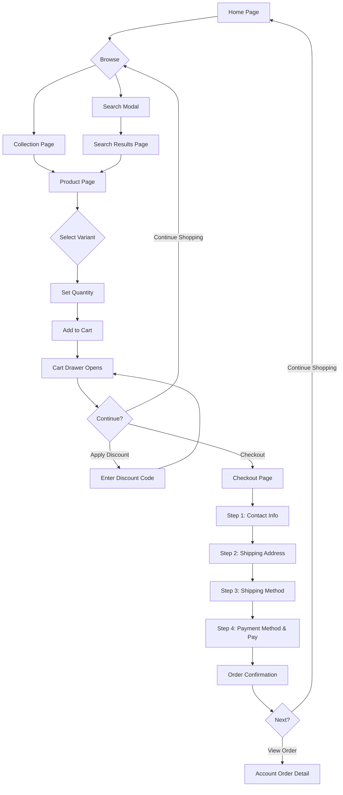
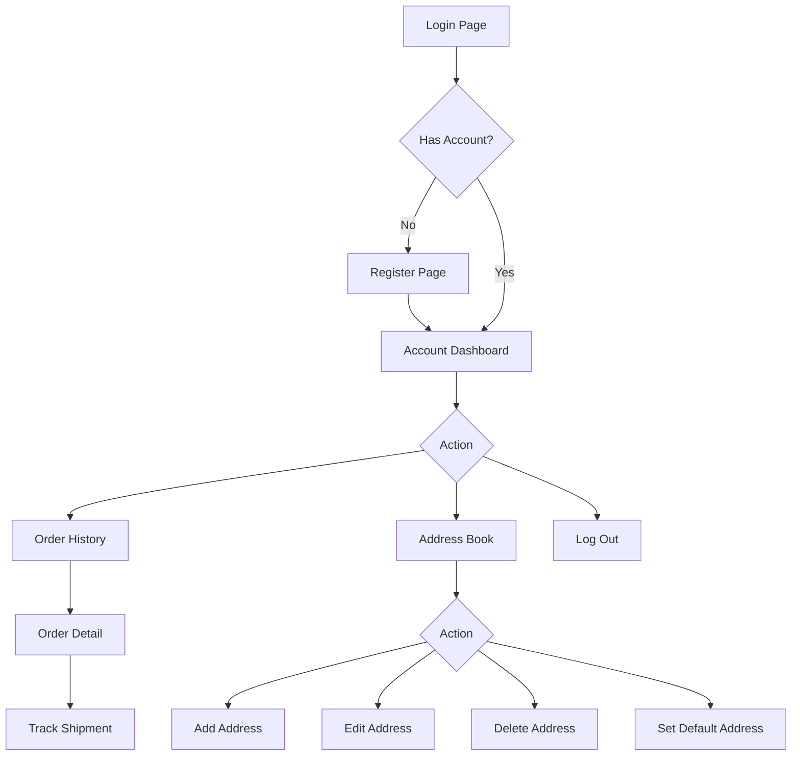
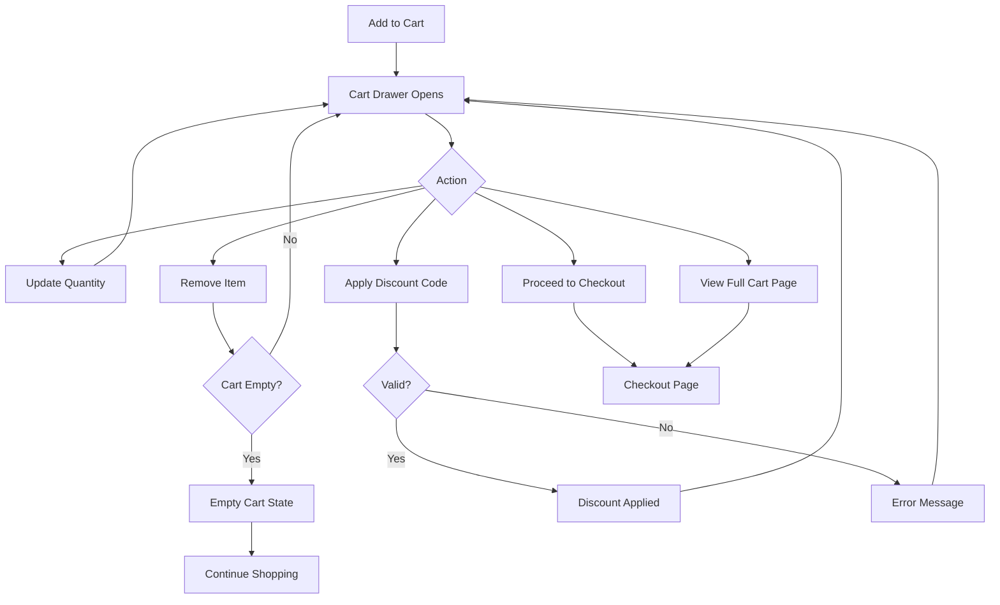
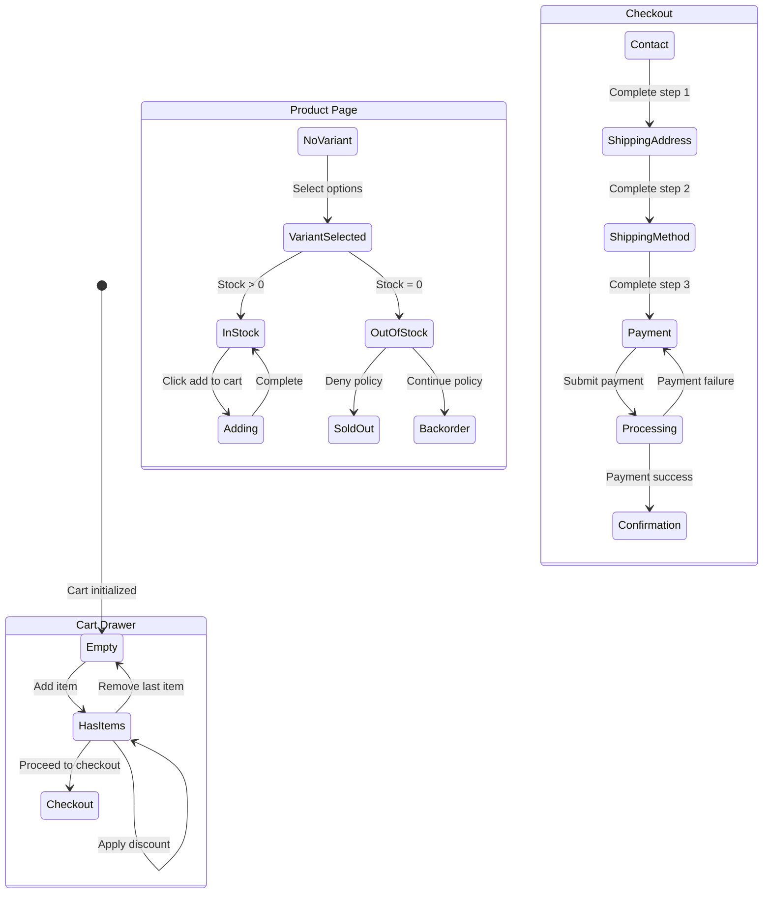

# 04 - Storefront UI/UX Specification

> E-commerce platform - Customer-facing storefront UI/UX requirements

---

## Conventions

| Convention | Detail |
|---|---|
| CSS Framework | Tailwind CSS v4, mobile-first design, dark mode support |
| Interactivity | Livewire v4 for all dynamic UI (cart, filters, checkout) |
| Templating | Blade templates with reusable storefront-prefixed components |
| Accessibility | WCAG 2.2 AA compliance throughout |
| Responsive | Mobile-first with progressive enhancement at small, medium, large, and extra-large breakpoints |
| Currency | All prices stored as integers (cents), formatted with locale-aware helpers |
| Images | Lazy-loaded, with proper alt text and maintained aspect ratios |

---

## Currency Formatting

All monetary amounts are stored as integers in minor units (cents) and must be formatted for display according to these rules:

| Setting | Value |
|---------|-------|
| Decimal separator | `.` (period) |
| Thousands separator | `,` (comma) |
| Currency symbol | After amount with space (e.g., `24.99 EUR`) |
| Decimal places | Always 2 |
| Free amounts | Display as `0.00 EUR` |
| Negative amounts (refunds) | Prefix with `-` (e.g., `-12.50 EUR`) |

**Helper:** Use a shared Blade component or helper (e.g., `<x-price :amount="$amount" :currency="$currency" />`) to ensure consistent formatting across all storefront pages.

**Examples:**
- 2499 cents -> `24.99 EUR`
- 0 cents -> `0.00 EUR`
- 149900 cents -> `1,499.00 EUR`

---

## 1. Theme System Architecture

### 1.1 View Organization

The storefront views are organized into the following categories:

| Category | Purpose | Views |
|---|---|---|
| Layouts | Master page shell | app (master layout) |
| Pages | Core storefront pages | home, collection, product, cart, search, page (static CMS) |
| Checkout | Purchase flow | checkout index, order confirmation |
| Account | Customer area | login, register, dashboard, orders (list + detail), addresses |
| Errors | Error states | 404, 503 |
| Components | Reusable UI elements | product-card, price, badge, quantity-selector, address-form, order-summary, breadcrumbs, pagination |

### 1.2 Layout Hierarchy

All storefront pages extend a single master layout, which provides the full page shell including header, footer, cart drawer, and global Livewire listeners. Individual page templates fill the main content section.

### 1.3 Theme Settings

Theme settings are stored in the database as JSON (keyed by theme ID). A singleton service loads and caches the active theme settings for the current store. Settings control:

- Announcement bar visibility, text, link, and background color
- Sticky header toggle
- Home page section order and visibility
- Color palette overrides (primary, secondary, accent)
- Typography scale
- Footer content and social links
- Dark mode behavior (system preference, toggle, or forced)

### 1.4 Section-Based Architecture

Each page is composed of configurable sections. Sections are Blade includes or Livewire components receiving configuration from theme settings.

| Section | Description | Used On |
|---|---|---|
| Hero | Full-width banner with heading, subheading, call-to-action | Home |
| Featured Collections | Grid of collection cards | Home |
| Featured Products | Grid of product cards (lazy-loaded) | Home |
| Newsletter | Email signup form | Home, Footer |
| Rich Text | Customizable content block | Home, Pages |

### 1.5 Blade Components

All reusable UI elements are implemented as Blade components with a storefront prefix. See Section 16 for the full component library reference.

---

## 2. Base Layout

### 2.1 Document Head

The document head includes:

| Element | Description |
|---|---|
| Character encoding | UTF-8 |
| Viewport | Width = device width, initial scale 1 |
| Meta description | Page-specific, yielded from child templates |
| Title | Page-specific title appended with the app name |
| Stylesheets | Compiled CSS via Vite |
| Scripts | Compiled JS via Vite |
| Livewire styles | Injected by Livewire |
| Language attribute | Set on the HTML element from application locale |
| Scroll behavior | Smooth scrolling enabled globally |

### 2.2 Skip Link

A visually hidden "Skip to main content" link is the first element in the body. It becomes visible on keyboard focus, positioned fixed at top-left with a clear visual treatment (solid background, shadow, focus ring). Supports dark mode.

**Accessibility:** Allows keyboard users to bypass the header navigation and jump directly to the main content area.

### 2.3 Announcement Bar

Optional, controlled by theme settings. Renders a full-width bar above the header.

| Attribute | Description |
|---|---|
| Position | Full-width, above the header |
| Background | Configurable color, defaults to dark background (light text) / inverted in dark mode |
| Text | Centered, small size, configurable content |
| Link | Optional, underlined, opens in same tab |
| Dismiss | Close button (X icon) on the right side; dismissal persisted via localStorage |
| Height | Auto height with vertical padding |

### 2.4 Header

The header serves as the primary navigation banner.

**Desktop Layout (large breakpoint and above):**

```
+--------------------------------------------------------------+
| [Logo]      [Nav Item] [Nav Item] [Nav Item]     [S] [C] [A] |
+--------------------------------------------------------------+
```

| Element | Position | Description |
|---|---|---|
| Logo | Left | Linked to home page. Shows image if logo URL is set in theme settings, otherwise store name as text. Max height approximately 40px on desktop, 32px on smaller screens |
| Main Navigation | Center | Horizontal nav with links sourced from the "main-menu" navigation menu. Supports one level of dropdown submenus (revealed on hover/focus) |
| Search Icon | Right group | Button that opens the search modal |
| Cart Icon | Right group | Button that opens the cart drawer. Displays item count badge (small circular indicator, primary color background, white text) |
| Account Icon | Right group | Link to account dashboard (logged in) or login page (guest) |

**Mobile Layout (below large breakpoint):**

```
+--------------------------------------------------------------+
| [Hamburger]           [Logo]                            [Cart]|
+--------------------------------------------------------------+
```

| Element | Position | Description |
|---|---|---|
| Hamburger menu | Left | Toggle button for mobile navigation drawer |
| Logo | Center | Same as desktop but horizontally centered |
| Cart icon | Right | Same as desktop |

**Sticky Header (optional):**

When enabled in theme settings, the header sticks to the top of the viewport with a semi-transparent background and backdrop blur. A subtle bottom border appears on scroll.

**Mobile Navigation Drawer:**

| Attribute | Description |
|---|---|
| Animation | Slides in from the left side |
| Height | Full viewport height |
| Backdrop | Semi-transparent dark overlay behind the drawer |
| Close button | X icon at the top-right of the drawer |
| Navigation items | Vertical stack with comfortable tap targets |
| Submenus | Collapsible accordion pattern with chevron icons |
| Account link | Positioned at the bottom of the navigation list |
| Focus behavior | Focus is trapped within the drawer while open |
| ARIA | Labeled as "Mobile navigation" |

### 2.5 Main Content Area

The main content area is a landmark element with a unique ID for skip-link targeting. It occupies at least the full viewport height.

### 2.6 Footer

The footer is a content-info landmark.

**Layout:**

```
+--------------------------------------------------------------+
| [Column 1: Links]  [Column 2: Links]  [Column 3: Store Info] |
|                                                               |
| [Social Icons]                                                |
| [Copyright] [Payment Icons]                                   |
+--------------------------------------------------------------+
```

| Element | Description |
|---|---|
| Link columns | Responsive grid: 2 columns on mobile, 3 on tablet, up to 4 on desktop. Links sourced from "footer-menu" navigation menu. Each column has an uppercase heading and a list of links |
| Store info column | Store name, address (if configured), contact email |
| Social links | Row of icon links (Facebook, Instagram, Twitter/X, TikTok, YouTube) configured in theme settings. Each with screen reader label. Icons are 20x20, muted color with hover to full contrast |
| Copyright line | Small muted text: "(c) {year} {store name}. All rights reserved." |
| Payment method icons | Row of SVG icons for accepted payment methods (Visa, Mastercard, Amex, PayPal, etc.). Slightly reduced opacity |
| Spacing | Generous vertical padding, content constrained to max-width container with horizontal padding |
| Background | Light gray (dark: very dark gray), top border separator |

### 2.7 Cart Drawer (Livewire)

The cart drawer is always present in the layout as a global Livewire component. It listens for the "cart-updated" browser event to refresh and open. See Section 6 for full specification.

### 2.8 Dark Mode

Dark mode is implemented via Tailwind's dark variant. The behavior is controlled by theme settings:

| Mode | Implementation |
|---|---|
| System preference (default) | Follows OS-level dark mode preference automatically |
| Toggle | User-controlled toggle button in header/footer; preference stored in localStorage |
| Forced light/dark | Applied at server render time on the HTML element |

**Color Token Patterns:**

| Token | Light Mode | Dark Mode |
|---|---|---|
| Page background | White | Near-black |
| Card/section background | Light gray | Very dark gray |
| Heading text | Near-black | White |
| Body text | Medium gray | Light gray |
| Borders | Light gray | Medium-dark gray |
| Primary actions | Blue, darkens on hover | Slightly lighter blue, lightens on hover |

---

## 3. Home Page (GET /)

The home page renders sections in the order defined by theme settings. Each section can be toggled on/off and reordered. Default section order:

1. Hero Banner
2. Featured Collections
3. Featured Products
4. Newsletter Signup
5. Rich Text

### 3.1 Hero Banner Section

**Layout:** Full-width container (no max-width on the outer wrapper). Inner content constrained to standard max-width.

**Desktop (large breakpoint and above):**

```
+--------------------------------------------------------------+
|                                                               |
|  [Background Image / Gradient]                                |
|                                                               |
|       [Heading - very large, bold]                            |
|       [Subheading - medium, regular weight]                   |
|       [CTA Button - primary, large]                           |
|                                                               |
+--------------------------------------------------------------+
```

| Attribute | Description |
|---|---|
| Background | Full-width image (cover, centered) or gradient. Image set via theme settings. Semi-transparent dark overlay for text readability |
| Content | Centered vertically and horizontally, white text |
| Heading | H1 or H2 depending on context. Very large on desktop, progressively smaller on mobile. Bold, tight tracking |
| Subheading | Regular paragraph, medium size, generous top margin. Constrained to a comfortable reading width |
| CTA | Styled as primary button, large. Links to a configured collection or product |
| Height | Minimum 600px on desktop, 500px on tablet, 400px on mobile, 300px on small mobile |
| Padding | Generous vertical and horizontal padding |

**Mobile:** Same structure but stacked, with reduced font sizes and shorter minimum height. Full-bleed background image remains.

**Accessibility:**

- If background is an image, it is decorative (the content provides meaning)
- CTA button has descriptive text (e.g., "Shop the summer collection")

### 3.2 Featured Collections Section

**Layout:** Section with heading and grid of collection cards.

| Attribute | Description |
|---|---|
| Section heading | H2, large, bold, centered, with generous bottom margin |
| Grid | 2 columns on mobile, 4 columns on large screens, with gap spacing |
| Count | 2 to 4 collections, configurable in theme settings |

**Collection Card:**

```
+---------------------------+
|  [Collection Image]       |
|  3:4 aspect ratio         |
|  cover-fit, rounded       |
|                           |
|  [Title overlay at bottom]|
|  [Shop now ->]            |
+---------------------------+
```

| Element | Description |
|---|---|
| Image | 3:4 aspect ratio, cover-fit, rounded corners. Gradient overlay at bottom fading from transparent to semi-transparent dark |
| Title | White text overlaid at bottom of image, semi-bold, medium-large size |
| "Shop now" link | Small white text below title, slightly transparent, underlined. Becomes fully opaque on hover |
| Interaction | Entire card is clickable. Subtle scale-up on hover with smooth transition |

**Accessibility:**

- Each card link has the collection title as accessible name
- Images have alt text matching the collection title

### 3.3 Featured Products Section

**Livewire Component:** FeaturedProducts

This section uses Livewire for lazy loading to improve initial page load.

| Attribute | Description |
|---|---|
| Section heading | H2, same styling as featured collections heading |
| Grid | 2 columns on mobile, 3 on tablet, 4 on desktop, with gap spacing |
| Products | 4 to 8, configurable. Sourced from a configured collection or "best sellers" logic |
| Loading state | Skeleton placeholders with pulsing animation, matching the product card dimensions |

Each product uses the product-card component (see Section 16).

### 3.4 Newsletter Signup Section

**Livewire Component:** NewsletterSignup

**Layout:**

```
+--------------------------------------------------------------+
|  [Heading: "Stay in the loop"]                                |
|  [Subtext: "Subscribe for exclusive offers and updates."]     |
|  [Email input] [Subscribe button]                             |
+--------------------------------------------------------------+
```

| Attribute | Description |
|---|---|
| Background | Light gray (dark mode: darker gray), generous vertical padding |
| Content | Centered, constrained to a comfortable width |
| Heading | H2, medium-large, bold |
| Subtext | Muted color, small top margin |
| Form | Horizontal layout with gap. Input takes remaining width, button shrinks to fit |
| Input | Email type, placeholder "Enter your email", required |
| Button | Primary style, "Subscribe" text |
| Success state | Replaces form with "Thanks for subscribing!" message |
| Error state | Inline error below input in red, small text |
| Loading state | Button text changes to "Subscribing..." during submission |

**Accessibility:**

- Label associated with email input (visually hidden if using placeholder)
- Success/error messages in a polite live region for screen readers

### 3.5 Rich Text Section

Simple section rendering customizable content from theme settings.

| Attribute | Description |
|---|---|
| Container | Constrained to comfortable reading width, centered, vertical padding |
| Content | Sanitized HTML from theme settings, styled with typography (prose) styling for headings, paragraphs, lists, links |
| Dark mode | Inverted prose styling |

---

## 4. Collection Page (GET /collections/{handle})

**Livewire Component:** CollectionPage

### 4.1 Collection Header

| Element | Description |
|---|---|
| Breadcrumbs | Home > Collections > {Collection Title} |
| Title | H1, large, bold |
| Description | Rendered HTML from collection description, styled with prose/typography, constrained width |
| Spacing | Generous vertical padding |

### 4.2 Toolbar

Horizontal bar between the header and the product grid.

**Desktop:**

```
+--------------------------------------------------------------+
| [Filter toggle button]          [X products] [Sort dropdown]  |
+--------------------------------------------------------------+
```

**Mobile:**

```
+--------------------------------------------------------------+
| [Filter button]                           [Sort dropdown]     |
+--------------------------------------------------------------+
```

| Element | Description |
|---|---|
| Product count | Small muted text, e.g., "24 products" |
| Sort dropdown | Select element with live Livewire binding |

**Sort Options:**

| Option | Description |
|---|---|
| Featured | Default sort order |
| Price: Low to High | Ascending by price |
| Price: High to Low | Descending by price |
| Newest | Descending by creation date |
| Best Selling | Descending by sales count |

### 4.3 Filter Sidebar

**Desktop (large breakpoint and above):** Persistent sidebar on the left, approximately 256px wide.
**Mobile (below large breakpoint):** Slide-out drawer from the left, triggered by "Filter" button with filter icon.

**Filter Groups:**

Each filter group is a collapsible section with a heading and toggle chevron.

| Filter Group | Type | Binding | Description |
|---|---|---|---|
| Availability | Single checkbox | Live | "In stock" toggle |
| Price Range | Two number inputs | Live with 500ms debounce | "Min" and "Max" inputs with currency symbol prefix, displayed side by side |
| Product Type | Checkbox list | Live | Dynamically sourced from products in the collection |
| Vendor | Checkbox list | Live | Dynamically sourced from products in the collection |

**Clear All:**

- Link at the top of the filter sidebar: "Clear all filters"
- Only visible when at least one filter is active
- Small, blue, interactive text

**Active Filter Pills:**

- Displayed above the product grid (below toolbar) when filters are active
- Each pill: rounded tag with filter value text and a remove (X) button
- "Clear all" link at the end of the pills row

**Mobile Filter Drawer:**

| Attribute | Description |
|---|---|
| Position | Full-height overlay from left side |
| Header | "Filters" title + close button (X) |
| Content | Same filter groups as desktop, stacked vertically |
| Footer | Sticky "Apply" button at bottom that closes the drawer |
| Clear | "Clear all" link in header area |
| Focus | Trapped within drawer while open |

### 4.4 Product Grid

| Attribute | Description |
|---|---|
| Layout | Fills remaining width next to the sidebar |
| Columns | 2 on mobile, 3 on tablet, 3 on desktop (when sidebar visible). Without sidebar: 2 mobile, 3 tablet, 4 desktop |
| Loading state | Subtle opacity reduction on the grid while results update |

### 4.5 Product Card (Component)

The product card is a reusable component used on collection pages, search results, and featured products sections.

```
+---------------------------+
|  [Product Image]          |
|  1:1 aspect ratio         |
|  cover-fit, rounded       |
|  (hover: show 2nd image)  |
|                           |
|  [Sale badge]  [Sold out] |
+---------------------------+
|  [Product Title]          |
|  [Price]  [Compare price] |
|  [Quick Add / Options]    |
+---------------------------+
```

**Image Behavior:**

| Attribute | Description |
|---|---|
| Container | Square aspect ratio, rounded corners, overflow hidden, gray placeholder background |
| Primary image | Cover-fit, fills the container |
| Secondary image | On hover (desktop with hover capability only), crossfades to the second product image |
| Fallback | If no image, show a centered shopping bag placeholder icon |
| Loading | Lazy-loaded |

**Badges:**

| Badge | Condition | Position |
|---|---|---|
| "Sale" | compare_at_amount > price_amount | Top-left of image, stacked vertically |
| "Sold out" | All variants out of stock with deny policy | Top-left of image, stacked vertically |

**Text Content:**

| Element | Description |
|---|---|
| Title | H3 (or configurable heading level), small semi-bold text. Truncated to 2 lines |
| Price | Current price in small semi-bold text. Compare-at price shown with strikethrough if applicable |
| Quick Add | Single variant: "Add to cart" button. Multiple variants: "Choose options" link text. Hidden by default on desktop (shown on hover), always visible on mobile |

**Accessibility:**

- Card link wraps the entire card; title serves as the accessible name
- Badges have screen reader labels (e.g., "On sale")
- Price changes announced via parent live region when filtering changes results

### 4.6 Pagination

| Attribute | Description |
|---|---|
| Style | Numbered pagination with previous/next arrow buttons |
| Current page | Highlighted with primary color background and white text |
| Other pages | Muted text, hover background |
| Disabled | Reduced opacity and not-allowed cursor on previous (at first page) or next (at last page) |
| Truncation | Ellipsis for large page counts |
| Mobile | Simplified: previous/next only with current page indicator |

### 4.7 Empty State

When no products match the current filters:

```
+--------------------------------------------------------------+
|  [Search icon - large, muted]                                 |
|  "No products found"                                          |
|  "Try adjusting your filters or browse our full collection."  |
|  [Clear filters button]                                       |
+--------------------------------------------------------------+
```

| Element | Description |
|---|---|
| Icon | Large, muted search icon |
| Heading | Medium, semi-bold |
| Subtext | Muted, descriptive guidance |
| Button | Secondary style, "Clear filters" |
| Position | Centered in the grid area with generous vertical padding |

---

## 5. Product Page (GET /products/{handle})

**Livewire Component:** ProductPage

### 5.1 Layout

**Desktop (large breakpoint and above):** Two-column, 50/50 split. Left column (images) is sticky while the right column (product info) scrolls.

**Mobile:** Single column, stacked. Images first, then product info.

```
Desktop:
+-------------------------------+-------------------------------+
|  [Image Gallery]              |  [Product Info]               |
|  (sticky while scrolling)     |  (scrollable)                 |
+-------------------------------+-------------------------------+

Mobile:
+--------------------------------------------------------------+
|  [Image Gallery - horizontal scroll]                          |
+--------------------------------------------------------------+
|  [Product Info - full width]                                  |
+--------------------------------------------------------------+
```

Container constrained to standard max-width with horizontal padding and vertical spacing.

### 5.2 Image Gallery (Left Column)

**Desktop:**

```
+-------------------------------+
|                               |
|  [Main Image - large]         |
|  1:1 aspect ratio, rounded    |
|                               |
+-------------------------------+
| [Thumb] [Thumb] [Thumb] ...  |
+-------------------------------+
```

| Attribute | Description |
|---|---|
| Main image | Square aspect ratio, large rounded corners, cover-fit. Gray placeholder background |
| Zoom on hover | Optional (theme setting): image scales to 150% and follows cursor position |
| Thumbnail strip | Horizontal row with overflow scroll, small gap between thumbnails |
| Each thumbnail | 64x64px, rounded, cover-fit, pointer cursor. Active thumbnail has a colored border |
| Variant images | When a variant is selected that has specific images, those images are shown |

**Mobile:**

| Attribute | Description |
|---|---|
| Gallery | Horizontal scrollable row with snap-scroll behavior |
| Each image | Full-width, square aspect ratio, rounded, cover-fit |
| Scroll indicators | Row of dots below the gallery. Active dot is dark (light in dark mode), inactive dots are gray |

**Accessibility:**

| Requirement | Description |
|---|---|
| Alt text | Main image has descriptive alt text from product media data |
| Thumbnails | Rendered as buttons with labels "View image X of Y" and current state indicator |
| Region | Gallery wrapped in a labeled region ("Product images") |

### 5.3 Product Info (Right Column)

#### Breadcrumbs

Home > {Primary Collection} > {Product Title}. Small, muted text with separator characters.

#### Product Title

H1, large, bold.

#### Price Display

| Element | Description |
|---|---|
| Current price | Large, bold |
| Compare-at price | Medium, muted, strikethrough (shown when set and higher than current price) |
| Sale badge | Inline badge next to the price |
| Currency | Formatted based on the store's default currency |
| Live updates | Price container is a live region, so price changes when variant changes are announced to screen readers |

#### Variant Selector

For each product option (e.g., Size, Color), render a selector group.

**Radio button style (for options with 6 or fewer values):**

```
Size
[S] [M] [L] [XL] [XXL]
```

| State | Visual Description |
|---|---|
| Available | Bordered pill shape, pointer cursor, border darkens on hover |
| Selected | Primary color border with subtle background tint and focus ring |
| Unavailable | Muted border, muted text, strikethrough, reduced opacity, not-allowed cursor |

**Select dropdown style:** Used when the option has more than 6 values.

**Color swatches (when option name is "Color"):**

| Attribute | Description |
|---|---|
| Shape | Circular, 32x32px |
| Color | Determined by value name mapped to a color lookup or inline style |
| Selected state | Ring with offset around the swatch |
| Tooltip | Shows color name on hover |

**Livewire behavior:**

- Selected options are a key-value map (e.g., Size = M, Color = Red)
- Selected variant is computed by matching all selected options to the variant option values
- On change: updates price, stock messaging, available images, and add-to-cart availability

#### Stock Messaging

Displayed below the variant selector.

| Condition | Message | Visual Style |
|---|---|---|
| In stock, quantity > 10 | "In stock" | Green text with check icon |
| In stock, quantity <= 10 | "Only X left in stock" | Amber text with warning icon |
| Out of stock, deny policy | "Out of stock" | Red text with X icon |
| Out of stock, continue policy | "Available on backorder" | Blue text with info icon |

Small text, icon + text inline. Wrapped in a live region for screen reader announcements on variant change.

#### Quantity Selector

Uses the quantity-selector component.

```
[-] [3] [+]
```

| Attribute | Description |
|---|---|
| Container | Inline flex, bordered, rounded |
| Decrease button | "-" icon, 40x40px. Disabled at minimum (1) |
| Input | Centered number input, 56px wide, 40px tall. Min = 1, Max = available stock (deny policy) or unlimited (continue policy) |
| Increase button | "+" icon, same size. Disabled at maximum |
| Disabled state | Reduced opacity, not-allowed cursor |
| Labels | Input labeled "Quantity", buttons labeled "Decrease quantity" / "Increase quantity" |

#### Add to Cart Button

| Attribute | Description |
|---|---|
| Width | Full width |
| Style | Primary button: blue background, white text, semi-bold, generous padding, rounded |
| Text | "Add to cart" |
| Loading state | Text changes to "Adding..." with spinner icon. Button disabled during loading |
| Sold out state | Gray background, muted text, not-allowed cursor. Text: "Sold out" |
| Spacing | Generous top margin |

**Livewire action (addToCart):**

1. Validates variant is selected and in stock
2. Adds to cart (creates cart if none exists in session)
3. Dispatches "cart-updated" browser event
4. Cart drawer opens automatically

#### Product Description

- Separated from above content by a horizontal rule with generous vertical spacing
- Rendered HTML styled with prose/typography styling

#### Tags

- Displayed below the description (if tags exist)
- Horizontal wrapping row with gap
- Each tag: rounded pill, gray background, small text

### 5.4 Accessibility Summary

| Requirement | Implementation |
|---|---|
| Variant radio buttons | Properly labeled with labels and grouped with fieldset/legend |
| Live regions | Price display, stock messaging, add-to-cart feedback |
| Image alt text | All images have meaningful alt text |
| Keyboard | Tab through thumbnails, variant options, quantity controls, and add-to-cart |
| Focus indicators | Visible ring styles on all interactive elements |

---

## 6. Cart Drawer

**Livewire Component:** CartDrawer

### 6.1 Trigger and Animation

| Attribute | Description |
|---|---|
| Trigger | "cart-updated" browser event (from add-to-cart actions), or clicking the cart icon in the header |
| Animation | Slides in from the right side of the viewport. Transforms from fully off-screen to visible |
| Backdrop | Fixed full-screen semi-transparent dark overlay. Click to close |
| Panel | Fixed, right-aligned, full height, full width on small screens or 384px on larger screens. White background (dark mode: near-black), shadow |
| Body | Scroll locked when drawer is open |

### 6.2 Drawer Header

```
+--------------------------------------+
| Your Cart (3)                    [X] |
+--------------------------------------+
```

| Element | Description |
|---|---|
| Heading | H2, semi-bold, medium-large text |
| Item count | In parentheses after heading |
| Close button | X icon, labeled "Close cart" |
| Layout | Flex row, space-between, with horizontal padding and bottom border |

### 6.3 Cart Line Items

Scrollable list area occupying the space between header and totals.

Each line item:

```
+--------------------------------------+
| [Thumb]  Title                       |
|          Variant: Size M / Blue      |
|          [-] [2] [+]       $49.98    |
|                             [Remove] |
+--------------------------------------+
```

| Element | Description |
|---|---|
| Thumbnail | 64x64px, rounded, cover-fit, non-shrinking |
| Title | Small semi-bold text, truncated to 1 line |
| Variant info | Extra-small muted text showing selected options |
| Quantity stepper | Compact version of quantity-selector (smaller buttons, 32x32px) |
| Line total | Small semi-bold text |
| Remove button | Trash icon, muted color, turns red on hover. Labeled "Remove {item title} from cart" |
| Separation | Bottom border between items, vertical padding per item |
| Loading | Opacity reduction on the line item during quantity update |

### 6.4 Discount Code Section

Below the line items list, above totals.

**No discount applied:**

```
+--------------------------------------+
| [Discount code input] [Apply]        |
+--------------------------------------+
```

**Discount applied:**

```
+--------------------------------------+
| SUMMER20 (-15%)              [Remove]|
+--------------------------------------+
```

| Attribute | Description |
|---|---|
| Input | Small text, placeholder "Discount code" |
| Apply button | Secondary style, small |
| Success state | Green text showing the code and discount type, with a remove button |
| Error state | Small red text below, e.g., "Invalid discount code" or "This code has expired" |
| Loading state | Button text changes to "Applying..." |

### 6.5 Totals Section

```
+--------------------------------------+
| Subtotal                     $149.97 |
| Discount (SUMMER20)          -$22.50 |
| ------------------------------------ |
| Estimated total              $127.47 |
+--------------------------------------+
```

| Element | Description |
|---|---|
| Position | Sticky at the bottom of the drawer, with top border |
| Each line | Flex row, justified space-between, small text |
| Discount line | Only shown when discount applied, green text |
| Total | Slightly larger text, semi-bold |
| Note | "Shipping and taxes calculated at checkout" in extra-small muted text below totals |

### 6.6 Action Buttons

| Button | Description |
|---|---|
| Checkout | Primary, full-width. Creates checkout record, then navigates to checkout page |
| Continue shopping | Centered text link below checkout button. Small muted text, hover to darker. Closes the drawer |

### 6.7 Empty Cart State

```
+--------------------------------------+
|                                      |
|  [Shopping bag icon - large]         |
|  "Your cart is empty"                |
|  [Continue shopping button]          |
|                                      |
+--------------------------------------+
```

| Element | Description |
|---|---|
| Layout | Centered vertically and horizontally in the drawer content area |
| Icon | Large, very muted shopping bag icon |
| Text | Muted, with top margin |
| Button | Secondary style, closes the drawer |

### 6.8 Accessibility

| Requirement | Description |
|---|---|
| Role | Dialog with modal behavior, labeled "Shopping cart" |
| Focus trap | Tab/Shift+Tab cycles through drawer elements only |
| On open | Focus moves to the close button or first interactive element |
| On close | Focus returns to the element that triggered the drawer (cart icon) |
| Escape key | Closes the drawer |
| Feedback | All quantity changes and removals announced via polite live region |

---

## 7. Full Cart Page (GET /cart)

**Livewire Component:** CartPage

Same functionality as the cart drawer but in a full-page layout.

### 7.1 Desktop Layout

```
+--------------------------------------------------------------+
|  Your Cart                                                    |
+--------------------------------------------------------------+
|  Image | Product      | Price   | Quantity | Total   |       |
|  ------|------------- |---------|----------|---------|-------|
|  [img] | Title        | $24.99  | [-][2][+]| $49.98  | [X]   |
|        | Size: M      |         |          |         |       |
|  [img] | Title        | $34.99  | [-][1][+]| $34.99  | [X]   |
|        | Color: Blue  |         |          |         |       |
+--------------------------------------------------------------+
|                                            Subtotal: $84.97   |
|                              [Discount code] [Apply]          |
|                                            Discount: -$12.75  |
|                                            Total:    $72.22   |
|                                                               |
|                                            [Checkout button]  |
|                                            [Continue shopping]|
+--------------------------------------------------------------+
```

| Attribute | Description |
|---|---|
| Container | Constrained max-width, centered, with horizontal padding and vertical spacing |
| Title | H1, large bold, generous bottom margin |
| Desktop layout | Proper table with header row and body |
| Table headers | Left-aligned, small, semi-bold, muted, uppercase, wide tracking |
| Mobile layout | Card-based layout (same as cart drawer items, stacked) |

### 7.2 Totals and Actions

- Right-aligned on desktop, full-width on mobile
- Same discount code input/apply functionality as drawer
- Same totals breakdown
- "Checkout" button: primary, aligned right
- "Continue shopping" link: below checkout button

### 7.3 Empty State

Same as drawer empty state but centered in the page content area with more vertical padding.

---

## 8. Checkout Page (GET /checkout/{checkoutId})

**CRITICAL:** This Livewire component MUST be implemented. It provides the browser-facing checkout UI. Without it, customers cannot complete purchases through the storefront.

**Route:** `GET /checkout/{checkoutId}` (registered in `routes/web.php` under `store.resolve:storefront` middleware)

**Livewire Component:** `Storefront\Checkout\Show` (file: `app/Livewire/Storefront/Checkout/Show.php`)

### 8.1 Layout

**Desktop (large breakpoint and above):** Two-column layout. Left column (wider, approx 60%) contains the form sections. Right column (narrower, approx 40%) contains the sticky order summary.

**Mobile:** Single column. Order summary is a collapsible section at the top (collapsed by default, showing a toggle with "Show order summary" / "Hide order summary" + chevron + total amount).

```
Desktop:
+-------------------------------+-------------------+
|  [Checkout Form Sections]     | [Order Summary]   |
|  (wider, ~60%)                | (narrower, ~40%)  |
|                               | (sticky)          |
+-------------------------------+-------------------+

Mobile:
+--------------------------------------------------------------+
|  [Order Summary - collapsible]                                |
+--------------------------------------------------------------+
|  [Checkout Form Sections]                                     |
+--------------------------------------------------------------+
```

### 8.2 Checkout Steps

The checkout uses a single-page design with collapsible sections. Steps: Contact, Shipping Address, Shipping Method, Payment Method & Pay.

**Step State Behavior:**

| State | Description |
|---|---|
| Completed | Shows summary of entered data with an "Edit" link |
| Current | Expanded with the full form |
| Future | Collapsed, muted, not interactive |

Each step header shows the step number + title, e.g., "1. Contact information".

#### Step 1 - Contact Information

| Field | Description |
|---|---|
| Email | Full-width email input, required. Validated on blur |
| Account link | "Already have an account? Log in" link below email, small blue text |
| Continue button | Primary, below the form |

#### Step 2 - Shipping Address

Uses the address-form component.

**Fields:**

| Field | Type | Required | Layout Width |
|---|---|---|---|
| First name | Text | Yes | Half |
| Last name | Text | Yes | Half |
| Address line 1 | Text | Yes | Full |
| Address line 2 | Text | No | Full |
| City | Text | Yes | Half |
| State/Province | Select or text | Yes (varies by country) | Half |
| Postal code | Text | Yes | Half |
| Country | Select | Yes | Half |
| Phone | Tel | No | Full |

- Layout: 2-column grid, full-width fields span both columns
- Country select: on change, State/Province updates to show relevant regions
- All fields validate on blur

**Billing address:**

- Checkbox: "Billing address same as shipping" (checked by default)
- When unchecked, a second address form appears for billing

**Saved addresses (logged-in customers):**

- Dropdown above the form: "Select a saved address" with saved addresses listed
- "Use a new address" option to show the blank form
- On selection, form fields populate with the saved address data

Continue button: primary.

#### Step 3 - Shipping Method

Radio button list of available shipping methods, filtered server-side by matching the shipping address to shipping zones.

```
+--------------------------------------------------------------+
| (o) Standard Shipping          5-7 business days       $7.99 |
| ( ) Express Shipping           2-3 business days      $14.99 |
| ( ) Free Shipping              7-10 business days      Free  |
+--------------------------------------------------------------+
```

| Attribute | Description |
|---|---|
| Each option | Bordered, rounded card with padding. Selected: primary border with subtle background tint. Unselected: gray border |
| Label layout | Method name (left), estimated delivery (center), price (right) |
| Live binding | On selection, the order summary sidebar updates totals |
| No methods | Warning message: "No shipping methods are available for your address. Please verify your address or contact us." in amber text with info icon |

Continue button: primary.

#### Step 4 - Payment Method & Pay

All payment is handled onsite via the Mock PSP. No external redirects, no iframes, no third-party scripts.

**Payment method selection (radio buttons):**

```
+--------------------------------------------------------------+
| Select a payment method                                       |
|                                                               |
| (o) Credit Card                                               |
| ( ) PayPal                                                    |
| ( ) Bank Transfer                                             |
+--------------------------------------------------------------+
```

| Attribute | Description |
|---|---|
| Layout | Radio button list, each option in a bordered card (same styling as shipping method radios) |
| Default | First option (Credit Card) is pre-selected |
| Live binding | On selection, the payment form below updates to show the relevant fields |

**Credit Card form (shown when Credit Card is selected):**

```
+--------------------------------------------------------------+
| Card number     [4242 4242 4242 4242        ]                |
| Cardholder name [John Doe                   ]                |
| Expiry          [12/28     ]  CVC [123    ]                  |
+--------------------------------------------------------------+
| [Pay now - 29.98 EUR]                                        |
+--------------------------------------------------------------+
```

| Field | Type | Required | Validation |
|---|---|---|---|
| Card number | Text (digits, auto-formatted with spaces every 4 digits) | Yes | 16 digits |
| Cardholder name | Text | Yes | Max 255 |
| Expiry | Text (MM/YY format) | Yes | Valid future date |
| CVC | Text (3-4 digits) | Yes | 3-4 digits |

**PayPal form (shown when PayPal is selected):**

```
+--------------------------------------------------------------+
| Your PayPal payment will be processed securely.               |
|                                                               |
| [Pay with PayPal - 29.98 EUR]                                |
+--------------------------------------------------------------+
```

No additional form fields. The button text changes to "Pay with PayPal - {total}".

**Bank Transfer form (shown when Bank Transfer is selected):**

```
+--------------------------------------------------------------+
| After placing your order, you will receive bank transfer      |
| instructions. Your order will be held for 7 days while we     |
| await your payment.                                           |
|                                                               |
| [Place order - 29.98 EUR]                                     |
+--------------------------------------------------------------+
```

No additional form fields. The button text changes to "Place order - {total}" (not "Pay now", since payment is deferred).

| Element | Description |
|---|---|
| Pay/Place button | Primary, full-width, large text. Loading state: "Processing..." with spinner. Calls `POST /checkouts/{id}/pay` with the selected method and card details (if credit card). |
| Error handling | On payment decline (magic card number), display an inline error callout: "Payment declined: {reason}". The customer can correct details and retry. |
| Success (card/paypal) | On successful instant capture, redirect to confirmation page. |
| Success (bank_transfer) | On successful order placement, redirect to confirmation page (which shows bank transfer instructions). |

### 8.3 Order Summary Sidebar (Right Column)

Sticky on desktop.

```
+-------------------------------+
|  Order Summary                |
+-------------------------------+
|  [Thumb] Title x2     $49.98 |
|          Size: M              |
|  [Thumb] Title x1     $34.99 |
+-------------------------------+
|  [Discount code] [Apply]     |
+-------------------------------+
|  Subtotal              $84.97|
|  Discount             -$12.75|
|  Shipping               $7.99|
|  Tax                    $5.74|
|  ----------------------------|
|  Total                 $85.95|
+-------------------------------+
```

| Element | Description |
|---|---|
| Background | Light gray (dark: dark gray), large rounded corners, with padding |
| Cart items | Compact list with small thumbnail (48x48px), truncated title, quantity badge, and line total |
| Discount code input | Same as cart drawer |
| Totals | Line items for subtotal, discount (conditional), shipping ("Calculated at next step" until selected), tax (calculated after address), and total |
| Updates | Event-driven from step completion actions (no polling) |

### 8.4 Accessibility

| Requirement | Description |
|---|---|
| Labels | All form inputs have associated label elements |
| Validation errors | Linked via describedby pointing to error message element |
| Required fields | Marked with required attribute and visual asterisk |
| Step transitions | Focus moves to the first input of the newly expanded step |
| Shipping radios | Grouped in a fieldset with legend |
| Totals | Live region for screen reader updates |

---

## 9. Order Confirmation (GET /checkout/{checkoutId}/confirmation)

### 9.1 Layout

Centered content, single column.

```
+--------------------------------------------------------------+
|  [Checkmark icon - green circle]                              |
|  "Thank you for your order!"                                  |
|  Order #1042                                                  |
|  "We've sent a confirmation to you@email.com"                 |
+--------------------------------------------------------------+
|  Order Summary                                                |
|  [Items list with thumbnails]                                 |
+--------------------------------------------------------------+
|  Shipping Address          |  Payment Method                  |
|  Jane Doe                  |  Credit Card ending in 4242      |
|  123 Main St               |  (or: PayPal / Bank Transfer)    |
|  New York, NY 10001        |                                  |
+--------------------------------------------------------------+
|  Subtotal        $84.97                                       |
|  Shipping         $7.99                                       |
|  Tax              $5.74                                       |
|  Total           $98.70                                       |
+--------------------------------------------------------------+
|  [Continue shopping button]  [View order - if logged in]      |
+--------------------------------------------------------------+
```

| Element | Description |
|---|---|
| Container | Constrained to a comfortable width, centered, generous vertical padding |
| Success icon | Large green checkmark in a circle, centered |
| Heading | H1, large bold, centered, generous top margin |
| Order number | Medium muted text, centered |
| Email notice | Small muted text, centered |

### 9.2 Order Details

| Element | Description |
|---|---|
| Items | List with thumbnail, title, variant info, quantity, price |
| Address and payment | Two-column grid on desktop, stacked on mobile |
| Payment method display | Shows "Credit Card ending in {last4}", "PayPal", or "Bank Transfer" depending on `order.payment_method` |
| Totals | Right-aligned summary |

#### Bank Transfer Instructions (shown only when `payment_method = bank_transfer`)

A prominent callout (info variant) displayed between the order details and the totals:

```
+--------------------------------------------------------------+
|  [info icon] Bank Transfer Instructions                       |
|                                                               |
|  Please transfer the total amount to the following account:   |
|                                                               |
|  Bank:     Mock Bank AG                                       |
|  IBAN:     DE89 3704 0044 0532 0130 00                        |
|  BIC:      COBADEFFXXX                                        |
|  Amount:   29.98 EUR                                          |
|  Reference: #1042                                             |
|                                                               |
|  Please complete your transfer within 7 days. Your order will |
|  be processed once payment is confirmed by our team.          |
+--------------------------------------------------------------+
```

The reference field uses the order number so the admin can match incoming transfers.

### 9.3 Actions

| Button | Description |
|---|---|
| Continue shopping | Primary, links to home page |
| View order | Link to account order detail page (logged-in customers only) |
| Layout | Centered row with gap |

---

## 10. Customer Account Pages

All account pages require authentication. Unauthenticated access redirects to the login page.

### 10.1 Login (GET /account/login)

**Livewire Component:** Login

```
+--------------------------------------------------------------+
|  Log in to your account                                       |
|                                                               |
|  [Email input]                                                |
|  [Password input]                                             |
|  [Forgot password? link]                                      |
|  [Log in button]                                              |
|                                                               |
|  Don't have an account? [Create one]                          |
+--------------------------------------------------------------+
```

| Element | Description |
|---|---|
| Container | Narrow max-width, centered, generous vertical padding |
| Heading | H1, medium-large, bold, centered |
| Form | Vertical stack with gap |
| Email | Email type, required, autocomplete for email |
| Password | Password type, required, autocomplete for current password |
| Forgot password | Small blue link, right-aligned |
| Submit button | Primary, full-width, "Log in" |
| Error messages | Inline below fields in small red text |
| General error | Invalid credentials shown in a callout/alert above the form |
| Register link | "Create one" link to registration page |

### 10.2 Register (GET /account/register)

**Livewire Component:** Register

```
+--------------------------------------------------------------+
|  Create an account                                            |
|                                                               |
|  [Name input]                                                 |
|  [Email input]                                                |
|  [Password input]                                             |
|  [Confirm password input]                                     |
|  [ ] Subscribe to marketing emails                            |
|  [Create account button]                                      |
|                                                               |
|  Already have an account? [Log in]                            |
+--------------------------------------------------------------+
```

| Element | Description |
|---|---|
| Container | Narrow max-width, centered, generous vertical padding |
| Heading | H1, medium-large, bold, centered |
| Form | Vertical stack with gap |
| Name | Text type, required, autocomplete for name |
| Email | Email type, required, autocomplete for email |
| Password | Password type, required, minimum 8 characters, autocomplete for new password |
| Confirm password | Password type, required, autocomplete for new password |
| Marketing checkbox | Checkbox with label "Subscribe to marketing emails" |
| Submit button | Primary, full-width, "Create account" |
| On success | Redirect to account dashboard |

### 10.3 Account Dashboard (GET /account)

```
+--------------------------------------------------------------+
|  Welcome back, Jane!                                          |
+--------------------------------------------------------------+
|  [Orders card]     [Addresses card]     [Log out card]        |
+--------------------------------------------------------------+
|  Recent Orders                                                |
|  # | Date       | Status  | Total   | Action                 |
|  --|------------|---------|---------|--------                 |
|  1042 | Jan 15  | Paid    | $98.70  | View                   |
|  1041 | Jan 10  | Shipped | $45.00  | View                   |
+--------------------------------------------------------------+
```

| Element | Description |
|---|---|
| Container | Constrained max-width, centered, with padding |
| Welcome heading | H1, medium-large bold |
| Quick links | Responsive grid: 1 column on mobile, 3 on tablet+. Each card has border, rounded corners, padding, hover shadow |
| Orders card | Order icon, "Order history", "View all your orders" |
| Addresses card | Location icon, "Addresses", "Manage your addresses" |
| Log out card | Logout icon, "Log out", submits POST logout form |
| Recent orders | Table showing last 5 orders. Status shown as badge component |

### 10.4 Order History (GET /account/orders)

| Attribute | Description |
|---|---|
| Heading | H1, "Order History" |
| Table columns | Order (link), Date, Status (badge), Total, Action ("View" link) |
| Status badge colors | Pending: yellow. Paid: green. Fulfilled: blue. Cancelled: gray. Refunded: red |
| Mobile | Card-based layout instead of table. Each card shows order number, date, status, and total |
| Pagination | Standard pagination component |

### 10.5 Order Detail (GET /account/orders/{orderNumber})

```
+--------------------------------------------------------------+
|  Order #1042                      Status: [Paid] [Fulfilled] |
|  Placed on January 15, 2026                                  |
+--------------------------------------------------------------+
|  Items                                                        |
|  [Thumb] Product Title x2              $49.98                 |
|          Size: M                                              |
+--------------------------------------------------------------+
|  Shipping Address    |  Billing Address   | Payment           |
|  Jane Doe            |  Same as shipping  | Visa ****4242     |
|  123 Main St         |                    |                   |
+--------------------------------------------------------------+
|  Subtotal        $84.97                                       |
|  Shipping         $7.99                                       |
|  Tax              $5.74                                       |
|  Discount        -$0.00                                       |
|  Total           $98.70                                       |
+--------------------------------------------------------------+
|  Fulfillment                                                  |
|  Shipped via UPS - 1Z999AA10123456784                         |
|  [Track shipment ->]                                          |
+--------------------------------------------------------------+
```

| Element | Description |
|---|---|
| Breadcrumbs | Account > Orders > #1042 |
| Header | Order number and status badges |
| Date | Small muted text |
| Items | Table with thumbnail, title + variant info, quantity, line total |
| Info grid | Three columns on desktop (shipping, billing, payment), stacked on mobile |
| Totals | Summary breakdown |
| Fulfillment | Only shown if fulfillments exist. Shows tracking company, number, and link to tracking URL (opens in new tab safely) |

### 10.6 Address Book (GET /account/addresses)

**Livewire Component:** AddressBook

```
+--------------------------------------------------------------+
|  Your Addresses                          [+ Add new address]  |
+--------------------------------------------------------------+
|  [Default badge]              |                               |
|  Jane Doe                     |  Jane Doe                     |
|  123 Main St                  |  456 Oak Ave                  |
|  New York, NY 10001           |  Chicago, IL 60601            |
|  United States                |  United States                |
|  [Edit] [Delete]              |  [Edit] [Delete] [Set default]|
+--------------------------------------------------------------+
```

| Attribute | Description |
|---|---|
| Grid | 1 column on mobile, 2 on tablet, 3 on desktop |
| Each card | Bordered, rounded, with padding. Default address has a primary-colored border and "Default" badge |
| Content | Formatted address lines |
| Actions | Edit and Delete text buttons, with "Set as default" on non-default addresses |
| Add new | Opens modal with address-form component |
| Edit | Opens same modal pre-filled |
| Delete | Confirmation dialog before deleting |

---

## 11. Search

### 11.1 Search Modal

**Livewire Component:** SearchModal

Triggered by clicking the search icon in the header.

```
+--------------------------------------------------------------+
|  [Search input with icon]                           [X close] |
+--------------------------------------------------------------+
|  Products                                                     |
|  [Thumb] Product Title            $24.99                      |
|  [Thumb] Product Title            $34.99                      |
|                                                               |
|  Collections                                                  |
|  Summer Collection                                            |
|  Winter Collection                                            |
|                                                               |
|  [View all X results ->]                                      |
+--------------------------------------------------------------+
```

| Attribute | Description |
|---|---|
| Overlay | Full-screen semi-transparent dark backdrop |
| Modal | Centered, moderate max-width, rounded corners, shadow |
| Search input | Large text, search icon prefix, autofocus on open. Live binding with 300ms debounce |
| Results | Appear below input as user types. Grouped by type: "Products" and "Collections" headings |
| Product results | Thumbnail, title, price. Clickable to product page |
| Collection results | Title only. Clickable to collection page |
| Max results | 5 per category in the modal |
| View all | Link at the bottom navigating to the full search results page |
| Loading | Skeleton lines while fetching |
| No results | "No results for '{query}'" message |
| Keyboard | Escape closes, arrow keys navigate results, Enter selects highlighted result |
| Focus | Trapped within the modal |
| ARIA | Dialog role, modal, labeled "Search". Results list as listbox with option items |

### 11.2 Search Results Page (GET /search?q=)

**Livewire Component:** SearchResults

Same layout as the collection page (Section 4) with the following differences:

| Difference | Description |
|---|---|
| Heading | H1, "X results for '{query}'" or "Search results for '{query}'" |
| Breadcrumbs | Home > Search results |
| Filters | Same filter sidebar (availability, price, type, vendor) |
| Sort | Same sort dropdown |
| Product grid | Same product card component |
| Pagination | Same pagination |
| Empty state | "No results found for '{query}'. Try a different search term." with a search input to try again |

---

## 12. Content Pages (GET /pages/{handle})

### 12.1 Layout

| Element | Description |
|---|---|
| Breadcrumbs | Home > {Page Title} |
| Title | H1, large bold |
| Body | Rendered HTML from body_html, styled with prose/typography styling, constrained to comfortable reading width (configurable to full width via theme settings) |
| Container | Standard max-width, centered, with padding |

---

## 13. Error Pages

### 13.1 404 Page

```
+--------------------------------------------------------------+
|  [404 - large, bold, very muted]                              |
|  "Page not found"                                             |
|  "The page you're looking for doesn't exist or has been       |
|   moved."                                                     |
|                                                               |
|  [Search input]                                               |
|  [Go to home page button]                                     |
+--------------------------------------------------------------+
```

| Element | Description |
|---|---|
| Layout | Full viewport height, centered vertically and horizontally |
| 404 text | Very large, bold, extremely muted (barely visible as a background element) |
| Heading | Medium-large, bold |
| Subtext | Muted, moderate max-width, centered |
| Search | Simple input + button, submits to search page |
| Home link | Secondary button |

### 13.2 503 / Maintenance Page

```
+--------------------------------------------------------------+
|  [Store logo]                                                 |
|  "We'll be back soon"                                         |
|  "We're currently performing maintenance. Please check back   |
|   shortly."                                                   |
+--------------------------------------------------------------+
```

| Element | Description |
|---|---|
| Layout | Full viewport height, centered column |
| Logo | Standard height, centered |
| Heading | Medium-large, bold |
| Subtext | Muted, moderate max-width, centered |
| Style | Consistent with the store theme (colors, fonts) |

---

## 14. Responsive Breakpoints

Default breakpoints used across the storefront:

| Breakpoint | Min-width | Typical Devices |
|---|---|---|
| Base (none) | 0px | Mobile phones (portrait) |
| Small | 640px | Mobile phones (landscape), small tablets |
| Medium | 768px | Tablets (portrait) |
| Large | 1024px | Tablets (landscape), small desktops |
| Extra-large | 1280px | Desktops |

### Key Responsive Behaviors

| Component | Mobile (base) | Tablet (medium) | Desktop (large+) |
|---|---|---|---|
| Navigation | Hamburger + drawer | Hamburger + drawer | Horizontal nav bar |
| Product grid | 2 columns | 3 columns | 3-4 columns |
| Product page | Stacked (images, then info) | Stacked | Side-by-side 50/50 |
| Cart drawer | Full-screen overlay | 384px sidebar | 384px sidebar |
| Checkout | Single column, summary collapsed | Single column | Two columns (form + summary) |
| Footer | Stacked columns | 2-column grid | 3-4 column grid |
| Collection filters | Drawer overlay | Drawer overlay | Persistent sidebar |
| Account tables | Card-based layout | Card-based layout | Table layout |

### Touch Considerations

| Consideration | Requirement |
|---|---|
| Tap targets | Minimum 44x44px for all interactive elements on mobile |
| Hover effects | Only applied on devices with hover capability |
| Swipe gestures | Horizontal swipe on product images (mobile gallery), cart drawer close |

---

## 15. Accessibility Checklist

### Global (All Pages)

| Requirement | Description |
|---|---|
| Skip link | "Skip to main content" link, first element in body |
| Landmark roles | Banner for header, main for content, contentinfo for footer, labeled nav elements |
| Heading hierarchy | Single H1 per page, logical H2-H6 nesting |
| Focus indicators | Visible ring on all interactive elements with offset |
| Color contrast | Minimum 4.5:1 for normal text, 3:1 for large text (WCAG AA) |
| Keyboard navigation | All interactive elements reachable via Tab, operable via Enter/Space |
| Screen reader text | Visually hidden text for icon-only buttons (close, cart, search) |
| Language | Lang attribute on HTML element |
| Images | All images have alt attributes; decorative images marked appropriately |

### Page-Specific Accessibility

| Page | Requirements |
|---|---|
| Collection Page | Live region for product count/grid on filter change. Filter sidebar labeled as navigation. Sort dropdown has associated label |
| Product Page | Variant selector uses fieldset/legend grouping. Price and stock in live regions. Image gallery thumbnails as buttons with current state |
| Cart Drawer | Dialog role with modal behavior, labeled "Shopping cart". Focus trap. Quantity changes in live region |
| Checkout | Form validation with describedby linking to errors, invalid state on fields. Focus management on step transitions. Shipping radios in fieldset/legend. Totals in live region |
| Search Modal | Dialog role with modal behavior. Results as listbox with option items. Active descendant tracking for keyboard navigation |
| Account Pages | All form inputs labeled. Tables use proper header markup with column scope. Status badges readable by text (not color-only) |

### Keyboard Interactions

| Component | Key | Action |
|---|---|---|
| Hamburger menu | Enter/Space | Toggle open/close |
| Mobile nav drawer | Escape | Close |
| Dropdown menus | Arrow Up/Down | Navigate items |
| Dropdown menus | Escape | Close |
| Cart drawer | Escape | Close |
| Search modal | Escape | Close |
| Search results | Arrow Up/Down | Navigate results |
| Search results | Enter | Select highlighted result |
| Variant radio buttons | Arrow Left/Right | Navigate options |
| Quantity input | Arrow Up/Down | Increment/decrement |
| Modals/dialogs | Tab/Shift+Tab | Cycle focus within (trap) |

---

## 16. Component Library

### storefront-layout

Master layout wrapper.

| Prop | Type | Default | Description |
|---|---|---|---|
| title | string | App name from config | Page title |
| metaDescription | string | Empty | Meta description tag |

### storefront-product-card

Renders a single product card in grid contexts.

| Prop | Type | Default | Description |
|---|---|---|---|
| product | Product model | Required | Product with variants, media, and inventory eager-loaded |
| headingLevel | string | h3 | Heading tag for the product title |
| showQuickAdd | boolean | true | Whether to show the quick add / choose options action |

**Eager-load requirements:** product.variants.inventoryItem, product.media (sorted by position).

### storefront-price

Displays a formatted price with optional compare-at price.

| Prop | Type | Default | Description |
|---|---|---|---|
| amount | integer | Required | Price in minor units (cents) |
| currency | string | USD | ISO 4217 currency code |
| compareAtAmount | integer or null | null | Original price in minor units for sale display |

**Rendering:** Formats amount using Laravel's Number currency helper. If compareAtAmount is set and greater than amount, shows compare-at price with strikethrough styling and a "Sale" badge.

### storefront-badge

Renders a styled badge/tag.

| Prop | Type | Default | Description |
|---|---|---|---|
| text | string | Required | Badge text |
| variant | string | default | Visual variant: sale, sold-out, new, default |

**Variant Styles:**

| Variant | Background | Text Color |
|---|---|---|
| sale | Light red (dark: dark red tint) | Red |
| sold-out | Light gray (dark: dark gray) | Medium gray |
| new | Light blue (dark: dark blue tint) | Blue |
| default | Light gray (dark: dark gray) | Dark gray |

**Base appearance:** Inline pill shape, rounded-full, extra-small medium-weight text with horizontal padding.

### storefront-quantity-selector

Number input with increment/decrement buttons.

| Prop | Type | Default | Description |
|---|---|---|---|
| value | integer | 1 | Current quantity |
| min | integer | 1 | Minimum allowed value |
| max | integer or null | null | Maximum allowed value (null = unlimited) |
| wireModel | string | Required | Livewire model binding string |
| compact | boolean | false | Smaller variant for cart drawer |

### storefront-address-form

Renders a full address form with all fields.

| Prop | Type | Default | Description |
|---|---|---|---|
| address | array or null | null | Pre-filled address data |
| prefix | string | Empty | Livewire model prefix (e.g., "shipping" for shipping.firstName) |

### storefront-order-summary

Renders the checkout order summary sidebar.

| Prop | Type | Default | Description |
|---|---|---|---|
| checkout | Checkout model | Required | Checkout with cart, cart lines, and variants eager-loaded |
| showDiscountInput | boolean | true | Whether to show the discount code input |

### storefront-breadcrumbs

Renders a breadcrumb navigation trail.

| Prop | Type | Default | Description |
|---|---|---|---|
| items | array | Required | Array of objects with label and url. Last item has no URL (current page) |

**Rendering:**

- Wrapped in a nav element labeled "Breadcrumb"
- Ordered list with separator characters between items
- Current page (last item) has a "current page" indicator and distinct styling
- Includes structured data (BreadcrumbList schema) for SEO

### storefront-pagination

Wraps Laravel's pagination with custom styling.

| Prop | Type | Default | Description |
|---|---|---|---|
| paginator | LengthAwarePaginator | Required | Laravel paginator instance |

**Rendering:**

- Wrapped in a nav element labeled "Pagination"
- Previous/Next buttons with arrow icons
- Numbered page buttons with current page highlighted
- Ellipsis for truncated ranges
- Mobile: previous/next only with "Page X of Y" text

---

## 17. Livewire Component Summary

| Component | Location | Purpose |
|---|---|---|
| FeaturedProducts | Home page | Lazy-loaded featured products grid |
| NewsletterSignup | Home page, footer | Email subscription form |
| CollectionPage | Collection page | Filtering, sorting, pagination |
| ProductPage | Product page | Variant selection, add to cart |
| CartDrawer | Layout (global) | Slide-in cart with line management |
| CartPage | Cart page | Full-page cart |
| CheckoutPage | Checkout | Multi-step checkout flow |
| SearchModal | Layout (global) | Autocomplete search overlay |
| SearchResults | Search page | Full search results with filters |
| Login | Login page | Authentication form |
| Register | Register page | Registration form |
| AddressBook | Addresses page | CRUD for saved addresses |

---

## 18. Browser Event Communication

Livewire components communicate via dispatched browser events:

| Event Name | Dispatched By | Listened By | Payload |
|---|---|---|---|
| cart-updated | ProductPage, CartDrawer, CartPage | CartDrawer (opens + refreshes), Header (badge count) | cartId, itemCount |
| open-cart-drawer | Header cart icon click | CartDrawer | None |
| close-cart-drawer | CartDrawer close actions | CartDrawer | None |
| open-search-modal | Header search icon click | SearchModal | None |
| close-search-modal | SearchModal close actions | SearchModal | None |
| variant-changed | ProductPage (variant selector) | ProductPage (internal) | variantId, price, stock |

---

## 19. SEO and Structured Data

### Meta Tags

Each page type sets appropriate meta tags:

| Page | Title Pattern | Description Source |
|---|---|---|
| Home | Store name | Theme settings |
| Collection | "{Collection title} - {Store name}" | Collection description (stripped of markup) |
| Product | "{Product title} - {Store name}" | Product description (stripped, truncated to 160 chars) |
| Content page | "{Page title} - {Store name}" | Page body (stripped, truncated) |
| Search | "Search results - {Store name}" | Static |

### Open Graph Tags

Product pages include Open Graph tags for social sharing:

| Tag | Value |
|---|---|
| og:title | Product title |
| og:description | Meta description |
| og:image | Primary product image URL |
| og:type | product |
| og:url | Current page URL |
| product:price:amount | Formatted price (dollars) |
| product:price:currency | Store currency code |

### JSON-LD Structured Data

| Schema Type | Used On |
|---|---|
| Product | Product pages |
| BreadcrumbList | Breadcrumb navigation on all pages |
| Organization | Footer (store info) |

---

## 20. User Flow Diagrams

### Browse to Purchase Flow



### Account Management Flow



### Cart Management Flow



### Component State Diagram



---

## 21. Flash / Toast Messages

| Action | Message | Type |
|--------|---------|------|
| Item added to cart | "Added to cart" | success |
| Item removed from cart | "Item removed" | success |
| Cart is empty | "Your cart is empty" | info |
| Discount applied | "Discount applied" | success |
| Invalid discount code | "Invalid discount code" | error |
| Out of stock | "This product is currently out of stock" | warning |
| Registration success | "Account created successfully" | success |
| Login success | (redirect, no message) | - |
| Login failed | "Invalid credentials" | error |
| Password reset sent | "We have emailed your password reset link!" | success |
| Order placed | "Thank you for your order!" | success |
