# 05 - Business Logic Specification

> E-commerce platform - All domain logic, state machines, calculations, and rules for Laravel 12

---

## Conventions

| Convention | Detail |
|---|---|
| Monetary amounts | **INTEGER in minor units** (cents). All arithmetic uses integers - never floating point. |
| Percentage storage | Basis points where noted (e.g., 1900 = 19.00%) or whole-number percentage in `discounts.value_amount` (e.g., 15 = 15%) |
| Rounding | Round each line independently, then sum (prevents rounding drift) |
| Database | SQLite - single-writer, WAL mode, no advisory locks needed |
| Time | All timestamps in ISO-8601 UTC via Laravel `created_at` / `updated_at` |
| Currency | Single currency per store (`stores.default_currency`). No multi-currency conversion. |

---

## 1. Multi-Tenancy and Store Isolation

### 1.1 Tenant Resolution Middleware

**Class:** `App\Http\Middleware\ResolveStore`

**Register** in `bootstrap/app.php` under both the `storefront` and `admin` middleware groups.

#### Storefront Route Resolution (from request hostname)

1. Extract hostname from the incoming HTTP request.
2. Look up `store_domains` table where `hostname` matches.
3. Cache the hostname-to-store_id mapping using file cache with a 5-minute TTL. Cache key pattern: `store_domain:{hostname}`.
4. Retrieve the full Store model and bind it as a singleton in the application container under the key `current_store`.
5. Share the store as a view variable via `View::share('currentStore', $store)` so Blade templates can access it.
6. If hostname is not found in `store_domains`: return HTTP 404.
7. If the resolved store has `status = 'suspended'`: return HTTP 503 maintenance page.

**IMPORTANT:** The `store_domains` table MUST contain the local development hostname (e.g., `shop.test` for Laravel Herd projects) mapped to the primary store. Without this entry, ALL storefront routes will return 404 during local development. See spec 07, Section 3.3 (StoreDomainSeeder) for the required seed data.

#### Admin Route Resolution (from session)

1. Read the selected store ID from the authenticated user's session (key: `current_store_id`).
2. Verify the authenticated user has a `store_users` record for that store.
3. If the store is suspended: return HTTP 403 Forbidden. Admin users can still view settings but cannot perform storefront-affecting mutations.

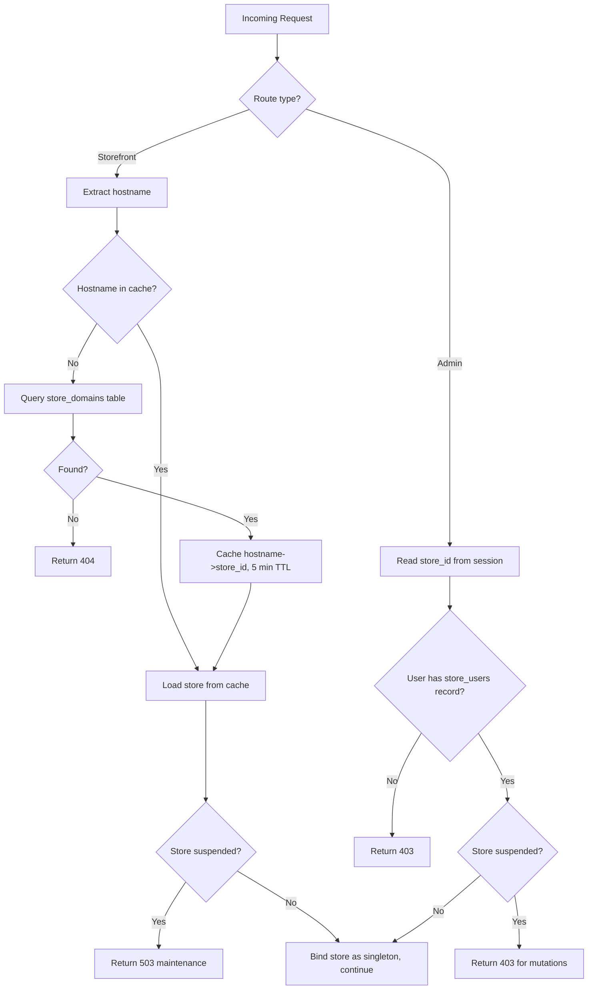

### 1.2 Store Scoping

**Trait:** `App\Models\Concerns\BelongsToStore`
**Global Scope:** `App\Models\Scopes\StoreScope`

The trait applies a global query scope to every model that uses it. The scope adds a `WHERE store_id = <current_store_id>` clause to all queries automatically.

**Behavior:**

- On the model's `creating` event, automatically set `store_id` from the current store context (defense-in-depth).
- All SELECT, UPDATE, DELETE queries on tenant-scoped models include the store filter.
- In platform-admin contexts where cross-store access is needed, the scope can be temporarily removed.

**Models that must use this trait:**
products, collections, customers, orders, carts, checkouts, discounts, shipping_zones, themes, pages, navigation_menus, analytics_events, analytics_daily, webhook_subscriptions, inventory_items, search_queries.

### 1.3 Role-Based Access Control

**Enum:** `App\Enums\StoreUserRole` - backed by string values: `owner`, `admin`, `staff`, `support`

**Permission Matrix:**

| Permission | Owner | Admin | Staff | Support |
|---|---|---|---|---|
| Manage store settings | Yes | Yes | No | No |
| Manage staff | Yes | Yes | No | No |
| Manage products | Yes | Yes | Yes | No |
| Manage orders | Yes | Yes | Yes | Yes (read-only) |
| Manage discounts | Yes | Yes | Yes | No |
| Manage themes | Yes | Yes | No | No |
| Manage apps | Yes | Yes | No | No |
| View analytics | Yes | Yes | Yes | No |
| Manage shipping/tax | Yes | Yes | No | No |
| Process refunds | Yes | Yes | No | No |
| Create fulfillments | Yes | Yes | Yes | No |

**Implementation requirements:**

- Create a Laravel policy for each resource model (e.g., `ProductPolicy`, `OrderPolicy`).
- Register gate definitions in a service provider.
- Each policy method receives the User, looks up the user's role for the current store via the `store_users` pivot table, and checks the matrix above.
- Add a helper method on the User model - `roleForStore(store)` - that returns the user's role for a given store or null if the user has no access.

---

## 2. Product Lifecycle

### 2.1 Status Transitions

**Enum:** `App\Enums\ProductStatus` - values: `draft`, `active`, `archived`

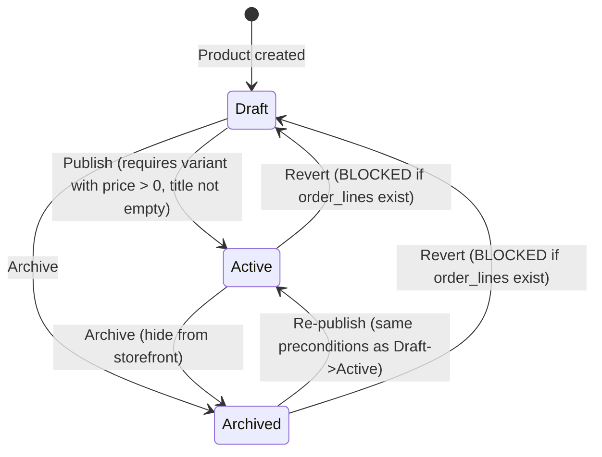

**Transition rules:**

| From | To | Preconditions |
|---|---|---|
| Draft | Active | At least one variant with `price_amount > 0`; product `title` is not empty |
| Draft | Archived | None |
| Active | Archived | None (soft transition: product hidden from storefront, preserved in order history) |
| Archived | Active | Same preconditions as Draft to Active |
| Active | Draft | **BLOCKED** if any `order_lines` reference variants of this product |
| Archived | Draft | **BLOCKED** if any `order_lines` reference variants of this product |

**Deletion rules:**
- Only `draft` products with zero `order_lines` references may be hard-deleted.
- Products with existing order references must be archived, never deleted, to preserve order history integrity.

**Service:** `App\Services\ProductService`
- Method `transitionStatus(product, newStatus)` validates the current state, checks preconditions, throws `InvalidProductTransitionException` on failure.
- On activation: set `published_at` to current time if not already set.
- Dispatch `ProductStatusChanged` event after successful transition.

### 2.2 Variant and Option Matrix

**Rules:**

- A product has 0 to 3 options (e.g., Size, Color, Material), stored in `product_options`.
- Each option has 1 or more values, stored in `product_option_values`.
- Variants represent the cartesian product of option values (or a manually curated subset).
- When a product has no options, a single "Default" variant is auto-created with `is_default = 1`.

**Matrix rebuild logic (when options change):**

```
PROCEDURE rebuildMatrix(product):
    current_option_values = load all option values grouped by option
    desired_combos = cartesianProduct(current_option_values)
    existing_variants = load all variants with their option value sets

    FOR EACH combo IN desired_combos:
        IF combo matches an existing variant's option value set:
            SKIP (preserve existing variant - prices, SKUs, inventory intact)
        ELSE:
            CREATE new variant with default pricing from first existing variant

    FOR EACH existing_variant NOT matching any desired combo:
        IF variant has order_line references:
            ARCHIVE variant (set status = 'archived')
        ELSE:
            DELETE variant
```

**Service:** `App\Services\VariantMatrixService`

### 2.3 SKU Uniqueness

- Combination of store_id (derived through the product's store) and SKU must be unique.
- Enforced at application level before save.
- Null or empty SKU values are exempt from the uniqueness check (multiple variants may have no SKU).
- Validation: query all variants belonging to products in the same store, check for SKU collision excluding the current variant's ID.

### 2.4 Handle/Slug Generation

**Helper class:** `App\Support\HandleGenerator`

- Auto-generate from the title by converting to a URL-safe slug (lowercase, hyphens for spaces, strip special characters).
- Uniqueness enforced per store via the database unique index on `(store_id, handle)`.
- On collision, append incrementing suffix: `my-product`, `my-product-1`, `my-product-2`, etc.
- Merchants can manually edit the handle; on save, re-validate uniqueness.
- Same logic applies to collections and pages.

---

## 3. Inventory Management

### 3.1 Tracking Model

Each `product_variant` has exactly one `inventory_item` record (created automatically when the variant is created).

| Field | Description |
|---|---|
| `quantity_on_hand` | Total physical stock count |
| `quantity_reserved` | Units held for active checkouts or pending orders |
| **Available** (computed) | `quantity_on_hand - quantity_reserved` |

### 3.2 Inventory Policy

Per-variant policy stored in `inventory_items.policy`:

| Policy | Behavior |
|---|---|
| `deny` | Block add-to-cart when available <= 0. Storefront displays "Out of stock". |
| `continue` | Allow add-to-cart regardless of stock level. When available <= 0, storefront displays "Available on backorder". |

### 3.3 Inventory Operations

**Service:** `App\Services\InventoryService`

All operations must execute within a database transaction.

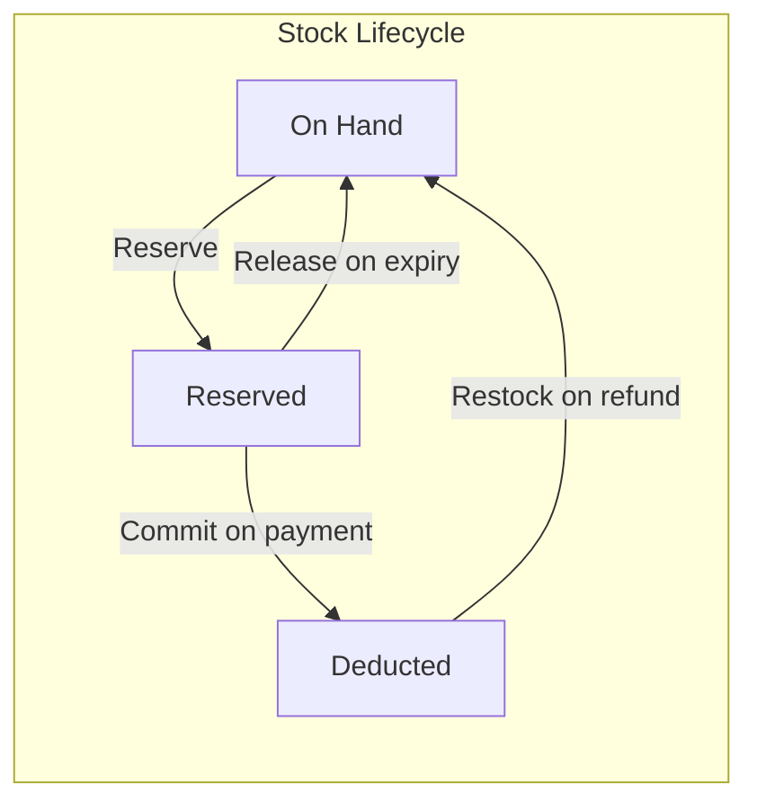

**Operation definitions:**

| Operation | Trigger | Effect on `quantity_on_hand` | Effect on `quantity_reserved` | Pre-check |
|---|---|---|---|---|
| **Reserve** | Checkout enters `payment_selected` | No change | +quantity | If policy=deny, verify available >= quantity. Throw `InsufficientInventoryException` if not. |
| **Release** | Checkout expires or is abandoned | No change | -quantity | None |
| **Commit** | Payment confirmed, order created | -quantity | -quantity | None (reservation already validated) |
| **Restock** | Refund processed with restock flag | +quantity | No change | None |

### 3.4 Concurrency

SQLite operates in single-writer mode with WAL journaling. Database transactions provide sufficient isolation. No optimistic locking or advisory locks are needed.

---

## 4. Cart Service

### 4.1 Cart Lifecycle

**Service:** `App\Services\CartService`

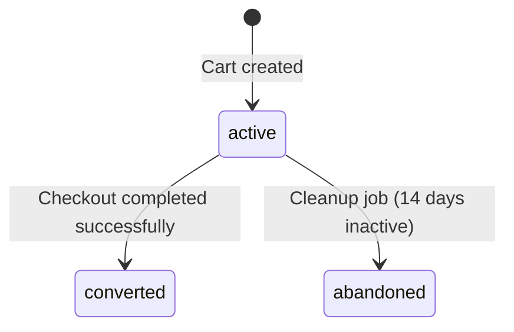

**Cart identification:**
- Guest users: cart ID stored in session cookie.
- Authenticated customers: cart linked via `customer_id` foreign key.

The guest cart is bound to the session using the key `cart_id`. When a guest visits the storefront, a cart is created on first add-to-cart and the cart's ID is stored in `session('cart_id')`. On customer login, if a session cart exists, it is merged with any existing customer cart (the session cart's items are added to the customer cart, preferring the higher quantity for duplicate variants). After merge, the session key is cleared.

**Cart merge on login:**

```
PROCEDURE mergeGuestCart(guestCart, customerCart):
    FOR EACH line IN guestCart.lines:
        existingLine = customerCart.findLineByVariant(line.variant_id)
        IF existingLine EXISTS:
            existingLine.quantity = MAX(existingLine.quantity, line.quantity)
            RECALCULATE existingLine amounts
        ELSE:
            MOVE line to customerCart
    MARK guestCart as abandoned
    RECALCULATE all line amounts on customerCart
```

### 4.2 Cart Operations

**Create cart:**
- Accepts: store, optional customer
- Sets: store_id, currency from store's default_currency, initial cart_version = 1

**Add line - validations (in order):**

1. Variant exists and belongs to the current store (through its product).
2. Product has status = `active`.
3. Variant has status = `active`.
4. Inventory policy check: if policy = `deny`, verify available >= requested quantity.
5. If the variant already exists in the cart, increment existing line quantity instead of creating a duplicate.
6. Set `unit_price_amount` from the variant's `price_amount`.
7. Calculate: `line_subtotal_amount = unit_price_amount * quantity`.
8. Set `line_discount_amount = 0` (recalculated by discount engine during checkout).
9. Calculate: `line_total_amount = line_subtotal_amount - line_discount_amount`.
10. Increment `cart_version`.

**Update quantity:**
- Validate new quantity > 0. If 0, remove the line instead.
- Re-check inventory policy for the new quantity.
- Recalculate line amounts.
- Increment `cart_version`.

**Remove line:**
- Delete the `cart_lines` record.
- Increment `cart_version`.

### 4.3 Cart Version (Optimistic Concurrency)

Every cart mutation increments `cart_version` by 1.

**For API clients:**
- Client sends `expected_version` with each mutation request.
- If cart's current version does not match the expected version, return HTTP 409 Conflict with the current cart state in the response body.
- This prevents race conditions when multiple browser tabs or devices modify the same cart.

**For Livewire/session-based flows:**
- Still implemented for consistency, but less critical since requests are serialized per session.

### 4.4 Line Amount Calculation

```
line_subtotal_amount = unit_price_amount * quantity
line_discount_amount = 0  (updated by discount engine during checkout)
line_total_amount    = line_subtotal_amount - line_discount_amount
```

All values are integers in minor currency units.

### 4.5 Cart Expiration

**Job:** `App\Jobs\CleanupAbandonedCarts`

- Schedule: daily
- Finds carts where status = `active` AND updated_at < (now - 14 days). The 14-day threshold is configurable via `store_settings`.
- Marks them as `abandoned`.
- Releases any reserved inventory associated with active checkouts for these carts.

---

## 5. Pricing Engine

### 5.1 Calculation Order (deterministic pipeline)

**Service:** `App\Services\PricingEngine`

The pricing engine follows a strict, deterministic sequence. The same inputs must always produce the same output.

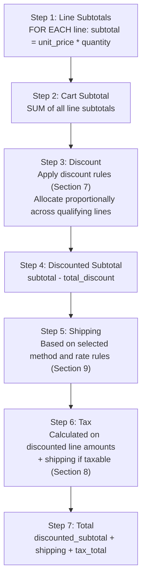

### 5.2 Output Structure

**Value Object:** `App\ValueObjects\PricingResult`

| Field | Type | Description |
|---|---|---|
| `subtotal` | integer (cents) | Sum of all line subtotals before discount |
| `discount` | integer (cents) | Total discount amount |
| `shipping` | integer (cents) | Shipping cost |
| `taxLines` | array of TaxLine | Individual tax line items |
| `taxTotal` | integer (cents) | Sum of all tax line amounts |
| `total` | integer (cents) | Final amount: discounted_subtotal + shipping + taxTotal |
| `currency` | string | ISO 4217 currency code |

**Value Object:** `App\ValueObjects\TaxLine`

| Field | Type | Description |
|---|---|---|
| `name` | string | Tax label (e.g., "State Tax") |
| `rate` | integer | Tax rate in basis points (e.g., 800 = 8.00%) |
| `amount` | integer (cents) | Calculated tax amount |

### 5.3 Rounding Strategy

- Each line's discount allocation, tax, and total are rounded independently.
- Totals are computed by summing already-rounded line amounts.
- This prevents accumulation of fractional cents across lines.
- Any remainder from proportional discount allocation is added to the last qualifying line (largest-remainder method).

### 5.4 Determinism and Snapshotting

- After each calculation, store the full result in `checkouts.totals_json` as a JSON snapshot.
- Recalculate on every significant state change: address change (may affect tax/shipping zones), shipping method change, discount code change.
- The snapshot structure mirrors the PricingResult value object.

---

## 6. Checkout State Machine

### 6.1 States

**Enum:** `App\Enums\CheckoutStatus` - values: `started`, `addressed`, `shipping_selected`, `payment_selected`, `completed`, `expired`

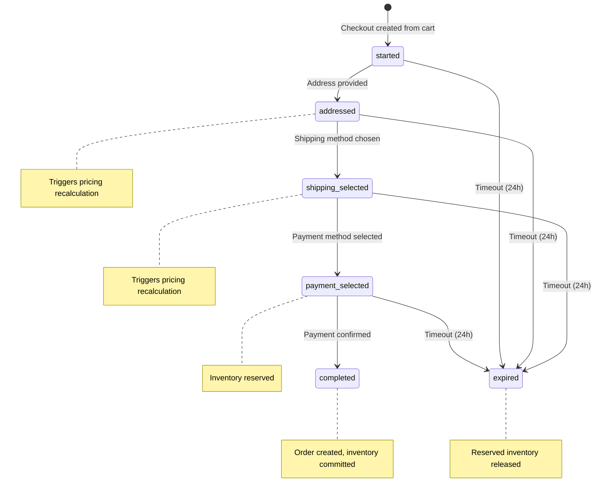

### 6.2 Transitions and Validation

**Service:** `App\Services\CheckoutService`

#### Transition: started -> addressed

**Method:** `setAddress(checkout, addressData)`

**Required data:**
- `email` - valid email address
- `shipping_address` with required fields:

| Field | Required | Type | Notes |
|---|---|---|---|
| `first_name` | Yes | string | |
| `last_name` | Yes | string | |
| `address1` | Yes | string | |
| `address2` | No | string | |
| `company` | No | string | |
| `city` | Yes | string | |
| `province` | No | string | |
| `province_code` | No | string | Used for zone matching |
| `country` | Yes | string | 2-letter ISO 3166-1 code |
| `postal_code` | Yes | string | |
| `phone` | No | string | |

**Actions:**
1. Validate address fields using a dedicated Form Request (`SetCheckoutAddressRequest`).
2. Save email and shipping_address_json on the checkout.
3. Copy shipping address to billing_address_json by default (can be overridden later).
4. Recalculate pricing (shipping zones and tax regions may change based on address).
5. Transition status to `addressed`.
6. Dispatch `CheckoutAddressed` event.

#### Transition: addressed -> shipping_selected

**Method:** `setShippingMethod(checkout, shippingRateId)`

**Requires:**
- A valid shipping_rate_id that belongs to a shipping zone matching the checkout's shipping address.
- **Skip condition:** If no cart lines have `requires_shipping = true` on their variant, skip this step. Set status to `shipping_selected` with shipping_method_id = null and shipping_amount = 0.

**Actions:**
1. Resolve available shipping zones for the address (see Section 9).
2. Verify the selected rate belongs to an applicable zone.
3. Save shipping_method_id on the checkout.
4. Recalculate pricing with the selected shipping rate.
5. Transition status to `shipping_selected`.
6. Dispatch `CheckoutShippingSelected` event.

#### Transition: shipping_selected -> payment_selected

**Method:** `selectPaymentMethod(checkout, paymentMethod)` - validates and stores the selected payment method

**Requires:**
- All previous data is valid (address, shipping method).
- Totals have been calculated and stored.
- `paymentMethod` must be one of: `credit_card`, `paypal`, `bank_transfer`.

**Actions:**
1. Store `payment_method` on the checkout record.
2. Reserve inventory for all cart lines (call InventoryService.reserve for each line).
3. Set `expires_at` on the checkout to current time + 24 hours.
4. Transition status to `payment_selected`.

#### Transition: payment_selected -> completed

**Method:** `completeCheckout(checkout, paymentMethodData)` - returns an Order

**Triggered by:** Customer submitting the payment form (onsite, no external redirect).

**CRITICAL: This transition must be idempotent.** If called multiple times for the same checkout (e.g., double-click), it must not create duplicate orders. Always check if an order already exists for this checkout before proceeding.

**Actions (all within a single database transaction):**

```
PROCEDURE completeCheckout(checkout, paymentMethodData):
    BEGIN TRANSACTION

    1. IF order already exists for this checkout:
           RETURN existing order (idempotent)

    2. CALL MockPaymentProvider.charge(checkout, paymentMethodData)
       IF result.success = false:
           Release reserved inventory
           THROW PaymentFailedException(result.errorCode)

    3. Generate next sequential order number for this store

    4. DETERMINE order statuses based on payment method:
       IF checkout.payment_method IN ('credit_card', 'paypal'):
           orderStatus = 'paid'
           financialStatus = 'paid'
           paymentStatus = 'captured'
           inventoryAction = 'commit'
       ELSE IF checkout.payment_method = 'bank_transfer':
           orderStatus = 'pending'
           financialStatus = 'pending'
           paymentStatus = 'pending'
           inventoryAction = 'keep_reserved'

    5. CREATE order record with:
       - All checkout data (addresses, email, totals snapshot)
       - payment_method = checkout.payment_method
       - status = orderStatus, financial_status = financialStatus
       - fulfillment_status = 'unfulfilled'
       - placed_at = now

    6. FOR EACH cart line:
       CREATE order_line with snapshot data:
       - title_snapshot = product title + variant option labels
       - sku_snapshot = variant SKU at time of purchase
       - unit_price_amount, quantity, total_amount
       - tax_lines_json, discount_allocations_json

    7. CREATE payment record:
       - Link to order, provider = 'mock', method = checkout.payment_method
       - provider_payment_id = mock reference ID
       - status = paymentStatus, amount = order total

    8. IF inventoryAction = 'commit':
       FOR EACH cart line:
           CALL InventoryService.commit(variant, quantity)
       // Note: for bank_transfer, inventory stays reserved until admin confirms payment

    9. IF checkout has a discount code:
       INCREMENT discount's usage_count by 1

    10. SET cart status = 'converted'

    11. SET checkout status = 'completed'

    12. IF inventoryAction = 'commit' AND all order lines are digital:
        Auto-create fulfillment (see Section 11.7)

    13. DISPATCH OrderCreated event

    COMMIT TRANSACTION
    RETURN order
```

#### Transition: Any active state -> expired

**Triggered by:** `App\Jobs\ExpireAbandonedCheckouts` scheduled job (every 15 minutes).

**Conditions:** Checkouts where status is NOT `completed` or `expired`, AND `updated_at` < now - 24 hours.

**Actions:**
1. If inventory was reserved (status was `payment_selected`): release all reserved inventory via InventoryService.release.
2. Transition status to `expired`.
3. Dispatch `CheckoutExpired` event.

### 6.3 Events

| Event | Dispatched When |
|---|---|
| `CheckoutAddressed` | Address saved on checkout |
| `CheckoutShippingSelected` | Shipping method selected |
| `CheckoutCompleted` | Payment confirmed and order created |
| `CheckoutExpired` | Checkout expired due to inactivity |

---

## 7. Discount Engine

### 7.1 Discount Types

**Enum:** `App\Enums\DiscountType` - values: `code`, `automatic`

| Type | Behavior |
|---|---|
| `code` | Customer enters a code at checkout. Stored in `discounts.code`, matched case-insensitively. |
| `automatic` | Applied automatically when rule conditions are met. Evaluated on every pricing calculation. |

**Stacking rules:**
- Only one code discount per checkout.
- Multiple automatic discounts can stack (each applied sequentially to the remaining undiscounted amount).

### Discount Status Lifecycle

| Status | Description | Transition |
|--------|-------------|------------|
| `draft` | Created but not yet active. Not visible to customers, not applicable to carts. | Admin creates discount -> `draft`. Admin activates -> `active`. |
| `active` | Live and applicable to carts (subject to date range and usage limits). | Automatic transition when `starts_at` is reached (if set). Admin can manually activate. |
| `expired` | Past the `ends_at` date. No longer applicable. | Automatic transition when `ends_at` passes. Irreversible. |
| `disabled` | Manually deactivated by admin. Not applicable to carts. | Admin disables an `active` discount. Admin can re-enable -> `active`. |

**Allowed transitions:**
- `draft` -> `active`
- `active` -> `disabled`
- `active` -> `expired` (automatic)
- `disabled` -> `active`

### 7.2 Value Types

**Enum:** `App\Enums\DiscountValueType` - values: `percent`, `fixed`, `free_shipping`

| Value Type | Calculation | Notes |
|---|---|---|
| `percent` | `discount = applicable_subtotal * value_amount / 100` | `value_amount` stores whole percentage (e.g., 15 = 15%) |
| `fixed` | `discount = value_amount` (cents) | Cannot exceed the applicable subtotal |
| `free_shipping` | Override shipping amount to 0 | No monetary discount on items. `value_amount` is ignored. |

### 7.3 Rules

Rules are stored in `discounts.rules_json` with the following structure:

| Rule Key | Type | Description |
|---|---|---|
| `min_purchase_amount` | integer (cents) or null | Cart subtotal must be >= this value. Null means no minimum. |
| `applicable_product_ids` | array of integers or null | Discount only applies to lines with these product IDs. Null/empty means all products. |
| `applicable_collection_ids` | array of integers or null | Discount applies to products belonging to these collections. Null/empty means all. |
| `customer_eligibility` | string | `"all"` for all customers. Future expansion: `"returning"`, `"specific"`. |

**Applicability logic:** When both `applicable_product_ids` and `applicable_collection_ids` are set, a product qualifies if it matches **either** condition (union, not intersection). When both are null or empty, the discount applies to the entire order.

### 7.4 Validation Flow

**Service:** `App\Services\DiscountService`

**Method:** `validate(code, cart)` - returns a DiscountValidationResult value object

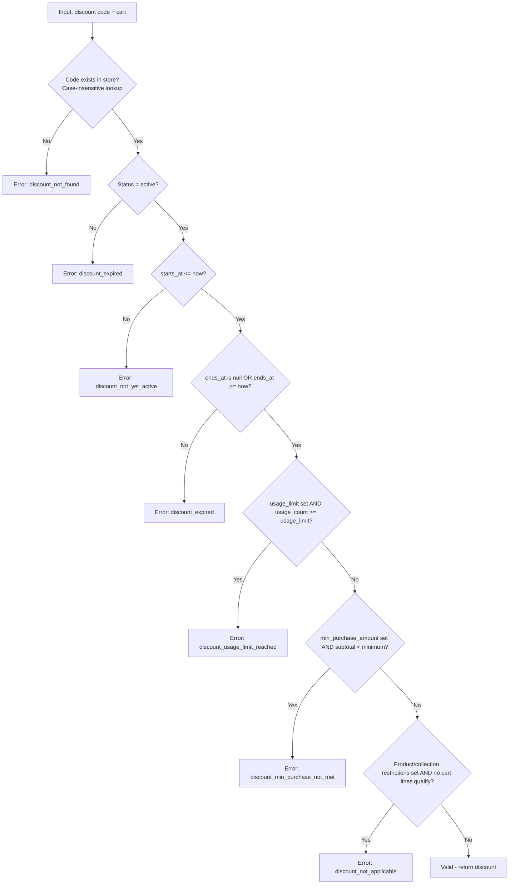

### 7.5 Error Codes

| Code | Description |
|---|---|
| `discount_not_found` | Code does not exist in this store |
| `discount_expired` | Past `ends_at` date or status is not active |
| `discount_not_yet_active` | Before `starts_at` date |
| `discount_usage_limit_reached` | `usage_count >= usage_limit` |
| `discount_min_purchase_not_met` | Cart subtotal < `min_purchase_amount` |
| `discount_not_applicable` | No qualifying products in cart |

### 7.6 Discount Allocation

For `percent` and `fixed` discounts with applicable product restrictions:

```
PROCEDURE allocateDiscount(discount, cartLines):
    qualifyingLines = FILTER cartLines where product matches applicable_product_ids
                      OR product belongs to applicable_collection_ids
    qualifyingSubtotal = SUM(qualifyingLines.line_subtotal_amount)

    IF discount.value_type = 'percent':
        totalDiscount = qualifyingSubtotal * discount.value_amount / 100
    ELSE IF discount.value_type = 'fixed':
        totalDiscount = MIN(discount.value_amount, qualifyingSubtotal)

    remainingDiscount = totalDiscount

    FOR EACH qualifyingLine (except last):
        lineDiscount = ROUND(totalDiscount * lineSubtotal / qualifyingSubtotal)
        remainingDiscount -= lineDiscount
        SET line.line_discount_amount = lineDiscount

    // Last line gets the remainder (largest-remainder method)
    SET lastLine.line_discount_amount = remainingDiscount

    RECALCULATE line_total_amount for each affected line
```

**Storage of allocations:**
- During checkout: update `cart_lines.line_discount_amount`.
- On order creation: store in `order_lines.discount_allocations_json` as an array of `{discount_id, amount}`.

### 7.7 Usage Tracking

When an order is successfully created with a discount code:
- Increment `discounts.usage_count` by 1.
- This happens within the order creation transaction (see Section 6.2, completeCheckout procedure, step 7).

---

## 8. Tax Calculation

### 8.1 Tax Provider Architecture

**Interface:** `App\Contracts\TaxProvider`

- Must implement a `calculate(request)` method that accepts a TaxCalculationRequest and returns a TaxCalculationResult.
- The TaxCalculationRequest contains: line items (with discounted amounts), shipping amount, shipping address, store tax settings.
- The TaxCalculationResult contains: array of TaxLine value objects, total tax amount.

**Service:** `App\Services\TaxCalculator` - orchestrates provider selection and delegates to the appropriate implementation.

**Implementations:**
- `App\Services\Tax\ManualTaxProvider` - default, uses manually configured rates
- `App\Services\Tax\StripeTaxProvider` - stub for Stripe Tax API integration

### 8.2 Manual Tax Mode

**Rate resolution:**
1. Match shipping address against shipping zones (same zone matching algorithm as shipping - see Section 9.1).
2. Use the tax rate defined in `tax_settings.config_json` for the matched zone, or the global default rate.
3. Rate stored as integer basis points (e.g., 1900 = 19.00%).

**Calculation per line:**

```
line_tax = ROUND(line_total_after_discount * rate / 10000)
```

Round each line's tax independently, then sum for the total tax amount.

### 8.3 Prices Include Tax

Controlled by `tax_settings.prices_include_tax` (boolean).

#### Tax-inclusive pricing (prices_include_tax = true)

- Displayed prices on the storefront are gross (include tax).
- Subtotal shown to customer is gross.
- Tax is "extracted" from the gross amount:

```
net_amount = intdiv(gross_amount * 10000, 10000 + rate_bps)
tax = gross_amount - net_amount
```

> **Note:** Integer division (truncation toward zero) is used rather than rounding to ensure deterministic tax extraction. This matches PHP's `intdiv()` function.

**Example:** Price = 1190 cents, rate = 1900 (19%).
- net = intdiv(1190 * 10000, 11900) = intdiv(11900000, 11900) = 1000
- tax = 1190 - 1000 = 190

#### Tax-exclusive pricing (prices_include_tax = false)

- Displayed prices are net (excluding tax).
- Tax added on top:

```
tax = ROUND(net_amount * rate / 10000)
total = net_amount + tax
```

**Example:** Price = 1000 cents, rate = 1900.
- tax = ROUND(1000 * 1900 / 10000) = 190
- total = 1190

### 8.4 Stripe Tax Provider (Stub)

**Implementation:** `App\Services\Tax\StripeTaxProvider`

- Sends line items and shipping address to Stripe Tax API.
- Stores the full response in `checkouts.tax_provider_snapshot_json` for audit.
- Fallback behavior (configurable per store in `tax_settings.config_json`):

| Fallback Setting | Behavior |
|---|---|
| `"block"` | Block checkout progression if Stripe Tax API errors |
| `"allow"` | Allow checkout to proceed without tax (log a warning) |

### 8.5 Discount-Before-Tax Semantics

Discounts are always applied before tax calculation. Tax is calculated on the discounted amount. This aligns with standard accounting practice and Stripe Tax behavior.

For tax-inclusive pricing (`prices_include_tax = true`): The discount is subtracted from the gross (tax-inclusive) subtotal. Tax is then extracted from the post-discount gross amount: `tax = post_discount_gross * rate / (1 + rate)`. This means the tax portion decreases proportionally when a discount is applied.

**Calculation order within the pricing pipeline:**
1. Calculate line subtotals.
2. Apply discount allocations to lines.
3. Calculate tax on discounted line amounts.
4. Sum everything for the total.

---

## 9. Shipping Calculation

### 9.1 Zone Matching

**Service:** `App\Services\ShippingCalculator`

**Zone matching algorithm:**

```
PROCEDURE getMatchingZone(address, store):
    zones = load all shipping zones for store

    bestMatch = null
    bestSpecificity = -1

    FOR EACH zone IN zones:
        countryMatch = address.country_code IN zone.countries_json
        regionMatch = address.province_code IN zone.regions_json

        IF countryMatch AND regionMatch:
            specificity = 2  // Most specific
        ELSE IF countryMatch:
            specificity = 1  // Country-only match
        ELSE:
            CONTINUE  // No match

        IF specificity > bestSpecificity:
            bestMatch = zone
            bestSpecificity = specificity
        ELSE IF specificity = bestSpecificity AND zone.id < bestMatch.id:
            bestMatch = zone  // Tie-break: lowest ID wins

    RETURN bestMatch  // null if no zone matches
```

**When no zone matches:** The address is unserviceable. Block checkout progression with error "Cannot ship to this address".

### 9.2 Rate Types

For the matched zone, return all active shipping rates (`is_active = 1`). Calculate cost for each:

#### Flat rate

Config structure: `{"amount": 500}`

- Cost = fixed amount regardless of cart contents.

#### Weight-based rate

Config structure: `{"ranges": [{"min_g": 0, "max_g": 1000, "amount": 500}, {"min_g": 1001, "max_g": 5000, "amount": 1000}]}`

```
PROCEDURE calculateWeightRate(config, cart):
    totalWeight = 0
    FOR EACH line IN cart.lines:
        IF line.variant.requires_shipping = true:
            totalWeight += line.variant.weight_g * line.quantity

    FOR EACH range IN config.ranges:
        IF range.min_g <= totalWeight AND totalWeight <= range.max_g:
            RETURN range.amount

    RETURN null  // Rate not available for this weight
```

#### Price-based rate

Config structure: `{"ranges": [{"min_amount": 0, "max_amount": 5000, "amount": 500}, {"min_amount": 5001, "amount": 0}]}`

```
PROCEDURE calculatePriceRate(config, cartSubtotal):
    FOR EACH range IN config.ranges:
        IF range.min_amount <= cartSubtotal:
            IF range.max_amount IS NOT SET OR cartSubtotal <= range.max_amount:
                RETURN range.amount

    RETURN null  // Rate not available for this subtotal
```

A range without `max_amount` matches all subtotals above `min_amount` (useful for "free shipping over X" rules).

#### Carrier-calculated rate (stub)

Config structure: `{"carrier": "ups", "service": "ground"}`

- Placeholder for future carrier API integration.
- Returns a hardcoded rate or error until implemented.

### 9.3 Requires Shipping Check

- If no line in the cart has `requires_shipping = true` on its variant, the shipping step is skipped entirely.
- shipping_amount = 0 in the pricing result.
- The checkout transitions directly past `shipping_selected` (set status to `shipping_selected` with shipping_method_id = null).

**Mixed carts** (some physical, some digital):
- Shipping is calculated only for physical items' weight.
- Digital items are excluded from weight calculations.

### 9.4 Free Shipping Discount Override

If a validated discount has `value_type = 'free_shipping'`:
- Override the calculated shipping amount to 0.
- The shipping method is still selected (for fulfillment routing), but the customer is not charged.

---

## 10. Payment Processing (Mock PSP)

### 10.1 Mock Payment Provider Architecture

The platform uses a **Mock Payment Service Provider (PSP)** instead of real payment gateways. All payment processing happens in-process with no external API calls, no webhooks, and no redirects. This enables a fully functional checkout flow for development, testing, and demonstration purposes.

**Interface:** `App\Contracts\PaymentProvider`

Must implement:
- `charge(checkout, paymentMethodData)` - returns a PaymentResult value object (success/failure, reference ID)
- `refund(payment, amount)` - initiates a mock refund, returns a RefundResult

**Service:** `App\Services\PaymentService` - orchestrates payment processing, delegates to MockPaymentProvider.

**Implementation:** `App\Services\Payment\MockPaymentProvider`

### 10.2 Supported Payment Methods

**Enum:** `App\Enums\PaymentMethod` - values: `CreditCard` (`credit_card`), `Paypal` (`paypal`), `BankTransfer` (`bank_transfer`)

| Method | Behavior | Capture Timing |
|---|---|---|
| `credit_card` | Simulates card authorization and immediate capture. Uses magic card numbers for test scenarios. | Auto-capture on checkout (instant) |
| `paypal` | Simulates PayPal approval and immediate capture. Always succeeds (no magic numbers). | Auto-capture on checkout (instant) |
| `bank_transfer` | No charge at checkout. Order created with `financial_status = pending`. Admin manually confirms payment receipt. | Deferred - admin confirms payment |

### 10.3 Magic Card Numbers (Credit Card Testing)

When payment_method is `credit_card`, the mock provider inspects the card number submitted in the checkout form to determine the outcome:

| Card Number | Outcome | PaymentResult |
|---|---|---|
| `4242 4242 4242 4242` | Success | `success = true`, status = `captured` |
| `4000 0000 0000 0002` | Decline | `success = false`, error = `card_declined` |
| `4000 0000 0000 9995` | Insufficient funds | `success = false`, error = `insufficient_funds` |
| Any other valid-looking number | Success | `success = true`, status = `captured` |

The mock provider does **not** validate card expiry, CVC, or cardholder name. These fields exist in the UI for realism but are ignored by the backend.

### 10.4 Mock Payment Flow

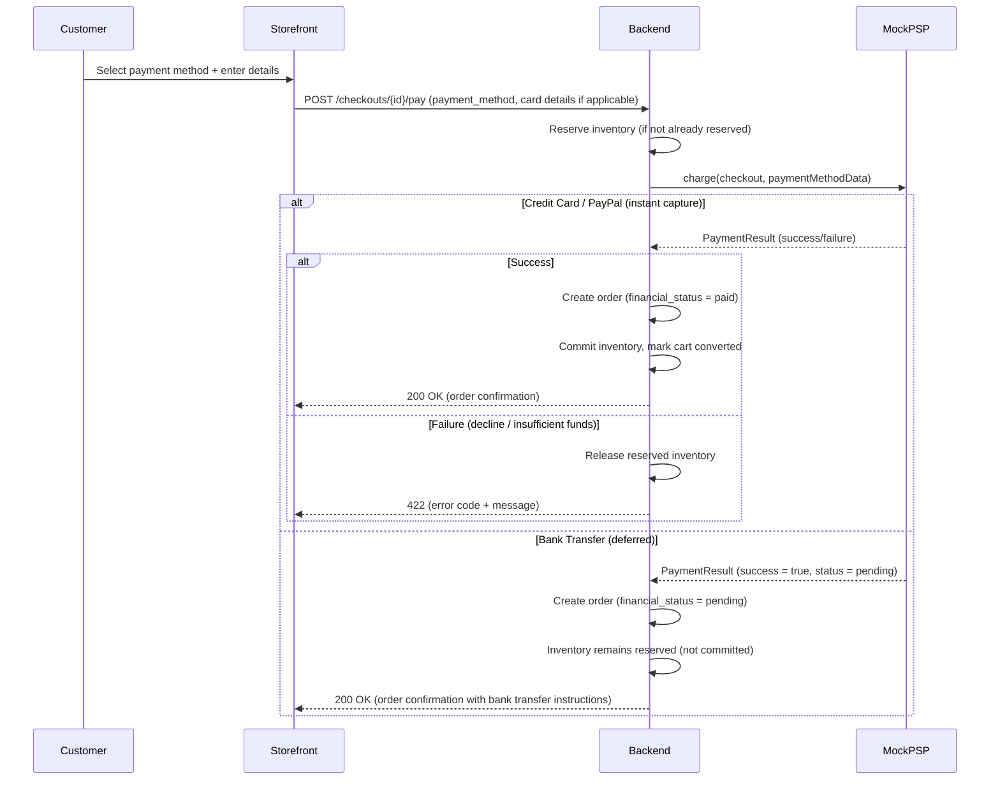

### 10.5 Payment State Machine

**Enum:** `App\Enums\PaymentStatus` - values: `pending`, `captured`, `failed`, `refunded`

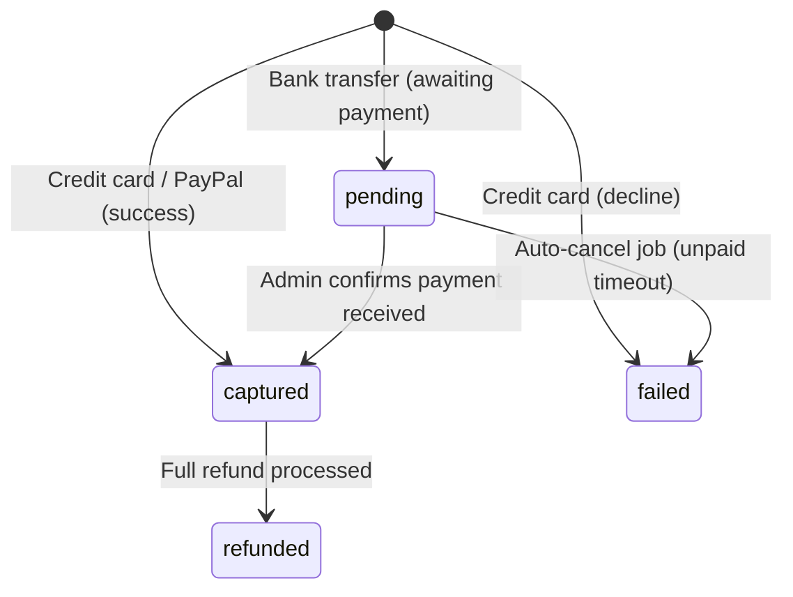

### 10.6 Bank Transfer Instructions

When `payment_method = bank_transfer`, the order confirmation page and email display mock bank transfer details:

| Field | Value |
|---|---|
| Bank name | Mock Bank AG |
| IBAN | DE89 3704 0044 0532 0130 00 |
| BIC | COBADEFFXXX |
| Reference | Order number (e.g., #1001) |
| Amount | Order total formatted in EUR |

These are static mock values. No real bank interaction occurs.

### 10.7 Admin: Confirm Payment (Bank Transfer)

Admin users can confirm that a bank transfer payment has been received via a "Confirm Payment" button on the order detail page (visible only when `payment_method = bank_transfer` AND `financial_status = pending`).

**Action flow:**
1. Admin clicks "Confirm Payment" button.
2. Backend updates `payments.status` from `pending` to `captured`.
3. Backend updates `orders.financial_status` from `pending` to `paid`.
4. Backend updates `orders.status` from `pending` to `paid`.
5. Backend calls `InventoryService.commit()` for each order line (converts reserved stock to committed).
6. If all order lines are digital (`requires_shipping = false`): auto-create fulfillment with `status = delivered` (see Section 11.7).
7. Dispatch `OrderPaid` event.

### 10.8 Auto-Cancel Unpaid Bank Transfer Orders

**Job:** `App\Jobs\CancelUnpaidBankTransferOrders`

- Schedule: daily
- Finds orders where `payment_method = bank_transfer` AND `financial_status = pending` AND `placed_at < (now - configurable days)`.
- Configurable timeout: `store_settings.settings_json` key `bank_transfer_cancel_days`, default = 7.

**Cancel action:**
1. Release reserved inventory via `InventoryService.release()`.
2. Update `orders.financial_status` to `voided`.
3. Update `orders.status` to `cancelled`.
4. Update `payments.status` to `failed`.
5. Dispatch `OrderCancelled` event.

---

## 11. Order Management

### 11.1 Order Creation (from Completed Checkout)

See Section 6.2 "Transition: payment_selected -> completed" for the full procedure. The order creation is the central action within the completeCheckout transaction.

**Key requirements for the order record:**
- Snapshot all checkout data (addresses, email, totals) at time of order creation.
- Order lines must contain snapshot data (`title_snapshot`, `sku_snapshot`) so that order history survives product changes.
- The mock payment response is encrypted before storage.
- The entire operation must be atomic (single database transaction).
- The `payment_method` from the checkout is copied to the order record.

**Payment-method-specific order creation:**

| Payment Method | `orders.status` | `orders.financial_status` | Inventory Action | Payment Record Status |
|---|---|---|---|---|
| `credit_card` | `paid` | `paid` | Commit (on_hand and reserved both decremented) | `captured` |
| `paypal` | `paid` | `paid` | Commit (on_hand and reserved both decremented) | `captured` |
| `bank_transfer` | `pending` | `pending` | Reserve only (reserved incremented, on_hand unchanged) | `pending` |

### 11.2 Order Numbering

- Sequential per store, starting at 1001.
- The `order_number` column stores ONLY the numeric portion as a string (e.g., `"1001"`, `"1002"`). It does NOT include the prefix.
- Display prefix: configurable (default: `#`) stored in `store_settings.settings_json` key `order_number_prefix`. The prefix is prepended ONLY at display time (in admin UI, storefront, emails, exports).
- **CRITICAL:** The UI must format order numbers as `{prefix}{order_number}` (e.g., `#1001`). Since the prefix is NOT stored in the `order_number` field, the UI should prepend it exactly once. Do NOT store the prefix in the `order_number` column, and do NOT prepend it if the stored value already contains it.
- Generation: within the order creation transaction, find the maximum existing order number for the store (cast to integer for comparison) and increment by 1.
- Since this runs inside a SQLite transaction, there is no risk of duplicate numbers.

### 11.3 Order Statuses

Three independent status dimensions tracked on each order:

**Order status** (`orders.status`):

| Status | Description |
|---|---|
| `pending` | Order created, awaiting processing |
| `paid` | Payment confirmed |
| `fulfilled` | All items shipped |
| `cancelled` | Order cancelled before fulfillment |
| `refunded` | Fully refunded |

**Financial status** (`orders.financial_status`):

| Status | Description |
|---|---|
| `pending` | Payment not yet confirmed |
| `authorized` | Payment authorized but not captured |
| `paid` | Payment captured successfully |
| `partially_refunded` | Some items or partial amount refunded |
| `refunded` | Fully refunded |
| `voided` | Authorization voided (no capture occurred) |

**Fulfillment status** (`orders.fulfillment_status`):

| Status | Description |
|---|---|
| `unfulfilled` | No items have been shipped |
| `partial` | Some items shipped, others pending |
| `fulfilled` | All items shipped |

### 11.4 Refund Processing

**Service:** `App\Services\RefundService`

**Input (RefundRequest):**

| Field | Type | Required | Description |
|---|---|---|---|
| `amount` | integer (cents) | No | Custom refund amount. If not set, calculated from lines. |
| `lines` | map of order_line_id to quantity | No | Which lines and quantities to refund (for line-level refunds). |
| `reason` | string | No | Text reason for the refund. |
| `restock` | boolean | No | Whether to restock inventory for refunded items. |

**Process:**

```
PROCEDURE processRefund(order, request):
    1. Calculate remaining refundable amount:
       refundable = order.total_amount - SUM(existing refunds for this order)

    2. IF request.amount is set:
           VALIDATE request.amount <= refundable
       ELSE IF request.lines is set:
           CALCULATE amount from specified lines and quantities
       ELSE:
           amount = refundable (full refund)

    3. CALL PaymentProvider.refund(order's payment, amount)

    4. CREATE Refund record with status = 'pending'

    5. On provider confirmation:
       UPDATE refund status = 'processed'

    6. Calculate total refunded for this order:
       IF total refunded = order.total_amount:
           SET order.financial_status = 'refunded'
           SET order.status = 'refunded'
       ELSE:
           SET order.financial_status = 'partially_refunded'

    7. IF request.restock = true:
       FOR EACH refunded line and quantity:
           CALL InventoryService.restock(variant, quantity)

    8. DISPATCH OrderRefunded event
```

### 11.5 Fulfillment

**Service:** `App\Services\FulfillmentService`

#### Fulfillment Guard

**CRITICAL:** A fulfillment cannot be created unless the order's `financial_status` is `paid` or `partially_refunded`. This prevents shipping goods before payment is confirmed.

| `financial_status` | Fulfillment Allowed? | Reason |
|---|---|---|
| `pending` | **No** | Payment not yet received (e.g., bank transfer awaiting confirmation) |
| `authorized` | **No** | Payment authorized but not captured |
| `paid` | **Yes** | Payment confirmed |
| `partially_refunded` | **Yes** | Payment confirmed, partial refund does not block shipment |
| `refunded` | **No** | Fully refunded, nothing to ship |
| `voided` | **No** | Payment voided / cancelled |

When fulfillment is blocked by the guard, the admin UI shows an info callout: "Fulfillment cannot be created until payment is confirmed." The "Create fulfillment" button is disabled.

#### Creating a Fulfillment

Input:
- `lines` - map of order_line_id to quantity, specifying which items are in this shipment
- `trackingData` - tracking_company, tracking_number, tracking_url

**Process:**

```
PROCEDURE createFulfillment(order, lines, trackingData):
    1. GUARD: Verify order.financial_status IN ('paid', 'partially_refunded')
       IF NOT: throw FulfillmentGuardException

    2. FOR EACH line in request:
       fulfilledSoFar = SUM(fulfillment_lines quantities for this order_line)
       unfulfilled = order_line.quantity - fulfilledSoFar
       VALIDATE requested quantity <= unfulfilled

    3. CREATE Fulfillment record with status = 'pending' and tracking data

    4. CREATE fulfillment_lines for each order line and quantity

    5. Determine new fulfillment status:
       FOR EACH order_line in order:
           totalFulfilled = SUM(all fulfillment_lines for this order_line)
           IF totalFulfilled < order_line.quantity:
               allFulfilled = false

       IF allFulfilled:
           SET order.fulfillment_status = 'fulfilled'
           SET order.status = 'fulfilled'
       ELSE:
           SET order.fulfillment_status = 'partial'

    6. DISPATCH FulfillmentCreated event
```

#### Fulfillment Status Transitions (Admin Button Actions)

Fulfillment status transitions are triggered by explicit admin button clicks. There are no automatic transitions for physical products.

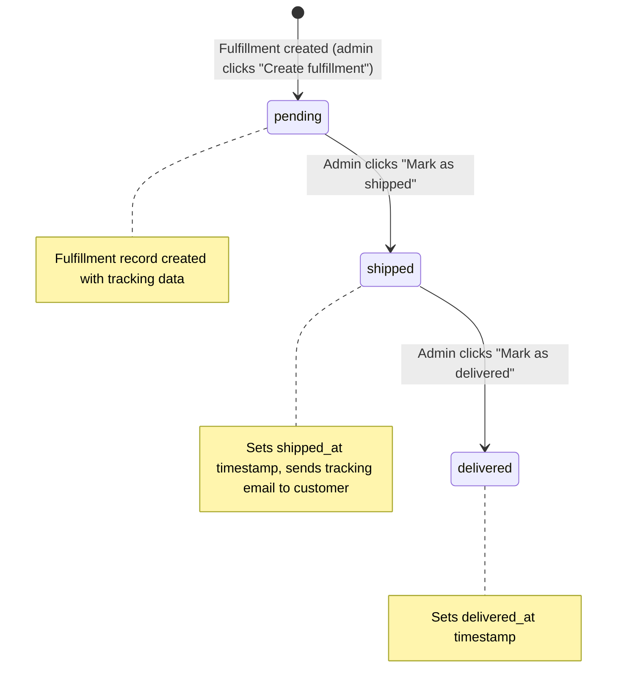

**Admin buttons on each fulfillment card:**

| Button | Shown When | Action |
|---|---|---|
| "Mark as shipped" | `fulfillment.status = pending` | Transitions to `shipped`, sets `shipped_at`, dispatches `FulfillmentShipped` event, sends tracking email |
| "Mark as delivered" | `fulfillment.status = shipped` | Transitions to `delivered`, dispatches `FulfillmentDelivered` event |

When transitioning to `shipped`:
- Set `shipped_at` timestamp.
- Dispatch `FulfillmentShipped` event.
- Send email notification to customer with tracking information.

When transitioning to `delivered`:
- Dispatch `FulfillmentDelivered` event.

### 11.6 Fulfillment Guard - Inventory Behavior per Payment Method

The fulfillment guard interacts with inventory differently depending on the payment method:

| Payment Method | At Order Creation | At Payment Confirmation | At Fulfillment |
|---|---|---|---|
| `credit_card` / `paypal` | Inventory committed (on_hand decremented, reserved decremented) | N/A (already committed) | No inventory change |
| `bank_transfer` | Inventory reserved only (reserved incremented) | Inventory committed (on_hand decremented, reserved decremented) | No inventory change |

For bank transfer orders, inventory is held in a reserved state until the admin confirms payment. If the order is auto-cancelled (see Section 10.8), the reserved inventory is released back.

### 11.7 Auto-Fulfillment for Digital Products

When a payment is confirmed (either instant for credit_card/paypal, or via admin confirmation for bank_transfer):

1. Check if **all** order lines reference variants with `requires_shipping = false` (digital products).
2. If yes: automatically create a fulfillment record covering all order lines:
   - `status = 'delivered'` (skip pending and shipped)
   - `tracking_company = null`, `tracking_number = null`, `tracking_url = null`
   - `shipped_at = now`
   - Set `order.fulfillment_status = 'fulfilled'`
   - Set `order.status = 'fulfilled'`
3. If the order contains a mix of physical and digital products: do **not** auto-fulfill. The admin must create fulfillments manually (they can fulfill digital items immediately and physical items when shipped).

This ensures digital product orders are immediately marked as complete after payment.

### 11.6 Order Export

`GET /api/admin/v1/orders/export` returns a CSV file of orders matching the current filter criteria.

**CSV columns:** `order_number`, `created_at`, `status`, `financial_status`, `fulfillment_status`, `customer_email`, `customer_name`, `subtotal_amount`, `discount_amount`, `shipping_amount`, `tax_amount`, `total_amount`, `currency`, `shipping_method`, `tracking_number`

All monetary values are exported in minor units (cents). Dates use ISO-8601 format. The response uses `Content-Type: text/csv` with `Content-Disposition: attachment; filename="orders-{date}.csv"`.

---

## 12. Customer Accounts

### 12.1 Registration

**Service:** `App\Services\CustomerService`

**Required fields:**

| Field | Validation |
|---|---|
| `name` | Required, string |
| `email` | Required, valid email, unique per store |
| `password` | Required, minimum 8 characters |
| `marketing_opt_in` | Optional, boolean, default false |

- Email uniqueness enforced by the database unique index on `(store_id, email)`.
- Password hashed using Laravel's Hash facade (bcrypt by default).

### 12.2 Authentication

**Separate auth guard:** `customer`

Requirements:
- Configure a dedicated `customer` guard in auth config, using session driver.
- Configure a dedicated `customers` provider using the Customer model.
- Login: email + password, scoped to the current store.
- Password reset: standard Laravel password reset flow adapted for the customer guard and broker.

**Store isolation:** Customer accounts are per-store. The same email address can exist in different stores as separate accounts. Authentication always scopes the query to the current store.

### 12.3 Data Access

- Customers can only view their own orders (scoped by customer_id match).
- Customers can only manage their own addresses (scoped by customer_id match).
- All customer queries include the StoreScope global scope for tenant isolation.

### 12.4 Guest Cart to Customer Linking

```
PROCEDURE linkGuestToCustomer(checkoutEmail, storeId, order):
    existingCustomer = find customer by email in store
    IF existingCustomer:
        LINK order to existingCustomer
    ELSE:
        CREATE new customer with:
            - email = checkoutEmail
            - password_hash = null (guest customer)
            - store_id = storeId
        LINK order to new customer

    // Guest customer can later "claim" their account
    // by setting a password via registration or account-claim flow
```

---

## 13. Webhook Delivery System

### 13.1 Subscription Model

Stores (or app installations) subscribe to event types via `webhook_subscriptions`.

**Supported event types:**

| Event Type | Triggered By |
|---|---|
| `order.created` | OrderCreated event |
| `order.paid` | Payment captured successfully |
| `order.fulfilled` | All order lines fulfilled |
| `order.refunded` | Refund processed |
| `product.created` | New product saved |
| `product.updated` | Product modified |
| `product.deleted` | Product deleted or archived |
| `checkout.completed` | Checkout successfully completed |

### 13.2 Delivery Process

**Listener:** `App\Listeners\DispatchWebhooks` - registered to listen for all domain events that have webhook counterparts.

**Job:** `App\Jobs\DeliverWebhook`

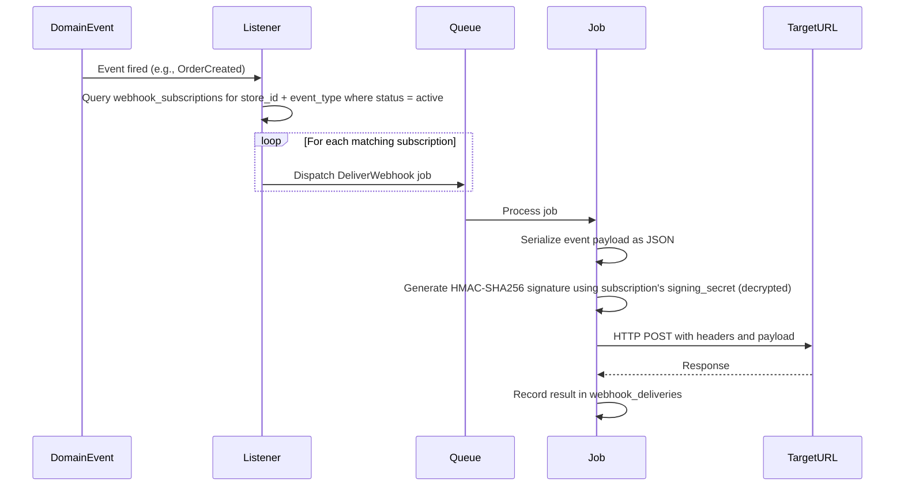

**Required HTTP headers on delivery:**

| Header | Value |
|---|---|
| `X-Platform-Signature` | HMAC-SHA256 hex digest of the payload |
| `X-Platform-Event` | Event type string (e.g., `order.created`) |
| `X-Platform-Delivery-Id` | Unique UUID for this delivery attempt |
| `X-Platform-Timestamp` | Unix timestamp of the event |
| `Content-Type` | `application/json` |

### 13.3 Retry Logic

On non-2xx response or connection timeout:

| Attempt | Backoff Delay |
|---|---|
| 1 (initial) | Immediate |
| 2 | 1 minute |
| 3 | 5 minutes |
| 4 | 30 minutes |
| 5 | 2 hours |
| 6 (final) | 12 hours |

After 5 retry attempts (6 total), mark the delivery as `failed` (dead letter).

Use Laravel's built-in job retry mechanism with the backoff delays configured as: 60, 300, 1800, 7200, 43200 seconds.

### 13.4 Circuit Breaker

- Track consecutive failures per subscription (across different events).
- If a subscription's endpoint fails 5 consecutive times: automatically set `webhook_subscriptions.status = 'paused'`.
- Log a warning and (future) send an admin notification.
- Manual re-enable required by the merchant through the admin UI.
- On each successful delivery, reset the consecutive failure counter to 0.

**Service:** `App\Services\WebhookService`

---

## 14. Analytics

### 14.1 Event Ingestion

**Endpoint:** `POST /api/storefront/v1/analytics/events`

**Request structure:**

| Field | Type | Required | Description |
|---|---|---|---|
Events are submitted in batches:

```json
{
  "events": [
    {
      "type": "page_view",
      "session_id": "...",
      "client_event_id": "...",
      "occurred_at": "2025-01-15T10:30:00Z",
      "properties": { ... }
    }
  ]
}
```

**Event fields:**

| Field | Type | Required | Description |
|---|---|---|---|
| `type` | string | Yes | One of: `page_view`, `product_view`, `add_to_cart`, `checkout_started`, `checkout_completed` |
| `session_id` | string | Yes | Client session identifier |
| `client_event_id` | string | Yes | Client-generated unique ID for deduplication |
| `occurred_at` | string (ISO-8601) | Yes | When the event occurred on the client |
| `properties` | object | No | Event-specific data (product_id, variant_id, etc.) |

**Deduplication:** Events are deduplicated by `client_event_id` within the store scope. If a `client_event_id` has already been recorded for the current store (enforced by the unique index on `store_id, client_event_id`), the duplicate event is silently dropped.

**Rate limiting:** 60 requests per minute per IP address, using Laravel's throttle middleware.

### 14.2 Aggregation

**Job:** `App\Jobs\AggregateAnalytics`

- Schedule: daily at 01:00 UTC
- Aggregates the previous day's raw `analytics_events` into `analytics_daily`.

**Aggregated metrics:**

| Metric | Calculation |
|---|---|
| `orders_count` | Count of `checkout_completed` events for the day |
| `revenue_amount` | Sum of order totals from `checkout_completed` event properties |
| `aov_amount` | `revenue_amount / orders_count` (integer division, 0 if no orders) |
| `visits_count` | Count of distinct `session_id` values with `page_view` events |
| `add_to_cart_count` | Count of `add_to_cart` events |
| `checkout_started_count` | Count of `checkout_started` events |

---

## 15. Media Processing

### 15.1 Upload Flow

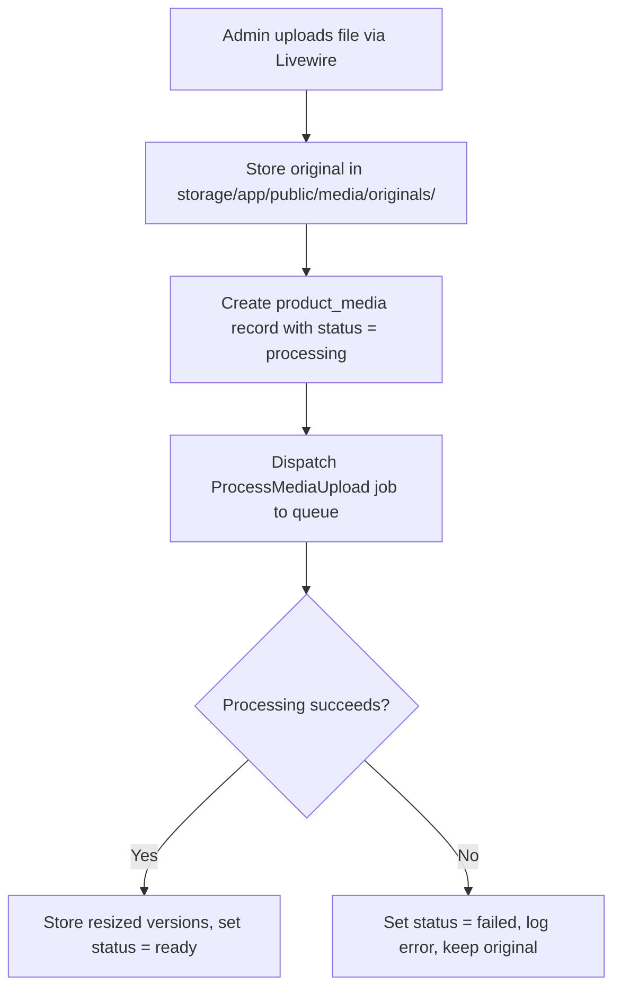

### 15.2 Processing

**Job:** `App\Jobs\ProcessMediaUpload`

**Resize targets:**

| Key | Max Dimensions | Use Case |
|---|---|---|
| `thumbnail` | 150x150 px | Admin grid, small previews |
| `small` | 300x300 px | Product cards, listings |
| `medium` | 600x600 px | Product detail page |
| `large` | 1200x1200 px | Full-size product image, zoom |

**Processing rules:**
- Maintain aspect ratio (contain within target dimensions, no cropping).
- Generate WebP version alongside the original format if the server supports it.
- Store all sizes with predictable path keys: `media/{product_id}/{media_id}/{size}.{ext}`
- Update the `product_media` record with: `width`, `height`, `mime_type`, `byte_size` from the original, and `status = 'ready'`.
- On failure: set `status = 'failed'` and log the error. Do not delete the original file.
- Maximum 3 retry attempts before permanent failure.

### 15.3 Cleanup

When a `product_media` record is deleted, a model event listener removes all associated files from storage (all sizes and the original).

---

## 16. Search (SQLite FTS5)

### 16.1 Index Setup

Create an FTS5 virtual table named `products_fts` with these columns:

| Column | Indexed | Description |
|---|---|---|
| `store_id` | No (UNINDEXED) | Used for filtering, not searching |
| `product_id` | No (UNINDEXED) | Foreign key reference for loading results |
| `title` | Yes | Product title, fully searchable |
| `description` | Yes | Plain-text version of description_html (HTML tags stripped) |
| `vendor` | Yes | Vendor name |
| `product_type` | Yes | Product type |
| `tags` | Yes | Space-separated tag values |

### 16.2 Index Synchronization

**Observer:** `App\Observers\ProductObserver`

| Model Event | FTS Action |
|---|---|
| `created` | Insert row into products_fts |
| `updated` | Delete old row, insert updated row (FTS5 does not support UPDATE) |
| `deleted` | Delete row from products_fts |

**Data preparation before insert:**
- Strip HTML tags from `description_html` to get plain text.
- Convert JSON tags array to space-separated string.
- Use empty string for null vendor and product_type fields.

### 16.3 Search Query

**Service:** `App\Services\SearchService`

**Search algorithm:**

```
PROCEDURE search(store, queryString, limit = 20):
    1. Sanitize queryString: escape FTS5 special characters
    2. Append '*' to last token for prefix matching (autocomplete)
       Example: "running sh" becomes "running sh*"
    3. Execute FTS5 MATCH query:
       - Filter by store_id
       - Order by FTS5 relevance rank
       - Limit results
    4. Load matching Product models
    5. Exclude products with status != 'active' or published_at IS NULL
    6. RETURN ordered collection
```

### 16.4 Search Logging

Each search query is logged to `search_queries` with: store_id, query text, results_count, created_at. This data feeds into analytics and can inform autocomplete suggestions.

---

## 17. Event and Listener Registry

Summary of all domain events and their listeners/side effects:

| Event | Listeners / Side Effects |
|---|---|
| `OrderCreated` | Send confirmation email, dispatch webhooks (`order.created`), log analytics event |
| `OrderRefunded` | Send refund notification email, dispatch webhooks (`order.refunded`), optionally restock |
| `CheckoutAddressed` | Recalculate pricing |
| `CheckoutShippingSelected` | Recalculate pricing |
| `CheckoutCompleted` | Dispatch webhooks (`checkout.completed`) |
| `CheckoutExpired` | Release reserved inventory |
| `ProductStatusChanged` | Sync FTS5 index if transitioning to/from active |
| `ProductCreated` | Sync FTS5 index, dispatch webhooks (`product.created`) |
| `ProductUpdated` | Sync FTS5 index, dispatch webhooks (`product.updated`) |
| `ProductDeleted` | Remove from FTS5 index, dispatch webhooks (`product.deleted`) |
| `OrderPaid` | Update order status, commit inventory (bank transfer confirmation), auto-fulfill digital products |
| `FulfillmentCreated` | Update order fulfillment status |
| `FulfillmentShipped` | Send shipping notification email with tracking info, dispatch webhooks (`order.fulfilled` if fully fulfilled) |
| `FulfillmentDelivered` | Update fulfillment record, dispatch webhooks |
| `OrderCancelled` | Release reserved inventory, send cancellation email |

All events should be placed in `App\Events`. All listeners in `App\Listeners`.

---

## 18. Scheduled Jobs Registry

| Job Class | Schedule | Description |
|---|---|---|
| `App\Jobs\CleanupAbandonedCarts` | Daily | Mark stale active carts as abandoned (14-day threshold) |
| `App\Jobs\ExpireAbandonedCheckouts` | Every 15 minutes | Expire checkouts idle for 24+ hours, release reserved inventory |
| `App\Jobs\AggregateAnalytics` | Daily at 01:00 UTC | Roll up raw analytics events into daily aggregates |
| `App\Jobs\CancelUnpaidBankTransferOrders` | Daily | Cancel bank transfer orders that remain unpaid after configurable days (default: 7) |

**Queued jobs (dispatched on demand, not scheduled):**

| Job Class | Description |
|---|---|
| `App\Jobs\ProcessMediaUpload` | Resize uploaded images to standard sizes |
| `App\Jobs\DeliverWebhook` | POST webhook payload to subscriber endpoint |

Schedule registration belongs in `routes/console.php`.

---

## 19. Service Class Registry

| Service | Namespace | Responsibility |
|---|---|---|
| ProductService | `App\Services` | Product CRUD, status transitions |
| VariantMatrixService | `App\Services` | Option/variant matrix management |
| InventoryService | `App\Services` | Reserve, release, commit, restock operations |
| CartService | `App\Services` | Cart CRUD, line management, merge on login |
| PricingEngine | `App\Services` | Deterministic total calculation pipeline |
| CheckoutService | `App\Services` | Checkout state machine transitions |
| DiscountService | `App\Services` | Discount validation and application |
| TaxCalculator | `App\Services` | Tax calculation orchestration (delegates to providers) |
| ManualTaxProvider | `App\Services\Tax` | Manual tax rate calculation |
| StripeTaxProvider | `App\Services\Tax` | Stripe Tax API integration (stub) |
| ShippingCalculator | `App\Services` | Zone matching, rate calculation |
| PaymentService | `App\Services` | Payment processing orchestration |
| MockPaymentProvider | `App\Services\Payment` | Mock PSP - simulates card/PayPal/bank transfer payments in-process |
| RefundService | `App\Services` | Refund processing and inventory restock |
| FulfillmentService | `App\Services` | Fulfillment creation and status management |
| CustomerService | `App\Services` | Customer registration, account management |
| WebhookService | `App\Services` | Webhook delivery, circuit breaker |
| SearchService | `App\Services` | FTS5 search queries |
| HandleGenerator | `App\Support` | Unique handle/slug generation |

---

## 20. Contracts (Interfaces)

| Interface | Namespace | Implementing Classes |
|---|---|---|
| TaxProvider | `App\Contracts` | ManualTaxProvider, StripeTaxProvider |
| PaymentProvider | `App\Contracts` | MockPaymentProvider |

---

## 21. Enum Registry

All enums live in `App\Enums` and are string-backed.

| Enum | Values (TitleCase keys, lowercase string values) |
|---|---|
| StoreUserRole | Owner (`owner`), Admin (`admin`), Staff (`staff`), Support (`support`) |
| ProductStatus | Draft (`draft`), Active (`active`), Archived (`archived`) |
| VariantStatus | Active (`active`), Archived (`archived`) |
| DiscountType | Code (`code`), Automatic (`automatic`) |
| DiscountValueType | Percent (`percent`), Fixed (`fixed`), FreeShipping (`free_shipping`) |
| CartStatus | Active (`active`), Converted (`converted`), Abandoned (`abandoned`) |
| CheckoutStatus | Started (`started`), Addressed (`addressed`), ShippingSelected (`shipping_selected`), PaymentSelected (`payment_selected`), Completed (`completed`), Expired (`expired`) |
| PaymentMethod | CreditCard (`credit_card`), Paypal (`paypal`), BankTransfer (`bank_transfer`) |
| PaymentStatus | Pending (`pending`), Captured (`captured`), Failed (`failed`), Refunded (`refunded`) |
| OrderStatus | Pending (`pending`), Paid (`paid`), Fulfilled (`fulfilled`), Cancelled (`cancelled`), Refunded (`refunded`) |
| FinancialStatus | Pending (`pending`), Authorized (`authorized`), Paid (`paid`), PartiallyRefunded (`partially_refunded`), Refunded (`refunded`), Voided (`voided`) |
| FulfillmentOrderStatus | Unfulfilled (`unfulfilled`), Partial (`partial`), Fulfilled (`fulfilled`) |
| FulfillmentShipmentStatus | Pending (`pending`), Shipped (`shipped`), Delivered (`delivered`) |
| ShippingRateType | Flat (`flat`), Weight (`weight`), Price (`price`), Carrier (`carrier`) |
| MediaStatus | Processing (`processing`), Ready (`ready`), Failed (`failed`) |
| WebhookSubscriptionStatus | Active (`active`), Paused (`paused`), Disabled (`disabled`) |

---

## 22. Value Object Registry

All value objects live in `App\ValueObjects`.

| Value Object | Fields | Purpose |
|---|---|---|
| PricingResult | subtotal (int), discount (int), shipping (int), taxLines (array of TaxLine), taxTotal (int), total (int), currency (string) | Complete pricing calculation output |
| TaxLine | name (string), rate (int, basis points), amount (int, cents) | Individual tax line item |
| TaxCalculationRequest | lineItems (array), shippingAmount (int), address (Address), taxSettings (object) | Input for tax providers |
| TaxCalculationResult | taxLines (array of TaxLine), totalAmount (int) | Output from tax providers |
| DiscountValidationResult | valid (bool), discount (nullable), errorCode (nullable string), errorMessage (nullable string) | Discount validation outcome |
| PaymentResult | success (bool), referenceId (string), status (string: pending/captured/failed), errorCode (nullable string), errorMessage (nullable string) | Mock payment processing result |
| WebhookResult | success (bool), message (string) | Webhook processing result |
| RefundResult | success (bool), providerRefundId (string), status (string) | Refund processing result |
| Address | firstName, lastName, company, address1, address2, city, province, provinceCode, country, countryCode, postalCode, phone | Structured address fields |
| ShippingRate | id (int), name (string), amount (int, cents), type (string) | Calculated shipping rate option |
