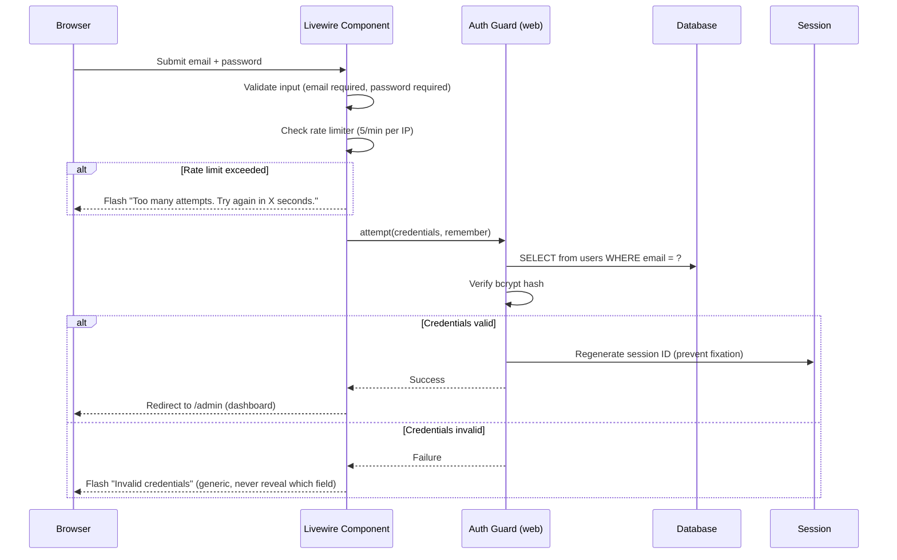
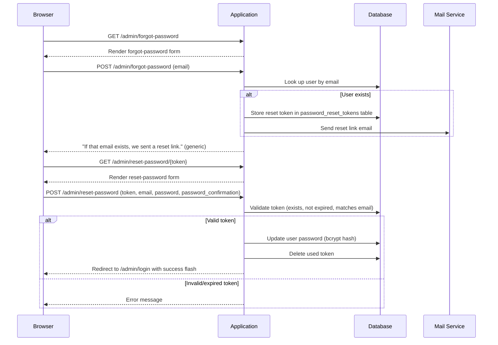
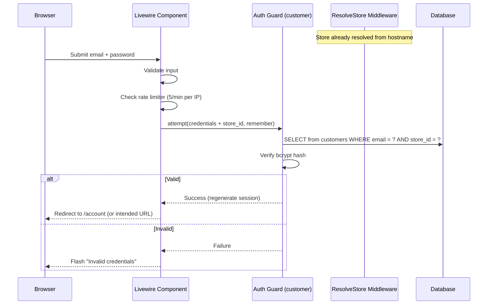
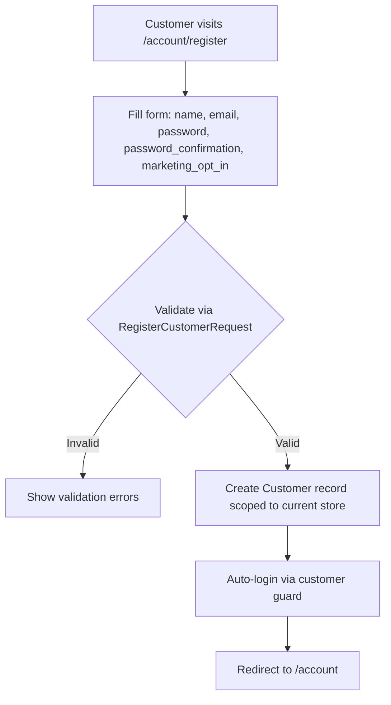
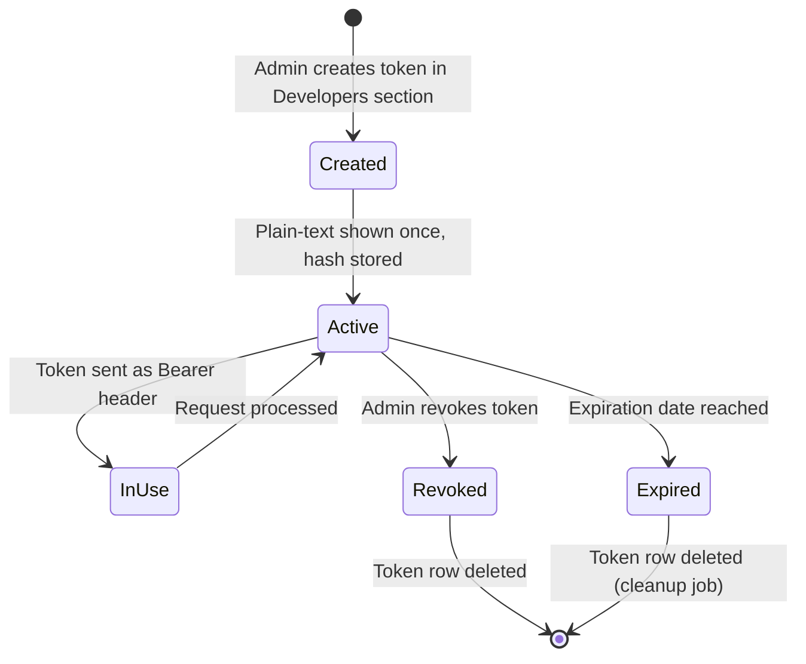
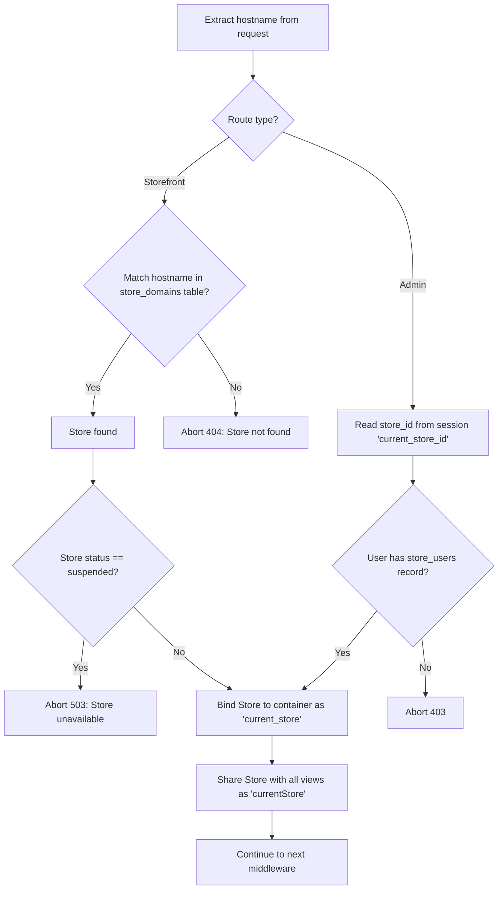
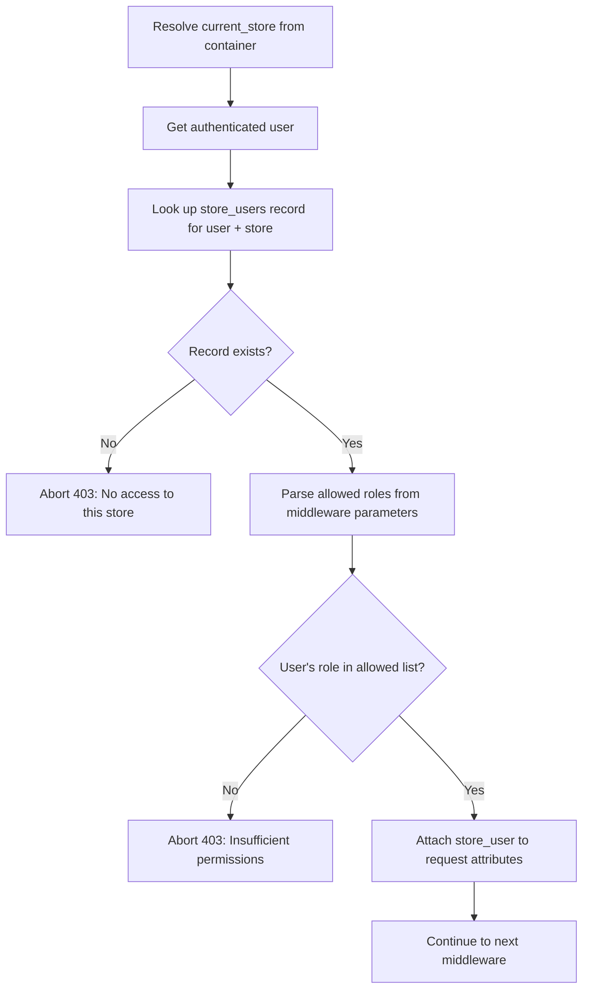
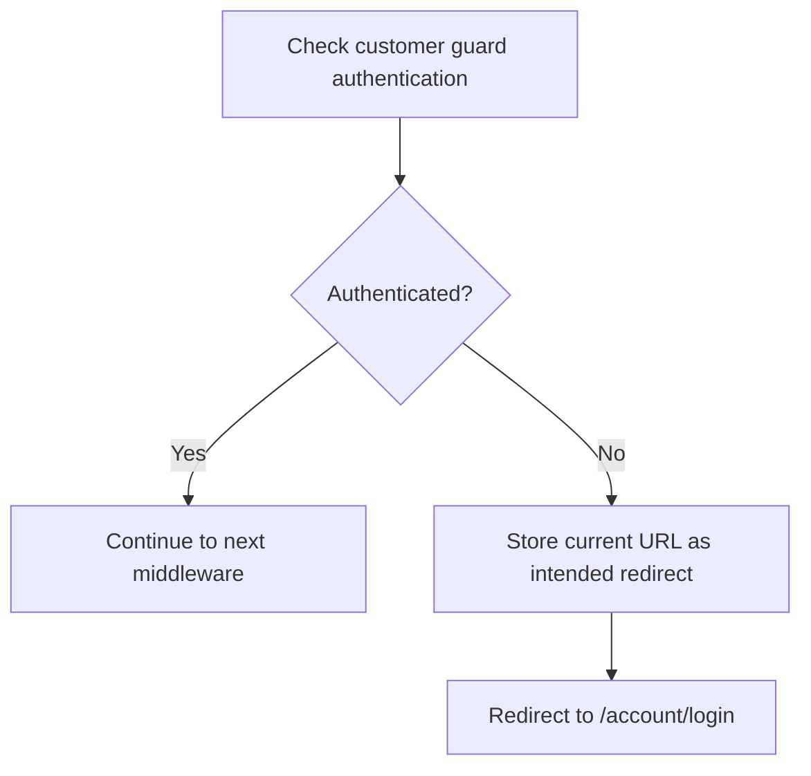
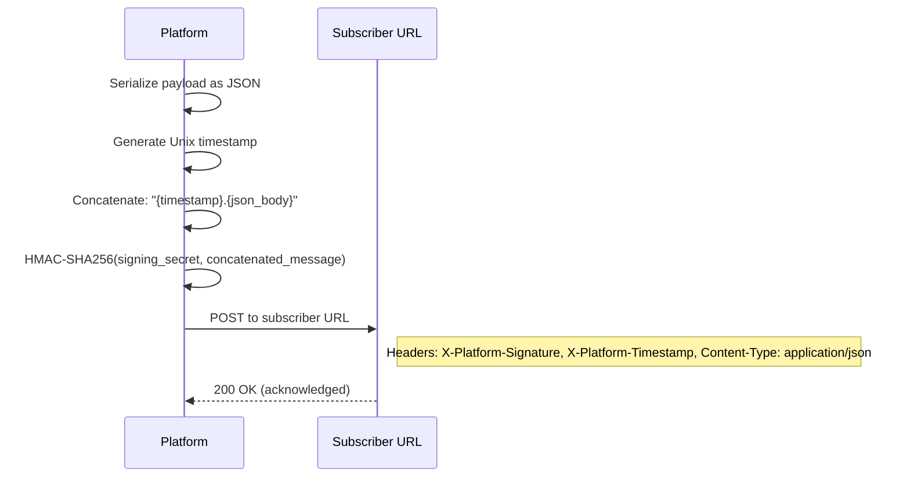

# 06 - Authentication and Security Specification

> E-commerce platform - Auth, authorization, and security controls for Laravel 12 + Livewire v4 + SQLite

---

## 1. Authentication

The platform supports three distinct authentication mechanisms: session-based admin auth, session-based customer auth (store-scoped), and token-based API auth via Sanctum.

### 1.1 Admin Authentication

| Setting | Value |
|---------|-------|
| Guard name | `web` (default Laravel guard) |
| Provider name | `users` (Eloquent driver) |
| Model | `App\Models\User` |
| Driver | Session (cookie-based) |
| Login route | `GET /admin/login` |
| Login form | Livewire component `Admin\Auth\Login` |

#### Admin Login Flow



**Requirements:**

- The login form collects `email` and `password`.
- On successful login, the session MUST be regenerated to prevent session fixation attacks.
- On failed login, only the generic message "Invalid credentials" is shown. The system must not indicate whether the email or password was wrong.
- Rate limiting: maximum 5 attempts per minute, keyed by IP address. Uses the `login` rate limiter.
- After login: redirect to `/admin` (the dashboard).

#### Remember Me

- An optional "Remember me" checkbox on the login form.
- When enabled, Laravel sets a long-lived remember token cookie.
- The `remember_token` column on the `users` table stores the hashed token.
- Cookie name follows Laravel default convention: `remember_web_{hash}`.

#### Admin Password Reset Flow



**Requirements:**

- Uses Laravel's built-in password broker (`users` broker).
- Reset tokens stored in the `password_reset_tokens` table.
- Token expiration: 60 minutes (configurable in `config/auth.php` under `passwords.users.expire`).
- Throttle: one reset email per 60 seconds per email address.
- The "forgot password" response must be generic (do not reveal whether email exists).

#### Admin Logout

- Route: `POST /admin/logout` (via Livewire action or standard route).
- Steps: invalidate the entire session, regenerate the CSRF token, redirect to `/admin/login`.
- The response must not cache.

#### Session Lifetime

| Setting | Value |
|---------|-------|
| Lifetime | 120 minutes (configurable via `SESSION_LIFETIME` env var) |
| Expire on close | No (session persists until lifetime expires) |

---

### 1.2 Customer Authentication

| Setting | Value |
|---------|-------|
| Guard name | `customer` (custom guard) |
| Provider name | `customers` (Eloquent driver) |
| Model | `App\Models\Customer` |
| Driver | Session (cookie-based) |
| Login route | `GET /account/login` |
| Registration route | `GET /account/register` |

#### Customer Login Flow



**Requirements:**

- Customer login is always scoped to the current store. The store is resolved from the request hostname by the `ResolveStore` middleware before the login attempt.
- The custom `CustomerUserProvider` must inject `store_id` into the credential check so the query filters by both `email` and `store_id`.
- The same email address can exist in different stores (multi-tenant isolation).
- Rate limiting: maximum 5 attempts per minute per IP, using the same `login` rate limiter.
- After login: redirect to `/account` or the intended URL (if the customer was redirected from a protected page).

#### Customer Registration Flow



**Registration fields:**

| Field | Type | Required | Validation |
|-------|------|:--------:|------------|
| name | string | Y | max:255 |
| email | string | Y | valid email, unique per store (composite unique on email + store_id) |
| password | string | Y | min:8, confirmed |
| password_confirmation | string | Y | must match password |
| marketing_opt_in | boolean | N | defaults to false |

#### Customer Store Scoping

- The `customers` auth provider requires a custom `CustomerUserProvider` class.
- This provider overrides the default Eloquent provider to always include `store_id` in credential queries.
- The `store_id` is obtained from the container-bound current store (resolved by `ResolveStore` middleware).
- This ensures that `Auth::guard('customer')->attempt()` never crosses store boundaries.

#### Customer Password Reset

- Uses a separate password broker: `customers` broker.
- Tokens stored in the `customer_password_reset_tokens` table (separate from admin tokens).
- Token records include `store_id` to scope resets to the correct store.
- Routes: `GET /forgot-password`, `POST /forgot-password`, `GET /reset-password/{token}`, `POST /reset-password`.
- Token expiration: 60 minutes.
- Throttle: one reset email per 60 seconds.
- Generic response on the "forgot password" form (do not reveal whether email exists in the store).

---

### 1.3 API Authentication (Sanctum)

| Setting | Value |
|---------|-------|
| Guard name | `sanctum` |
| Provider | `users` (admin users only) |
| Token type | Personal access tokens |
| Token prefix | `shop_` |
| Hashing | SHA-256 |
| Default expiration | 1 year |
| Storage | `personal_access_tokens` table |

#### Token Lifecycle



**Requirements:**

- Tokens are created in the admin panel, under the Developers section.
- Each token has: a human-readable name, an optional expiration date, and a list of abilities (scopes).
- On creation, the plain-text token (prefixed with `shop_`) is displayed exactly once. Only the SHA-256 hash is persisted.
- Tokens are sent as `Authorization: Bearer shop_xxxxxxxx`.
- Sanctum middleware validates the hash and resolves the associated user.
- Ability checks are performed per-endpoint (e.g., the products list endpoint requires `read-products`).
- Revoking a token deletes its row from the `personal_access_tokens` table.

#### Token Abilities (Scopes)

| Ability | Description |
|---------|-------------|
| `read-products` | List and view products |
| `write-products` | Create, update, delete products |
| `read-orders` | List and view orders |
| `write-orders` | Update orders, create fulfillments |
| `read-customers` | List and view customers |
| `write-customers` | Update customers |
| `read-collections` | List and view collections |
| `write-collections` | Create, update, delete collections |
| `read-discounts` | List and view discounts |
| `write-discounts` | Create, update, delete discounts |
| `read-analytics` | View analytics data |
| `read-settings` | View store settings (general, shipping, taxes, checkout, notifications) |
| `write-settings` | Update store settings (replaces the legacy `manage-store`, `manage-shipping`, `manage-taxes` scopes) |
| `read-themes` | View themes and theme files |
| `write-themes` | Create, update, delete, publish themes |
| `read-content` | View pages and navigation menus |
| `write-content` | Create, update, delete pages and navigation items |
| `manage-platform` | Platform-level management (super-admin only) |

Each API endpoint must check the token's abilities before processing the request. If the token lacks the required ability, the endpoint returns `403 Forbidden`.

---

### 1.4 Guard Configuration

File to configure: `config/auth.php`

#### Guards Data Dictionary

| Guard Name | Driver | Provider | Purpose |
|------------|--------|----------|---------|
| `web` | session | `users` | Admin panel session auth (default guard) |
| `customer` | session | `customers` | Storefront customer session auth |
| `sanctum` | sanctum | `users` | Admin REST API token auth |

#### Providers Data Dictionary

| Provider Name | Driver | Model | Purpose |
|---------------|--------|-------|---------|
| `users` | eloquent | `App\Models\User` | Admin users |
| `customers` | eloquent | `App\Models\Customer` | Storefront customers (store-scoped via custom provider) |

#### Password Brokers Data Dictionary

| Broker Name | Provider | Token Table | Expiry | Throttle |
|-------------|----------|-------------|--------|----------|
| `users` | `users` | `password_reset_tokens` | 60 min | 60 sec |
| `customers` | `customers` | `customer_password_reset_tokens` | 60 min | 60 sec |

**Defaults:** The default guard is `web` and the default password broker is `users`.

---

## 2. Authorization

### 2.1 Role Enum

File: `app/Enums/StoreUserRole.php`

A backed string enum with four values:

| Case | Stored Value | Description |
|------|-------------|-------------|
| Owner | `'owner'` | Full access. Can transfer ownership, manage billing, delete store. One per store. |
| Admin | `'admin'` | Near-full access. Cannot transfer ownership or delete store. |
| Staff | `'staff'` | Operational access. Can manage products, orders, collections, discounts, pages. Cannot access settings, themes, staff management, or developers. |
| Support | `'support'` | Read-only access to products, orders, and customers. For customer service agents. |

**Constraints:**

- Each store must have exactly one Owner.
- Ownership transfer is a dedicated action (not a simple role change).
- A User can hold different roles in different stores (via the `store_users` pivot table).

---

### 2.2 Permission Matrix

The `store_users` pivot table links a `User` to a `Store` with a `role`. A user can have different roles in different stores.

| Resource | Action | Owner | Admin | Staff | Support |
|----------|--------|:-----:|:-----:|:-----:|:-------:|
| Store Settings | View | Y | Y | N | N |
| Store Settings | Update | Y | Y | N | N |
| Store | Delete | Y | N | N | N |
| Products | List / View | Y | Y | Y | Y |
| Products | Create | Y | Y | Y | N |
| Products | Update | Y | Y | Y | N |
| Products | Delete / Archive | Y | Y | N | N |
| Products | Restore | Y | Y | N | N |
| Collections | List / View | Y | Y | Y | Y |
| Collections | Create | Y | Y | Y | N |
| Collections | Update | Y | Y | Y | N |
| Collections | Delete | Y | Y | N | N |
| Orders | List / View | Y | Y | Y | Y |
| Orders | Update | Y | Y | Y | N |
| Orders | Cancel | Y | Y | N | N |
| Fulfillments | Create | Y | Y | Y | N |
| Fulfillments | Update / Cancel | Y | Y | Y | N |
| Refunds | Create | Y | Y | N | N |
| Customers | List / View | Y | Y | Y | Y |
| Customers | Update | Y | Y | Y | N |
| Discounts | List / View | Y | Y | Y | Y |
| Discounts | Create | Y | Y | Y | N |
| Discounts | Update | Y | Y | Y | N |
| Discounts | Delete | Y | Y | N | N |
| Themes | List / View | Y | Y | N | N |
| Themes | Create / Upload | Y | Y | N | N |
| Themes | Customize | Y | Y | N | N |
| Themes | Publish | Y | Y | N | N |
| Themes | Delete | Y | Y | N | N |
| Pages | List / View | Y | Y | Y | N |
| Pages | Create | Y | Y | Y | N |
| Pages | Update | Y | Y | Y | N |
| Pages | Delete | Y | Y | N | N |
| Navigation | List / View | Y | Y | Y | N |
| Navigation | Manage | Y | Y | N | N |
| Apps | List / View | Y | Y | N | N |
| Apps | Install / Remove | Y | Y | N | N |
| Analytics | View | Y | Y | Y | N |
| Developers / API | Manage | Y | Y | N | N |
| Staff | List / View | Y | Y | N | N |
| Staff | Invite | Y | Y | N | N |
| Staff | Update Role | Y | Y | N | N |
| Staff | Remove | Y | Y | N | N |
| Shipping Zones | Manage | Y | Y | N | N |
| Tax Settings | Manage | Y | Y | N | N |
| Search Settings | Manage | Y | Y | N | N |

#### Role Group Shorthand

The permission matrix reveals three natural groupings that the authorization layer should use as reusable helpers:

| Group Name | Roles Included | Used For |
|------------|---------------|----------|
| OwnerOnly | Owner | Store deletion, ownership transfer |
| OwnerOrAdmin | Owner, Admin | Settings, themes, staff, developers, navigation, apps, shipping, taxes, search, delete/archive actions |
| OwnerAdminOrStaff | Owner, Admin, Staff | Create/update products, collections, discounts, pages, fulfillments, order updates |
| AnyRole | Owner, Admin, Staff, Support | Read-only listing/viewing of products, orders, customers, collections, discounts |

---

### 2.3 Role Checking Trait

File: `app/Traits/ChecksStoreRole.php`

A reusable trait included in all policies and used by gate definitions. Must provide the following methods:

| Method | Parameters | Returns | Description |
|--------|-----------|---------|-------------|
| `getStoreRole` | User, store_id (int) | StoreUserRole or null | Looks up the user's role for the given store via the `store_users` relationship. Returns null if the user has no role in that store. |
| `hasRole` | User, store_id (int), roles (array of StoreUserRole) | bool | Returns true if the user's role for the store is in the provided list. Returns false if user has no role. |
| `isOwnerOrAdmin` | User, store_id (int) | bool | Shorthand: checks if role is Owner or Admin. |
| `isOwnerAdminOrStaff` | User, store_id (int) | bool | Shorthand: checks if role is Owner, Admin, or Staff. |
| `isAnyRole` | User, store_id (int) | bool | Returns true if the user has any role at all in the store. |

**Store ID resolution:** When the policy method receives a model instance (e.g., Product), the store_id comes from the model's `store_id` attribute. When the policy method does not receive a model (e.g., `viewAny`, `create`), the store_id is resolved from the container-bound `current_store`.

---

### 2.4 Laravel Policies

All policies use the `ChecksStoreRole` trait. Laravel 12 auto-discovers policies by convention (`App\Policies\{Model}Policy`), so no manual registration is needed.

Every policy method follows this pattern:
1. Determine the `store_id` (from the model if available, otherwise from the resolved current store).
2. Use the appropriate role-checking helper method.
3. Return a boolean.

#### ProductPolicy

File: `app/Policies/ProductPolicy.php`

| Method | Receives Model? | Required Roles | Store ID Source |
|--------|:--------------:|----------------|-----------------|
| `viewAny(User)` | No | AnyRole | current_store |
| `view(User, Product)` | Yes | AnyRole | product.store_id |
| `create(User)` | No | OwnerAdminOrStaff | current_store |
| `update(User, Product)` | Yes | OwnerAdminOrStaff | product.store_id |
| `delete(User, Product)` | Yes | OwnerOrAdmin | product.store_id |
| `archive(User, Product)` | Yes | OwnerOrAdmin | product.store_id |
| `restore(User, Product)` | Yes | OwnerOrAdmin | product.store_id |

#### OrderPolicy

File: `app/Policies/OrderPolicy.php`

| Method | Receives Model? | Required Roles | Store ID Source |
|--------|:--------------:|----------------|-----------------|
| `viewAny(User)` | No | AnyRole | current_store |
| `view(User, Order)` | Yes | AnyRole | order.store_id |
| `update(User, Order)` | Yes | OwnerAdminOrStaff | order.store_id |
| `cancel(User, Order)` | Yes | OwnerOrAdmin | order.store_id |
| `createFulfillment(User, Order)` | Yes | OwnerAdminOrStaff | order.store_id |
| `createRefund(User, Order)` | Yes | OwnerOrAdmin | order.store_id |

#### CollectionPolicy

File: `app/Policies/CollectionPolicy.php`

| Method | Receives Model? | Required Roles | Store ID Source |
|--------|:--------------:|----------------|-----------------|
| `viewAny(User)` | No | AnyRole | current_store |
| `view(User, Collection)` | Yes | AnyRole | collection.store_id |
| `create(User)` | No | OwnerAdminOrStaff | current_store |
| `update(User, Collection)` | Yes | OwnerAdminOrStaff | collection.store_id |
| `delete(User, Collection)` | Yes | OwnerOrAdmin | collection.store_id |

#### DiscountPolicy

File: `app/Policies/DiscountPolicy.php`

| Method | Receives Model? | Required Roles | Store ID Source |
|--------|:--------------:|----------------|-----------------|
| `viewAny(User)` | No | AnyRole | current_store |
| `view(User, Discount)` | Yes | AnyRole | discount.store_id |
| `create(User)` | No | OwnerAdminOrStaff | current_store |
| `update(User, Discount)` | Yes | OwnerAdminOrStaff | discount.store_id |
| `delete(User, Discount)` | Yes | OwnerOrAdmin | discount.store_id |

#### CustomerPolicy

File: `app/Policies/CustomerPolicy.php`

| Method | Receives Model? | Required Roles | Store ID Source |
|--------|:--------------:|----------------|-----------------|
| `viewAny(User)` | No | AnyRole | current_store |
| `view(User, Customer)` | Yes | AnyRole | customer.store_id |
| `update(User, Customer)` | Yes | OwnerAdminOrStaff | customer.store_id |

#### ThemePolicy

File: `app/Policies/ThemePolicy.php`

| Method | Receives Model? | Required Roles | Store ID Source |
|--------|:--------------:|----------------|-----------------|
| `viewAny(User)` | No | OwnerOrAdmin | current_store |
| `view(User, Theme)` | Yes | OwnerOrAdmin | theme.store_id |
| `create(User)` | No | OwnerOrAdmin | current_store |
| `update(User, Theme)` | Yes | OwnerOrAdmin | theme.store_id |
| `delete(User, Theme)` | Yes | OwnerOrAdmin | theme.store_id |
| `publish(User, Theme)` | Yes | OwnerOrAdmin | theme.store_id |

#### PagePolicy

File: `app/Policies/PagePolicy.php`

| Method | Receives Model? | Required Roles | Store ID Source |
|--------|:--------------:|----------------|-----------------|
| `viewAny(User)` | No | OwnerAdminOrStaff | current_store |
| `view(User, Page)` | Yes | OwnerAdminOrStaff | page.store_id |
| `create(User)` | No | OwnerAdminOrStaff | current_store |
| `update(User, Page)` | Yes | OwnerAdminOrStaff | page.store_id |
| `delete(User, Page)` | Yes | OwnerOrAdmin | page.store_id |

#### StorePolicy

File: `app/Policies/StorePolicy.php`

| Method | Receives Model? | Required Roles | Store ID Source |
|--------|:--------------:|----------------|-----------------|
| `viewSettings(User, Store)` | Yes | OwnerOrAdmin | store.id |
| `updateSettings(User, Store)` | Yes | OwnerOrAdmin | store.id |
| `delete(User, Store)` | Yes | OwnerOnly | store.id |

#### FulfillmentPolicy

File: `app/Policies/FulfillmentPolicy.php`

| Method | Receives Model? | Required Roles | Store ID Source |
|--------|:--------------:|----------------|-----------------|
| `create(User, Order)` | Yes (Order) | OwnerAdminOrStaff | order.store_id |
| `update(User, Fulfillment)` | Yes | OwnerAdminOrStaff | fulfillment -> order.store_id |
| `cancel(User, Fulfillment)` | Yes | OwnerAdminOrStaff | fulfillment -> order.store_id |

Note: `create` receives the parent Order, not a Fulfillment, since the Fulfillment does not exist yet. The `update` and `cancel` methods navigate through the Fulfillment's order relationship to get the store_id.

#### RefundPolicy

File: `app/Policies/RefundPolicy.php`

| Method | Receives Model? | Required Roles | Store ID Source |
|--------|:--------------:|----------------|-----------------|
| `create(User, Order)` | Yes (Order) | OwnerOrAdmin | order.store_id |

Note: `create` receives the parent Order for the same reason as FulfillmentPolicy.

#### NavigationMenuPolicy

File: `app/Policies/NavigationMenuPolicy.php`

| Method | Receives Model? | Required Roles | Store ID Source |
|--------|:--------------:|----------------|-----------------|
| `viewAny(User)` | No | OwnerAdminOrStaff | current_store |
| `manage(User)` | No | OwnerOrAdmin | current_store |

---

### 2.5 Gates (Non-Model Operations)

Gates are registered in `AppServiceProvider` (or a dedicated `AuthServiceProvider`). Each gate resolves the current store from the container and checks the user's role via the `store_users` relationship.

| Gate Name | Required Roles | Purpose |
|-----------|---------------|---------|
| `manage-store-settings` | Owner, Admin | Access store settings pages |
| `manage-staff` | Owner, Admin | Invite, update, remove staff members |
| `manage-developers` | Owner, Admin | Create/revoke API tokens, manage webhooks |
| `view-analytics` | Owner, Admin, Staff | View analytics dashboard and reports |
| `manage-shipping` | Owner, Admin | Manage shipping zones, rates, profiles |
| `manage-taxes` | Owner, Admin | Manage tax settings and rates |
| `manage-search-settings` | Owner, Admin | Configure search weights and synonyms |
| `manage-navigation` | Owner, Admin | Create/edit/delete navigation menus |
| `manage-apps` | Owner, Admin | Install and remove third-party apps |

**Gate resolution pattern (all gates follow this):**

1. Resolve the current store from the container
2. Look up the user's `store_users` record for that store
3. If no record exists, return false
4. If the user's role is in the gate's required roles list, return true
5. Otherwise return false

---

### 2.6 Policy and Gate Usage Patterns

#### In Livewire Components

- List views: call `authorize('viewAny', ModelClass)` in the `mount()` lifecycle method.
- Action methods (delete, update, etc.): call `authorize('action', $modelInstance)` at the start of the action, before performing any mutation.
- If authorization fails, Laravel throws `AuthorizationException`, which renders as 403.

#### In API Controllers

- Use `$this->authorize('action', $model)` at the start of each controller method.
- Alternatively, use `can` middleware on routes for simpler checks.
- Form Requests also implement `authorize()` to check the relevant policy or gate before validation runs.

#### In Blade Templates

- Use `@can('gate-name')` / `@cannot` directives to conditionally show/hide navigation items and action buttons.
- This is purely cosmetic (UI hiding) - the actual authorization check happens server-side in policies/gates.

---

## 3. Middleware Stack

### 3.1 Middleware Registration

File: `bootstrap/app.php`

Three custom middleware aliases must be registered:

| Alias | Class | Purpose |
|-------|-------|---------|
| `store.resolve` | `App\Http\Middleware\ResolveStore` | Resolves current store from hostname or session |
| `role.check` | `App\Http\Middleware\CheckStoreRole` | Checks user has required role for current store |
| `auth:customer` | `App\Http\Middleware\CustomerAuthenticate` | Ensures customer is authenticated via customer guard |

---

### 3.2 Route Middleware Groups

| Route Group | Middleware Stack | Description |
|-------------|-----------------|-------------|
| Admin web (auth pages) | `web` | Login, forgot-password, reset-password |
| Admin web (authenticated) | `web`, `auth`, `verified`, `store.resolve`, `role.check` | All admin panel pages |
| Admin API | `api`, `auth:sanctum`, `store.resolve`, `throttle:api.admin` | REST API endpoints |
| Storefront web (public) | `web`, `store.resolve` | Public store pages (catalog, product, cart) |
| Storefront web (customer) | `web`, `store.resolve`, `auth:customer` | Customer account pages |
| Storefront API | `api`, `store.resolve`, `throttle:api.storefront` | Cart and checkout API |
| Webhook routes | `api`, `throttle:webhooks` | Reserved for outbound app webhooks (no inbound payment webhooks - Mock PSP is in-process) |

---

### 3.3 Custom Middleware Specifications

#### ResolveStore

File: `app/Http/Middleware/ResolveStore.php`

**Purpose:** Resolves the current store from the request hostname and binds it to the service container.



**Requirements:**

Storefront requests: Resolve store from the `store_domains` table by matching the request hostname against `store_domains.hostname`. Cache the hostname-to-store mapping using file cache (tag: `store-domains`).

Admin requests: Store is determined by session key `current_store_id`, set after login or via the store-switcher in the admin panel. Admin routes do NOT use hostname resolution. The `admin.acme-fashion.test` domain in seeders routes requests to the admin panel, but the actual store context within the admin is determined by the session `current_store_id` after login.

**Shared steps (after store is resolved):**

1. If the store's `status` column is `'suspended'`: abort with HTTP 503 and message "This store is currently unavailable." (For admin routes: abort 403 for mutations instead.)
2. Bind the resolved Store model instance to the service container with the key `'current_store'`.
3. Share the store with all Blade views under the variable name `currentStore`.
4. Allow the request to proceed.

#### CheckStoreRole

File: `app/Http/Middleware/CheckStoreRole.php`

**Purpose:** Verifies the authenticated user has one of the specified roles for the current store.

**Route usage:** Applied as `role.check:owner,admin` or `role.check:owner,admin,staff` (comma-separated role values passed as variadic parameters).



**Requirements:**

1. Resolve the current store from the container.
2. Get the authenticated user from the request.
3. Query the user's `store_users` relationship filtered by `store_id`.
4. If no record exists: abort 403 with message "You do not have access to this store."
5. Convert the middleware parameter strings to `StoreUserRole` enum instances.
6. If the user's role is not in the allowed list: abort 403 with message "Insufficient permissions."
7. Store the resolved `StoreUser` pivot record on the request attributes (key: `store_user`) for downstream use.
8. Allow the request to proceed.

#### CustomerAuthenticate

File: `app/Http/Middleware/CustomerAuthenticate.php`

**Purpose:** Ensures the request is authenticated via the `customer` guard. Redirects unauthenticated customers to login.



**Requirements:**

1. Check if `Auth::guard('customer')` reports the user as authenticated.
2. If authenticated: allow the request to proceed.
3. If not authenticated: save the current URL in the session as the intended URL (so the customer returns there after login), then redirect to the storefront login route (`/account/login`).

---

## 4. Security Controls

### 4.1 CSRF Protection

| Context | Mechanism |
|---------|-----------|
| Blade forms | Laravel's `@csrf` directive injects a hidden token field (automatic) |
| Livewire actions | Livewire handles CSRF verification automatically on every request |
| API routes (Sanctum token) | Exempt from CSRF (token-based auth replaces CSRF need) |
| SPA clients | `GET /sanctum/csrf-cookie` sets XSRF-TOKEN cookie for session-based API calls |

**Requirements:**

- CSRF verification is enforced globally on all `web` middleware group routes.
- No routes within the `web` group may be excluded from CSRF verification.
- API routes (under `api` middleware group) are inherently exempt since they use token auth.

---

### 4.2 Rate Limiting

All rate limiters are defined in `bootstrap/app.php` (or `AppServiceProvider::boot()`).

| Limiter Name | Limit | Keyed By | Applied To |
|-------------|-------|----------|------------|
| `login` | 5 per minute | IP address | Admin login, customer login |
| `api.admin` | 60 per minute | User ID (if authenticated), otherwise IP | Admin REST API endpoints |
| `api.storefront` | 120 per minute | IP address | Public storefront API (cart, search) |
| `checkout` | 10 per minute | Session ID | Checkout-related operations |
| `search` | 30 per minute | IP address | Search queries |
| `analytics` | 60 per minute | IP address | Analytics event ingestion |
| `webhooks` | 100 per minute | IP address | Outbound app webhook endpoints (reserved; no inbound payment webhooks - Mock PSP is in-process) |

**Rate limit response headers** (returned on all API responses by Laravel default):

| Header | Description |
|--------|-------------|
| `X-RateLimit-Limit` | Maximum requests allowed in the window |
| `X-RateLimit-Remaining` | Requests remaining in the current window |
| `Retry-After` | Seconds until the rate limit resets (only on 429 responses) |

When a rate limit is exceeded, the response is HTTP 429 Too Many Requests.

---

### 4.3 Encryption at Rest

Encryption algorithm: AES-256-CBC with MAC verification, keyed by the application's `APP_KEY`.

**Fields requiring encrypted storage (using Laravel's `encrypted` cast):**

| Model | Column | Cast Type | Purpose |
|-------|--------|-----------|---------|
| OauthClient | `client_secret_encrypted` | `encrypted` | Third-party OAuth client secrets |
| WebhookSubscription | `signing_secret_encrypted` | `encrypted` | Per-subscription signing secrets for outbound webhooks |
| Payment | `raw_json` | `encrypted:array` | Full payment gateway response (may contain sensitive card/account data) |

**Requirements:**

- These columns are declared with the `encrypted` (or `encrypted:array`) cast in the model's `casts()` method.
- Data is automatically encrypted before writing to the database and decrypted when reading.
- The encrypted columns store opaque ciphertext (type TEXT in SQLite). They cannot be queried with WHERE clauses at the database level.

---

### 4.4 Input Validation

All write endpoints must use dedicated Form Request classes. Validation rules use string syntax per project convention.

#### Form Request Inventory

| Form Request Class | Used By | Key Validation Rules |
|-------------------|---------|---------------------|
| `StoreProductRequest` | Create product | `title`: required, string, max:255. `description_html`: nullable, string. `status`: required, in:active,draft,archived. `vendor`: nullable, string. Price fields: required, integer, min:0. |
| `UpdateProductRequest` | Update product | Same fields as StoreProductRequest but all optional (sometimes rule). |
| `StoreCollectionRequest` | Create collection | `title`: required, string, max:255. `type`: required, in:manual,automated. `rules_json`: required_if:type,automated, valid JSON. |
| `UpdateCollectionRequest` | Update collection | Same as StoreCollectionRequest, all optional. |
| `StoreDiscountRequest` | Create discount | `type`: required, in:code,automatic. `code`: required_if:type,code, string, max:50, unique per store (case-insensitive). `value_type`: required, in:fixed,percent,free_shipping. `value_amount`: required_unless:value_type,free_shipping, integer, min:0; when value_type is `percent`, max:100. `minimum_order_amount`: nullable, integer, min:0. `usage_limit`: nullable, integer, min:1. `starts_at`: nullable, date, ISO-8601. `ends_at`: nullable, date, after:starts_at. |
| `UpdateDiscountRequest` | Update discount | Same as StoreDiscountRequest, code unique ignoring self. |
| `SetCheckoutAddressRequest` | Set shipping/billing address | `first_name`, `last_name`, `address1`, `city`, `country_code`: required. `province_code`: required when applicable. `postal_code`: required. `phone`: nullable. |
| `ApplyDiscountRequest` | Apply discount to checkout | `code`: required, string, must exist in discounts table for current store. |
| `CreateFulfillmentRequest` | Create fulfillment | `line_item_ids`: required, array of existing line item IDs. `tracking_company`: nullable, string. `tracking_number`: nullable, string. `tracking_url`: nullable, valid URL. |
| `CreateRefundRequest` | Create refund | `line_items`: required, array with `id` and `quantity` per item. `reason`: required, string. `amount`: required, integer, min:0, max:original payment amount. |
| `UpdateStoreSettingsRequest` | Update store settings | `name`: required, string. `default_currency`: in allowed currencies. `default_locale`: in allowed locales. `timezone`: valid timezone string. |
| `InviteStaffRequest` | Invite staff member | `email`: required, valid email. `role`: required, in:admin,staff,support (not owner). |
| `RegisterCustomerRequest` | Customer registration | `name`: required. `email`: required, email, unique per store (composite). `password`: required, min:8, confirmed. |
| `LoginRequest` | Admin/customer login | `email`: required, email. `password`: required, string. |

**Authorization in Form Requests:**

Each Form Request's `authorize()` method must check the relevant policy or gate. For example, `StoreProductRequest::authorize()` checks whether the user can create a Product. If authorization fails, the request is rejected with 403 before validation even runs.

---

### 4.5 XSS Prevention

| Context | Strategy |
|---------|----------|
| Standard Blade output | Double-curly-brace syntax auto-escapes all output (Laravel default) |
| Rich HTML output | Unescaped syntax used only for trusted HTML fields: product `description_html`, page `body_html` |
| HTML input sanitization | Use HTMLPurifier (or equivalent) on save, before persisting to database |
| Livewire properties | Auto-escaped by default when rendered in Blade |
| JSON API responses | Laravel escapes JSON output by default |

#### HTML Sanitization Requirements

An `SanitizeHtml` action class must be created at `app/Actions/SanitizeHtml.php`.

**Allowed HTML elements and attributes:**

| Element | Allowed Attributes |
|---------|-------------------|
| `p`, `br`, `strong`, `em`, `u` | none |
| `ol`, `ul`, `li` | none |
| `a` | `href` |
| `img` | `src`, `alt` |
| `h1` through `h6` | none |
| `blockquote` | none |
| `table`, `thead`, `tbody`, `tr`, `th`, `td` | none |
| `div`, `span` | none |

All other elements and attributes must be stripped. Empty elements should be removed.

**Where sanitization is applied:** Before persisting product `description_html` and page `body_html` fields. The sanitization runs during the create and update operations for these models.

---

### 4.6 SQL Injection Prevention

**Requirements:**

- All database queries must use Eloquent ORM with parameterized bindings (Laravel default behavior).
- No raw query strings may contain unsanitized user input.
- Any use of `whereRaw`, `selectRaw`, or `DB::raw` must use parameter bindings (the `?` placeholder syntax).
- FTS5 (full-text search) queries require special handling: user input must be sanitized before building the MATCH expression.

#### FTS5 Input Sanitization

Before using user input in an FTS5 MATCH expression:

1. Strip all characters that are not Unicode letters, Unicode numbers, or whitespace (remove FTS5 special operators like `*`, `AND`, `OR`, `NOT`, `NEAR`, quotes, parentheses, etc.).
2. Trim leading and trailing whitespace.
3. Pass the sanitized string via a parameterized binding (never concatenate into the query string).

---

### 4.7 Mass Assignment Protection

**Requirements:**

- Every Eloquent model must define a `$fillable` array listing only the columns that are safe for mass assignment.
- The pattern `$guarded = []` is never permitted in any model.
- All controller and Livewire action code must use `$request->validated()` (not `$request->all()` or `$request->input()`) when passing data to model creation or update methods.

---

### 4.8 Password Security

| Setting | Value |
|---------|-------|
| Minimum length | 8 characters (for both admin and customer passwords) |
| Hashing algorithm | Bcrypt (Laravel default) |
| Password in logs | Never logged - use Laravel's built-in log redaction |
| Password in API responses | Never returned - `password` and `remember_token` must be in the model's `$hidden` array |

**Model requirements:**

- Both `User` and `Customer` models must include `password` and `remember_token` in their `$hidden` array.
- Password validation rules must enforce minimum 8 characters and use the `confirmed` rule (requiring a matching `password_confirmation` field).

**Important:** Both the `User` and `Customer` models use `password_hash` as the database column name instead of Laravel's default `password`. Both models must override `getAuthPassword()`:

```php
public function getAuthPassword(): string
{
    return $this->password_hash;
}
```

This is required for `Auth::attempt()` and `Hash::check()` to work correctly with the custom column name.

---

## 5. Session Configuration

File: `config/session.php`

| Setting | Value | Rationale |
|---------|-------|-----------|
| `driver` | `'file'` | Simple, no external dependencies. Compatible with SQLite-based stack without needing Redis. |
| `lifetime` | 120 (minutes) | Configurable via `SESSION_LIFETIME` env var. |
| `expire_on_close` | `false` | Session persists until lifetime expires, not on browser close. |
| `encrypt` | `true` | Session data encrypted at rest on disk. |
| `cookie` | `'shop_session'` | Custom name to avoid generic fingerprinting. Configurable via `SESSION_COOKIE` env var. |
| `path` | `'/'` | Cookie available across entire domain. |
| `domain` | `null` | Laravel determines from request. |
| `secure` | `true` | HTTPS-only cookies in production. Configurable via `SESSION_SECURE_COOKIE` env var (set to false for local dev). |
| `http_only` | `true` | Cookie inaccessible to JavaScript (mitigates XSS-based cookie theft). |
| `same_site` | `'lax'` | Allows navigation-initiated requests while preventing CSRF from external origins. |
| `partitioned` | `false` | Not needed for this use case. |

---

## 6. CORS Configuration

File: `config/cors.php`

| Setting | Value | Rationale |
|---------|-------|-----------|
| `paths` | `['api/*', 'sanctum/csrf-cookie']` | Only API and Sanctum CSRF cookie endpoints are CORS-enabled. Web routes are not. |
| `allowed_methods` | `['*']` | All HTTP methods allowed for API. |
| `allowed_origins` | `[FRONTEND_URL env var, default '*']` | Restrict to store domain in production. Wildcard for development. |
| `allowed_origins_patterns` | `[]` | No pattern-based origin matching needed. |
| `allowed_headers` | `['*']` | All headers allowed (Authorization, Content-Type, etc.). |
| `exposed_headers` | `['X-RateLimit-Limit', 'X-RateLimit-Remaining', 'Retry-After']` | Expose rate limit headers so API clients can implement backoff. |
| `max_age` | `0` | No preflight caching (conservative default). |
| `supports_credentials` | `true` | Required for Sanctum SPA auth (cookies). |

---

## 7. Webhook Signature Verification

### 7.1 Inbound Payment Webhooks

> **Not applicable.** All payment processing happens in-process via the Mock PSP. There are no inbound payment webhooks from external providers (no Stripe, no PayPal). This section is preserved for reference only -- if a real PSP is integrated in the future, inbound webhook verification would follow the patterns described in the outbound webhook section below (HMAC signature verification).

---

### 7.2 Platform Webhooks (Outbound)

Service: `App\Services\WebhookDispatcher`

When the platform sends webhooks to external subscribers (third-party apps, integrations).



**Requirements:**

1. The payload is serialized as JSON.
2. A Unix timestamp is generated (current time).
3. The message to sign is: `"{timestamp}.{json_body}"` (timestamp, dot, JSON string).
4. The signature is computed as HMAC-SHA256 using the per-subscription `signing_secret` (decrypted from the `signing_secret_encrypted` column).
5. The HTTP request to the subscriber includes three headers:
   - `X-Platform-Signature`: the hex-encoded HMAC digest
   - `X-Platform-Timestamp`: the Unix timestamp as a string
   - `Content-Type`: `application/json`
6. Replay protection guidance for recipients: reject any request where `X-Platform-Timestamp` is more than 5 minutes in the past.

---

## 8. Audit Logging

### 8.1 Logging Channel

A dedicated `audit` channel must be added to `config/logging.php`.

| Setting | Value |
|---------|-------|
| Driver | `daily` (file-based, daily rotation) |
| Path | `storage/logs/audit.log` |
| Level | `info` |
| Retention | 90 days |

---

### 8.2 Log Entry Format

All audit log entries are structured JSON objects with the following schema:

| Field | Type | Required | Description |
|-------|------|:--------:|-------------|
| `timestamp` | string (ISO-8601) | Y | When the event occurred |
| `event` | string | Y | Event identifier (e.g., `product.updated`, `auth.login`) |
| `user_id` | integer or null | N | ID of the admin user who triggered the event |
| `store_id` | integer or null | N | ID of the store context |
| `resource_type` | string or null | N | Type of resource affected (e.g., `product`, `order`) |
| `resource_id` | integer or null | N | ID of the affected resource |
| `ip` | string | Y | Client IP address |
| `user_agent` | string | Y | Client user agent string |
| `changes` | object or null | N | For update events: object mapping field names to `[old_value, new_value]` tuples |
| (additional keys) | varies | N | Event-specific extra data |

---

### 8.3 Events to Log

#### Authentication Events

| Event ID | Trigger | Extra Data |
|----------|---------|------------|
| `auth.login` | Successful admin login | user_id, ip, user_agent |
| `auth.logout` | Admin logout | user_id |
| `auth.failed_login` | Failed admin login attempt | email (never password), ip, user_agent |
| `customer.login` | Successful customer login | customer_id, store_id, ip |
| `customer.registered` | New customer registration | customer_id, store_id |
| `customer.failed_login` | Failed customer login attempt | email, store_id, ip |

#### Admin Resource Events

For each of the following resource types, log `created`, `updated`, `deleted`, and `restored` (where applicable) events:

**Resource types:** product, collection, discount, page, theme, order, fulfillment, refund, navigation_menu, shipping_zone, tax_setting, staff

| Event Pattern | Trigger | Extra Data |
|---------------|---------|------------|
| `{resource}.created` | Resource created | resource_id, key attributes of the new resource |
| `{resource}.updated` | Resource updated | resource_id, `changes` object with old/new values for each changed field |
| `{resource}.deleted` | Resource soft-deleted or archived | resource_id |
| `{resource}.restored` | Resource restored from soft-delete | resource_id |

#### Security Events

| Event ID | Trigger | Extra Data |
|----------|---------|------------|
| `api_token.created` | New API token issued | token_name, abilities list, user_id |
| `api_token.revoked` | API token revoked | token_name, user_id |
| `webhook.signature_invalid` | Outbound webhook delivery failed signature verification at subscriber | subscriber_url, ip |
| `store.settings_changed` | Store settings updated | changed fields with old/new values |

---

### 8.4 Audit Logger Service

File: `app/Services/AuditLogger.php`

A service class that encapsulates audit log writing.

**Method signature:**

| Parameter | Type | Required | Description |
|-----------|------|:--------:|-------------|
| `event` | string | Y | Event identifier |
| `userId` | int or null | N | Acting user ID |
| `storeId` | int or null | N | Store context ID |
| `resourceType` | string or null | N | Affected resource type |
| `resourceId` | int or null | N | Affected resource ID |
| `extra` | associative array | N | Additional key-value pairs to include in the log entry |

**Behavior:**

1. Write to the `audit` logging channel at the `info` level.
2. Automatically include `timestamp` (ISO-8601), `ip` (from request), and `user_agent` (from request) in every entry.
3. Merge any `extra` data into the log context.

---

### 8.5 Integration with Laravel Events

The audit logger hooks into Laravel's built-in authentication events and custom model observers.

#### Auth Event Listeners

Register listeners (in `AppServiceProvider` or `EventServiceProvider`) for these Laravel events:

| Laravel Event | Audit Event ID | Data Captured |
|--------------|----------------|---------------|
| `Illuminate\Auth\Events\Login` | `auth.login` | user_id from event |
| `Illuminate\Auth\Events\Failed` | `auth.failed_login` | email from credentials (never password) |
| `Illuminate\Auth\Events\Logout` | `auth.logout` | user_id from event |

#### Model Observers

For each auditable resource model, create an observer (or use a shared trait) that logs `created`, `updated`, and `deleted` events. The `updated` observer should capture the changed fields (dirty attributes) with their original and new values.

---

## 9. Security Checklist Summary

| # | Control | Implementation Approach | Priority |
|---|---------|------------------------|----------|
| 1 | Session-based auth (admin) | Laravel `web` guard with bcrypt, session regeneration on login | Required |
| 2 | Session-based auth (customer) | Custom `customer` guard, store-scoped via custom user provider | Required |
| 3 | API token auth | Sanctum personal access tokens with per-token abilities | Required |
| 4 | Role-based access control | `StoreUserRole` enum, Laravel policies on all models, gates for non-model ops | Required |
| 5 | CSRF protection | `@csrf` on all session forms, Livewire auto-handles, API routes exempt | Required |
| 6 | Rate limiting | Seven named limiters (login, api.admin, api.storefront, checkout, search, analytics, webhooks) | Required |
| 7 | Input validation | Dedicated Form Request class for every write endpoint | Required |
| 8 | XSS prevention | Blade auto-escaping by default, HTMLPurifier for rich content fields | Required |
| 9 | SQL injection prevention | Eloquent ORM with parameterized queries, FTS5 input sanitization | Required |
| 10 | Mass assignment protection | `$fillable` on all models, always use `$request->validated()` | Required |
| 11 | Encryption at rest | Laravel `encrypted` cast for secrets and sensitive JSON columns | Required |
| 12 | Password security | Bcrypt, min 8 characters, `$hidden` on User and Customer models | Required |
| 13 | Session security | Encrypted sessions, HTTP-only cookies, secure flag, SameSite=Lax | Required |
| 14 | Webhook signature verification | HMAC-SHA256 for outbound platform webhooks (no inbound payment webhooks - Mock PSP is in-process) | Required |
| 15 | Audit logging | Structured JSON to dedicated daily-rotation log channel, 90-day retention | Required |
| 16 | CORS | Restricted to `api/*` paths, credentials supported, rate limit headers exposed | Required |
