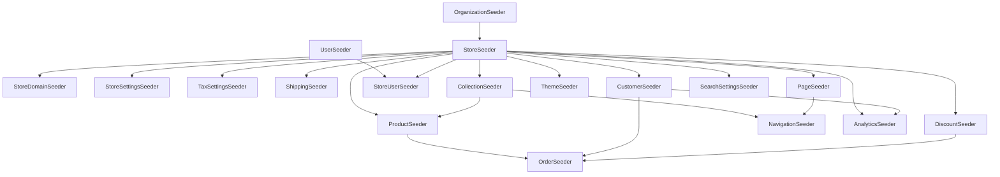

# 07 - Seeders and Test Data Specification

> Complete seeder and factory specification for populating the platform with realistic demo data. Laravel 12, SQLite. All monetary amounts in cents (INTEGER). All seed data supports Playwright E2E tests.

---

## 1. DatabaseSeeder Orchestration

The main `DatabaseSeeder` calls child seeders in a strict order that respects foreign key dependencies. Each seeder targets a specific entity type. The ordering ensures parent records exist before children are created.

**Execution order:**

| Step | Seeder Class | Depends On | Purpose |
|------|-------------|------------|---------|
| 1 | OrganizationSeeder | (none) | Creates billing organizations |
| 2 | StoreSeeder | Organizations | Creates stores under organizations |
| 3 | StoreDomainSeeder | Stores | Attaches hostnames to stores |
| 4 | UserSeeder | (none) | Creates admin/staff user accounts |
| 5 | StoreUserSeeder | Stores, Users | Links users to stores with roles (pivot) |
| 6 | StoreSettingsSeeder | Stores | Inserts per-store JSON settings |
| 7 | TaxSettingsSeeder | Stores | Configures tax mode and rates |
| 8 | ShippingSeeder | Stores | Creates shipping zones and rates |
| 9 | CollectionSeeder | Stores | Creates product collections |
| 10 | ProductSeeder | Stores, Collections | Creates products, options, variants, inventory, collection assignments |
| 11 | DiscountSeeder | Stores | Creates discount codes |
| 12 | CustomerSeeder | Stores | Creates customer accounts with addresses |
| 13 | OrderSeeder | Stores, Customers, Products, Variants, Discounts | Creates orders with lines, payments, fulfillments, refunds |
| 14 | ThemeSeeder | Stores | Creates themes with settings |
| 15 | PageSeeder | Stores | Creates content pages |
| 16 | NavigationSeeder | Stores, Collections, Pages | Creates menus linking to collections and pages |
| 17 | AnalyticsSeeder | Stores, Customers | Creates daily aggregates and event stream |
| 18 | SearchSettingsSeeder | Stores | Configures search synonyms and stop words |

**Dependency diagram (Mermaid):**



**Running seeders:**
- All seeders: `php artisan db:seed`
- Single seeder: `php artisan db:seed --class=ProductSeeder`
- Fresh database with seed data: `php artisan migrate:fresh --seed`

---

## 2. Factory Definitions

Each factory below lists the model, default field generation rules, named states (overrides), and relationship hooks. The coding agent should create corresponding Laravel factory classes.

---

### 2.1 OrganizationFactory

**Model:** Organization

**Default definition:**

| Field | Generation Rule |
|-------|----------------|
| name | Faker company name |
| billing_email | Faker company email |

**States:** None.

---

### 2.2 StoreFactory

**Model:** Store

**Default definition:**

| Field | Generation Rule |
|-------|----------------|
| organization_id | Creates a new Organization via its factory |
| name | Faker company name + " Store" suffix |
| handle | Faker unique slug (2 words) |
| status | "active" |
| default_currency | "EUR" |
| default_locale | "en" |
| timezone | "Europe/Berlin" |

**States:**

| State Name | Overrides |
|-----------|-----------|
| `suspended` | status = "suspended" |

---

### 2.3 StoreDomainFactory

**Model:** StoreDomain

**Default definition:**

| Field | Generation Rule |
|-------|----------------|
| store_id | Creates a new Store via its factory |
| hostname | Faker unique domain name |
| type | "storefront" |
| is_primary | 1 |
| tls_mode | "managed" |

**States:**

| State Name | Overrides |
|-----------|-----------|
| `admin` | type = "admin" |
| `api` | type = "api" |
| `secondary` | is_primary = 0 |

---

### 2.4 UserFactory

**Model:** User

**Default definition:**

| Field | Generation Rule |
|-------|----------------|
| email | Faker unique safe email |
| password_hash | bcrypt of "password" |
| name | Faker full name |
| status | "active" |
| last_login_at | Random date within the last 30 days |

**States:**

| State Name | Overrides |
|-----------|-----------|
| `disabled` | status = "disabled" |

---

### 2.5 ProductFactory

**Model:** Product

**Default definition:**

| Field | Generation Rule |
|-------|----------------|
| store_id | Creates a new Store via its factory |
| title | Faker 3 random words joined |
| handle | URL-slug of the title |
| status | "active" |
| description_html | Faker 2 paragraphs wrapped in `<p>` tags |
| vendor | Faker company name |
| product_type | Random from: Shirts, Pants, Shoes, Accessories, Electronics, Books |
| tags | JSON array of 1-3 random picks from: new, sale, trending, popular, limited |
| published_at | Current timestamp |

**States:**

| State Name | Overrides |
|-----------|-----------|
| `draft` | status = "draft", published_at = null |
| `archived` | status = "archived" |

**Relationship hooks:**

| Hook Name | Behavior |
|-----------|----------|
| `withVariants(count)` | After creating the product, create `count` ProductVariant records associated with the product |
| `withDefaultVariant(price)` | After creating the product, create one ProductVariant marked as default at the given price in EUR |

---

### 2.6 ProductVariantFactory

**Model:** ProductVariant

**Default definition:**

| Field | Generation Rule |
|-------|----------------|
| product_id | Creates a new Product via its factory |
| sku | Faker unique, pattern: "SKU-####-???" (digits and letters) |
| barcode | Faker EAN-13 |
| price_amount | Random integer 999-19999 (9.99 to 199.99 EUR) |
| compare_at_amount | null |
| currency | "EUR" |
| weight_g | Random integer 100-5000 |
| requires_shipping | 1 |
| is_default | 0 |
| position | 0 |
| status | "active" |

**States:**

| State Name | Overrides |
|-----------|-----------|
| `onSale` | compare_at_amount = random 20000-39999, price_amount = random 9999-19999 |
| `digital` | requires_shipping = 0, weight_g = 0 |
| `default` | is_default = 1 |
| `archived` | status = "archived" |

---

### 2.7 InventoryItemFactory

**Model:** InventoryItem

**Default definition:**

| Field | Generation Rule |
|-------|----------------|
| store_id | Creates a new Store via its factory |
| variant_id | Creates a new ProductVariant via its factory |
| quantity_on_hand | Random integer 0-100 |
| quantity_reserved | 0 |
| policy | "deny" |

**States:**

| State Name | Overrides |
|-----------|-----------|
| `outOfStock` | quantity_on_hand = 0 |
| `continuePolicy` | policy = "continue" |
| `lowStock` | quantity_on_hand = random 1-3 |

---

### 2.8 CollectionFactory

**Model:** Collection

**Default definition:**

| Field | Generation Rule |
|-------|----------------|
| store_id | Creates a new Store via its factory |
| title | Faker 2 random words joined |
| handle | URL-slug of the title |
| description_html | Faker sentence wrapped in `<p>` tags |
| type | "manual" |
| status | "active" |

**States:**

| State Name | Overrides |
|-----------|-----------|
| `draft` | status = "draft" |
| `archived` | status = "archived" |
| `automated` | type = "automated" |

---

### 2.9 CartFactory

**Model:** Cart

**Default definition:**

| Field | Generation Rule |
|-------|----------------|
| store_id | Creates a new Store via its factory |
| customer_id | null |
| currency | "EUR" |
| cart_version | 1 |
| status | "active" |

**States:**

| State Name | Overrides |
|-----------|-----------|
| `forCustomer` | customer_id = creates a new Customer via its factory |
| `converted` | status = "converted" |
| `abandoned` | status = "abandoned" |

---

### 2.10 CartLineFactory

**Model:** CartLine

**Default definition:**

| Field | Generation Rule |
|-------|----------------|
| cart_id | Creates a new Cart via its factory |
| variant_id | Creates a new ProductVariant via its factory |
| quantity | Random 1-5 |
| unit_price_amount | Random 999-19999 |
| line_subtotal_amount | Computed: unit_price_amount * quantity |
| line_discount_amount | 0 |
| line_total_amount | Computed: line_subtotal_amount - line_discount_amount |

**States:** None.

---

### 2.11 CheckoutFactory

**Model:** Checkout

**Default definition:**

| Field | Generation Rule |
|-------|----------------|
| store_id | Creates a new Store via its factory |
| cart_id | Creates a new Cart via its factory |
| customer_id | null |
| status | "started" |
| email | Faker safe email |
| shipping_address_json | JSON object with Faker first_name, last_name, address1, city, country_code "DE", zip |
| billing_address_json | null |
| shipping_method_id | null |
| payment_method | null |
| discount_code | null |
| tax_provider_snapshot_json | null |
| totals_json | null |
| expires_at | 24 hours from now |

**States:**

| State Name | Overrides |
|-----------|-----------|
| `completed` | status = "completed" |
| `expired` | status = "expired", expires_at = 1 hour ago |
| `withCreditCard` | payment_method = "credit_card" |
| `withPaypal` | payment_method = "paypal" |
| `withBankTransfer` | payment_method = "bank_transfer" |

---

### 2.12 OrderFactory

**Model:** Order

**Default definition:**

| Field | Generation Rule |
|-------|----------------|
| store_id | Creates a new Store via its factory |
| customer_id | Creates a new Customer via its factory |
| order_number | Faker unique integer 1001-9999 as a string (e.g., "1001"). The prefix is NOT stored in this field - it is stored separately in `store_settings.settings_json` key `order_number_prefix` and prepended only at display time. |
| payment_method | "credit_card" |
| status | "paid" |
| financial_status | "paid" |
| fulfillment_status | "unfulfilled" |
| currency | "EUR" |
| subtotal_amount | 4998 |
| discount_amount | 0 |
| shipping_amount | 499 |
| tax_amount | 798 |
| total_amount | 5497 |
| email | Faker safe email |
| billing_address_json | JSON address object with German Faker data |
| shipping_address_json | JSON address object with German Faker data |
| placed_at | Current timestamp |

**States:**

| State Name | Overrides |
|-----------|-----------|
| `pending` | status = "pending", financial_status = "pending" |
| `pendingBankTransfer` | status = "pending", financial_status = "pending", payment_method = "bank_transfer" |
| `fulfilled` | status = "fulfilled", fulfillment_status = "fulfilled" |
| `cancelled` | status = "cancelled", financial_status = "refunded" |
| `refunded` | status = "refunded", financial_status = "refunded" |
| `partiallyFulfilled` | fulfillment_status = "partial" |
| `creditCard` | payment_method = "credit_card" |
| `paypal` | payment_method = "paypal" |
| `bankTransfer` | payment_method = "bank_transfer" |

---

### 2.13 OrderLineFactory

**Model:** OrderLine

**Default definition:**

| Field | Generation Rule |
|-------|----------------|
| order_id | Creates a new Order via its factory |
| product_id | Creates a new Product via its factory |
| variant_id | Creates a new ProductVariant via its factory |
| title_snapshot | Faker 3 words |
| sku_snapshot | Faker pattern "SKU-####-???" |
| quantity | Random 1-3 |
| unit_price_amount | Random 999-19999 |
| total_amount | Computed: unit_price_amount * quantity |
| tax_lines_json | Empty JSON array |
| discount_allocations_json | Empty JSON array |

**States:** None.

---

### 2.14 PaymentFactory

**Model:** Payment

**Default definition:**

| Field | Generation Rule |
|-------|----------------|
| order_id | Creates a new Order via its factory |
| provider | "mock" |
| method | "credit_card" |
| provider_payment_id | "mock_" + Faker 20 random alphanumeric characters |
| status | "captured" |
| amount | Random 999-99999 |
| currency | "EUR" |
| raw_json_encrypted | null |

**States:**

| State Name | Overrides |
|-----------|-----------|
| `pending` | status = "pending" |
| `failed` | status = "failed" |
| `refunded` | status = "refunded" |
| `creditCard` | method = "credit_card" |
| `paypal` | method = "paypal" |
| `bankTransfer` | method = "bank_transfer" |

---

### 2.15 RefundFactory

**Model:** Refund

**Default definition:**

| Field | Generation Rule |
|-------|----------------|
| order_id | Creates a new Order via its factory |
| payment_id | Creates a new Payment via its factory |
| amount | Random 999-19999 |
| reason | Faker sentence |
| status | "processed" |
| provider_refund_id | "mock_re_" + Faker 20 random alphanumeric characters |

**States:**

| State Name | Overrides |
|-----------|-----------|
| `pending` | status = "pending", provider_refund_id = null |
| `failed` | status = "failed" |

---

### 2.16 FulfillmentFactory

**Model:** Fulfillment

**Default definition:**

| Field | Generation Rule |
|-------|----------------|
| order_id | Creates a new Order via its factory |
| status | "shipped" |
| tracking_company | Random from: DHL, UPS, FedEx, DPD |
| tracking_number | Faker pattern "??########" (2 letters + 8 digits) |
| tracking_url | "https://tracking.example.com/" + tracking_number |
| shipped_at | Current timestamp |

**States:**

| State Name | Overrides |
|-----------|-----------|
| `pending` | status = "pending", tracking_number = null, tracking_url = null, shipped_at = null |
| `delivered` | status = "delivered" |

---

### 2.16b FulfillmentLineFactory

**Model:** FulfillmentLine

**Default definition:**

| Field | Rule | Notes |
|-------|------|-------|
| fulfillment_id | FK | Parent fulfillment |
| order_line_id | FK | The order line being fulfilled |
| quantity | integer, 1..max | Quantity fulfilled for this line (must not exceed order line quantity) |

**States:** None.

---

### 2.17 CustomerFactory

**Model:** Customer

**Default definition:**

| Field | Generation Rule |
|-------|----------------|
| store_id | Creates a new Store via its factory |
| email | Faker unique safe email |
| password_hash | bcrypt of "password" |
| name | Faker full name |
| marketing_opt_in | 30% chance of 1, otherwise 0 |

**States:**

| State Name | Overrides |
|-----------|-----------|
| `guest` | password_hash = null |
| `optedInMarketing` | marketing_opt_in = 1 |

---

### 2.18 CustomerAddressFactory

**Model:** CustomerAddress

**Default definition:**

| Field | Generation Rule |
|-------|----------------|
| customer_id | Creates a new Customer via its factory |
| label | Random from: Home, Work, Other |
| address_json | JSON object (see Address JSON Structure in Section 6) |
| is_default | 0 |

**States:**

| State Name | Overrides |
|-----------|-----------|
| `default` | is_default = 1 |

---

### 2.19 DiscountFactory

**Model:** Discount

**Default definition:**

| Field | Generation Rule |
|-------|----------------|
| store_id | Creates a new Store via its factory |
| type | "code" |
| code | Faker unique uppercase pattern "????##" |
| value_type | "percent" |
| value_amount | 10 |
| starts_at | 1 month ago |
| ends_at | 1 year from now |
| usage_limit | null |
| usage_count | 0 |
| rules_json | Empty JSON object |
| status | "active" |

**Note on value_amount for percent type:** Stored as whole number percentages. 10 = 10%, 20 = 20%.

**States:**

| State Name | Overrides |
|-----------|-----------|
| `fixed(amountCents)` | value_type = "fixed", value_amount = amountCents |
| `freeShipping` | value_type = "free_shipping", value_amount = 0 |
| `expired` | starts_at = 1 year ago, ends_at = yesterday, status = "expired" |
| `maxedOut` | usage_limit = 5, usage_count = 5 |
| `automatic` | type = "automatic", code = null |
| `draft` | status = "draft" |
| `disabled` | status = "disabled", starts_at = past date |

---

### 2.20 ShippingZoneFactory

**Model:** ShippingZone

**Default definition:**

| Field | Generation Rule |
|-------|----------------|
| store_id | Creates a new Store via its factory |
| name | Faker country name |
| countries_json | JSON array: ["DE"] |
| regions_json | Empty JSON array |

**States:** None.

---

### 2.21 ShippingRateFactory

**Model:** ShippingRate

**Default definition:**

| Field | Generation Rule |
|-------|----------------|
| zone_id | Creates a new ShippingZone via its factory |
| name | Random from: Standard, Express, Economy |
| type | "flat" |
| config_json | JSON object with amount = 499 |
| is_active | 1 |

**States:**

| State Name | Overrides |
|-----------|-----------|
| `inactive` | is_active = 0 |
| `weightBased` | type = "weight", config_json has ranges array with tiers: 0-500g = 399, 501-2000g = 699, 2001g+ = 1299 |

---

### 2.22 ThemeFactory

**Model:** Theme

**Default definition:**

| Field | Generation Rule |
|-------|----------------|
| store_id | Creates a new Store via its factory |
| name | "Default Theme" |
| version | "1.0.0" |
| status | "published" |
| published_at | Current timestamp |

**States:**

| State Name | Overrides |
|-----------|-----------|
| `draft` | status = "draft", published_at = null |

---

### 2.23 PageFactory

**Model:** Page

**Default definition:**

| Field | Generation Rule |
|-------|----------------|
| store_id | Creates a new Store via its factory |
| title | Faker 3 random words |
| handle | URL-slug of the title |
| body_html | Faker heading + 3 paragraphs in HTML tags |
| status | "published" |
| published_at | Current timestamp |

**States:**

| State Name | Overrides |
|-----------|-----------|
| `draft` | status = "draft", published_at = null |
| `archived` | status = "archived" |

---

### 2.24 NavigationMenuFactory

**Model:** NavigationMenu

**Default definition:**

| Field | Generation Rule |
|-------|----------------|
| store_id | Creates a new Store via its factory |
| handle | Faker unique slug (2 words) |
| title | Faker 2 words |

**States:** None.

---

### 2.25 NavigationItemFactory

**Model:** NavigationItem

**Default definition:**

| Field | Generation Rule |
|-------|----------------|
| menu_id | Creates a new NavigationMenu via its factory |
| type | "link" |
| label | Faker 2 words |
| url | "/" |
| resource_id | null |
| position | 0 |

**States:**

| State Name | Overrides |
|-----------|-----------|
| `page(pageId)` | type = "page", url = null, resource_id = pageId |
| `collection(collectionId)` | type = "collection", url = null, resource_id = collectionId |
| `product(productId)` | type = "product", url = null, resource_id = productId |

---

### 2.26 AnalyticsEventFactory

**Model:** AnalyticsEvent

**Default definition:**

| Field | Generation Rule |
|-------|----------------|
| store_id | Creates a new Store via its factory |
| type | Random from: page_view, product_view, add_to_cart, remove_from_cart, checkout_started, checkout_completed, search |
| session_id | Faker UUID |
| customer_id | null |
| properties_json | JSON with url (Faker slug) and referrer (40% chance Faker URL, otherwise null) |
| created_at | Random timestamp within last 7 days |

**States:**

| State Name | Overrides |
|-----------|-----------|
| `pageView` | type = "page_view" |
| `productView` | type = "product_view", properties_json includes product_id and product_title |
| `addToCart` | type = "add_to_cart", properties_json includes variant_id and quantity |

---

## 3. Demo Seed Scenario (Exact Data)

All seeders below create deterministic, named records required by E2E tests. References like "Product 1" in order lines refer to products by their seed position.

---

### 3.1 OrganizationSeeder

Creates one organization.

| Field | Value |
|-------|-------|
| name | Acme Corp |
| billing_email | billing@acme.test |

---

### 3.2 StoreSeeder

Creates two stores under "Acme Corp".

**Store 1: Acme Fashion**

| Field | Value |
|-------|-------|
| name | Acme Fashion |
| handle | acme-fashion |
| status | active |
| default_currency | EUR |
| default_locale | en |
| timezone | Europe/Berlin |

**Store 2: Acme Electronics**

| Field | Value |
|-------|-------|
| name | Acme Electronics |
| handle | acme-electronics |
| status | active |
| default_currency | EUR |
| default_locale | en |
| timezone | Europe/Berlin |

---

### 3.3 StoreDomainSeeder

**CRITICAL: Local Development Domain**

The seeder MUST register the Laravel Herd project domain (`shop.test`) as a storefront domain for Acme Fashion. This is the hostname used during local development. Without it, the `store.resolve:storefront` middleware will return 404 for all storefront routes.

The seeder should dynamically detect the Herd project domain using `config('app.url')` parsed to extract the hostname, or hardcode `shop.test` as the Herd project domain. This domain must be registered IN ADDITION to the custom store domains below.

**Acme Fashion domains:**

| Hostname | Type | is_primary | tls_mode |
|----------|------|-----------|----------|
| shop.test | storefront | 1 | managed |
| acme-fashion.test | storefront | 0 | managed |
| admin.acme-fashion.test | admin | 0 | managed |

**Note:** `shop.test` is the primary storefront domain because it matches the Laravel Herd project directory name. The `acme-fashion.test` domain exists as a secondary storefront domain for multi-domain testing.

**Note:** The admin domain (`admin.acme-fashion.test`) routes HTTP requests to the admin panel. However, the actual store context within the admin panel is determined by the session key `current_store_id`, set after login or via the store-switcher. The admin domain itself does not determine store scope.

**Acme Electronics domains:**

| Hostname | Type | is_primary | tls_mode |
|----------|------|-----------|----------|
| acme-electronics.test | storefront | 1 | managed |

---

### 3.4 UserSeeder

**CRITICAL:** All admin users MUST have `email_verified_at` set to `now()`. The admin routes use the `verified` middleware, which will redirect users without a verified email to a verification notice page. Without `email_verified_at`, admin users cannot access any admin pages.

| Email | Name | Password (plaintext, stored as bcrypt hash) | Status | email_verified_at | last_login_at |
|-------|------|----------------------------------------------|--------|-------------------|---------------|
| admin@acme.test | Admin User | password | active | now | now |
| staff@acme.test | Staff User | password | active | now | 2 days ago |
| support@acme.test | Support User | password | active | now | 1 day ago |
| manager@acme.test | Store Manager | password | active | now | 1 day ago |
| admin2@acme.test | Admin Two | password | active | now | 1 day ago |

---

### 3.5 StoreUserSeeder

| User Email | Store | Role |
|------------|-------|------|
| admin@acme.test | Acme Fashion | owner |
| staff@acme.test | Acme Fashion | staff |
| support@acme.test | Acme Fashion | support |
| manager@acme.test | Acme Fashion | admin |
| admin2@acme.test | Acme Electronics | owner |

**IMPORTANT - Admin Store Session:** The admin panel's `store.resolve:admin` middleware reads `current_store_id` from the session to determine which store the admin is managing. This value is set during the admin login flow. The `Admin\Auth\Login` Livewire component MUST set `session(['current_store_id' => $store->id])` after a successful login, using the first store the user has access to (via `store_users`). Without this, the admin dashboard will abort with 403 "No store selected."

---

### 3.6 StoreSettingsSeeder

**Acme Fashion - settings_json contents:**

| Setting Key | Value |
|-------------|-------|
| store_name | Acme Fashion |
| contact_email | hello@acme-fashion.test |
| order_number_prefix | # |
| order_number_start | 1001 |

**Acme Electronics - settings_json contents:**

| Setting Key | Value |
|-------------|-------|
| store_name | Acme Electronics |
| contact_email | hello@acme-electronics.test |
| order_number_prefix | # |
| order_number_start | 5001 |

---

### 3.7 TaxSettingsSeeder

**Acme Fashion:**

| Field | Value |
|-------|-------|
| mode | manual |
| provider | none |
| prices_include_tax | 1 (prices shown to customers are gross/tax-inclusive) |
| config_json | default_rate_bps: 1900 |

Tax rate: 19% (1900 basis points) applied to all zones.

**Acme Electronics:** Same as Acme Fashion.

---

### 3.8 ShippingSeeder

**Acme Fashion - Shipping Zones and Rates:**

**Zone 1: "Domestic"**
- countries_json: ["DE"]
- regions_json: []

| Rate Name | Type | config_json (amount in cents) | is_active |
|-----------|------|-------------------------------|-----------|
| Standard Shipping | flat | amount: 499 (4.99 EUR) | 1 |
| Express Shipping | flat | amount: 999 (9.99 EUR) | 1 |

**Zone 2: "EU"**
- countries_json: ["AT", "FR", "IT", "ES", "NL", "BE", "PL"]
- regions_json: []

| Rate Name | Type | config_json (amount in cents) | is_active |
|-----------|------|-------------------------------|-----------|
| EU Standard | flat | amount: 899 (8.99 EUR) | 1 |

**Zone 3: "Rest of World"**
- countries_json: ["US", "GB", "CA", "AU"]
- regions_json: []

| Rate Name | Type | config_json (amount in cents) | is_active |
|-----------|------|-------------------------------|-----------|
| International | flat | amount: 1499 (14.99 EUR) | 1 |

**Acme Electronics - One zone:**

**Zone: "Germany"**
- countries_json: ["DE"]

| Rate Name | Type | config_json | is_active |
|-----------|------|-------------|-----------|
| Standard | flat | amount: 0 (free) | 1 |

---

### 3.9 CollectionSeeder

**Acme Fashion - 4 collections:**

| # | Title | Handle | Type | Status | description_html |
|---|-------|--------|------|--------|------------------|
| 1 | New Arrivals | new-arrivals | manual | active | "Discover the latest additions to our store." in `<p>` tag |
| 2 | T-Shirts | t-shirts | manual | active | "Premium cotton tees for every occasion." in `<p>` tag |
| 3 | Pants & Jeans | pants-jeans | manual | active | "Find the perfect fit from our denim and trouser range." in `<p>` tag |
| 4 | Sale | sale | manual | active | "Great deals on selected items." in `<p>` tag |

**Acme Electronics - 2 collections:**

| # | Title | Handle | Type | Status |
|---|-------|--------|------|--------|
| 1 | Featured | featured | manual | active |
| 2 | Accessories | accessories | manual | active |

---

### 3.10 ProductSeeder

#### Acme Fashion - 20 Products

For each product the seeder creates the full entity graph: product record, product_options, product_option_values, product_variants (with variant_option_values pivot entries), and inventory_items.

---

**Product 1: "Classic Cotton T-Shirt"**

| Field | Value |
|-------|-------|
| handle | classic-cotton-t-shirt |
| status | active |
| vendor | Acme Basics |
| product_type | T-Shirts |
| tags | ["new", "popular"] |
| description_html | "A timeless classic cotton t-shirt. Comfortable, breathable, and perfect for everyday wear." in `<p>` tag |
| published_at | now |

Collections: New Arrivals, T-Shirts

Options and values:

| Option Name | Values (in position order) |
|-------------|---------------------------|
| Size | S, M, L, XL |
| Color | White, Black, Navy |

Variants (12 total - all size x color combinations):
- SKU pattern: ACME-CTSH-{SIZE}-{COLOR} (e.g. ACME-CTSH-S-WHT, ACME-CTSH-S-BLK, etc.)
- First variant (S/White) is marked is_default = 1
- Position increments 0 through 11

| Per-variant field | Value |
|-------------------|-------|
| price_amount | 2499 (24.99 EUR) |
| compare_at_amount | null |
| currency | EUR |
| weight_g | 200 |
| requires_shipping | 1 |

Inventory per variant: quantity_on_hand = 15, policy = "deny"

---

**Product 2: "Premium Slim Fit Jeans"**

| Field | Value |
|-------|-------|
| handle | premium-slim-fit-jeans |
| status | active |
| vendor | Acme Denim |
| product_type | Pants |
| tags | ["new", "sale"] |
| description_html | "Slim fit jeans crafted from premium stretch denim. Comfortable all-day wear with a modern silhouette." in `<p>` tag |
| published_at | now |

Collections: New Arrivals, Pants & Jeans, Sale

Options and values:

| Option Name | Values |
|-------------|--------|
| Size | 28, 30, 32, 34, 36 |
| Color | Blue, Black |

Variants (10 total): First variant (28/Blue) is default.

| Per-variant field | Value |
|-------------------|-------|
| price_amount | 7999 (79.99 EUR) |
| compare_at_amount | 9999 (99.99 EUR - on sale) |
| weight_g | 800 |
| requires_shipping | 1 |

Inventory per variant: quantity_on_hand = 8, policy = "deny"

---

**Product 3: "Organic Hoodie"**

| Field | Value |
|-------|-------|
| handle | organic-hoodie |
| status | active |
| vendor | Acme Basics |
| product_type | Hoodies |
| tags | ["new", "trending"] |
| description_html | "Made from 100% organic cotton. Warm, soft, and sustainably produced." |
| published_at | now |

Collections: New Arrivals

Options: Size (S, M, L, XL)

Variants (4 total): price_amount = 5999, weight_g = 500, inventory = 20 each (deny)

---

**Product 4: "Leather Belt"**

| Field | Value |
|-------|-------|
| handle | leather-belt |
| status | active |
| vendor | Acme Accessories |
| product_type | Accessories |
| tags | ["popular"] |
| description_html | "Genuine leather belt with brushed metal buckle. A wardrobe essential." |
| published_at | now |

Collections: (none)

Options: Size (S/M, L/XL), Color (Brown, Black)

Variants (4 total): price_amount = 3499, weight_g = 150, inventory = 25 each (deny)

---

**Product 5: "Running Sneakers"**

| Field | Value |
|-------|-------|
| handle | running-sneakers |
| status | active |
| vendor | Acme Sport |
| product_type | Shoes |
| tags | ["trending"] |
| description_html | "Lightweight running sneakers with responsive cushioning and breathable mesh upper." |
| published_at | now |

Collections: New Arrivals

Options: Size (EU 38, EU 39, EU 40, EU 41, EU 42, EU 43, EU 44), Color (White, Black)

Variants (14 total): price_amount = 11999, weight_g = 600, inventory = 5 each (deny) - LOW STOCK

---

**Product 6: "Graphic Print Tee"**

| Field | Value |
|-------|-------|
| handle | graphic-print-tee |
| status | active |
| vendor | Acme Basics |
| product_type | T-Shirts |
| tags | ["new"] |
| description_html | "Bold graphic print on soft cotton. Express yourself with this statement piece." |
| published_at | now |

Collections: T-Shirts

Options: Size (S, M, L, XL)

Variants (4 total): price_amount = 2999, weight_g = 210, inventory = 18 each (deny)

---

**Product 7: "V-Neck Linen Tee"**

| Field | Value |
|-------|-------|
| handle | v-neck-linen-tee |
| status | active |
| vendor | Acme Basics |
| product_type | T-Shirts |
| tags | ["popular"] |
| description_html | "Lightweight linen blend v-neck. Perfect for warm summer days." |
| published_at | now |

Collections: T-Shirts

Options: Size (S, M, L), Color (Beige, Olive, Sky Blue)

Variants (9 total): price_amount = 3499, weight_g = 180, inventory = 12 each (deny)

---

**Product 8: "Striped Polo Shirt"**

| Field | Value |
|-------|-------|
| handle | striped-polo-shirt |
| status | active |
| vendor | Acme Basics |
| product_type | T-Shirts |
| tags | ["sale"] |
| description_html | "Classic striped polo with a modern relaxed fit. Knitted collar and two-button placket." |
| published_at | now |

Collections: T-Shirts, Sale

Options: Size (S, M, L, XL)

Variants (4 total): price_amount = 2799, compare_at_amount = 3999 (on sale), weight_g = 250, inventory = 10 each (deny)

---

**Product 9: "Cargo Pants"**

| Field | Value |
|-------|-------|
| handle | cargo-pants |
| status | active |
| vendor | Acme Workwear |
| product_type | Pants |
| tags | ["popular"] |
| description_html | "Utility cargo pants with multiple pockets. Durable cotton twill construction." |
| published_at | now |

Collections: Pants & Jeans

Options: Size (30, 32, 34, 36), Color (Khaki, Olive, Black)

Variants (12 total): price_amount = 5499, weight_g = 700, inventory = 14 each (deny)

---

**Product 10: "Chino Shorts"**

| Field | Value |
|-------|-------|
| handle | chino-shorts |
| status | active |
| vendor | Acme Basics |
| product_type | Pants |
| tags | ["new", "trending"] |
| description_html | "Tailored chino shorts. Comfortable stretch fabric with a clean silhouette." |
| published_at | now |

Collections: Pants & Jeans, New Arrivals

Options: Size (30, 32, 34, 36), Color (Navy, Sand)

Variants (8 total): price_amount = 3999, weight_g = 350, inventory = 16 each (deny)

---

**Product 11: "Wide Leg Trousers"**

| Field | Value |
|-------|-------|
| handle | wide-leg-trousers |
| status | active |
| vendor | Acme Denim |
| product_type | Pants |
| tags | ["sale"] |
| description_html | "Relaxed wide leg trousers with a high waist. Flowing drape in premium woven fabric." |
| published_at | now |

Collections: Pants & Jeans, Sale

Options: Size (S, M, L)

Variants (3 total): price_amount = 4999, compare_at_amount = 6999 (on sale), weight_g = 550, inventory = 7 each (deny)

---

**Product 12: "Wool Scarf"**

| Field | Value |
|-------|-------|
| handle | wool-scarf |
| status | active |
| vendor | Acme Accessories |
| product_type | Accessories |
| tags | ["popular"] |
| description_html | "Warm merino wool scarf. Soft hand feel, naturally breathable and temperature regulating." |
| published_at | now |

Collections: (none)

Options: Color (Grey, Burgundy, Navy)

Variants (3 total): price_amount = 2999, weight_g = 120, inventory = 30 each (deny)

---

**Product 13: "Canvas Tote Bag"**

| Field | Value |
|-------|-------|
| handle | canvas-tote-bag |
| status | active |
| vendor | Acme Accessories |
| product_type | Accessories |
| tags | ["trending"] |
| description_html | "Heavy-duty canvas tote bag with reinforced handles. Spacious enough for daily essentials." |
| published_at | now |

Collections: (none)

Options: Color (Natural, Black)

Variants (2 total): price_amount = 1999, weight_g = 300, inventory = 40 each (deny)

---

**Product 14: "Bucket Hat"**

| Field | Value |
|-------|-------|
| handle | bucket-hat |
| status | active |
| vendor | Acme Accessories |
| product_type | Accessories |
| tags | ["new", "trending"] |
| description_html | "Lightweight bucket hat for sun protection. Packable design, washed cotton twill." |
| published_at | now |

Collections: New Arrivals

Options: Size (S/M, L/XL), Color (Beige, Black, Olive)

Variants (6 total): price_amount = 2499, weight_g = 80, inventory = 22 each (deny)

---

**Product 15: "Unreleased Winter Jacket" -- DRAFT**

| Field | Value |
|-------|-------|
| handle | unreleased-winter-jacket |
| status | **draft** |
| vendor | Acme Outerwear |
| product_type | Jackets |
| tags | ["limited"] |
| description_html | "Upcoming winter collection piece. Insulated puffer jacket with water-resistant shell." |
| published_at | **null** |

Collections: (none - draft not assigned)

Options: Size (S, M, L, XL)

Variants (4 total): price_amount = 14999, weight_g = 900, inventory = **0 each** (deny)

**Test purpose:** Verifies draft products do not appear on the storefront.

---

**Product 16: "Discontinued Raincoat" -- ARCHIVED**

| Field | Value |
|-------|-------|
| handle | discontinued-raincoat |
| status | **archived** |
| vendor | Acme Outerwear |
| product_type | Jackets |
| tags | [] |
| description_html | "Lightweight waterproof raincoat. This product has been discontinued." |
| published_at | 6 months ago |

Collections: (none)

Options: Size (M, L)

Variants (2 total): price_amount = 8999, weight_g = 400, inventory = 3 each (deny)

**Test purpose:** Verifies archived products do not appear on the storefront.

---

**Product 17: "Limited Edition Sneakers" -- SOLD OUT (deny policy)**

| Field | Value |
|-------|-------|
| handle | limited-edition-sneakers |
| status | active |
| vendor | Acme Sport |
| product_type | Shoes |
| tags | ["limited"] |
| description_html | "Limited edition collaboration sneakers. Once they are gone, they are gone." |
| published_at | now |

Collections: (none)

Options: Size (EU 40, EU 42, EU 44)

Variants (3 total): price_amount = 15999, weight_g = 650, inventory = **0 each, policy = "deny"**

**Test purpose:** Tests "sold out" display and add-to-cart prevention.

---

**Product 18: "Backorder Denim Jacket" -- OUT OF STOCK (continue policy)**

| Field | Value |
|-------|-------|
| handle | backorder-denim-jacket |
| status | active |
| vendor | Acme Denim |
| product_type | Jackets |
| tags | ["popular"] |
| description_html | "Classic denim jacket. Currently on backorder - ships within 2-3 weeks." |
| published_at | now |

Collections: (none)

Options: Size (S, M, L, XL)

Variants (4 total): price_amount = 9999, weight_g = 750, inventory = **0 each, policy = "continue"**

**Test purpose:** Tests that items with "continue" inventory policy can be added to cart despite zero stock.

---

**Product 19: "Gift Card" -- DIGITAL (no shipping)**

| Field | Value |
|-------|-------|
| handle | gift-card |
| status | active |
| vendor | Acme Fashion |
| product_type | Gift Cards |
| tags | ["popular"] |
| description_html | "Digital gift card delivered via email. The perfect gift when you are not sure what to choose." |
| published_at | now |

Collections: (none)

Options: Amount (25 EUR, 50 EUR, 100 EUR)

Variants (3 total - each a different denomination):

| SKU | Price (cents) | Weight | requires_shipping | Inventory |
|-----|---------------|--------|-------------------|-----------|
| ACME-GIFT-25 | 2500 | 0g | **0 (digital)** | 9999 (deny) |
| ACME-GIFT-50 | 5000 | 0g | **0 (digital)** | 9999 (deny) |
| ACME-GIFT-100 | 10000 | 0g | **0 (digital)** | 9999 (deny) |

**Test purpose:** Tests digital product flow (no shipping step in checkout).

---

**Product 20: "Cashmere Overcoat" -- EXPENSIVE**

| Field | Value |
|-------|-------|
| handle | cashmere-overcoat |
| status | active |
| vendor | Acme Premium |
| product_type | Jackets |
| tags | ["limited", "new"] |
| description_html | "Luxurious cashmere-blend overcoat. Impeccable tailoring with silk lining." |
| published_at | now |

Collections: New Arrivals

Options: Size (S, M, L), Color (Camel, Charcoal)

Variants (6 total): price_amount = 49999 (499.99 EUR), weight_g = 1200, inventory = 3 each (deny)

**Test purpose:** Tests high-value price display (499.99 EUR).

---

#### Product Summary Table (Acme Fashion)

| # | Title | Handle | Status | Price (cents) | Compare At | Variants | Inventory | Special |
|---|-------|--------|--------|---------------|-----------|----------|-----------|---------|
| 1 | Classic Cotton T-Shirt | classic-cotton-t-shirt | active | 2499 | - | 12 | 15 ea | - |
| 2 | Premium Slim Fit Jeans | premium-slim-fit-jeans | active | 7999 | 9999 | 10 | 8 ea | On sale |
| 3 | Organic Hoodie | organic-hoodie | active | 5999 | - | 4 | 20 ea | - |
| 4 | Leather Belt | leather-belt | active | 3499 | - | 4 | 25 ea | - |
| 5 | Running Sneakers | running-sneakers | active | 11999 | - | 14 | 5 ea | Low stock |
| 6 | Graphic Print Tee | graphic-print-tee | active | 2999 | - | 4 | 18 ea | - |
| 7 | V-Neck Linen Tee | v-neck-linen-tee | active | 3499 | - | 9 | 12 ea | - |
| 8 | Striped Polo Shirt | striped-polo-shirt | active | 2799 | 3999 | 4 | 10 ea | On sale |
| 9 | Cargo Pants | cargo-pants | active | 5499 | - | 12 | 14 ea | - |
| 10 | Chino Shorts | chino-shorts | active | 3999 | - | 8 | 16 ea | - |
| 11 | Wide Leg Trousers | wide-leg-trousers | active | 4999 | 6999 | 3 | 7 ea | On sale |
| 12 | Wool Scarf | wool-scarf | active | 2999 | - | 3 | 30 ea | - |
| 13 | Canvas Tote Bag | canvas-tote-bag | active | 1999 | - | 2 | 40 ea | - |
| 14 | Bucket Hat | bucket-hat | active | 2499 | - | 6 | 22 ea | - |
| 15 | Unreleased Winter Jacket | unreleased-winter-jacket | draft | 14999 | - | 4 | 0 ea | Draft |
| 16 | Discontinued Raincoat | discontinued-raincoat | archived | 8999 | - | 2 | 3 ea | Archived |
| 17 | Limited Edition Sneakers | limited-edition-sneakers | active | 15999 | - | 3 | 0 ea | Sold out (deny) |
| 18 | Backorder Denim Jacket | backorder-denim-jacket | active | 9999 | - | 4 | 0 ea | Backorder (continue) |
| 19 | Gift Card | gift-card | active | 2500/5000/10000 | - | 3 | 9999 ea | Digital |
| 20 | Cashmere Overcoat | cashmere-overcoat | active | 49999 | - | 6 | 3 ea | Expensive |

**Total variants across Acme Fashion:** 107

---

#### Acme Electronics - 5 Products (minimal seed for tenant isolation)

These products exist for tenant isolation testing. Store 2 data must never appear in Store 1 queries.

| # | Title | Handle | Vendor | Type | Options | Variants | Price (cents) | Weight | Inventory |
|---|-------|--------|--------|------|---------|----------|---------------|--------|-----------|
| E1 | Pro Laptop 15 | pro-laptop-15 | TechCorp | Laptops | Storage: 256GB, 512GB, 1TB | 3 | 99999, 119999, 149999 | 1800g | 10 ea |
| E2 | Wireless Headphones | wireless-headphones | AudioMax | Audio | Color: Black, Silver | 2 | 14999 | 250g | 25 ea |
| E3 | USB-C Cable 2m | usb-c-cable-2m | CablePro | Cables | (none - single default variant) | 1 | 1299 | 50g | 200 |
| E4 | Mechanical Keyboard | mechanical-keyboard | KeyTech | Peripherals | Switch Type: Red, Blue, Brown | 3 | 12999 | 1100g | 15 ea |
| E5 | Monitor Stand | monitor-stand | DeskGear | Accessories | (none - single default variant) | 1 | 4999 | 2500g | 30 |

All active, published now, tags vary. Inventory policy = "deny" for all.

**Note on product media:** No `ProductMedia` records are seeded. The storefront must gracefully handle products without images by displaying a placeholder (e.g., a neutral SVG placeholder with the store's brand color). E2E tests should not assert on specific image URLs.

---

### 3.11 DiscountSeeder

**Acme Fashion - 5 discount codes:**

| Code | Type | Value Type | value_amount | starts_at | ends_at | usage_limit | usage_count | rules_json | status |
|------|------|-----------|-------------|-----------|---------|-------------|-------------|-----------|--------|
| WELCOME10 | code | percent | 10 (=10%) | 2025-01-01 | 2027-12-31 | null | 3 | min_purchase_amount: 2000 (=20.00 EUR) | active |
| FLAT5 | code | fixed | 500 (=5.00 EUR) | 2025-01-01 | 2027-12-31 | null | 0 | (empty) | active |
| FREESHIP | code | free_shipping | 0 | 2025-01-01 | 2027-12-31 | null | 1 | (empty) | active |
| EXPIRED20 | code | percent | 20 (=20%) | 2024-01-01 | 2024-12-31 | null | 0 | (empty) | expired |
| MAXED | code | percent | 10 (=10%) | 2025-01-01 | 2027-12-31 | 5 | 5 | (empty) | active |

**Behavioral expectations:**
- WELCOME10: Applies 10% off to orders with subtotal >= 20.00 EUR. Already used 3 times (has capacity remaining since no usage_limit).
- FLAT5: Applies flat 5.00 EUR discount. Never used.
- FREESHIP: Removes shipping cost. Used once.
- EXPIRED20: Expired - checkout must reject this code with "discount expired" error.
- MAXED: Usage limit of 5 reached - checkout must reject this code with "discount limit reached" error.

---

### 3.12 CustomerSeeder

**Acme Fashion - 10 customers:**

| # | Email | Name | Password (plaintext) | marketing_opt_in |
|---|-------|------|----------------------|------------------|
| 1 | customer@acme.test | John Doe | password | 1 |
| 2 | jane@example.com | Jane Smith | password | 0 |
| 3 | michael@example.com | Michael Brown | password | 1 |
| 4 | sarah@example.com | Sarah Wilson | password | 0 |
| 5 | david@example.com | David Lee | password | 1 |
| 6 | emma@example.com | Emma Garcia | password | 0 |
| 7 | james@example.com | James Taylor | password | 0 |
| 8 | lisa@example.com | Lisa Anderson | password | 1 |
| 9 | robert@example.com | Robert Martinez | password | 0 |
| 10 | anna@example.com | Anna Thomas | password | 1 |

**Customer 1 (customer@acme.test) addresses:**

| Label | is_default | Address Details |
|-------|-----------|-----------------|
| Home | 1 | John Doe, Hauptstrasse 1, 10115 Berlin, DE, phone: +49 30 12345678 |
| Work | 0 | John Doe, Acme Corp, Friedrichstrasse 100, 3rd Floor, 10117 Berlin, DE, phone: +49 30 87654321 |

**Customer 2 (jane@example.com) addresses:**

| Label | is_default | Address Details |
|-------|-----------|-----------------|
| Home | 1 | Jane Smith, Schillerstrasse 45, 80336 Munich, Bavaria (BY), DE |

**Customers 3-10:** Each gets one default address with Faker-generated German addresses.

**Acme Electronics - 2 customers (tenant isolation testing):**

| # | Email | Name | Password |
|---|-------|------|----------|
| 1 | techfan@example.com | Tech Fan | password |
| 2 | gadgetlover@example.com | Gadget Lover | password |

Each has one default address with Faker-generated data.

---

### 3.13 OrderSeeder

**Acme Fashion - 15 orders:**

All orders use the customer's default shipping address (unless noted). Order numbers are stored as plain integers starting from 1001 (e.g., `"1001"`, `"1002"`). The `#` prefix is NOT part of the stored `order_number` value - it comes from the `order_number_prefix` setting and is prepended only when displaying to the user.

---

**Order #1001 - Awaiting fulfillment (Credit Card)**

| Field | Value |
|-------|-------|
| customer | customer@acme.test (John Doe) |
| payment_method | credit_card |
| status / financial / fulfillment | paid / paid / unfulfilled |
| placed_at | 2 days ago |

Lines:

| Product | Variant (option values) | Qty | Unit Price | Line Total |
|---------|------------------------|-----|-----------|-----------|
| Classic Cotton T-Shirt | S / White | 2 | 2499 | 4998 |

Totals: subtotal 4998, discount 0, shipping 499, tax 798, total **5497**

Payment: mock, method "credit_card", provider_payment_id "mock_test_order1001", status "captured", amount 5497

Fulfillments: None.

---

**Order #1002 - Fully delivered (Credit Card)**

| Field | Value |
|-------|-------|
| customer | customer@acme.test (John Doe) |
| payment_method | credit_card |
| status / financial / fulfillment | fulfilled / paid / fulfilled |
| placed_at | 10 days ago |

Lines:

| Product | Variant | Qty | Unit Price | Line Total |
|---------|---------|-----|-----------|-----------|
| Organic Hoodie | M | 1 | 5999 | 5999 |
| Classic Cotton T-Shirt | L / Black | 1 | 2499 | 2499 |

Totals: subtotal 8498, discount 0, shipping 499, tax 1357, total **8997**

Payment: mock, method "credit_card", "mock_test_order1002", captured, 8997

Fulfillment: status "delivered", tracking company "DHL", tracking number "DHL1234567890", shipped 8 days ago. Fulfillment lines cover all order lines at full quantity.

---

**Order #1003 - Partially fulfilled (Credit Card)**

| Field | Value |
|-------|-------|
| customer | jane@example.com (Jane Smith) |
| payment_method | credit_card |
| status / financial / fulfillment | paid / paid / partial |
| placed_at | 5 days ago |

Lines:

| Product | Variant | Qty | Unit Price | Line Total |
|---------|---------|-----|-----------|-----------|
| Premium Slim Fit Jeans | 32 / Blue | 1 | 7999 | 7999 |
| Leather Belt | L/XL / Brown | 1 | 3499 | 3499 |

Totals: subtotal 11498, discount 0, shipping 499, tax 1836, total **11997**

Payment: mock, method "credit_card", "mock_test_order1003", captured, 11997

Fulfillment: status "shipped", DHL, "DHL9876543210", shipped 3 days ago. Fulfillment lines: **only the Jeans line (qty 1)**. The Belt is not yet shipped.

---

**Order #1004 - Cancelled with full refund (Credit Card)**

| Field | Value |
|-------|-------|
| customer | customer@acme.test (John Doe) |
| payment_method | credit_card |
| status / financial / fulfillment | cancelled / refunded / unfulfilled |
| placed_at | 15 days ago |

Lines:

| Product | Variant | Qty | Unit Price | Line Total |
|---------|---------|-----|-----------|-----------|
| Classic Cotton T-Shirt | M / Navy | 1 | 2499 | 2499 |

Totals: subtotal 2499, discount 0, shipping 499, tax 399, total **2998**

Payment: mock, method "credit_card", "mock_test_order1004", status "refunded", amount 2998

Refund: amount 2998, reason "Customer requested cancellation", status "processed", provider_refund_id "mock_re_test_order1004"

---

**Order #1005 - Bank transfer awaiting payment**

| Field | Value |
|-------|-------|
| customer | jane@example.com (Jane Smith) |
| payment_method | bank_transfer |
| status / financial / fulfillment | pending / pending / unfulfilled |
| placed_at | 2 hours ago |

Lines:

| Product | Variant | Qty | Unit Price | Line Total |
|---------|---------|-----|-----------|-----------|
| Leather Belt | S/M / Black | 1 | 3499 | 3499 |

Totals: subtotal 3499, discount 0, shipping 499, tax 559, total **3998**

Payment: mock, method "bank_transfer", "mock_test_order1005", status "pending", amount 3998

**Test purpose:** Tests the bank transfer flow - admin "Confirm Payment" button, fulfillment guard (cannot fulfill until payment confirmed), and auto-cancel job scenario.

---

**Order #1006 - Standard paid order (Credit Card)**

| Field | Value |
|-------|-------|
| customer | michael@example.com (Michael Brown) |
| payment_method | credit_card |
| status / financial / fulfillment | paid / paid / unfulfilled |
| placed_at | 1 day ago |

Lines:

| Product | Variant | Qty | Unit Price | Line Total |
|---------|---------|-----|-----------|-----------|
| Running Sneakers | EU 42 / Black | 1 | 11999 | 11999 |

Totals: subtotal 11999, discount 0, shipping 499, tax 1916, total **12498**

Payment: mock, method "credit_card", "mock_test_order1006", captured, 12498

---

**Order #1007 - Multi-item delivered (PayPal)**

| Field | Value |
|-------|-------|
| customer | sarah@example.com (Sarah Wilson) |
| payment_method | paypal |
| status / financial / fulfillment | fulfilled / paid / fulfilled |
| placed_at | 20 days ago |

Lines:

| Product | Variant | Qty | Unit Price | Line Total |
|---------|---------|-----|-----------|-----------|
| V-Neck Linen Tee | M / Beige | 2 | 3499 | 6998 |
| Wool Scarf | Grey | 1 | 2999 | 2999 |

Totals: subtotal 9997, discount 0, shipping 499, tax 1596, total **10496**

Payment: mock, method "paypal", "mock_test_order1007", captured, 10496

Fulfillment: delivered, DHL, "DHL1112223334", shipped 18 days ago. All lines fulfilled.

---

**Order #1008 - Partial refund (Credit Card)**

| Field | Value |
|-------|-------|
| customer | david@example.com (David Lee) |
| payment_method | credit_card |
| status / financial / fulfillment | paid / partially_refunded / fulfilled |
| placed_at | 12 days ago |

Lines:

| Product | Variant | Qty | Unit Price | Line Total |
|---------|---------|-----|-----------|-----------|
| Cargo Pants | 32 / Khaki | 1 | 5499 | 5499 |
| Graphic Print Tee | L | 1 | 2999 | 2999 |

Totals: subtotal 8498, discount 0, shipping 499, tax 1357, total **8997**

Payment: mock, method "credit_card", "mock_test_order1008", captured, 8997

Fulfillment: delivered, UPS, "UPS5556667778", shipped 10 days ago

Refund (partial - for Graphic Print Tee only): amount 2999, reason "Item returned", status "processed", provider_refund_id "mock_re_test_order1008"

---

**Order #1009 - Accessories order (Credit Card)**

| Field | Value |
|-------|-------|
| customer | emma@example.com (Emma Garcia) |
| payment_method | credit_card |
| status / financial / fulfillment | paid / paid / unfulfilled |
| placed_at | 3 days ago |

Lines:

| Product | Variant | Qty | Unit Price | Line Total |
|---------|---------|-----|-----------|-----------|
| Canvas Tote Bag | Natural | 1 | 1999 | 1999 |
| Bucket Hat | S/M / Black | 1 | 2499 | 2499 |

Totals: subtotal 4498, discount 0, shipping 499, tax 718, total **4997**

Payment: mock, method "credit_card", "mock_test_order1009", captured, 4997

---

**Order #1010 - High-value order (PayPal)**

| Field | Value |
|-------|-------|
| customer | customer@acme.test (John Doe) |
| payment_method | paypal |
| status / financial / fulfillment | paid / paid / unfulfilled |
| placed_at | 1 day ago |

Lines:

| Product | Variant | Qty | Unit Price | Line Total |
|---------|---------|-----|-----------|-----------|
| Cashmere Overcoat | M / Camel | 1 | 49999 | 49999 |

Totals: subtotal 49999, discount 0, shipping 499, tax 7983, total **50498**

Payment: mock, method "paypal", "mock_test_order1010", captured, 50498

---

**Order #1011 - Single item delivered (Credit Card)**

| Field | Value |
|-------|-------|
| customer | james@example.com (James Taylor) |
| payment_method | credit_card |
| status / financial / fulfillment | paid / paid / fulfilled |
| placed_at | 25 days ago |

Lines:

| Product | Variant | Qty | Unit Price | Line Total |
|---------|---------|-----|-----------|-----------|
| Striped Polo Shirt | XL | 1 | 2799 | 2799 |

Totals: subtotal 2799, discount 0, shipping 499, tax 447, total **3298**

Payment: mock, method "credit_card", "mock_test_order1011", captured, 3298

Fulfillment: delivered, FedEx, "FX9998887776", shipped 23 days ago

---

**Order #1012 - Multi-quantity order (Credit Card)**

| Field | Value |
|-------|-------|
| customer | lisa@example.com (Lisa Anderson) |
| payment_method | credit_card |
| status / financial / fulfillment | paid / paid / unfulfilled |
| placed_at | 4 days ago |

Lines:

| Product | Variant | Qty | Unit Price | Line Total |
|---------|---------|-----|-----------|-----------|
| Chino Shorts | 34 / Navy | 2 | 3999 | 7998 |

Totals: subtotal 7998, discount 0, shipping 499, tax 1277, total **8497**

Payment: mock, method "credit_card", "mock_test_order1012", captured, 8497

---

**Order #1013 - Multi-item order (Credit Card)**

| Field | Value |
|-------|-------|
| customer | robert@example.com (Robert Martinez) |
| payment_method | credit_card |
| status / financial / fulfillment | paid / paid / unfulfilled |
| placed_at | 1 day ago |

Lines:

| Product | Variant | Qty | Unit Price | Line Total |
|---------|---------|-----|-----------|-----------|
| Wide Leg Trousers | M | 1 | 4999 | 4999 |
| Wool Scarf | Burgundy | 1 | 2999 | 2999 |

Totals: subtotal 7998, discount 0, shipping 499, tax 1277, total **8497**

Payment: mock, method "credit_card", "mock_test_order1013", captured, 8497

---

**Order #1014 - Digital product order (Credit Card)**

| Field | Value |
|-------|-------|
| customer | anna@example.com (Anna Thomas) |
| payment_method | credit_card |
| status / financial / fulfillment | paid / paid / fulfilled |
| placed_at | 14 days ago |

Lines:

| Product | Variant | Qty | Unit Price | Line Total |
|---------|---------|-----|-----------|-----------|
| Gift Card | 50 EUR | 1 | 5000 | 5000 |

Totals: subtotal 5000, discount 0, shipping **0** (digital product), tax 798, total **5000**

Payment: mock, method "credit_card", "mock_test_order1014", captured, 5000

Fulfillment: delivered (auto-fulfilled digital product), no tracking company, no tracking number, shipped_at = placed_at, delivered_at = placed_at

---

**Order #1015 - Order with discount (Bank Transfer, confirmed)**

| Field | Value |
|-------|-------|
| customer | customer@acme.test (John Doe) |
| payment_method | bank_transfer |
| status / financial / fulfillment | paid / paid / unfulfilled |
| placed_at | now (today) |

Lines:

| Product | Variant | Qty | Unit Price | Line Total | Discount Allocation |
|---------|---------|-----|-----------|-----------|-------------------|
| Classic Cotton T-Shirt | M / White | 1 | 2499 | 2499 | WELCOME10 discount, amount: 250 |
| Graphic Print Tee | M | 1 | 2999 | 2999 | WELCOME10 discount, amount: 300 |

Totals: subtotal 5498, discount **550**, shipping 499, tax 790, total **5447**

Payment: mock, method "bank_transfer", "mock_test_order1015", captured, 5447

The discount_allocations_json on each order line references the WELCOME10 discount's database ID and the allocated discount amount for that specific line.

**Test purpose:** Tests a bank transfer order that has been confirmed by the admin (payment status = captured). Contrasts with #1005 which is still pending.

---

#### Order Summary Table (Acme Fashion)

| Order | Customer | Payment Method | Status | Financial | Fulfillment | Total | Key Test Scenario |
|-------|----------|---------------|--------|-----------|-------------|-------|-------------------|
| #1001 | John Doe | credit_card | paid | paid | unfulfilled | 5497 | Awaiting fulfillment |
| #1002 | John Doe | credit_card | fulfilled | paid | fulfilled | 8997 | Delivered order |
| #1003 | Jane Smith | credit_card | paid | paid | partial | 11997 | Partial fulfillment |
| #1004 | John Doe | credit_card | cancelled | refunded | unfulfilled | 2998 | Full cancellation + refund |
| #1005 | Jane Smith | bank_transfer | pending | pending | unfulfilled | 3998 | Bank transfer awaiting payment |
| #1006 | Michael Brown | credit_card | paid | paid | unfulfilled | 12498 | Standard paid order |
| #1007 | Sarah Wilson | paypal | fulfilled | paid | fulfilled | 10496 | Multi-item delivered (PayPal) |
| #1008 | David Lee | credit_card | paid | partially_refunded | fulfilled | 8997 | Partial refund |
| #1009 | Emma Garcia | credit_card | paid | paid | unfulfilled | 4997 | Accessories order |
| #1010 | John Doe | paypal | paid | paid | unfulfilled | 50498 | High-value order (PayPal) |
| #1011 | James Taylor | credit_card | paid | paid | fulfilled | 3298 | Single item delivered |
| #1012 | Lisa Anderson | credit_card | paid | paid | unfulfilled | 8497 | Multi-quantity order |
| #1013 | Robert Martinez | credit_card | paid | paid | unfulfilled | 8497 | Multi-item order |
| #1014 | Anna Thomas | credit_card | paid | paid | fulfilled | 5000 | Digital product (auto-fulfilled) |
| #1015 | John Doe | bank_transfer | paid | paid | unfulfilled | 5447 | Order with discount (bank transfer, confirmed) |

---

**Acme Electronics - 3 orders (minimal, for tenant isolation):**

| Order | Customer | Status | Financial | Fulfillment | Total | Details |
|-------|----------|--------|-----------|-------------|-------|---------|
| #5001 | techfan@example.com | credit_card | paid | paid | fulfilled | 121298 | Pro Laptop 512GB (119999) + USB-C Cable (1299), shipping 0 |
| #5002 | gadgetlover@example.com | credit_card | paid | paid | unfulfilled | 14999 | Wireless Headphones Black (14999), shipping 0 |
| #5003 | techfan@example.com | bank_transfer | pending | pending | unfulfilled | 4999 | Monitor Stand (4999), shipping 0, bank transfer pending |

---

### 3.14 ThemeSeeder

**Acme Fashion:**

| Field | Value |
|-------|-------|
| name | Default Theme |
| version | 1.0.0 |
| status | published |
| published_at | now |

**Theme settings (theme_settings row):**

| Setting Key | Value |
|-------------|-------|
| primary_color | #1a1a2e |
| secondary_color | #e94560 |
| font_family | Inter, sans-serif |
| hero_heading | Welcome to Acme Fashion |
| hero_subheading | Discover our curated collection of modern essentials |
| hero_cta_text | Shop New Arrivals |
| hero_cta_link | /collections/new-arrivals |
| featured_collection_handles | ["new-arrivals", "t-shirts", "sale"] |
| footer_text | 2025 Acme Fashion. All rights reserved. |
| show_announcement_bar | true |
| announcement_text | Free shipping on orders over 50 EUR - Use code FREESHIP |
| products_per_page | 12 |
| show_vendor | true |
| show_quantity_selector | true |

**Acme Electronics:**

| Field | Value |
|-------|-------|
| name | Default Theme |
| version | 1.0.0 |
| status | published |

Theme settings:

| Setting Key | Value |
|-------------|-------|
| primary_color | #0f172a |
| secondary_color | #3b82f6 |
| font_family | Inter, sans-serif |
| hero_heading | Acme Electronics |
| hero_subheading | Premium tech for professionals |
| hero_cta_text | Shop Featured |
| hero_cta_link | /collections/featured |
| featured_collection_handles | ["featured"] |
| footer_text | 2025 Acme Electronics. All rights reserved. |

---

### 3.15 PageSeeder

**Acme Fashion - 5 content pages:**

All pages: status = "published", published_at = 3 months ago.

**Page 1: About Us**
- handle: about
- body_html content: Three sections with h2 headings - "Our Story" (mission and philosophy), "Our Values" (ethical sourcing, sustainability, fair labor), "Our Team" (Berlin-based designers). Multiple paragraphs of realistic store copy.

**Page 2: FAQ**
- handle: faq
- body_html content: h2 "Frequently Asked Questions" followed by four Q&A pairs using h3/p structure:
  1. Shipping timeframes (Germany 2-4 days standard, 1-2 express; EU 5-7 days)
  2. Return policy (30 days, unworn, original packaging)
  3. International shipping (EU + US, UK, CA, AU)
  4. Order tracking (email with tracking number after shipment)

**Page 3: Shipping & Returns**
- handle: shipping-returns
- body_html content: Shipping rates table (Germany standard 4.99/express 9.99, EU 8.99, International 14.99) using h3 and ul/li elements, plus returns policy paragraph (30 days, customer pays return shipping unless defective).

**Page 4: Privacy Policy**
- handle: privacy-policy
- body_html content: Standard privacy policy with sections: Information We Collect, How We Use Your Information, Cookies, Contact (privacy@acme-fashion.test). Uses h2/h3/p structure.

**Page 5: Terms of Service**
- handle: terms
- body_html content: Standard ToS with sections: Orders and Payments (EUR, tax-inclusive), Product Descriptions (color variance disclaimer), Limitation of Liability, Governing Law (Federal Republic of Germany). Uses h2/h3/p structure.

---

### 3.16 NavigationSeeder

**Acme Fashion - Main Menu (handle: main-menu, title: "Main Menu"):**

| Position | Label | Type | Target |
|----------|-------|------|--------|
| 0 | Home | link | URL: / |
| 1 | New Arrivals | collection | resource_id: ID of "New Arrivals" collection |
| 2 | T-Shirts | collection | resource_id: ID of "T-Shirts" collection |
| 3 | Pants & Jeans | collection | resource_id: ID of "Pants & Jeans" collection |
| 4 | Sale | collection | resource_id: ID of "Sale" collection |

**Acme Fashion - Footer Menu (handle: footer-menu, title: "Footer Menu"):**

| Position | Label | Type | Target |
|----------|-------|------|--------|
| 0 | About Us | page | resource_id: ID of "About Us" page |
| 1 | FAQ | page | resource_id: ID of "FAQ" page |
| 2 | Shipping & Returns | page | resource_id: ID of "Shipping & Returns" page |
| 3 | Privacy Policy | page | resource_id: ID of "Privacy Policy" page |
| 4 | Terms of Service | page | resource_id: ID of "Terms of Service" page |

**Acme Electronics - Main Menu (handle: main-menu, title: "Main Menu"):**

| Position | Label | Type | Target |
|----------|-------|------|--------|
| 0 | Home | link | URL: / |
| 1 | Featured | collection | resource_id: ID of "Featured" collection |
| 2 | Accessories | collection | resource_id: ID of "Accessories" collection |

---

### 3.17 AnalyticsSeeder

**Acme Fashion - analytics_daily (30 days of daily data):**

Generate one row per day for the past 30 days (today minus 30 through today). Revenue trends upward to simulate growth.

**Generation algorithm (pseudo-code):**

```
FOR i FROM 30 DOWN TO 0:
    dayFactor = 1 + (30 - i) * 0.03       // ~3% daily growth factor
    visits = ROUND(RANDOM(50, 100) * dayFactor)
    addToCart = ROUND(visits * RANDOM(18, 25) / 100)
    checkoutStarted = ROUND(addToCart * RANDOM(40, 55) / 100)
    orders = MAX(2, ROUND(checkoutStarted * RANDOM(35, 55) / 100))
    aov = RANDOM(4000, 9000)               // average order value in cents
    revenue = orders * aov

    INSERT analytics_daily:
        store_id = Acme Fashion ID
        date = TODAY minus i days (ISO format YYYY-MM-DD)
        visits_count = visits
        add_to_cart_count = addToCart
        checkout_started_count = checkoutStarted
        orders_count = orders
        revenue_amount = revenue
        aov_amount = aov
```

**Expected ranges for sanity checking:**

| Day Range | Visits | Orders | Revenue (cents) |
|-----------|--------|--------|-----------------|
| Days -30 to -21 (oldest) | 50-100 | 2-4 | 7000-30000 |
| Days -20 to -11 (middle) | 70-140 | 3-6 | 15000-45000 |
| Days -10 to -1 (recent) | 100-190 | 4-8 | 30000-65000 |
| Day 0 (today, partial) | 80-110 | 2-4 | 15000-30000 |

---

**Acme Fashion - analytics_events (200+ events, last 7 days):**

**Event type distribution:**

| Type | Percentage | Count (of ~220 total) |
|------|-----------|----------------------|
| page_view | 40% | ~88 |
| product_view | 25% | ~55 |
| add_to_cart | 15% | ~33 |
| checkout_started | 10% | ~22 |
| checkout_completed | 5% | ~11 |
| search | 5% | ~11 |

**Session grouping:** Create ~30-40 unique session IDs. Each session should have 5-10 events. This simulates realistic user journeys.

**Customer association:** 30% of events should have a customer_id pointing to a random Acme Fashion customer. The remaining 70% represent anonymous visitors (customer_id = null).

**Properties by event type:**

| Event Type | properties_json keys |
|------------|---------------------|
| page_view | url (e.g. "/", "/collections/t-shirts"), referrer (optional, e.g. "https://www.google.com") |
| product_view | product_id, product_title, url |
| add_to_cart | product_id, variant_id, quantity, price_amount |
| checkout_started | cart_id, item_count, cart_total |
| checkout_completed | order_id, order_number, total_amount |
| search | query (e.g. "cotton t-shirt", "jeans", "gift card"), results_count |

**created_at:** Random timestamps spread across the last 7 days, with more events on recent days.

---

### 3.18 SearchSettingsSeeder

**Acme Fashion:**

| Field | Value |
|-------|-------|
| synonyms_json | [["tee", "t-shirt", "tshirt"], ["pants", "trousers", "jeans"], ["sneakers", "trainers", "shoes"], ["hoodie", "sweatshirt"]] |
| stop_words_json | ["the", "a", "an", "and", "or", "but", "in", "on", "at", "to", "for", "of", "is"] |

**Acme Electronics:**

| Field | Value |
|-------|-------|
| synonyms_json | [["laptop", "notebook", "computer"], ["headphones", "earphones", "earbuds"], ["cable", "cord", "wire"]] |
| stop_words_json | ["the", "a", "an", "and", "or"] |

---

## 4. Collection-Product Assignments Summary

**Acme Fashion:**

| Collection | Product Numbers Assigned |
|------------|------------------------|
| New Arrivals | 1, 2, 3, 5, 10, 14, 20 |
| T-Shirts | 1, 6, 7, 8 |
| Pants & Jeans | 2, 9, 10, 11 |
| Sale | 2, 8, 11 |

These are inserted into the `collection_products` pivot table with position values matching the order listed above (position 0, 1, 2, ...).

**Acme Electronics:**

| Collection | Products Assigned |
|------------|------------------|
| Featured | E1, E2, E4 |
| Accessories | E3, E5 |

---

## 5. Test Credentials Summary

```
============================================
  ADMIN PANEL CREDENTIALS
============================================

Admin Login:
  Email:    admin@acme.test
  Password: password
  Store:    Acme Fashion (acme-fashion.test)
  Role:     owner

Staff Login:
  Email:    staff@acme.test
  Password: password
  Store:    Acme Fashion
  Role:     staff

Support Login:
  Email:    support@acme.test
  Password: password
  Store:    Acme Fashion
  Role:     support

Manager Login:
  Email:    manager@acme.test
  Password: password
  Store:    Acme Fashion
  Role:     admin

Admin Two Login:
  Email:    admin2@acme.test
  Password: password
  Store:    Acme Electronics (acme-electronics.test)
  Role:     owner

============================================
  STOREFRONT CUSTOMER CREDENTIALS
============================================

Primary Test Customer:
  Email:    customer@acme.test
  Password: password
  Store:    Acme Fashion
  Addresses: Home (default), Work

Secondary Test Customer:
  Email:    jane@example.com
  Password: password
  Store:    Acme Fashion
  Addresses: Home (default)

============================================
  DISCOUNT CODES (Acme Fashion)
============================================

WELCOME10  - 10% off, min order 20.00 EUR (active, usable)
FLAT5      - 5.00 EUR off (active, usable)
FREESHIP   - Free shipping (active, usable)
EXPIRED20  - 20% off (expired, must be rejected)
MAXED      - 10% off (usage limit reached, must be rejected)

============================================
  SPECIAL PRODUCTS FOR TESTING
============================================

Draft:      "Unreleased Winter Jacket" (not visible on storefront)
Archived:   "Discontinued Raincoat" (not visible on storefront)
Sold Out:   "Limited Edition Sneakers" (deny policy, qty 0)
Backorder:  "Backorder Denim Jacket" (continue policy, qty 0)
Digital:    "Gift Card" (no shipping required)
Expensive:  "Cashmere Overcoat" (499.99 EUR)
```

---

## 6. Implementation Notes

### Idempotency

Each seeder should use `firstOrCreate` or `updateOrCreate` keyed on unique business fields (handle, email, order_number) so that `php artisan db:seed` can be run multiple times without duplicating data.

### Performance

The full seed creates approximately 250 records. With SQLite this should complete in under 5 seconds. Wrap each seeder's work in a single database transaction for speed.

### Timestamps

All relative dates (placed_at, shipped_at, created_at) use offsets from "now" (e.g. "2 days ago", "10 days ago") so seed data always looks recent regardless of when it is run.

### Variant-Option Wiring

After creating variants for a product with options, the seeder must also insert rows into the `variant_option_values` pivot table to link each variant to its specific option value IDs. The process is:

1. Create the product
2. Create product_options (e.g. "Size", "Color") with position 0, 1, ...
3. Create product_option_values for each option (e.g. "S", "M", "L" for Size)
4. Create product_variants with SKU, price, etc.
5. For each variant, insert into `variant_option_values` mapping the variant ID to the IDs of the option values it represents (e.g. variant "S/White" maps to Size="S" and Color="White" option value IDs)

### Inventory Items

Every variant must have a corresponding `inventory_items` row. Create these immediately after variant creation with the specified quantity_on_hand and policy values.

### Order Line Snapshots

Order lines store `title_snapshot` and `sku_snapshot` which are copies of the product title and variant SKU at the time of purchase. The seeder should populate these from the actual product/variant records created earlier in the seed process.

### Address JSON Structure

All `shipping_address_json`, `billing_address_json` (on orders), and `address_json` (on customer_addresses) follow this structure:

| Key | Type | Description |
|-----|------|-------------|
| first_name | string | Customer first name |
| last_name | string | Customer last name |
| company | string | Company name (empty string if none) |
| address1 | string | Street address line 1 |
| address2 | string | Street address line 2 (empty string if none) |
| city | string | City name |
| province | string | Province/state name (empty string for Germany) |
| province_code | string | Province/state code (empty string for Germany) |
| country | string | Full country name (e.g. "Germany") |
| country_code | string | ISO 3166-1 alpha-2 code (e.g. "DE") |
| zip | string | Postal code |
| phone | string | Phone number (empty string if none) |

### Discount Allocation on Order Lines

For orders that use a discount code (e.g. Order #1015 with WELCOME10), each order line's `discount_allocations_json` contains an array of allocation objects. Each allocation references the discount's database ID and the cent amount allocated to that specific line. The total of all allocations across all lines equals the order's `discount_amount`.
