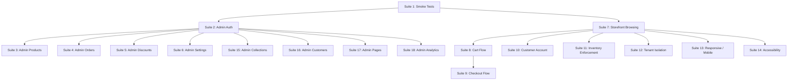
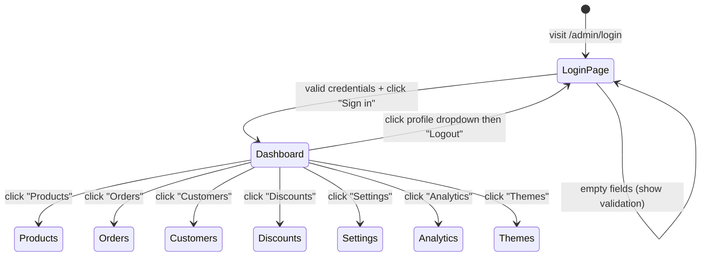
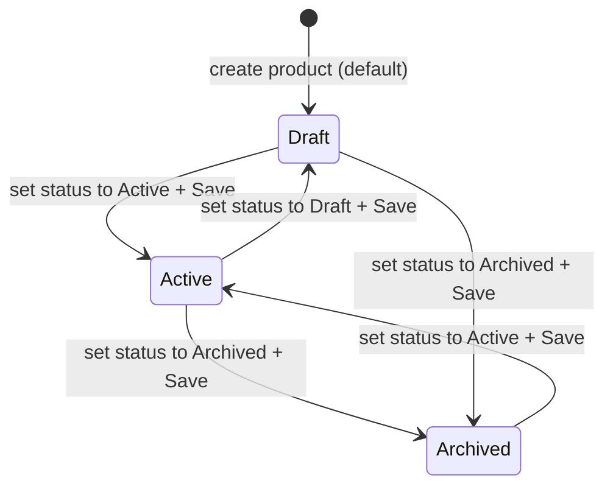
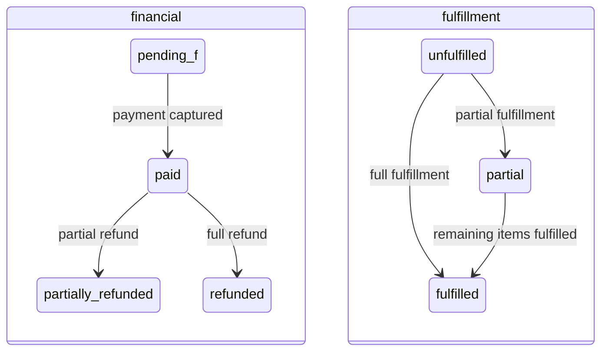
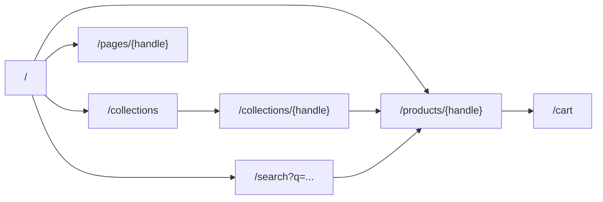
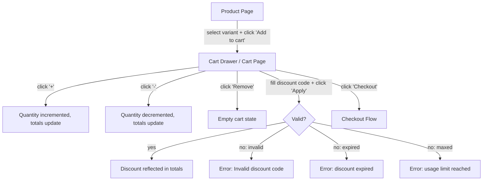
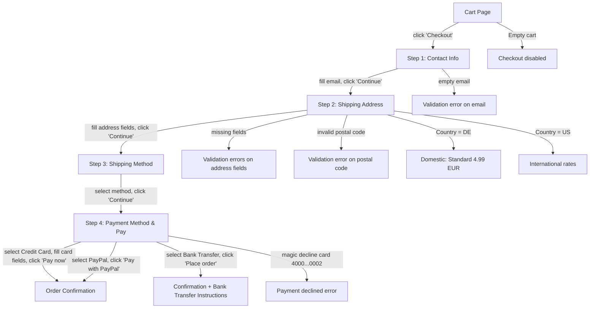
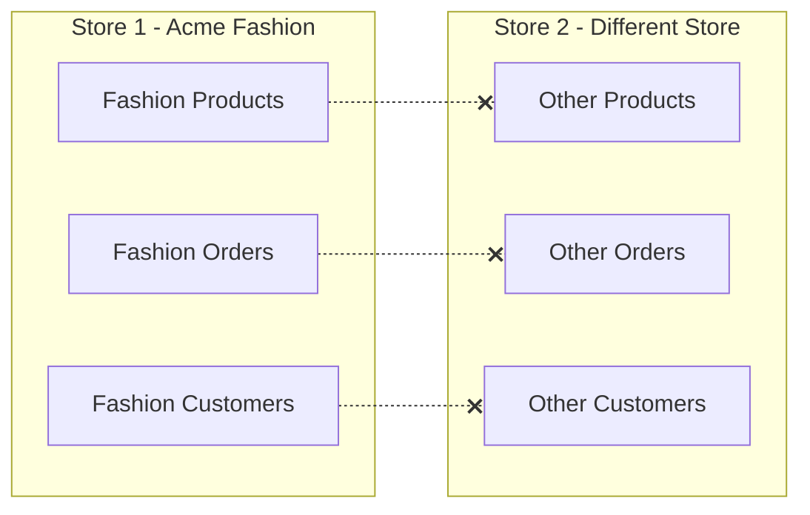

# 08 - Playwright E2E Test Plan

> Complete end-to-end browser test specification for the e-commerce platform using Pest v4 browser testing (Playwright-backed). All tests verify the entire application works through a real browser. This document defines requirements and specifications for the coding agent to implement.

---

## Test Suite Summary

| Suite | File | Tests | Purpose | Dependencies |
|-------|------|:-----:|---------|--------------|
| 1 - Smoke Tests | `tests/Browser/SmokeTest.php` | 10 | Hit every major page, assert HTTP 200 and no JS errors | Store 1, Products, Collections, Pages |
| 2 - Admin Authentication | `tests/Browser/Admin/AuthenticationTest.php` | 10 | Admin login, logout, invalid credentials, session access control | Admin user |
| 3 - Admin Product Management | `tests/Browser/Admin/ProductManagementTest.php` | 7 | Product CRUD: listing, creating, editing, archiving, filtering | Admin user, Products (incl. #15 draft) |
| 4 - Admin Order Management | `tests/Browser/Admin/OrderManagementTest.php` | 11 | Order listing, filtering, detail view, fulfillment, refund, confirm payment, fulfillment guard, mark shipped/delivered | Admin user, Orders (#1001, #1005), Customer |
| 5 - Admin Discount Management | `tests/Browser/Admin/DiscountManagementTest.php` | 6 | Discount code listing, creation, editing | Admin user, Discounts |
| 6 - Admin Settings | `tests/Browser/Admin/SettingsTest.php` | 7 | Store settings, shipping zones, tax config, domains | Admin user, Shipping zones, Store 1 |
| 7 - Storefront Browsing | `tests/Browser/Storefront/BrowsingTest.php` | 15 | Home page, collections, product detail, variants, search, pages | Products, Collections, Pages, Products #15/#17/#18 |
| 8 - Cart Flow | `tests/Browser/Storefront/CartTest.php` | 12 | Cart lifecycle: add, update qty, remove, discounts, totals | Products, Discounts (all codes) |
| 9 - Checkout Flow | `tests/Browser/Storefront/CheckoutTest.php` | 13 | Full checkout: contact, address, shipping, payment method selection, payment, confirmation, magic card decline, bank transfer flow | Products, Shipping zones, Discounts |
| 10 - Customer Account | `tests/Browser/Storefront/CustomerAccountTest.php` | 12 | Registration, login, order history, addresses, logout | Customer user, Orders (#1001/#1002/#1004) |
| 11 - Inventory Enforcement | `tests/Browser/Storefront/InventoryTest.php` | 4 | Inventory policy enforcement: deny vs. continue | Products #17 (deny), #18 (continue), #1 |
| 12 - Tenant Isolation | `tests/Browser/Storefront/TenantIsolationTest.php` | 5 | Multi-store data isolation verification | Store 1, Admin user, Customer user |
| 13 - Responsive / Mobile | `tests/Browser/Storefront/ResponsiveTest.php` | 8 | Mobile and tablet viewport rendering and interaction | Products, Admin user |
| 14 - Accessibility | `tests/Browser/Storefront/AccessibilityTest.php` | 11 | Heading hierarchy, ARIA labels, form labels, keyboard nav | Products, Store 1 |
| 15 - Admin Collections | `tests/Browser/Admin/CollectionManagementTest.php` | 3 | Collection CRUD in admin | Admin user, Collections |
| 16 - Admin Customers | `tests/Browser/Admin/CustomerManagementTest.php` | 3 | Customer listing and detail views | Admin user, Customer user, Orders |
| 17 - Admin Pages | `tests/Browser/Admin/PageManagementTest.php` | 3 | CMS page management | Admin user, Pages |
| 18 - Admin Analytics | `tests/Browser/Admin/AnalyticsTest.php` | 3 | Analytics dashboard rendering | Admin user, Orders |
| **Total** | **18 files** | **143** | | |

---

## Test Infrastructure Requirements

### Framework

- **Test runner:** Pest v4 with browser testing capabilities (Playwright under the hood)
- **Test traits:** Each browser test file must use `TestCase` and `RefreshDatabase`
- **Configuration:** Register the `Browser` test directory in `tests/Pest.php` with appropriate base classes
- **Base URL:** Configured via `APP_URL` in `.env.testing`, set to `http://acme-fashion.test`

### Pest v4 Browser Testing API Reference

The coding agent should use these Pest v4 browser methods:

| Method | Purpose |
|--------|---------|
| `visit(url)` | Open a real browser and navigate to the given URL |
| `visit([url1, url2, ...])` | Visit multiple pages (for batch smoke testing) |
| `fill(field, value)` | Type a value into a named form field |
| `click(text)` | Click a visible element matching the given text |
| `assertSee(text)` | Assert the page contains the given visible text |
| `assertNoJavascriptErrors()` | Assert no uncaught JS exceptions occurred |
| `assertNoConsoleLogs()` | Assert no console warnings or errors were logged |

Additionally, standard Laravel test features are available within browser tests: factories, `Event::fake()`, `Notification::fake()`, `$this->actingAs()`, and model queries.

### Environment Configuration

The `.env.testing` file must contain the following keys:

| Key | Value | Purpose |
|-----|-------|---------|
| `APP_ENV` | `testing` | Laravel environment |
| `APP_URL` | `http://acme-fashion.test` | Browser base URL (served by Herd) |
| `DB_CONNECTION` | `sqlite` | Database driver |
| `DB_DATABASE` | Absolute path to test SQLite file | Isolated test database |
| `PAYMENT_PROVIDER` | `mock` | Mock PSP - no external API keys needed |
| `MAIL_MAILER` | `array` | Trap emails in memory |
| `QUEUE_CONNECTION` | `sync` | Process jobs synchronously |

### Prerequisites Before Running

1. Database seeded with `php artisan migrate:fresh --seed`
2. Laravel Herd serving `acme-fashion.test`
3. Playwright browsers installed via `npx playwright install`
4. Frontend assets built via `npm run build`

---

## Seeded Data Dependency Table

All tests depend on the database seeder providing this baseline data. Each test gets a fresh database via `RefreshDatabase`, then the seeder repopulates it.

Each browser test file must set `protected bool $seed = true;` on the test class (or call `$this->seed(DatabaseSeeder::class)` in `beforeEach`) to ensure the database is populated after RefreshDatabase clears it. Laravel's `RefreshDatabase` trait does NOT automatically run seeders unless explicitly configured.

| Entity | Key Details | Used By Suites |
|--------|-------------|----------------|
| **Admin user** | Email: `admin@acme.test`, password: `password`, role: `owner` on Store 1 | 2, 3, 4, 5, 6, 12, 13, 15, 16, 17, 18 |
| **Customer user** | Email: `customer@acme.test`, password: `password`, name: "John Doe", belongs to Store 1 | 10, 12 |
| **Store 1** | Name: "Acme Fashion", handle: `acme-fashion`, domain: `acme-fashion.test`, currency: EUR | 1, 6, 7, 12, 14 |
| **Product #1** | Title: "Classic Cotton T-Shirt", handle: `classic-cotton-t-shirt`, price: 24.99 EUR, status: active, options: Size (S/M/L/XL), Color (Black/White/Navy), inventory: in stock | 1, 3, 7, 8, 9, 11, 13, 14 |
| **Product #2** | Title: "Premium Slim Fit Jeans", handle: `premium-slim-fit-jeans`, status: active, has compare-at pricing (sale), options: Size, Color | 7, 8 |
| **Product #15** | Status: `draft` - must NOT appear on storefront | 3, 7 |
| **Product #17** | Status: active, inventory: 0 on hand, policy: `deny` - displays "Sold out", add-to-cart disabled | 7, 11 |
| **Product #18** | Status: active, inventory: 0 on hand, policy: `continue` - displays "Available on backorder", add-to-cart enabled | 7, 11 |
| **Products (20 total)** | Seeded across collections, with variants, options, images, inventory | 1, 3, 7, 8, 9, 11, 13 |
| **Collections** | "T-Shirts" (handle: `t-shirts`), "New Arrivals" (handle: `new-arrivals`), plus others | 1, 7, 13, 15 |
| **Orders** | #1001 (status: paid, fulfillment: unfulfilled, customer: customer@acme.test), #1002, #1004 also belonging to the same customer | 4, 10, 16, 18 |
| **Discounts** | WELCOME10 (10% off, min 20 EUR purchase, active), FLAT5 (5 EUR fixed, active), FREESHIP (free shipping, active), EXPIRED20 (expired end date), MAXED (usage_count >= usage_limit) | 5, 8, 9 |
| **Shipping zones** | "Domestic" zone (countries: DE) with rate "Standard Shipping" at 4.99 EUR flat; "International" zone with its own rates | 6, 9 |
| **Tax settings** | Store 1: manual mode, prices_include_tax varies by test | 6 |
| **Pages** | "About" (handle: `about`, status: published) | 1, 7, 17 |
| **Navigation** | Main menu with links to collections, about page | 7 |

---

## Test Execution Matrix

Tests should be executed in the order shown below. Later suites depend on the infrastructure and pages verified by earlier suites.



| Execution Phase | Suites | Rationale |
|-----------------|--------|-----------|
| Phase 1 | Suite 1 (Smoke) | Verifies all routes load before deeper testing |
| Phase 2 | Suites 2, 7 | Core auth and storefront browsing - gate to all further tests |
| Phase 3 | Suites 3, 4, 5, 6, 10, 11, 15, 16, 17, 18 | Admin CRUD and storefront feature suites (can run in parallel) |
| Phase 4 | Suite 8 (Cart) | Depends on storefront browsing working |
| Phase 5 | Suite 9 (Checkout) | Depends on cart flow working. Tests payment method selection (credit card, PayPal, bank transfer), magic card declines, and bank transfer instructions. |
| Phase 6 | Suites 12, 13, 14 | Cross-cutting concerns: isolation, responsive, accessibility |

---

## Required User Journey Simulations (Playwright MCP)

These journeys MUST be executed using the Playwright MCP tools after implementation.
Each journey is a sequence of browser actions with expected results at each step.
These are NOT Pest tests - they are live browser verifications performed by the coding agent
using Playwright MCP tools (navigate, click, fill, snapshot).

**IMPORTANT:** At each step, check `browser_console_messages` for JS errors. A page that renders
but throws ReferenceError or TypeError is broken. Fix JS errors before moving on.

### Journey 1: Guest browses and purchases a product

1. Navigate to `/` -> see hero banner with "Shop Now" CTA, featured collections with counts, featured products with images and prices
2. Click "Shop Now" -> navigate to `/collections`
3. Click a collection (e.g., "T-Shirts") -> see product grid with sort dropdown, product cards with images and prices
4. Click a product card -> see product detail with title, price, description, breadcrumbs (Home > Collection > Product)
5. Confirm variant selectors work: change size dropdown -> verify selection registers (not unbound dropdowns)
6. Confirm quantity selector is present: click "+" to set quantity to 2, click "-" back to 1
7. Confirm stock messaging shows (e.g., "In stock")
8. Click "Add to cart" -> cart drawer opens with item name, variant, price, quantity controls
9. In cart drawer, click "View Cart" -> cart page shows item with correct variant details and price
10. Click "Proceed to Checkout" -> checkout page loads with contact/address form
11. Fill email, name, address fields, click "Continue" -> shipping method step with rates (e.g., "Standard Shipping - 4.99 EUR")
12. Select shipping method, click "Continue" -> payment step
13. Fill payment details (card 4242424242424242, any expiry, any CVV), click "Pay" -> order confirmation
14. Confirm order number and "Thank you" message visible
15. Click "View Order" link -> confirm it navigates to order detail page (URL is not broken by `#`)

### Journey 2: Customer registers, logs in, views orders

1. Navigate to `/account/register`
2. Fill name, email, password, confirm password, click "Create account" -> redirected to customer dashboard
3. Confirm dashboard shows welcome message with customer name, quick link cards (Orders, Addresses, Log out)
4. Click "Log out" -> redirected to `/account/login`
5. Fill credentials, click "Sign in" -> dashboard renders
6. Click "Orders" -> order history page with table showing order numbers, dates, totals
7. Confirm order status badges render with visible text and color (not empty `<span>` tags)
8. Click "View" link on an order -> navigate to order detail page (link must not break from `#` in order number)
9. Confirm order detail shows: line items with SKUs, shipping/billing addresses, payment method, totals breakdown

### Journey 3: Admin manages store

1. Navigate to `/admin/login`, log in as `admin@acme.test` / `password` -> dashboard with KPI tiles
2. Click "Products" in sidebar -> product list with 20 products, formatted prices (e.g., "24.99 EUR", not "2499")
3. Click "Add product", fill title/description/price/status, save -> success message, product appears in list
4. Click "Orders" -> order list with order numbers (single `#` prefix, not `##`)
5. Click an order -> order detail with line items, totals, payment and fulfillment status
6. Click "Create fulfillment", fill tracking info, submit -> fulfillment created, status updates
7. Navigate to Settings > Shipping -> shipping zones and rates display with correct amounts (4.99 EUR, 9.99 EUR - not 0.00 EUR)
8. Verify admin sidebar is visible, positioned statically (not overlapping main content on desktop)

### Journey 4: Cart interactions (add, update, remove, discount)

1. Navigate to `/products/classic-cotton-t-shirt`, select size "M", color "Black", click "Add to cart"
2. Close cart drawer. Click cart icon in header -> cart drawer reopens showing the item (not static/empty)
3. Navigate to `/cart` -> item visible with variant "M / Black" and price 24.99 EUR
4. Click "+" -> quantity 2, line total 49.98 EUR
5. Click "-" -> quantity 1, line total 24.99 EUR
6. Enter discount code "WELCOME10", click "Apply" -> 10% discount applied, totals update
7. Click "Remove" on item -> "Your cart is empty" message, no "Proceed to Checkout" button
8. Check browser console for JS errors throughout -> confirm none

### Journey 5: Search

1. Click search icon in header -> search modal opens (Alpine/Livewire events must communicate)
2. Type "t-shirt" in search modal -> autocomplete results appear with product names (not "No results found")
3. Click a result -> navigate to the product detail page
4. Navigate to `/search?q=jeans` -> search results page shows matching products with result count
5. Check browser console for JS errors -> confirm none

### Journey 6: Page completeness audit

Verify that every page has all elements specified in the storefront UI spec (spec 04):

1. **Home page**: hero banner, featured collections with images, featured products with images (not placeholder icons), sale badges on sale items
2. **Navigation**: header with logo/search/cart/account, main menu with nav items (NOT empty), footer with link columns and store info
3. **Collection page**: breadcrumbs, sort dropdown that works, product cards with images/prices/sale badges, pagination if >12 products
4. **Product page**: breadcrumbs (Home > Collection > Product), image gallery with thumbnails, variant selectors with `wire:model`, quantity selector ([-] [qty] [+]), stock messaging, compare-at price with strikethrough for sale items
5. **Customer account pages**: status badges render with text (not empty), order links navigate correctly, address modals open without JS errors
6. **Error pages**: navigate to `/this-page-does-not-exist` -> custom 404 page within storefront layout (not default Laravel 404)
7. **Page titles**: each page has a specific `<title>` tag (e.g., "Classic Cotton T-Shirt - Acme Fashion", not just "Acme Fashion" everywhere)

---

## Test Directory Structure

```
tests/Browser/
    SmokeTest.php
    Admin/
        AuthenticationTest.php
        ProductManagementTest.php
        OrderManagementTest.php
        DiscountManagementTest.php
        SettingsTest.php
        CollectionManagementTest.php
        CustomerManagementTest.php
        PageManagementTest.php
        AnalyticsTest.php
    Storefront/
        BrowsingTest.php
        CartTest.php
        CheckoutTest.php
        CustomerAccountTest.php
        InventoryTest.php
        TenantIsolationTest.php
        ResponsiveTest.php
        AccessibilityTest.php
```

---

## Suite 1: Smoke Tests

**File:** `tests/Browser/SmokeTest.php`

**Purpose:** Hit every major public and admin page, assert they load without JavaScript errors. This is the fastest way to catch broken routes, missing views, or uncaught JS exceptions.

---

### Test 1.1: Loads the storefront home page

**Preconditions:** Seeded store

**Steps:**
1. Navigate to `/`

**Expected Results:**
- Page displays "Acme Fashion"
- No JavaScript errors

---

### Test 1.2: Loads a collection page

**Preconditions:** Seeded collections

**Steps:**
1. Navigate to `/collections/t-shirts`

**Expected Results:**
- Page displays "T-Shirts"
- No JavaScript errors

---

### Test 1.3: Loads a product page

**Preconditions:** Seeded products

**Steps:**
1. Navigate to `/products/classic-cotton-t-shirt`

**Expected Results:**
- Page displays "Classic Cotton T-Shirt"
- Page displays "24.99"
- No JavaScript errors

---

### Test 1.4: Loads the cart page

**Preconditions:** None

**Steps:**
1. Navigate to `/cart`

**Expected Results:**
- Page displays "Your Cart"
- No JavaScript errors

---

### Test 1.5: Loads the customer login page

**Preconditions:** None

**Steps:**
1. Navigate to `/account/login`

**Expected Results:**
- Page displays "Log in"
- No JavaScript errors

---

### Test 1.6: Loads the admin login page

**Preconditions:** None

**Steps:**
1. Navigate to `/admin/login`

**Expected Results:**
- Page displays "Sign in"
- No JavaScript errors

---

### Test 1.7: Loads the about page

**Preconditions:** Seeded pages

**Steps:**
1. Navigate to `/pages/about`

**Expected Results:**
- Page displays "About"
- No JavaScript errors

---

### Test 1.8: Loads the search page

**Preconditions:** Seeded products

**Steps:**
1. Navigate to `/search?q=shirt`

**Expected Results:**
- Page displays "shirt"
- No JavaScript errors

---

### Test 1.9: Loads all collections listing

**Preconditions:** Seeded collections

**Steps:**
1. Navigate to `/collections`

**Expected Results:**
- Page displays "Collections"
- No JavaScript errors

---

### Test 1.10: Has no errors on critical pages (batch)

**Preconditions:** All seed data

**Steps:**
1. Visit all critical pages in batch: `/`, `/collections/new-arrivals`, `/products/classic-cotton-t-shirt`, `/cart`, `/account/login`, `/admin/login`, `/pages/about`, `/search?q=shirt`

**Expected Results:**
- No JavaScript errors on any of the visited pages

**Total: 10 tests**

---

## Suite 2: Admin Authentication

**File:** `tests/Browser/Admin/AuthenticationTest.php`

**Purpose:** Verify the admin login flow, credential validation, session management, logout, and sidebar navigation after successful login.

### Authentication Flow



---

### Test 2.1: Can log in as admin

**Preconditions:** Seeded admin user

**Steps:**
1. Navigate to `/admin/login`
2. Enter email: `admin@acme.test`
3. Enter password: `password`
4. Click the "Sign in" button

**Expected Results:**
- Page displays "Dashboard"
- No JavaScript errors

---

### Test 2.2: Shows error for invalid credentials

**Preconditions:** Seeded admin user

**Steps:**
1. Navigate to `/admin/login`
2. Enter email: `admin@acme.test`
3. Enter password: `wrongpassword`
4. Click the "Sign in" button

**Expected Results:**
- Page displays "Invalid credentials"
- No JavaScript errors

---

### Test 2.3: Shows error for empty email

**Preconditions:** None

**Steps:**
1. Navigate to `/admin/login`
2. Enter password: `password` (leave email empty)
3. Click the "Sign in" button

**Expected Results:**
- Validation error referencing "email" is visible
- No JavaScript errors

---

### Test 2.4: Shows error for empty password

**Preconditions:** None

**Steps:**
1. Navigate to `/admin/login`
2. Enter email: `admin@acme.test` (leave password empty)
3. Click the "Sign in" button

**Expected Results:**
- Validation error referencing "password" is visible
- No JavaScript errors

---

### Test 2.5: Redirects unauthenticated users to login from dashboard

**Preconditions:** Not logged in

**Steps:**
1. Navigate to `/admin` (without logging in)

**Expected Results:**
- Page displays "Sign in" (redirected to login form)
- No JavaScript errors

---

### Test 2.6: Redirects unauthenticated users to login from products

**Preconditions:** Not logged in

**Steps:**
1. Navigate to `/admin/products` (without logging in)

**Expected Results:**
- Page displays "Sign in" (redirected to login form)
- No JavaScript errors

---

### Test 2.7: Can log out

**Preconditions:** Seeded admin user

**Steps:**
1. Navigate to `/admin/login`
2. Enter email: `admin@acme.test`
3. Enter password: `password`
4. Click the "Sign in" button
5. Verify "Dashboard" is visible
6. Click on "Admin User" (profile/user menu)
7. Click "Logout"

**Expected Results:**
- Page displays "Sign in" (returned to login form)

---

### Test 2.8: Can navigate through admin sidebar sections

**Preconditions:** Seeded admin user

**Steps:**
1. Navigate to `/admin/login`
2. Enter email: `admin@acme.test`
3. Enter password: `password`
4. Click the "Sign in" button
5. Click "Products" in the sidebar
6. Verify "Products" heading is visible
7. Click "Orders" in the sidebar
8. Verify "Orders" heading is visible
9. Click "Customers" in the sidebar
10. Verify "Customers" heading is visible
11. Click "Discounts" in the sidebar
12. Verify "Discounts" heading is visible
13. Click "Settings" in the sidebar
14. Verify "Store Settings" heading is visible

**Expected Results:**
- Each section loads without JavaScript errors
- Each section heading is visible after clicking its sidebar link

---

### Test 2.9: Can navigate to analytics from sidebar

**Preconditions:** Seeded admin user

**Steps:**
1. Navigate to `/admin/login`
2. Enter email: `admin@acme.test`
3. Enter password: `password`
4. Click the "Sign in" button
5. Click "Analytics" in the sidebar

**Expected Results:**
- Page displays "Analytics"
- No JavaScript errors

---

### Test 2.10: Can navigate to themes from sidebar

**Preconditions:** Seeded admin user

**Steps:**
1. Navigate to `/admin/login`
2. Enter email: `admin@acme.test`
3. Enter password: `password`
4. Click the "Sign in" button
5. Click "Themes" in the sidebar

**Expected Results:**
- Page displays "Themes"
- No JavaScript errors

**Login Helper Pattern:** Tests 2.7-2.10 require the admin to be logged in first. Each test should perform the full login sequence (visit login page, fill credentials, click sign in, assert dashboard) before proceeding. This ensures test independence.

**Total: 10 tests**

---

## Suite 3: Admin Product Management

**File:** `tests/Browser/Admin/ProductManagementTest.php`

**Purpose:** Verify CRUD operations for products through the admin interface - listing, creating, editing, archiving, searching, and filtering by status.

### Product Lifecycle States



---

### Test 3.1: Shows the product list with seeded products

**Preconditions:** Logged in as admin, seeded products

**Steps:**
1. Navigate to `/admin/login`
2. Enter email: `admin@acme.test`
3. Enter password: `password`
4. Click the "Sign in" button
5. Click "Products" in the sidebar

**Expected Results:**
- Page displays "Classic Cotton T-Shirt"
- Page displays "Premium Slim Fit Jeans"
- No JavaScript errors

---

### Test 3.2: Can create a new product

**Preconditions:** Logged in as admin

**Steps:**
1. Navigate to `/admin/login`
2. Log in as admin (email: `admin@acme.test`, password: `password`)
3. Click "Products" in the sidebar
4. Click "Add product"
5. Enter title: `Test Product Created by E2E`
6. Enter description: `This product was created by the E2E test suite.`
7. Enter vendor: `Test Vendor`
8. Enter product type: `T-Shirts`
9. Enter variant price (variants.0.price): `29.99`
10. Enter variant SKU (variants.0.sku): `E2E-TEST-001`
11. Enter variant quantity (variants.0.quantity): `50`
12. Click "Save"
13. Click "Products" to return to the product list

**Expected Results:**
- After step 12: page displays "Product saved", no JavaScript errors
- After step 13: page displays "Test Product Created by E2E" in the list

---

### Test 3.3: Can edit an existing product title

**Preconditions:** Logged in as admin, seeded products

**Steps:**
1. Navigate to `/admin/login`
2. Log in as admin
3. Click "Products" in the sidebar
4. Verify "Classic Cotton T-Shirt" is visible in the list
5. Click "Classic Cotton T-Shirt" to open the edit form
6. Clear the title field and enter: `Classic Cotton T-Shirt Updated`
7. Click "Save"
8. Click "Products" to return to the product list

**Expected Results:**
- After step 7: page displays "Product saved", no JavaScript errors
- After step 8: page displays "Classic Cotton T-Shirt Updated" in the list

---

### Test 3.4: Can archive a product

**Preconditions:** Logged in as admin

**Steps:**
1. Navigate to `/admin/login`
2. Log in as admin
3. Click "Products" in the sidebar
4. Click "Add product"
5. Enter title: `Product To Archive`
6. Enter variant price: `19.99`
7. Enter variant SKU: `E2E-ARCHIVE-001`
8. Enter variant quantity: `10`
9. Click "Save"
10. Verify "Product saved" is displayed
11. Click "Products" to return to the product list
12. Click "Product To Archive" to open the edit form
13. Change status to "Archived" (click the Archived option)
14. Click "Save"
15. Click "Products" to return to the product list

**Expected Results:**
- After step 9: page displays "Product saved"
- After step 14: page displays "Product saved"
- After step 15: with default "Active" filter, the archived product should not appear in the list

---

### Test 3.5: Shows draft products only in admin, not storefront

**Preconditions:** Logged in as admin, Product #15 exists with draft status

**Steps:**
1. Navigate to `/admin/login`
2. Log in as admin
3. Click "Products" in the sidebar
4. Verify Product #15 is visible in the admin list with a "Draft" badge
5. Open a new browser context / navigate to `/collections/t-shirts` (as guest)
6. Verify the draft product does NOT appear in the collection listing
7. Navigate to `/search?q=draft`
8. Verify the draft product does NOT appear in search results

**Expected Results:**
- Step 4: draft product visible in admin, no JavaScript errors
- Step 6: draft product absent from storefront collection, no JavaScript errors
- Step 8: draft product absent from search results, no JavaScript errors

---

### Test 3.6: Can search products in admin

**Preconditions:** Logged in as admin, seeded products

**Steps:**
1. Navigate to `/admin/login`
2. Log in as admin
3. Click "Products" in the sidebar
4. Enter "Cotton" in the search input field

**Expected Results:**
- Page displays "Classic Cotton T-Shirt" in filtered results
- No JavaScript errors

---

### Test 3.7: Can filter products by status in admin

**Preconditions:** Logged in as admin, seeded products including drafts

**Steps:**
1. Navigate to `/admin/login`
2. Log in as admin
3. Click "Products" in the sidebar
4. Click the "Draft" status filter tab
5. Verify only draft products are visible
6. Click the "Active" status filter tab

**Expected Results:**
- After step 4: only draft products are visible, no JavaScript errors
- After step 6: "Classic Cotton T-Shirt" is visible, no JavaScript errors

**Total: 7 tests**

---

## Suite 4: Admin Order Management

**File:** `tests/Browser/Admin/OrderManagementTest.php`

**Purpose:** Verify order listing, status filtering, order detail with timeline, fulfillment creation, and refund processing.

### Order State Transitions (via admin actions)



---

### Test 4.1: Shows the order list with seeded orders

**Preconditions:** Logged in as admin, seeded orders

**Steps:**
1. Navigate to `/admin/login`
2. Log in as admin
3. Click "Orders" in the sidebar

**Expected Results:**
- Page displays "#1001"
- No JavaScript errors

---

### Test 4.2: Can filter orders by status

**Preconditions:** Logged in as admin, seeded orders

**Steps:**
1. Navigate to `/admin/login`
2. Log in as admin
3. Click "Orders" in the sidebar
4. Click the "Paid" status filter/tab
5. Verify "#1001" is visible
6. Click the "Fulfilled" status filter/tab
7. Click the "All" tab to reset the filter

**Expected Results:**
- After step 4: "#1001" is visible, no JavaScript errors
- After step 6: filtered results shown, no JavaScript errors
- After step 7: full list shown, no JavaScript errors

---

### Test 4.3: Shows order detail with line items and totals

**Preconditions:** Logged in as admin, Order #1001 exists

**Steps:**
1. Navigate to `/admin/login`
2. Log in as admin
3. Click "Orders" in the sidebar
4. Click "#1001" to open the order detail

**Expected Results:**
- Page displays "#1001"
- Page displays "Paid" (financial status)
- Page displays "Unfulfilled" (fulfillment status)
- Page displays "Classic Cotton T-Shirt" (line item)
- Page displays "Subtotal", "Shipping", "Tax", and "Total" sections
- No JavaScript errors

---

### Test 4.4: Shows order timeline events

**Preconditions:** Logged in as admin, Order #1001 exists

**Steps:**
1. Navigate to `/admin/login`
2. Log in as admin
3. Click "Orders" in the sidebar
4. Click "#1001" to open the order detail

**Expected Results:**
- Page displays "Timeline" section
- Timeline shows at least the order creation event
- No JavaScript errors

---

### Test 4.5: Can create a fulfillment

**Preconditions:** Logged in as admin, Order #1001 is unfulfilled

**Steps:**
1. Navigate to `/admin/login`
2. Log in as admin
3. Click "Orders" in the sidebar
4. Click "#1001" to open the order detail
5. Click "Create fulfillment"
6. Enter tracking company: `DHL`
7. Enter tracking number: `DHL123456789`
8. Click "Fulfill items"

**Expected Results:**
- Page displays "Fulfillment created"
- Page displays "DHL" and "DHL123456789" in the fulfillment section
- No JavaScript errors

---

### Test 4.6: Can process a refund

**Preconditions:** Logged in as admin, Order #1001 is paid

**Steps:**
1. Navigate to `/admin/login`
2. Log in as admin
3. Click "Orders" in the sidebar
4. Click "#1001" to open the order detail
5. Click "Refund"
6. Enter amount: `10.00`
7. Enter reason: `Customer requested partial refund`
8. Click "Process refund"

**Expected Results:**
- Page displays "Refund processed"
- Page displays "Partially refunded" (updated financial status)
- No JavaScript errors

---

### Test 4.7: Shows customer information in order detail

**Preconditions:** Logged in as admin, Order #1001 exists with customer

**Steps:**
1. Navigate to `/admin/login`
2. Log in as admin
3. Click "Orders" in the sidebar
4. Click "#1001" to open the order detail

**Expected Results:**
- Page displays "customer@acme.test" in the customer info section
- No JavaScript errors

---

### Test 4.8: Can confirm bank transfer payment

**Preconditions:** Logged in as admin, Order #1005 exists with payment_method=bank_transfer and financial_status=pending

**Steps:**
1. Navigate to `/admin/login`
2. Log in as admin
3. Click "Orders" in the sidebar
4. Click "#1005" to open the order detail
5. Verify "Pending" financial status badge is displayed
6. Verify "Confirm payment" button is visible
7. Click "Confirm payment"

**Expected Results:**
- Page displays "Payment confirmed"
- Financial status badge changes to "Paid"
- "Confirm payment" button is no longer visible
- No JavaScript errors

---

### Test 4.9: Shows fulfillment guard for unpaid order

**Preconditions:** Logged in as admin, Order #1005 exists with financial_status=pending (before payment confirmation)

**Steps:**
1. Navigate to `/admin/login`
2. Log in as admin
3. Click "Orders" in the sidebar
4. Click "#1005" to open the order detail

**Expected Results:**
- Page displays a warning message about payment required before fulfillment
- "Create fulfillment" button is disabled or hidden
- No JavaScript errors

---

### Test 4.10: Can mark fulfillment as shipped

**Preconditions:** Logged in as admin, Order #1001 is paid and has been fulfilled (fulfillment created in test 4.5)

**Steps:**
1. Navigate to `/admin/login`
2. Log in as admin
3. Click "Orders" in the sidebar
4. Click "#1001" to open the order detail
5. Create a fulfillment first (if not already done via test 4.5)
6. Click "Mark as shipped" on the fulfillment card

**Expected Results:**
- Fulfillment status badge changes to "Shipped"
- No JavaScript errors

---

### Test 4.11: Can mark fulfillment as delivered

**Preconditions:** Logged in as admin, Order #1001 has a shipped fulfillment

**Steps:**
1. Navigate to `/admin/login`
2. Log in as admin
3. Click "Orders" in the sidebar
4. Click "#1001" to open the order detail
5. Click "Mark as delivered" on the shipped fulfillment card

**Expected Results:**
- Fulfillment status badge changes to "Delivered"
- Order fulfillment status updates to "Fulfilled"
- No JavaScript errors

**Total: 11 tests**

---

## Suite 5: Admin Discount Management

**File:** `tests/Browser/Admin/DiscountManagementTest.php`

**Purpose:** Verify discount code listing, creation (all three value types), editing, and status display.

### Discount Types

| Value Type | Description | Fields Required |
|------------|-------------|-----------------|
| `percent` | Percentage off the order subtotal | code, value (whole number, e.g., 25 for 25%), starts_at, optional ends_at |
| `fixed` | Fixed currency amount off | code, value (e.g., 10.00), starts_at, optional ends_at |
| `free_shipping` | Waive shipping costs entirely | code, starts_at, optional ends_at |

---

### Test 5.1: Shows seeded discount codes

**Preconditions:** Logged in as admin, seeded discounts

**Steps:**
1. Navigate to `/admin/login`
2. Log in as admin
3. Click "Discounts" in the sidebar

**Expected Results:**
- Page displays "WELCOME10"
- Page displays "FLAT5"
- Page displays "FREESHIP"
- No JavaScript errors

---

### Test 5.2: Can create a new percentage discount code

**Preconditions:** Logged in as admin

**Steps:**
1. Navigate to `/admin/login`
2. Log in as admin
3. Click "Discounts" in the sidebar
4. Click "Create discount"
5. Enter code: `E2ETEST25`
6. Click "Percentage" to select the value type
7. Enter value: `25`
8. Enter starts_at: `2026-01-01`
9. Enter ends_at: `2026-12-31`
10. Click "Save"
11. Click "Discounts" to return to the list

**Expected Results:**
- After step 10: page displays "Discount saved", no JavaScript errors
- After step 11: page displays "E2ETEST25" in the list

---

### Test 5.3: Can create a fixed amount discount code

**Preconditions:** Logged in as admin

**Steps:**
1. Navigate to `/admin/login`
2. Log in as admin
3. Click "Discounts" then "Create discount"
4. Enter code: `E2EFLAT10`
5. Click "Fixed amount" to select the value type
6. Enter value: `10.00`
7. Enter starts_at: `2026-01-01`
8. Click "Save"

**Expected Results:**
- Page displays "Discount saved"
- No JavaScript errors

---

### Test 5.4: Can create a free shipping discount code

**Preconditions:** Logged in as admin

**Steps:**
1. Navigate to `/admin/login`
2. Log in as admin
3. Click "Discounts" then "Create discount"
4. Enter code: `E2EFREESHIP`
5. Click "Free shipping" to select the value type
6. Enter starts_at: `2026-01-01`
7. Click "Save"

**Expected Results:**
- Page displays "Discount saved"
- No JavaScript errors

---

### Test 5.5: Can edit a discount

**Preconditions:** Logged in as admin, WELCOME10 discount exists

**Steps:**
1. Navigate to `/admin/login`
2. Log in as admin
3. Click "Discounts" in the sidebar
4. Click "WELCOME10" to open the edit form
5. Change the value field to: `15`
6. Click "Save"

**Expected Results:**
- Page displays "Discount saved"
- No JavaScript errors

---

### Test 5.6: Shows discount status indicators

**Preconditions:** Logged in as admin, seeded discounts (active and expired)

**Steps:**
1. Navigate to `/admin/login`
2. Log in as admin
3. Click "Discounts" in the sidebar

**Expected Results:**
- Page displays "Active" status badge (for active discounts)
- Page displays "Expired" status badge (for EXPIRED20)
- No JavaScript errors

**Total: 6 tests**

---

## Suite 6: Admin Settings

**File:** `tests/Browser/Admin/SettingsTest.php`

**Purpose:** Verify store settings management across all settings tabs: General, Domains, Shipping, Taxes, Checkout, and Notifications.

### Settings Page Structure

The admin settings page at `/admin/settings` uses a tabbed interface:

| Tab | Route | Content |
|-----|-------|---------|
| General | `/admin/settings` | Store name, contact email, currency, locale |
| Domains | (tab within settings) | Domain list including `acme-fashion.test` |
| Shipping | `/admin/settings/shipping` | Shipping zones, rates per zone |
| Taxes | `/admin/settings/taxes` | Tax mode (manual/provider), prices_include_tax toggle |
| Checkout | `/admin/settings/checkout` | Checkout behavior settings |
| Notifications | `/admin/settings/notifications` | Email notification preferences |

> **Note:** Domains tab is covered by Test 6.7. Checkout and Notifications tabs follow the same tabbed navigation pattern; E2E coverage for these tabs should be added when their functionality is implemented.

---

### Test 6.1: Can view store settings

**Preconditions:** Logged in as admin, Store 1 exists

**Steps:**
1. Navigate to `/admin/login`
2. Log in as admin
3. Click "Settings" in the sidebar

**Expected Results:**
- Page displays "Store Settings"
- Page displays "Acme Fashion"
- No JavaScript errors

---

### Test 6.2: Can update store name

**Preconditions:** Logged in as admin

**Steps:**
1. Navigate to `/admin/login`
2. Log in as admin
3. Click "Settings" in the sidebar
4. Update the name field to: `Acme Fashion Updated`
5. Click "Save"
6. Click "Settings" again to reload the page

**Expected Results:**
- After step 5: page displays "Settings saved", no JavaScript errors
- After step 6: page displays "Acme Fashion Updated" (change persisted)

---

### Test 6.3: Can view shipping zones

**Preconditions:** Logged in as admin, seeded shipping zones

**Steps:**
1. Navigate to `/admin/login`
2. Log in as admin
3. Click "Settings" in the sidebar
4. Click "Shipping" tab

**Expected Results:**
- Page displays "Domestic"
- Page displays "Standard Shipping"
- Page displays "4.99"
- No JavaScript errors

---

### Test 6.4: Can add a new shipping rate to existing zone

**Preconditions:** Logged in as admin, Domestic shipping zone exists

**Steps:**
1. Navigate to `/admin/login`
2. Log in as admin
3. Click "Settings" in the sidebar
4. Click "Shipping" tab
5. Click "Add rate" within the Domestic zone section
6. Enter name: `Overnight Shipping`
7. Enter price: `14.99`
8. Click "Save"

**Expected Results:**
- Page displays "Shipping rate saved"
- Page displays "Overnight Shipping" and "14.99" in the zone
- No JavaScript errors

---

### Test 6.5: Can view tax settings

**Preconditions:** Logged in as admin

**Steps:**
1. Navigate to `/admin/login`
2. Log in as admin
3. Click "Settings" in the sidebar
4. Click "Taxes" tab

**Expected Results:**
- Page displays "Tax Settings"
- No JavaScript errors

---

### Test 6.6: Can update tax inclusion setting

**Preconditions:** Logged in as admin

**Steps:**
1. Navigate to `/admin/login`
2. Log in as admin
3. Click "Settings" in the sidebar
4. Click "Taxes" tab
5. Click/toggle the "Prices include tax" switch
6. Click "Save"

**Expected Results:**
- Page displays "Tax settings saved"
- No JavaScript errors

---

### Test 6.7: Can view domain settings

**Preconditions:** Logged in as admin, Store 1 with domain configured

**Steps:**
1. Navigate to `/admin/login`
2. Log in as admin
3. Click "Settings" in the sidebar
4. Click "Domains" tab

**Expected Results:**
- Page displays "acme-fashion.test"
- No JavaScript errors

**Total: 7 tests**

---

## Suite 7: Storefront Browsing

**File:** `tests/Browser/Storefront/BrowsingTest.php`

**Purpose:** Verify all storefront pages render correctly as a guest visitor - home page, collection listings, product detail with variant options, search results, static pages, and content visibility rules (draft/stock).

### Storefront Page Map



---

### Test 7.1: Shows featured products on home page

**Preconditions:** Seeded products

**Steps:**
1. Navigate to `/`

**Expected Results:**
- Page displays "Acme Fashion"
- Page displays "Classic Cotton T-Shirt"
- Page displays "24.99"
- No JavaScript errors

---

### Test 7.2: Shows collection with product grid

**Preconditions:** Seeded collections and products

**Steps:**
1. Navigate to `/collections/t-shirts`

**Expected Results:**
- Page displays "T-Shirts"
- Page displays "Classic Cotton T-Shirt"
- No JavaScript errors

---

### Test 7.3: Can navigate from collection to product

**Preconditions:** Seeded collections and products

**Steps:**
1. Navigate to `/collections/t-shirts`
2. Click "Classic Cotton T-Shirt"

**Expected Results:**
- Page displays "Classic Cotton T-Shirt"
- Page displays "24.99"
- Page displays "Add to cart"
- No JavaScript errors

---

### Test 7.4: Shows product detail with variant options

**Preconditions:** Product #1

**Steps:**
1. Navigate to `/products/classic-cotton-t-shirt`

**Expected Results:**
- Page displays "Classic Cotton T-Shirt"
- Page displays "24.99"
- Page displays "Size"
- Page displays "Color"
- No JavaScript errors

---

### Test 7.5: Shows size and color option values

**Preconditions:** Product #1

**Steps:**
1. Navigate to `/products/classic-cotton-t-shirt`

**Expected Results:**
- Page displays size options: "S", "M", "L", "XL"
- Page displays color options: "Black", "White", "Navy"
- No JavaScript errors

---

### Test 7.6: Updates price when variant changes on product with compare-at pricing

**Preconditions:** Product #2 with compare-at pricing

**Steps:**
1. Navigate to `/products/premium-slim-fit-jeans`
2. Select a variant that has a compare-at price (sale variant)

**Expected Results:**
- Page displays "Premium Slim Fit Jeans"
- Sale price is displayed
- Compare-at (original) price is shown with strikethrough styling
- No JavaScript errors

---

### Test 7.7: Shows search results for valid query

**Preconditions:** Seeded products

**Steps:**
1. Navigate to `/search?q=cotton`

**Expected Results:**
- Page displays "Classic Cotton T-Shirt" in results
- No JavaScript errors

---

### Test 7.8: Shows no results message for invalid query

**Preconditions:** None

**Steps:**
1. Navigate to `/search?q=zznonexistentproductzz`

**Expected Results:**
- Page displays "No results"
- No JavaScript errors

---

### Test 7.9: Does not show draft products on storefront collections

**Preconditions:** Product #15 with draft status

**Steps:**
1. Navigate to `/collections`

**Expected Results:**
- Product #15 (draft) must NOT appear anywhere in the listing
- No JavaScript errors

---

### Test 7.10: Does not show draft products in search results

**Preconditions:** Product #15 with draft status

**Steps:**
1. Navigate to `/search?q=draft`

**Expected Results:**
- No draft products appear in search results
- No JavaScript errors

---

### Test 7.11: Shows out of stock messaging for deny-policy product

**Preconditions:** Product #17 (0 stock, inventory policy = deny)

**Steps:**
1. Navigate to `/products/limited-edition-sneakers`

**Expected Results:**
- Page displays "Sold out"
- "Add to cart" button is disabled or hidden
- No JavaScript errors

---

### Test 7.12: Shows backorder messaging for continue-policy product

**Preconditions:** Product #18 (0 stock, inventory policy = continue)

**Steps:**
1. Navigate to `/products/backorder-denim-jacket`

**Expected Results:**
- Page displays "Available on backorder"
- "Add to cart" button is still enabled
- No JavaScript errors

---

### Test 7.13: Shows new arrivals collection

**Preconditions:** Seeded collections

**Steps:**
1. Navigate to `/collections/new-arrivals`

**Expected Results:**
- Page displays "New Arrivals"
- No JavaScript errors

---

### Test 7.14: Shows static about page

**Preconditions:** Seeded pages

**Steps:**
1. Navigate to `/pages/about`

**Expected Results:**
- Page displays "About"
- No JavaScript errors

---

### Test 7.15: Navigates between pages using the main navigation

**Preconditions:** Seeded store with navigation

**Steps:**
1. Navigate to `/`
2. Click "T-Shirts" in the main navigation menu

**Expected Results:**
- Page navigates to the T-Shirts collection
- Page displays "T-Shirts"
- No JavaScript errors

**Total: 15 tests**

---

## Suite 8: Cart Flow

**File:** `tests/Browser/Storefront/CartTest.php`

**Purpose:** Verify the complete cart lifecycle - adding products with variant selection, updating quantities, removing items, applying/rejecting discount codes, and verifying totals calculations.

### Cart Interaction Flow



### Discount Code Validation Matrix

| Code | Type | Value | Min Purchase | Status | Expected Behavior |
|------|------|-------|-------------|--------|-------------------|
| WELCOME10 | percent | 10% | 20 EUR | active | Applies 10% discount to subtotal |
| FLAT5 | fixed | 5.00 EUR | none | active | Subtracts 5.00 from subtotal |
| FREESHIP | free_shipping | n/a | none | active | Sets shipping cost to 0 |
| EXPIRED20 | percent | 20% | none | expired (end date in past) | Rejected with "expired" error |
| MAXED | percent | 10% | none | active but usage_count >= usage_limit | Rejected with "usage limit" error |
| INVALID | n/a | n/a | n/a | does not exist | Rejected with "Invalid discount code" error |

---

### Test 8.1: Can add product to cart

**Preconditions:** Product #1 exists

**Steps:**
1. Navigate to `/products/classic-cotton-t-shirt`
2. Click "M" to select size M
3. Click "Black" to select color Black
4. Click "Add to cart"

**Expected Results:**
- Page displays "Classic Cotton T-Shirt"
- Page displays "24.99"
- No JavaScript errors

---

### Test 8.2: Can view cart with added item

**Preconditions:** Product #1 exists

**Steps:**
1. Navigate to `/products/classic-cotton-t-shirt`
2. Click "M" to select size M
3. Click "Black" to select color Black
4. Click "Add to cart"
5. Navigate to `/cart`

**Expected Results:**
- Page displays "Your Cart"
- Page displays "Classic Cotton T-Shirt"
- Page displays "24.99"
- No JavaScript errors

---

### Test 8.3: Can update quantity in cart

**Preconditions:** Product #1 exists

**Steps:**
1. Navigate to `/products/classic-cotton-t-shirt`
2. Click "M" to select size M
3. Click "Black" to select color Black
4. Click "Add to cart"
5. Navigate to `/cart`
6. Verify "Classic Cotton T-Shirt" is visible
7. Click "+" to increment quantity

**Expected Results:**
- Quantity updated to 2
- Line total updates to 49.98 (2 x 24.99)
- Page displays "49.98"
- No JavaScript errors

---

### Test 8.4: Can remove item from cart

**Preconditions:** Product #1 exists

**Steps:**
1. Navigate to `/products/classic-cotton-t-shirt`
2. Click "M" to select size M
3. Click "Black" to select color Black
4. Click "Add to cart"
5. Navigate to `/cart`
6. Verify "Classic Cotton T-Shirt" is visible
7. Click "Remove" on the item

**Expected Results:**
- Page displays "Your cart is empty"
- No JavaScript errors

---

### Test 8.5: Can add multiple different products

**Preconditions:** Products #1 and #2 exist

**Steps:**
1. Navigate to `/products/classic-cotton-t-shirt`
2. Click "M" to select size M
3. Click "Black" to select color Black
4. Click "Add to cart"
5. Navigate to `/products/premium-slim-fit-jeans`
6. Click "Add to cart"
7. Navigate to `/cart`

**Expected Results:**
- Page displays "Classic Cotton T-Shirt"
- Page displays "Premium Slim Fit Jeans"
- No JavaScript errors

---

### Test 8.6: Can apply valid discount code WELCOME10

**Preconditions:** Product #1 in cart (24.99 EUR, above 20 EUR minimum), WELCOME10 discount exists

**Steps:**
1. Navigate to `/products/classic-cotton-t-shirt`
2. Click "M" to select size M
3. Click "Black" to select color Black
4. Click "Add to cart"
5. Navigate to `/cart`
6. Verify "24.99" is displayed
7. Enter discount code: `WELCOME10` in the discount_code field
8. Click "Apply"

**Expected Results:**
- Page displays "WELCOME10" label
- Page displays "Discount" line in totals
- 10% discount applied (approximately 2.50 off 24.99)
- No JavaScript errors

---

### Test 8.7: Shows error for invalid discount code

**Preconditions:** Product #1 in cart

**Steps:**
1. Navigate to `/products/classic-cotton-t-shirt`
2. Click "M" to select size M
3. Click "Black" to select color Black
4. Click "Add to cart"
5. Navigate to `/cart`
6. Enter discount code: `INVALID` in the discount_code field
7. Click "Apply"

**Expected Results:**
- Page displays "Invalid discount code"
- No JavaScript errors

---

### Test 8.8: Shows error for expired discount code

**Preconditions:** Product #1 in cart, EXPIRED20 discount exists (expired)

**Steps:**
1. Navigate to `/products/classic-cotton-t-shirt`
2. Click "M" to select size M
3. Click "Black" to select color Black
4. Click "Add to cart"
5. Navigate to `/cart`
6. Enter discount code: `EXPIRED20` in the discount_code field
7. Click "Apply"

**Expected Results:**
- Page displays error message containing "expired"
- No JavaScript errors

---

### Test 8.9: Shows error for maxed out discount code

**Preconditions:** Product #1 in cart, MAXED discount exists (usage limit reached)

**Steps:**
1. Navigate to `/products/classic-cotton-t-shirt`
2. Click "M" to select size M
3. Click "Black" to select color Black
4. Click "Add to cart"
5. Navigate to `/cart`
6. Enter discount code: `MAXED` in the discount_code field
7. Click "Apply"

**Expected Results:**
- Page displays error message containing "usage limit"
- No JavaScript errors

---

### Test 8.10: Can apply free shipping discount

**Preconditions:** Product #1 in cart, FREESHIP discount exists

**Steps:**
1. Navigate to `/products/classic-cotton-t-shirt`
2. Click "M" to select size M
3. Click "Black" to select color Black
4. Click "Add to cart"
5. Navigate to `/cart`
6. Enter discount code: `FREESHIP` in the discount_code field
7. Click "Apply"

**Expected Results:**
- Page displays "FREESHIP" label
- Page displays "Free shipping" indicator
- No JavaScript errors

---

### Test 8.11: Can apply FLAT5 discount for fixed amount off

**Preconditions:** Product #1 in cart, FLAT5 discount exists

**Steps:**
1. Navigate to `/products/classic-cotton-t-shirt`
2. Click "M" to select size M
3. Click "Black" to select color Black
4. Click "Add to cart"
5. Navigate to `/cart`
6. Enter discount code: `FLAT5` in the discount_code field
7. Click "Apply"

**Expected Results:**
- Page displays "FLAT5" label
- Page displays "5.00" discount amount in totals
- No JavaScript errors

---

### Test 8.12: Shows subtotal and total in cart

**Preconditions:** Product #1 in cart

**Steps:**
1. Navigate to `/products/classic-cotton-t-shirt`
2. Click "M" to select size M
3. Click "Black" to select color Black
4. Click "Add to cart"
5. Navigate to `/cart`

**Expected Results:**
- Page displays "Subtotal" label
- Page displays "24.99"
- No JavaScript errors

**Total: 12 tests**

---

## Suite 9: Checkout Flow

**File:** `tests/Browser/Storefront/CheckoutTest.php`

**Purpose:** Verify the complete multi-step checkout process: cart to contact info, shipping address, shipping method selection, payment, and order confirmation.

### Checkout Step Flow



### Checkout Step Detail

| Step | Section | Required Fields | Visible After Completion |
|------|---------|-----------------|--------------------------|
| 1. Contact | Contact section | email | Email summary shown |
| 2. Shipping Address | Address section | first_name, last_name, address1, city, postal_code, country (select) | Address summary shown |
| 3. Shipping Method | Shipping section | Select one of the available shipping rates | Selected method + price shown |
| 4. Payment | Payment section | Select payment method (Credit Card / PayPal / Bank Transfer), fill card details if credit card | Redirect to confirmation |
| 5. Confirmation | Confirmation page | n/a (read only) | "Thank you", order number, line items, totals. Bank transfer: also shows transfer instructions. |

### Totals Calculation Reference

For the happy path (Classic Cotton T-Shirt, DE address, Standard Shipping):

| Line | Amount |
|------|--------|
| Subtotal | 24.99 EUR |
| Shipping (Standard, Domestic DE) | 4.99 EUR |
| Tax (included in price for DE, manual mode) | varies |
| **Total** | **29.98 EUR** |

With FLAT5 discount applied:

| Line | Amount |
|------|--------|
| Subtotal | 24.99 EUR |
| Discount (FLAT5) | -5.00 EUR |
| Shipping | 4.99 EUR |
| **Total** | **24.98 EUR** |

---

### Test 9.1: Completes full checkout with credit card

**Preconditions:** Product #1, Domestic shipping zone with Standard Shipping at 4.99 EUR

**Steps:**
1. Navigate to `/products/classic-cotton-t-shirt`
2. Click "M" to select size M
3. Click "Black" to select color Black
4. Click "Add to cart"
5. Navigate to `/cart`
6. Click "Checkout"
7. Enter email: `test-buyer@example.com`
8. Click "Continue"
9. Enter first name: `Test`
10. Enter last name: `Buyer`
11. Enter address: `Teststrasse 1`
12. Enter city: `Berlin`
13. Enter postal code: `10115`
14. Enter country: `DE`
15. Click "Continue"
16. Verify "Standard Shipping" and "4.99" are displayed
17. Click "Standard Shipping" to select it
18. Click "Continue"
19. Verify "Credit Card" is pre-selected as payment method
20. Enter card number: `4242 4242 4242 4242`
21. Enter cardholder name: `Test Buyer`
22. Enter expiry: `12/28`
23. Enter CVC: `123`
24. Verify total is 29.98 (24.99 + 4.99 shipping)
25. Click "Pay now"

**Expected Results:**
- Confirmation page displays "Thank you"
- Confirmation page displays an order number (prefixed with "#")
- No JavaScript errors

---

### Test 9.2: Shows shipping methods based on German address

**Preconditions:** Product #1 in cart, Domestic shipping zone

**Steps:**
1. Navigate to `/products/classic-cotton-t-shirt`
2. Click "M" to select size M
3. Click "Black" to select color Black
4. Click "Add to cart"
5. Navigate to `/cart`
6. Click "Checkout"
7. Enter email: `test@example.com`
8. Click "Continue"
9. Enter first name: `Hans`
10. Enter last name: `Mueller`
11. Enter address: `Berliner Str. 10`
12. Enter city: `Munich`
13. Enter postal code: `80331`
14. Enter country: `DE`
15. Click "Continue"

**Expected Results:**
- Page displays "Standard Shipping"
- Page displays "4.99" (Domestic zone rate)
- No JavaScript errors

---

### Test 9.3: Shows international shipping methods for non-DE address

**Preconditions:** Product #1 in cart, International shipping zone

**Steps:**
1. Navigate to `/products/classic-cotton-t-shirt`
2. Click "M" to select size M
3. Click "Black" to select color Black
4. Click "Add to cart"
5. Navigate to `/cart`
6. Click "Checkout"
7. Enter email: `test@example.com`
8. Click "Continue"
9. Enter first name: `John`
10. Enter last name: `Smith`
11. Enter address: `123 Main St`
12. Enter city: `New York`
13. Enter postal code: `10001`
14. Enter country: `US`
15. Click "Continue"

**Expected Results:**
- Page displays "International" shipping rates (not Domestic rates)
- No JavaScript errors

---

### Test 9.4: Applies discount during checkout

**Preconditions:** Product #1, FLAT5 discount, Domestic shipping zone

**Steps:**
1. Navigate to `/products/classic-cotton-t-shirt`
2. Click "M" to select size M
3. Click "Black" to select color Black
4. Click "Add to cart"
5. Navigate to `/cart`
6. Enter discount code: `FLAT5` in the discount_code field
7. Click "Apply"
8. Verify "FLAT5" is displayed
9. Click "Checkout"
10. Enter email: `test@example.com`
11. Click "Continue"
12. Enter first name: `Test`
13. Enter last name: `User`
14. Enter address: `Teststr 1`
15. Enter city: `Berlin`
16. Enter postal code: `10115`
17. Enter country: `DE`
18. Click "Continue"
19. Click "Standard Shipping" to select it
20. Click "Continue"

**Expected Results:**
- Page displays "FLAT5" label in checkout totals
- Page displays "5.00" discount amount
- Totals reflect: 24.99 - 5.00 + 4.99 = 24.98
- No JavaScript errors

---

### Test 9.5: Validates required contact email

**Preconditions:** Product #1 in cart

**Steps:**
1. Navigate to `/products/classic-cotton-t-shirt`
2. Click "M" to select size M
3. Click "Black" to select color Black
4. Click "Add to cart"
5. Navigate to `/cart`
6. Click "Checkout"
7. Click "Continue" without entering an email

**Expected Results:**
- Validation error referencing "email" is displayed
- No JavaScript errors

---

### Test 9.6: Validates required shipping address fields

**Preconditions:** Product #1 in cart

**Steps:**
1. Navigate to `/products/classic-cotton-t-shirt`
2. Click "M" to select size M
3. Click "Black" to select color Black
4. Click "Add to cart"
5. Navigate to `/cart`
6. Click "Checkout"
7. Enter email: `test@example.com`
8. Click "Continue"
9. Click "Continue" without filling any address fields

**Expected Results:**
- Validation errors for required fields (first_name, last_name, address1, city, postal_code, country) are displayed
- No JavaScript errors

---

### Test 9.7: Validates invalid postal code format

**Preconditions:** Product #1 in cart

**Steps:**
1. Navigate to `/products/classic-cotton-t-shirt`
2. Click "M" to select size M
3. Click "Black" to select color Black
4. Click "Add to cart"
5. Navigate to `/cart`
6. Click "Checkout"
7. Enter email: `test@example.com`
8. Click "Continue"
9. Enter first name: `Test`
10. Enter last name: `User`
11. Enter address: `Teststr 1`
12. Enter city: `Berlin`
13. Enter postal code: `INVALID`
14. Enter country: `DE`
15. Click "Continue"

**Expected Results:**
- Validation error for postal code format is displayed
- No JavaScript errors

---

### Test 9.8: Prevents checkout with empty cart

**Preconditions:** No products in cart

**Steps:**
1. Navigate to `/cart` (without adding any items)

**Expected Results:**
- Page displays "Your cart is empty"
- "Checkout" button is disabled or not shown
- No JavaScript errors

---

### Test 9.9: Completes checkout with PayPal

**Preconditions:** Product #1, Domestic shipping zone

**Steps:**
1. Navigate to `/products/classic-cotton-t-shirt`
2. Click "M" to select size M, click "Black" to select color Black
3. Click "Add to cart"
4. Navigate to `/cart`, click "Checkout"
5. Enter email: `test@example.com`, click "Continue"
6. Fill shipping address (DE), click "Continue"
7. Select "Standard Shipping", click "Continue"
8. Click "PayPal" radio button to select PayPal as payment method
9. Click "Pay with PayPal"

**Expected Results:**
- Confirmation page displays "Thank you"
- Confirmation page displays "PayPal" in payment method section
- No JavaScript errors

---

### Test 9.10: Completes checkout with bank transfer

**Preconditions:** Product #1, Domestic shipping zone

**Steps:**
1. Navigate to `/products/classic-cotton-t-shirt`
2. Click "M" to select size M, click "Black" to select color Black
3. Click "Add to cart"
4. Navigate to `/cart`, click "Checkout"
5. Enter email: `test@example.com`, click "Continue"
6. Fill shipping address (DE), click "Continue"
7. Select "Standard Shipping", click "Continue"
8. Click "Bank Transfer" radio button to select Bank Transfer as payment method
9. Click "Place order"

**Expected Results:**
- Confirmation page displays "Thank you"
- Confirmation page displays bank transfer instructions (IBAN, BIC, reference)
- Confirmation page displays the order number as reference
- No JavaScript errors

---

### Test 9.11: Shows error for declined credit card (magic number)

**Preconditions:** Product #1, Domestic shipping zone

**Steps:**
1. Navigate to `/products/classic-cotton-t-shirt`
2. Click "M" to select size M, click "Black" to select color Black
3. Click "Add to cart"
4. Navigate to `/cart`, click "Checkout"
5. Enter email: `test@example.com`, click "Continue"
6. Fill shipping address (DE), click "Continue"
7. Select "Standard Shipping", click "Continue"
8. Verify "Credit Card" is selected
9. Enter card number: `4000 0000 0000 0002` (magic decline card)
10. Enter cardholder name: `Test Buyer`
11. Enter expiry: `12/28`
12. Enter CVC: `123`
13. Click "Pay now"

**Expected Results:**
- Page displays an error message containing "declined"
- Customer remains on the checkout page (NOT redirected to confirmation)
- No JavaScript errors

---

### Test 9.12: Shows error for insufficient funds (magic number)

**Preconditions:** Product #1, Domestic shipping zone

**Steps:**
1. Navigate to `/products/classic-cotton-t-shirt`
2. Click "M" to select size M, click "Black" to select color Black
3. Click "Add to cart"
4. Navigate to `/cart`, click "Checkout"
5. Enter email: `test@example.com`, click "Continue"
6. Fill shipping address (DE), click "Continue"
7. Select "Standard Shipping", click "Continue"
8. Enter card number: `4000 0000 0000 9995` (magic insufficient funds card)
9. Enter cardholder name: `Test Buyer`
10. Enter expiry: `12/28`
11. Enter CVC: `123`
12. Click "Pay now"

**Expected Results:**
- Page displays an error message containing "insufficient"
- Customer remains on the checkout page
- No JavaScript errors

---

### Test 9.13: Switches between payment method forms

**Preconditions:** Product #1, reached Step 4 (payment) in checkout

**Steps:**
1. Complete checkout steps 1-3 (contact, address, shipping)
2. Verify "Credit Card" is selected and card form fields are visible
3. Click "PayPal" radio button
4. Verify card form fields are hidden
5. Verify "Pay with PayPal" button is visible
6. Click "Bank Transfer" radio button
7. Verify "Place order" button is visible
8. Verify bank transfer information text is displayed

**Expected Results:**
- Payment form dynamically updates based on selected payment method
- No JavaScript errors

**Total: 13 tests**

---

## Suite 10: Customer Account

**File:** `tests/Browser/Storefront/CustomerAccountTest.php`

**Purpose:** Verify customer registration, login, account dashboard, order history, order detail, address management, and logout on the storefront.

### Customer Account Flow

```mermaid
flowchart TD
    Guest[Guest visitor] -->|visit /account/register| Register[Registration Form]
    Guest -->|visit /account/login| Login[Login Form]
    Register -->|valid data + click 'Create account'| Dashboard[My Account Dashboard]
    Login -->|valid credentials + click 'Log in'| Dashboard
    Login -->|invalid credentials| Login
    Dashboard --> OrderHistory[/account/orders]
    OrderHistory --> OrderDetail[/account/orders/number]
    Dashboard --> Addresses[/account/addresses]
    Addresses -->|click 'Add address'| AddAddress[Address form]
    Addresses -->|click 'Edit'| EditAddress[Edit address form]
    Dashboard -->|click 'Logout'| Guest
```

---

### Test 10.1: Can register a new customer

**Preconditions:** None

**Steps:**
1. Navigate to `/account/register`
2. Enter name: `New Customer`
3. Enter email: `new-customer-e2e@example.com`
4. Enter password: `password123`
5. Enter password confirmation: `password123`
6. Click "Create account"

**Expected Results:**
- Page displays "My Account"
- No JavaScript errors

---

### Test 10.2: Shows validation errors for duplicate email registration

**Preconditions:** customer@acme.test already exists

**Steps:**
1. Navigate to `/account/register`
2. Enter name: `Duplicate Customer`
3. Enter email: `customer@acme.test`
4. Enter password: `password123`
5. Enter password confirmation: `password123`
6. Click "Create account"

**Expected Results:**
- Page displays "already been taken" error
- No JavaScript errors

---

### Test 10.3: Shows validation errors for mismatched passwords

**Preconditions:** None

**Steps:**
1. Navigate to `/account/register`
2. Enter name: `Test Customer`
3. Enter email: `mismatch@example.com`
4. Enter password: `password123`
5. Enter password confirmation: `different456`
6. Click "Create account"

**Expected Results:**
- Validation error referencing "password" is displayed
- No JavaScript errors

---

### Test 10.4: Can log in as existing customer

**Preconditions:** customer@acme.test seeded

**Steps:**
1. Navigate to `/account/login`
2. Enter email: `customer@acme.test`
3. Enter password: `password`
4. Click "Log in"

**Expected Results:**
- Page displays "My Account"
- Page displays "John Doe"
- No JavaScript errors

---

### Test 10.5: Shows error for invalid customer credentials

**Preconditions:** customer@acme.test seeded

**Steps:**
1. Navigate to `/account/login`
2. Enter email: `customer@acme.test`
3. Enter password: `wrongpassword`
4. Click "Log in"

**Expected Results:**
- Page displays "Invalid credentials"
- No JavaScript errors

---

### Test 10.6: Redirects unauthenticated customers to login

**Preconditions:** Not logged in

**Steps:**
1. Navigate to `/account` (without logging in)

**Expected Results:**
- Page displays "Log in" (redirected to login form)
- No JavaScript errors

---

### Test 10.7: Shows order history for logged-in customer

**Preconditions:** Logged in as customer@acme.test, Orders #1001/#1002/#1004 exist

**Steps:**
1. Navigate to `/account/login`
2. Enter email: `customer@acme.test`
3. Enter password: `password`
4. Click "Log in"
5. Click "Orders" or navigate to order history

**Expected Results:**
- Page displays "#1001"
- Page displays "#1002"
- Page displays "#1004"
- No JavaScript errors

---

### Test 10.8: Shows order detail for customer order

**Preconditions:** Logged in as customer, Order #1001 exists

**Steps:**
1. Navigate to `/account/login`
2. Log in as customer (email: `customer@acme.test`, password: `password`)
3. Click "Orders"
4. Click "#1001"

**Expected Results:**
- Page displays "#1001"
- Page displays "Subtotal"
- Page displays "Total"
- No JavaScript errors

---

### Test 10.9: Can view addresses

**Preconditions:** Logged in as customer

**Steps:**
1. Navigate to `/account/login`
2. Log in as customer (email: `customer@acme.test`, password: `password`)
3. Click "Addresses"

**Expected Results:**
- Existing addresses are displayed
- No JavaScript errors

---

### Test 10.10: Can add a new address

**Preconditions:** Logged in as customer

**Steps:**
1. Navigate to `/account/login`
2. Log in as customer (email: `customer@acme.test`, password: `password`)
3. Click "Addresses"
4. Click "Add address"
5. Enter first name: `John`
6. Enter last name: `Doe`
7. Enter address: `New Street 42`
8. Enter city: `Hamburg`
9. Enter postal code: `20095`
10. Enter country: `DE`
11. Click "Save"

**Expected Results:**
- Page displays "Address saved"
- Page displays "New Street 42"
- Page displays "Hamburg"
- No JavaScript errors

---

### Test 10.11: Can edit an existing address

**Preconditions:** Logged in as customer, at least one address exists

**Steps:**
1. Navigate to `/account/login`
2. Log in as customer (email: `customer@acme.test`, password: `password`)
3. Click "Addresses"
4. Click "Edit" on the first address
5. Change city to: `Frankfurt`
6. Click "Save"

**Expected Results:**
- Page displays "Address saved"
- Page displays "Frankfurt"
- No JavaScript errors

---

### Test 10.12: Can log out

**Preconditions:** Logged in as customer

**Steps:**
1. Navigate to `/account/login`
2. Enter email: `customer@acme.test`
3. Enter password: `password`
4. Click "Log in"
5. Verify "My Account" is displayed
6. Click "Logout"

**Expected Results:**
- Page displays "Log in" (redirected to login or home page)
- No JavaScript errors

**Total: 12 tests**

---

## Suite 11: Inventory Enforcement

**File:** `tests/Browser/Storefront/InventoryTest.php`

**Purpose:** Verify that inventory policies are correctly enforced on the storefront - deny-policy blocks purchasing when out of stock, continue-policy allows backorders.

### Inventory Policy Decision Matrix

| Stock Level | Policy | Storefront Display | Add-to-Cart |
|-------------|--------|--------------------|-------------|
| > 0 | `deny` | "Add to cart" button enabled | Allowed |
| > 0 | `continue` | "Add to cart" button enabled | Allowed |
| 0 | `deny` | "Sold out" text, button disabled | Blocked |
| 0 | `continue` | "Available on backorder" text, button enabled | Allowed |

---

### Test 11.1: Blocks add-to-cart for out-of-stock deny-policy product

**Preconditions:** Product #17 (0 stock, inventory policy = deny)

**Steps:**
1. Navigate to the product page for Product #17 (use actual handle from seeder)

**Expected Results:**
- Page displays "Sold out"
- "Add to cart" button is disabled or hidden (not clickable)
- No JavaScript errors

---

### Test 11.2: Allows add-to-cart for out-of-stock continue-policy product

**Preconditions:** Product #18 (0 stock, inventory policy = continue)

**Steps:**
1. Navigate to the product page for Product #18 (use actual handle from seeder)
2. Verify "Available on backorder" is displayed
3. Click "Add to cart"
4. Navigate to `/cart`

**Expected Results:**
- "Available on backorder" is visible on the product page
- Add to cart succeeds
- Cart page shows the product
- No JavaScript errors

---

### Test 11.3: Shows correct stock status for in-stock product

**Preconditions:** Product #1 (in stock)

**Steps:**
1. Navigate to `/products/classic-cotton-t-shirt`

**Expected Results:**
- Page displays "Add to cart" button (enabled)
- "Sold out" is NOT displayed
- "Available on backorder" is NOT displayed
- No JavaScript errors

---

### Test 11.4: Prevents adding more than available stock for deny-policy product

**Preconditions:** A product with limited stock (deny policy)

**Steps:**
1. Navigate to `/products/classic-cotton-t-shirt`
2. Click "M" to select size M
3. Click "Black" to select color Black
4. Click "Add to cart"
5. Navigate to `/cart`
6. Attempt to increase quantity beyond the available stock level

**Expected Results:**
- System prevents exceeding available inventory (either caps quantity or shows error)
- No JavaScript errors

**Total: 4 tests**

---

## Suite 12: Tenant Isolation

**File:** `tests/Browser/Storefront/TenantIsolationTest.php`

**Purpose:** Verify that multi-store tenant isolation is enforced - data from one store never leaks into another store's storefront or admin panel.

### Isolation Requirements



Dashed X lines indicate these must NEVER cross. No data from Store 2 should ever appear when browsing Store 1, and vice versa.

---

### Test 12.1: Store 1 only shows Store 1 products

**Preconditions:** Seeded Store 1 products

**Steps:**
1. Navigate to `/` (resolved to Store 1 via acme-fashion.test domain)

**Expected Results:**
- Page displays "Acme Fashion"
- Page displays "Classic Cotton T-Shirt"
- Products from other stores (e.g., electronics from Store 2) are absent
- No JavaScript errors

---

### Test 12.2: Store 1 collections only contain Store 1 products

**Preconditions:** Seeded collections

**Steps:**
1. Navigate to `/collections/t-shirts`

**Expected Results:**
- Page displays "T-Shirts"
- Only Store 1 products appear in the collection grid
- No JavaScript errors

---

### Test 12.3: Admin cannot access other store data

**Preconditions:** Logged in as admin@acme.test (Store 1 owner)

**Steps:**
1. Navigate to `/admin/login`
2. Log in as admin (email: `admin@acme.test`, password: `password`)
3. Click "Products" in the sidebar
4. Review the product list
5. Click "Orders" in the sidebar
6. Review the order list

**Expected Results:**
- All products listed belong to Store 1 only
- All orders listed belong to Store 1 only
- No cross-store data is visible
- No JavaScript errors

---

### Test 12.4: Search only returns current store products

**Preconditions:** Seeded Store 1 products

**Steps:**
1. Navigate to `/search?q=product`

**Expected Results:**
- Only Store 1 products appear in search results
- No cross-store data leakage
- No JavaScript errors

---

### Test 12.5: Customer accounts are scoped to their store

**Preconditions:** customer@acme.test seeded for Store 1

**Steps:**
1. Navigate to `/account/login`
2. Enter email: `customer@acme.test`
3. Enter password: `password`
4. Click "Log in"
5. Click "Orders"

**Expected Results:**
- Customer only sees Store 1 orders (#1001, #1002, #1004)
- No JavaScript errors

**Total: 5 tests**

---

## Suite 13: Responsive / Mobile

**File:** `tests/Browser/Storefront/ResponsiveTest.php`

**Purpose:** Verify that the storefront and admin panel render and function correctly on mobile (375x812) and tablet (768x1024) viewports.

### Viewport Definitions

| Device | Width | Height | Use For |
|--------|-------|--------|---------|
| iPhone (mobile) | 375 | 812 | Storefront tests |
| iPad (tablet) | 768 | 1024 | Admin panel tests |

---

### Test 13.1: Storefront home works on mobile viewport

**Preconditions:** Seeded store

**Steps:**
1. Set viewport to iPhone dimensions (375x812)
2. Navigate to `/`

**Expected Results:**
- Page displays "Acme Fashion"
- Mobile menu (hamburger) is visible
- Desktop navigation is hidden
- No horizontal scroll
- No JavaScript errors

---

### Test 13.2: Product page stacks layout on mobile

**Preconditions:** Product #1

**Steps:**
1. Set viewport to mobile (375x812)
2. Navigate to `/products/classic-cotton-t-shirt`

**Expected Results:**
- Page displays "Classic Cotton T-Shirt", "24.99", "Add to cart"
- Gallery and details stack vertically
- No JavaScript errors

---

### Test 13.3: Can add to cart on mobile

**Preconditions:** Product #1

**Steps:**
1. Set viewport to mobile (375x812)
2. Navigate to `/products/classic-cotton-t-shirt`
3. Click "M" to select size M
4. Click "Black" to select color Black
5. Click "Add to cart"

**Expected Results:**
- Product added to cart successfully
- No JavaScript errors

---

### Test 13.4: Cart page works on mobile

**Preconditions:** Product #1

**Steps:**
1. Set viewport to mobile (375x812)
2. Navigate to `/products/classic-cotton-t-shirt`
3. Click "M" to select size M
4. Click "Black" to select color Black
5. Click "Add to cart"
6. Navigate to `/cart`

**Expected Results:**
- Page displays "Classic Cotton T-Shirt"
- "Checkout" button is visible and accessible
- No JavaScript errors

---

### Test 13.5: Checkout flow works on mobile

**Preconditions:** Product #1, Domestic shipping zone

**Steps:**
1. Set viewport to mobile (375x812)
2. Navigate to `/products/classic-cotton-t-shirt`
3. Click "M" to select size M
4. Click "Black" to select color Black
5. Click "Add to cart"
6. Navigate to `/cart`
7. Click "Checkout"
8. Enter email: `mobile@example.com`
9. Click "Continue"
10. Enter first name: `Mobile`
11. Enter last name: `User`
12. Enter address: `Mobile Str 1`
13. Enter city: `Berlin`
14. Enter postal code: `10115`
15. Enter country: `DE`
16. Click "Continue"

**Expected Results:**
- Page displays "Standard Shipping"
- All steps accessible without horizontal scrolling
- No JavaScript errors

---

### Test 13.6: Admin login works on tablet viewport

**Preconditions:** Seeded admin user

**Steps:**
1. Set viewport to iPad dimensions (768x1024)
2. Navigate to `/admin/login`
3. Enter email: `admin@acme.test`
4. Enter password: `password`
5. Click "Sign in"

**Expected Results:**
- Page displays "Dashboard"
- No JavaScript errors

---

### Test 13.7: Admin sidebar navigation works on tablet

**Preconditions:** Seeded admin user

**Steps:**
1. Set viewport to iPad dimensions (768x1024)
2. Navigate to `/admin/login`
3. Log in as admin (email: `admin@acme.test`, password: `password`)
4. Click "Products" in the sidebar
5. Verify "Products" heading is visible
6. Click "Orders" in the sidebar
7. Verify "Orders" heading is visible

**Expected Results:**
- Each section loads correctly
- No JavaScript errors

---

### Test 13.8: Collection page works on mobile with filters

**Preconditions:** Seeded collections

**Steps:**
1. Set viewport to mobile (375x812)
2. Navigate to `/collections/t-shirts`

**Expected Results:**
- Page displays "T-Shirts"
- Products are visible
- Filters are accessible (may be behind a "Filter" button on mobile)
- No JavaScript errors

**Total: 8 tests**

---

## Suite 14: Accessibility

**File:** `tests/Browser/Storefront/AccessibilityTest.php`

**Purpose:** Verify that the storefront meets basic accessibility standards - no JS console errors/warnings, proper heading hierarchy, form labels, ARIA attributes, and keyboard navigability.

### Accessibility Requirements Checklist

| Requirement | What To Verify |
|-------------|----------------|
| No JS errors | assertNoJavascriptErrors on every page |
| No console warnings | assertNoConsoleLogs on key pages |
| Heading hierarchy | One h1 per page, headings in logical order |
| Form labels | Every input has an associated label or aria-label |
| Image alt text | Product images have meaningful alt attributes |
| Keyboard navigation | Interactive elements reachable via Tab key; focus indicators visible |
| Error accessibility | Validation errors linked to fields via aria-describedby or similar |

---

### Test 14.1: Home page has no JavaScript errors or console warnings

**Preconditions:** Seeded store

**Steps:**
1. Navigate to `/`

**Expected Results:**
- No JavaScript errors
- No console log warnings

---

### Test 14.2: Home page has proper heading hierarchy

**Preconditions:** Seeded store

**Steps:**
1. Navigate to `/`

**Expected Results:**
- Page has exactly one h1 element
- "Acme Fashion" is visible (h1 content)
- Headings follow a logical order
- No JavaScript errors

---

### Test 14.3: Product page has proper ARIA labels for variant selector

**Preconditions:** Product #1

**Steps:**
1. Navigate to `/products/classic-cotton-t-shirt`

**Expected Results:**
- "Size" and "Color" labels are visible for variant selectors
- "Add to cart" button is properly labeled
- No JavaScript errors

---

### Test 14.4: Product page images have alt text

**Preconditions:** Product #1 with images

**Steps:**
1. Navigate to `/products/classic-cotton-t-shirt`

**Expected Results:**
- All product images have non-empty, meaningful alt attributes
- No JavaScript errors

---

### Test 14.5: Customer login form has accessible labels

**Preconditions:** None

**Steps:**
1. Navigate to `/account/login`

**Expected Results:**
- "Email" label is visible and associated with the email input
- "Password" label is visible and associated with the password input
- No JavaScript errors

---

### Test 14.6: Admin login form has accessible labels

**Preconditions:** None

**Steps:**
1. Navigate to `/admin/login`

**Expected Results:**
- "Email" label is visible and associated with the email input
- "Password" label is visible and associated with the password input
- No JavaScript errors

---

### Test 14.7: Checkout form has accessible labels

**Preconditions:** Product #1

**Steps:**
1. Navigate to `/products/classic-cotton-t-shirt`
2. Click "M" to select size M
3. Click "Black" to select color Black
4. Click "Add to cart"
5. Navigate to `/cart`
6. Click "Checkout"

**Expected Results:**
- "Email" label is visible
- Form fields have associated labels
- No JavaScript errors

---

### Test 14.8: Checkout validation errors are accessible

**Preconditions:** Product #1

**Steps:**
1. Navigate to `/products/classic-cotton-t-shirt`
2. Click "M" to select size M
3. Click "Black" to select color Black
4. Click "Add to cart"
5. Navigate to `/cart`
6. Click "Checkout"
7. Click "Continue" without filling any fields

**Expected Results:**
- Validation error referencing "email" is visible
- Errors are linked to their respective fields
- No JavaScript errors

---

### Test 14.9: Can navigate storefront with keyboard only

**Preconditions:** Seeded store

**Steps:**
1. Navigate to `/`
2. Press Tab key repeatedly to move focus through interactive elements
3. Press Enter on a focused navigation link

**Expected Results:**
- Focus indicators are visible on interactive elements
- Navigation works via keyboard (Enter activates links)
- No JavaScript errors

---

### Test 14.10: Cart page has no console errors or warnings

**Preconditions:** None

**Steps:**
1. Navigate to `/cart`

**Expected Results:**
- No JavaScript errors
- No console log warnings

---

### Test 14.11: Search page has proper form labels

**Preconditions:** None

**Steps:**
1. Navigate to `/search?q=shirt`

**Expected Results:**
- Search input has a label or aria-label attribute
- No JavaScript errors

**Total: 11 tests**

---

## Suite 15: Admin Collections Management

**File:** `tests/Browser/Admin/CollectionManagementTest.php`

**Purpose:** Verify collection CRUD operations in the admin panel.

---

### Test 15.1: Shows the collection list with seeded collections

**Preconditions:** Logged in as admin, seeded collections

**Steps:**
1. Navigate to `/admin/login`
2. Log in as admin (email: `admin@acme.test`, password: `password`)
3. Navigate to `/admin/collections`

**Expected Results:**
- Page displays "T-Shirts"
- Page displays "New Arrivals"
- No JavaScript errors

---

### Test 15.2: Can create a new collection

**Preconditions:** Logged in as admin

**Steps:**
1. Navigate to `/admin/login`
2. Log in as admin
3. Navigate to `/admin/collections`
4. Click "Create collection"
5. Enter title: `E2E Test Collection`
6. Enter description: `A collection created by the E2E test suite.`
7. Click "Save"
8. Navigate to `/admin/collections`

**Expected Results:**
- After step 7: page displays "Collection saved", no JavaScript errors
- After step 8: page displays "E2E Test Collection" in the list

---

### Test 15.3: Can edit a collection

**Preconditions:** Logged in as admin, T-Shirts collection exists

**Steps:**
1. Navigate to `/admin/login`
2. Log in as admin
3. Navigate to `/admin/collections`
4. Click "T-Shirts"
5. Change description to: `Updated description for T-Shirts collection.`
6. Click "Save"

**Expected Results:**
- Page displays "Collection saved"
- No JavaScript errors

**Total: 3 tests**

---

## Suite 16: Admin Customer Management

**File:** `tests/Browser/Admin/CustomerManagementTest.php`

**Purpose:** Verify customer listing and detail views in the admin panel.

---

### Test 16.1: Shows the customer list

**Preconditions:** Logged in as admin, seeded customer

**Steps:**
1. Navigate to `/admin/login`
2. Log in as admin (email: `admin@acme.test`, password: `password`)
3. Click "Customers" in the sidebar

**Expected Results:**
- Page displays "customer@acme.test"
- Page displays "John Doe"
- No JavaScript errors

---

### Test 16.2: Shows customer detail with order history

**Preconditions:** Logged in as admin, seeded customer with orders

**Steps:**
1. Navigate to `/admin/login`
2. Log in as admin
3. Click "Customers" in the sidebar
4. Click "John Doe"

**Expected Results:**
- Page displays "John Doe"
- Page displays "customer@acme.test"
- Page displays "#1001" (order history)
- No JavaScript errors

---

### Test 16.3: Shows customer addresses

**Preconditions:** Logged in as admin, seeded customer

**Steps:**
1. Navigate to `/admin/login`
2. Log in as admin
3. Click "Customers" in the sidebar
4. Click "John Doe"

**Expected Results:**
- Page displays "Addresses" section
- No JavaScript errors

**Total: 3 tests**

---

## Suite 17: Admin Pages Management

**File:** `tests/Browser/Admin/PageManagementTest.php`

**Purpose:** Verify CMS page management in the admin panel.

---

### Test 17.1: Shows the pages list

**Preconditions:** Logged in as admin, seeded pages

**Steps:**
1. Navigate to `/admin/login`
2. Log in as admin (email: `admin@acme.test`, password: `password`)
3. Navigate to `/admin/pages`

**Expected Results:**
- Page displays "About"
- No JavaScript errors

---

### Test 17.2: Can create a new page

**Preconditions:** Logged in as admin

**Steps:**
1. Navigate to `/admin/login`
2. Log in as admin
3. Navigate to `/admin/pages`
4. Click "Create page"
5. Enter title: `FAQ`
6. Enter body: `Frequently asked questions content here.`
7. Click "Save"

**Expected Results:**
- Page displays "Page saved"
- No JavaScript errors

---

### Test 17.3: Can edit an existing page

**Preconditions:** Logged in as admin, About page exists

**Steps:**
1. Navigate to `/admin/login`
2. Log in as admin
3. Navigate to `/admin/pages`
4. Click "About"
5. Update body to: `Updated about page content.`
6. Click "Save"

**Expected Results:**
- Page displays "Page saved"
- No JavaScript errors

**Total: 3 tests**

---

## Suite 18: Admin Analytics Dashboard

**File:** `tests/Browser/Admin/AnalyticsTest.php`

**Purpose:** Verify the analytics dashboard renders with data and no errors.

### Analytics Dashboard Sections

The dashboard at `/admin/analytics` should display:

| Section | Content |
|---------|---------|
| KPI Tiles | Orders count, Revenue total, Average Order Value, Visits count |
| Sales Chart | Time-series chart of revenue over a date range |
| Conversion Funnel | visits -> add_to_cart -> checkout_started -> checkout_completed |

---

### Test 18.1: Shows the analytics dashboard

**Preconditions:** Logged in as admin

**Steps:**
1. Navigate to `/admin/login`
2. Log in as admin (email: `admin@acme.test`, password: `password`)
3. Click "Analytics" in the sidebar

**Expected Results:**
- Page displays "Analytics"
- No JavaScript errors

---

### Test 18.2: Shows sales data

**Preconditions:** Logged in as admin, seeded orders

**Steps:**
1. Navigate to `/admin/login`
2. Log in as admin
3. Click "Analytics" in the sidebar

**Expected Results:**
- Page displays "Orders" KPI label
- Page displays "Revenue" KPI label
- No JavaScript errors

---

### Test 18.3: Shows conversion funnel data

**Preconditions:** Logged in as admin

**Steps:**
1. Navigate to `/admin/login`
2. Log in as admin
3. Click "Analytics" in the sidebar

**Expected Results:**
- Page displays "Visits" label (part of funnel display)
- No JavaScript errors

**Total: 3 tests**

---

## Test Count Summary

| Suite | File | Tests |
|-------|------|:-----:|
| 1 - Smoke Tests | `tests/Browser/SmokeTest.php` | 10 |
| 2 - Admin Authentication | `tests/Browser/Admin/AuthenticationTest.php` | 10 |
| 3 - Admin Product Management | `tests/Browser/Admin/ProductManagementTest.php` | 7 |
| 4 - Admin Order Management | `tests/Browser/Admin/OrderManagementTest.php` | 7 |
| 5 - Admin Discount Management | `tests/Browser/Admin/DiscountManagementTest.php` | 6 |
| 6 - Admin Settings | `tests/Browser/Admin/SettingsTest.php` | 7 |
| 7 - Storefront Browsing | `tests/Browser/Storefront/BrowsingTest.php` | 15 |
| 8 - Cart Flow | `tests/Browser/Storefront/CartTest.php` | 12 |
| 9 - Checkout Flow | `tests/Browser/Storefront/CheckoutTest.php` | 8 |
| 10 - Customer Account | `tests/Browser/Storefront/CustomerAccountTest.php` | 12 |
| 11 - Inventory Enforcement | `tests/Browser/Storefront/InventoryTest.php` | 4 |
| 12 - Tenant Isolation | `tests/Browser/Storefront/TenantIsolationTest.php` | 5 |
| 13 - Responsive / Mobile | `tests/Browser/Storefront/ResponsiveTest.php` | 8 |
| 14 - Accessibility | `tests/Browser/Storefront/AccessibilityTest.php` | 11 |
| 15 - Admin Collections | `tests/Browser/Admin/CollectionManagementTest.php` | 3 |
| 16 - Admin Customers | `tests/Browser/Admin/CustomerManagementTest.php` | 3 |
| 17 - Admin Pages | `tests/Browser/Admin/PageManagementTest.php` | 3 |
| 18 - Admin Analytics | `tests/Browser/Admin/AnalyticsTest.php` | 3 |
| **Total** | **18 files** | **143** |

---

## Test Execution Commands

| What | Command |
|------|---------|
| Run all browser tests | `php artisan test tests/Browser/` |
| Run a specific suite | `php artisan test tests/Browser/SmokeTest.php` |
| Run a specific suite (nested) | `php artisan test tests/Browser/Storefront/CartTest.php` |
| Run a single test by name | `php artisan test --filter="can add product to cart"` |
| Run admin auth tests | `php artisan test tests/Browser/Admin/AuthenticationTest.php` |
| Run checkout flow tests | `php artisan test tests/Browser/Storefront/CheckoutTest.php` |

---

## Implementation Notes for the Coding Agent

1. **Test independence:** Every test must be independently runnable. Use `RefreshDatabase` to ensure clean state. The login helper sequence (visit login, fill credentials, click sign in, assert dashboard) must be repeated per test that requires admin/customer auth.

2. **No shared state between tests:** Do not rely on one test creating data that another test reads. Each test sets up its own preconditions.

3. **Pest v4 syntax:** All tests use Pest's `it()` function, NOT class-based PHPUnit. No `$this->` within closures unless accessing Laravel test methods. Use `visit()`, `fill()`, `click()`, `assertSee()` as the primary browser interaction API.

4. **Variant selection:** When adding products to cart, always select variant options first (e.g., click "M" for size, click "Black" for color) before clicking "Add to cart".

5. **Payment testing:** All payments are processed in-process via the Mock PSP. For credit card tests, use the magic card number `4242 4242 4242 4242` for success, `4000 0000 0000 0002` for decline, and `4000 0000 0000 9995` for insufficient funds. No external API calls, webhooks, or redirects are involved.

6. **Viewport testing (Suite 13):** The coding agent should use Pest v4 / Playwright's viewport configuration to set browser dimensions. The exact API for setting viewport in Pest v4 browser tests should be looked up via documentation search.

7. **Form field names:** The field names used in `fill()` calls (e.g., "email", "password", "first_name", "variants.0.price") are logical names. The coding agent must use the actual HTML field names/labels as rendered by the Livewire components.

8. **Product handles for inventory tests:** Product #17 and #18 handles are placeholders. The coding agent should use the actual handles from the seeder data or create products with known handles in the test setup.
