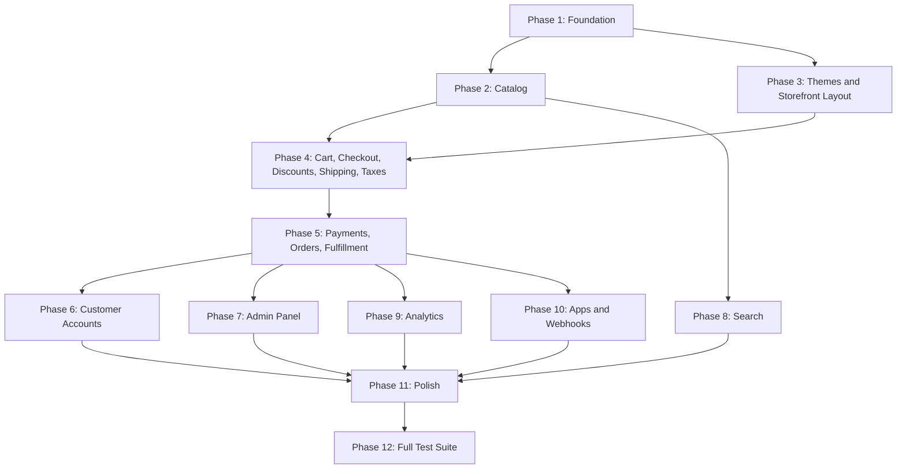

# 09 - Implementation Roadmap and Pest Test Specification

> E-commerce platform - Step-by-step build order and exhaustive test plan for Laravel 12 + Livewire v4 + Flux UI Free + SQLite + Tailwind CSS v4

---

## 1. Technology Decisions (Final)

These decisions adapt the original PDF spec for a self-contained, benchmarkable Laravel application. All decisions are final and must not be revisited.

| Concern | PDF Default | Our Decision | Rationale |
|---------|-------------|--------------|-----------|
| Database | PostgreSQL | SQLite | Self-contained, no external DB, zero config |
| Cache | Redis | File (Array for tests) | No Redis dependency |
| Session | Redis | File | No Redis dependency |
| Queue | Redis + Horizon | Sync (dev) / Database (prod) | No Redis dependency, sync for immediate feedback |
| Search | Elasticsearch + Scout | SQLite FTS5 | Self-contained, no external service |
| Storage | S3 | Local filesystem (storage/app/public) | No AWS dependency |
| Admin UI | React/Vue SPA | Livewire v4 + Flux UI Free | Server-rendered, matches project stack |
| Storefront | Blade SSR + Vite | Blade + Livewire + Tailwind v4 | Server-rendered, matches project stack |
| Auth (admin) | Sanctum SPA | Laravel session auth | Standard Livewire auth pattern |
| Auth (API) | Sanctum tokens | Sanctum personal access tokens | For programmatic API access |
| Auth (customer) | Separate guard | Custom `customer` guard | Storefront customer auth |
| OAuth (apps) | Passport | Deferred/Stubbed | Simplifies initial build, can add later |
| Payments | Stripe + PayPal | Mock PSP (in-process) | No external API calls. MockPaymentProvider handles credit card, PayPal, bank transfer with magic card numbers for testing. |
| Email | SMTP/SES | Log driver (dev) / SMTP | Log for benchmark, SMTP configurable |
| Monitoring | OpenTelemetry | Laravel Log (structured JSON) | Simplified for benchmark |
| CI/CD | GitHub Actions | Not implemented | Out of scope for one-shot benchmark |
| Docker | Multi-stage | Not implemented | App served by Laravel Herd locally |

---

## Playwright MCP Verification Protocol

CRITICAL: After completing each phase that produces user-facing UI, you MUST verify it works
by performing real browser interactions using Playwright MCP tools. This is NOT optional.

### Rules

1. **Render tests are not enough.** Visiting a page and confirming text appears does NOT count
   as verification. You must perform every user action (click buttons, fill forms, select options)
   and verify the resulting state change.

2. **Click every interactive element.** Every button, link, dropdown, and form input on a page
   must be tested. If a button exists in the UI, click it and verify it does something. If a
   link exists, click it and verify it navigates (not broken by anchors, encoding, or missing
   routes). If a form exists, fill and submit it.

3. **Check page completeness against the spec.** After a page renders, compare what you see
   against spec 03 (Admin UI) or spec 04 (Storefront UI). If the spec says "sort dropdown",
   verify a sort dropdown exists and works. If the spec says "breadcrumbs", verify breadcrumbs
   render. Missing elements = failing verification.

4. **Check for JavaScript errors.** After each page interaction, check the browser console for
   JS errors (ReferenceError, TypeError, etc.). A page that renders but has JS errors is broken.
   Use `browser_console_messages` to check.

5. **Verify link navigation.** When a page contains links to other pages (e.g., order links,
   product links), click at least one link and confirm it navigates to the correct destination.
   Watch for URLs broken by special characters (e.g., `#` in order numbers becoming anchor
   fragments).

6. **Verify after each phase, not at the end.** Each phase below includes a "Playwright MCP
   Verification" checklist. You must execute every item using the Playwright MCP tools (navigate,
   click, fill, snapshot) and confirm the expected result before moving to the next phase.

7. **If a verification fails, fix it before proceeding.** A failing interaction means the feature
   is broken. Do not move to the next phase until all verification items pass.

8. **Log results.** After each verification, briefly note what passed/failed in specs/progress.md.

---

## 2. Implementation Phases (Build Order)

Each phase builds on the previous. A coding agent should execute these in strict sequential order. Tests are written alongside each phase (see Section 3 for the full test specification).

### Phase Dependency Graph

---

### Phase 1: Foundation (Migrations, Models, Middleware, Auth)

**Priority:** CRITICAL - everything depends on this.

#### Step 1.1: Environment and Config

| Config File | Setting | Value | Purpose |
|-------------|---------|-------|---------|
| `.env` | `DB_CONNECTION` | `sqlite` | Use SQLite as database |
| `.env` | `DB_DATABASE` | `database/database.sqlite` | SQLite database file path |
| `.env` | `CACHE_STORE` | `file` | File-based caching |
| `.env` | `SESSION_DRIVER` | `file` | File-based sessions |
| `.env` | `QUEUE_CONNECTION` | `sync` | Synchronous queue for dev |
| `.env` | `MAIL_MAILER` | `log` | Log-based mail for dev |
| `.env` | `FILESYSTEM_DISK` | `local` | Local filesystem storage |
| `config/database.php` | SQLite connection | WAL mode, foreign keys enabled, busy_timeout=5000, synchronous=normal | Optimized SQLite configuration |
| `config/session.php` | `driver` | `file` | Session driver |
| `config/session.php` | `lifetime` | `120` | Session lifetime in minutes |
| `config/cache.php` | `default` | `file` | Cache driver |
| `config/queue.php` | `default` | `sync` | Queue driver |
| `config/auth.php` | Guards | Add `customer` guard with `customers` provider | Customer storefront authentication |
| `config/auth.php` | Providers | Add `customers` provider pointing to Customer model | Customer user provider |
| `config/auth.php` | Passwords | Add `customers` password broker | Customer password reset |
| `config/filesystems.php` | `public` disk | Ensure configured for local storage | Media file storage |
| `config/logging.php` | Channels | Add structured JSON channel | Structured logging |

#### Step 1.2: Core Migrations (Batch 1-2)

Create in this dependency order:

1. `create_organizations_table` - no dependencies
2. `create_stores_table` - FK: `organization_id`
3. `create_store_domains_table` - FK: `store_id`
4. Modify default `users` migration - add `status`, `last_login_at`, `two_factor_*` columns; rename `password` to `password_hash` internally
5. `create_store_users_table` - composite PK: `store_id` + `user_id`, with `role` column
6. `create_store_settings_table` - PK: `store_id`

All monetary amounts stored as INTEGER in minor units (cents). All enums stored as TEXT with CHECK constraints. All timestamps as TEXT (ISO-8601) via Laravel.

#### Step 1.3: Core Models

**Files to create:**

| Type | Name | Purpose |
|------|------|---------|
| Model (with migration, factory, seeder) | `Organization` | Top-level tenant entity |
| Model (with migration, factory, seeder) | `Store` | Individual store within an organization |
| Model (with migration, factory, seeder) | `StoreDomain` | Domain mapping for a store |
| Model (pivot) | `StoreUser` | Pivot model with `role` attribute, custom Pivot class |
| Model (with migration, factory, seeder) | `StoreSettings` | Per-store configuration |

**Relationship definitions:**

| Model | Key Relationships |
|-------|-------------------|
| `Organization` | `hasMany(Store::class)` |
| `Store` | `belongsTo(Organization::class)`, `hasMany(StoreDomain::class)`, `belongsToMany(User::class)` through `store_users`, `hasOne(StoreSettings::class)` |
| `StoreDomain` | `belongsTo(Store::class)` |
| `User` | `belongsToMany(Store::class)` through `store_users` |
| `StoreUser` | Pivot model with `role` attribute, custom `Pivot` class |
| `StoreSettings` | `belongsTo(Store::class)` |

Each model must have:
- Explicit return type declarations on all methods
- Proper `$fillable` or `$guarded` arrays
- `casts()` method for JSON/enum columns
- Factory with meaningful default values
- Seeder that creates sample data

#### Step 1.4: Enums

**Files to create in `app/Enums/`:**

| Enum | Values |
|------|--------|
| `StoreStatus` | `Active`, `Suspended` |
| `StoreUserRole` | `Owner`, `Admin`, `Staff`, `Support` |
| `StoreDomainType` | `Storefront`, `Admin`, `Api` |

#### Step 1.5: Tenant Resolution Middleware

**File to create:** `App\Http\Middleware\ResolveStore`

Requirements:
1. Storefront routes: extract hostname from the request, look up `store_domains`, cache hostname-to-store_id for 5 minutes, bind `Store` as singleton via container instance `current_store`
2. Admin routes: read `current_store_id` from session, verify user has `store_users` record
3. Return 404 if hostname not found
4. Return 503 for suspended stores on storefront routes

**Registration in `bootstrap/app.php`:**
- Register middleware group `storefront` containing `ResolveStore`
- Register middleware group `admin` containing `ResolveStore`

#### Step 1.6: BelongsToStore Trait and Global Scope

**Files to create:**

| Type | Name | Purpose |
|------|------|---------|
| Trait | `App\Models\Concerns\BelongsToStore` | Applies StoreScope and auto-sets store_id on creating event |
| Scope | `App\Models\Scopes\StoreScope` | Applies `where('store_id', app('current_store')->id)` to all queries |

Applied on: products, collections, customers, orders, carts, checkouts, discounts, shipping_zones, themes, pages, navigation_menus, analytics_events, analytics_daily, webhook_subscriptions, inventory_items, search_queries.

#### Step 1.7: Authentication

**Admin auth requirements:**

| Component | Description |
|-----------|-------------|
| Livewire component `Admin\Auth\Login` | Admin login form |
| Livewire component `Admin\Auth\Logout` | Admin logout action |
| Auth mechanism | Standard Laravel session auth via `Auth::guard('web')->attempt()` |
| Rate limiting | 5 attempts per minute per IP via `RateLimiter::for('login')` |
| Password reset | Standard Laravel flow with `Password::broker('users')` |

**Customer auth requirements:**

| Component | Description |
|-----------|-------------|
| Custom guard | `customer` guard with `customers` provider |
| Custom user provider | `CustomerUserProvider` that injects `store_id` into queries |
| Livewire component `Storefront\Account\Auth\Login` | Customer login form |
| Livewire component `Storefront\Account\Auth\Register` | Customer registration form |
| Uniqueness | Customer email unique per store, not globally |
| Rate limiting | 5 attempts per minute per IP |

**Rate limiter registration:**
- Register rate limiters in `AppServiceProvider::boot()` for login (5 per minute per IP)

#### Step 1.8: Authorization

**Files to create:**

| Type | Name | Purpose |
|------|------|---------|
| Policy | `ProductPolicy` | Product authorization based on store role |
| Policy | `OrderPolicy` | Order authorization based on store role |
| Policy | `CollectionPolicy` | Collection authorization based on store role |
| Policy | `DiscountPolicy` | Discount authorization based on store role |
| Policy | `CustomerPolicy` | Customer authorization based on store role |
| Policy | `StorePolicy` | Store authorization based on store role |
| Policy | `PagePolicy` | Page authorization based on store role |
| Policy | `ThemePolicy` | Theme authorization based on store role |
| Policy | `FulfillmentPolicy` | Fulfillment authorization based on store role |
| Policy | `RefundPolicy` | Refund authorization based on store role |

Each policy checks user role via `store_users` pivot for the current store. Helper on User model: `roleForStore(Store $store): ?StoreUserRole`. Register policies via auto-discovery or explicit binding in `AppServiceProvider`.

**Permission Matrix:**

| Permission | Owner | Admin | Staff | Support |
|------------|:-----:|:-----:|:-----:|:-------:|
| Manage store settings | Y | Y | N | N |
| Delete store | Y | N | N | N |
| Manage staff | Y | Y | N | N |
| Manage products (CRUD) | Y | Y | Y | N |
| Delete/archive products | Y | Y | N | N |
| Manage orders | Y | Y | Y | Read-only |
| Process refunds | Y | Y | N | N |
| Create fulfillments | Y | Y | Y | N |
| Manage discounts | Y | Y | Y | N |
| Manage themes | Y | Y | N | N |
| Manage apps | Y | Y | N | N |
| View analytics | Y | Y | Y | N |
| Manage shipping/tax | Y | Y | N | N |
| View customers | Y | Y | Y | Y |
| Update customers | Y | Y | Y | N |

#### Playwright MCP Verification

- [ ] Navigate to `http://shop.test/admin/login` -> confirm login form renders (assertSee "Sign in")
- [ ] Fill email `admin@acme.test`, fill password `password`, click "Sign in" -> confirm redirect to `/admin` (assertSee "Dashboard")
- [ ] Navigate to `http://shop.test/admin` while unauthenticated -> confirm redirect to `/admin/login`

---

### Phase 2: Catalog (Products, Variants, Inventory, Collections, Media)

**Priority:** HIGH - storefront and orders depend on this.

#### Step 2.1: Migrations (Batch 3-5)

Create in dependency order:

1. `create_products_table` - FK: `store_id`
2. `create_product_options_table` - FK: `product_id`
3. `create_product_option_values_table` - FK: `product_option_id`
4. `create_product_variants_table` - FK: `product_id`
5. `create_variant_option_values_table` - composite PK: `variant_id` + `product_option_value_id`
6. `create_inventory_items_table` - FK: `store_id`, `variant_id`
7. `create_collections_table` - FK: `store_id`
8. `create_collection_products_table` - composite PK: `collection_id` + `product_id`
9. `create_product_media_table` - FK: `product_id`

#### Step 2.2: Models with Relationships

**Files to create:**

| Type | Name | Purpose |
|------|------|---------|
| Model (with migration, factory, seeder) | `Product` | Product entity |
| Model (with migration, factory, seeder) | `ProductOption` | Product option (e.g., Size, Color) |
| Model (with migration, factory, seeder) | `ProductOptionValue` | Option values (e.g., S, M, L) |
| Model (with migration, factory, seeder) | `ProductVariant` | Product variant (SKU-level) |
| Model (with migration, factory, seeder) | `InventoryItem` | Inventory tracking per variant |
| Model (with migration, factory, seeder) | `Collection` | Product collection/category |
| Model (with migration, factory, seeder) | `ProductMedia` | Product images and videos |

**Relationship definitions:**

| Model | Key Relationships |
|-------|-------------------|
| `Product` | `hasMany(ProductVariant)`, `hasMany(ProductOption)`, `hasMany(ProductMedia)`, `belongsToMany(Collection)` via `collection_products` |
| `ProductOption` | `belongsTo(Product)`, `hasMany(ProductOptionValue)` |
| `ProductOptionValue` | `belongsTo(ProductOption)` |
| `ProductVariant` | `belongsTo(Product)`, `hasOne(InventoryItem)`, `belongsToMany(ProductOptionValue)` via `variant_option_values` |
| `InventoryItem` | `belongsTo(ProductVariant)` |
| `Collection` | `belongsToMany(Product)` via `collection_products` |
| `ProductMedia` | `belongsTo(Product)` |

**Enums to create:**

| Enum | Values |
|------|--------|
| `ProductStatus` | `Draft`, `Active`, `Archived` |
| `VariantStatus` | `Active`, `Archived` |
| `CollectionStatus` | `Draft`, `Active`, `Archived` |
| `MediaType` | `Image`, `Video` |
| `MediaStatus` | `Processing`, `Ready`, `Failed` |
| `InventoryPolicy` | `Deny`, `Continue` |

#### Step 2.3: Product Service

**File to create:** `App\Services\ProductService`

| Method | Description |
|--------|-------------|
| `create(Store $store, array $data): Product` | Creates product with nested variants/options |
| `update(Product $product, array $data): Product` | Updates product |
| `transitionStatus(Product $product, ProductStatus $newStatus): void` | Validates transitions per state machine |
| `delete(Product $product): void` | Hard delete only if draft with no order references; otherwise throws |

**File to create:** `App\Services\VariantMatrixService`

| Method | Description |
|--------|-------------|
| `rebuildMatrix(Product $product): void` | Computes cartesian product, creates missing variants, archives orphaned ones |

**File to create:** `App\Support\HandleGenerator`

| Method | Description |
|--------|-------------|
| `generate(string $title, string $table, int $storeId, ?int $excludeId = null): string` | Generates unique slugs |

#### Step 2.4: Inventory Service

**File to create:** `App\Services\InventoryService`

| Method | Description |
|--------|-------------|
| `checkAvailability(InventoryItem $item, int $quantity): bool` | Checks if sufficient available inventory exists |
| `reserve(InventoryItem $item, int $quantity): void` | Increments `quantity_reserved` |
| `release(InventoryItem $item, int $quantity): void` | Decrements `quantity_reserved` |
| `commit(InventoryItem $item, int $quantity): void` | Decrements both `on_hand` and `reserved` |
| `restock(InventoryItem $item, int $quantity): void` | Increments `quantity_on_hand` |

All operations wrapped in database transactions. Throws `InsufficientInventoryException` when policy is `deny` and available < quantity.

#### Step 2.5: Media Upload

**File to create:** `App\Jobs\ProcessMediaUpload`

Requirements:
- Resizes images to standard sizes (thumbnail 150x150, medium 600x600, large 1200x1200)
- Updates `ProductMedia` status from `processing` to `ready` (or `failed`)

Livewire file upload via `WithFileUploads` trait. Stored on local `public` disk.

---

### Phase 3: Themes, Pages, Navigation, Storefront Layout

**Priority:** HIGH - storefront rendering depends on this.

#### Step 3.1: Migrations (Batch 3)

1. `create_themes_table` - FK: `store_id`
2. `create_theme_files_table` - FK: `theme_id`
3. `create_theme_settings_table` - PK: `theme_id`
4. `create_pages_table` - FK: `store_id`
5. `create_navigation_menus_table` - FK: `store_id`
6. `create_navigation_items_table` - FK: `menu_id`

#### Step 3.2: Models

**Files to create:**

| Type | Name | Purpose |
|------|------|---------|
| Model (with migration, factory, seeder) | `Theme` | Store theme entity |
| Model (with migration, factory, seeder) | `ThemeFile` | Individual theme file |
| Model (with migration, factory, seeder) | `ThemeSettings` | Theme configuration |
| Model (with migration, factory, seeder) | `Page` | CMS page |
| Model (with migration, factory, seeder) | `NavigationMenu` | Navigation menu entity |
| Model (with migration, factory, seeder) | `NavigationItem` | Individual navigation item |

**Relationship definitions:**

| Model | Key Relationships |
|-------|-------------------|
| `Theme` | `belongsTo(Store)`, `hasMany(ThemeFile)`, `hasOne(ThemeSettings)` |
| `ThemeFile` | `belongsTo(Theme)` |
| `ThemeSettings` | `belongsTo(Theme)` |
| `Page` | `belongsTo(Store)` |
| `NavigationMenu` | `belongsTo(Store)`, `hasMany(NavigationItem)` |
| `NavigationItem` | `belongsTo(NavigationMenu)` |

**Enums to create:**

| Enum | Values |
|------|--------|
| `ThemeStatus` | `Draft`, `Published` |
| `PageStatus` | `Draft`, `Published`, `Archived` |
| `NavigationItemType` | `Link`, `Page`, `Collection`, `Product` |

#### Step 3.3: Storefront Blade Layout

**Directory structure for `resources/views/storefront/`:**

| Directory | Files |
|-----------|-------|
| `layouts/` | `app.blade.php` |
| `pages/` | `home.blade.php`, `collection.blade.php`, `product.blade.php`, `cart.blade.php`, `search.blade.php`, `page.blade.php` |
| `checkout/` | `index.blade.php`, `confirmation.blade.php` |
| `account/` | `login.blade.php`, `register.blade.php`, `dashboard.blade.php` |
| `account/orders/` | `index.blade.php`, `show.blade.php` |
| `account/addresses/` | `index.blade.php` |
| `errors/` | `404.blade.php`, `503.blade.php` |
| `components/` | `product-card.blade.php`, `price.blade.php`, `badge.blade.php`, `quantity-selector.blade.php`, `address-form.blade.php`, `order-summary.blade.php`, `breadcrumbs.blade.php`, `pagination.blade.php` |

Base layout (`app.blade.php`): header with nav, announcement bar, main content, footer, cart drawer. All with dark mode support via `dark:` prefix.

**ThemeSettings Service:** Singleton registered in `AppServiceProvider`, loads and caches active theme settings for the current store.

#### Step 3.4: Storefront Livewire Components

**Files to create:**

| Component | Purpose |
|-----------|---------|
| `Storefront\Home` | Dynamic sections based on theme settings |
| `Storefront\Collections\Index` | All collections grid |
| `Storefront\Collections\Show` | Product grid with filters/sort/pagination |
| `Storefront\Products\Show` | Variant selection, image gallery, add-to-cart |
| `Storefront\Cart\Show` | Full cart page with line items and totals |
| `Storefront\CartDrawer` | Slide-out cart drawer (always in layout) |
| `Storefront\Search\Index` | Search results with filters |
| `Storefront\Search\Modal` | Search modal with autocomplete |
| `Storefront\Pages\Show` | Static CMS page rendering |

#### Step 3.5: Navigation Service

**File to create:** `App\Services\NavigationService`

| Method | Description |
|--------|-------------|
| `buildTree(NavigationMenu $menu): array` | Builds navigation trees from navigation_menus / navigation_items |
| `resolveUrl(NavigationItem $item): string` | Resolves URLs for page, collection, product type items |

Caches per store with 5-minute TTL.

#### Playwright MCP Verification

**Home page (`/`):**
- [ ] Navigate to `http://shop.test/` -> confirm storefront renders (NOT the Laravel welcome page)
- [ ] Confirm hero banner with heading, subheading, and "Shop Now" CTA button
- [ ] Click "Shop Now" -> confirm navigation to `/collections`
- [ ] Confirm featured collections section shows collection cards with product counts
- [ ] Confirm featured products section shows product cards with titles and prices in EUR
- [ ] Check browser console for JS errors -> confirm none

**Navigation and layout:**
- [ ] Confirm header has logo, search icon, cart icon, account link
- [ ] Confirm main navigation menu has items (links to collections, pages) - NOT empty
- [ ] Click a navigation menu link -> confirm it navigates to the correct page
- [ ] Click cart icon in header -> confirm cart drawer opens (not broken by Alpine/Livewire event mismatch)
- [ ] Confirm footer has link columns, store info (not just copyright)
- [ ] Confirm page `<title>` is page-specific (e.g., "Acme Fashion" on home, "T-Shirts - Acme Fashion" on collection)

**Collections:**
- [ ] Navigate to `http://shop.test/collections` -> confirm collections listing with product counts
- [ ] Click a collection -> confirm collection page renders with product grid
- [ ] Confirm collection page has: breadcrumbs, sort dropdown, product cards with images/prices
- [ ] Use the sort dropdown -> confirm products reorder
- [ ] Confirm product cards show: title, price, product image (not just placeholder icon)

**Product page:**
- [ ] Navigate to `http://shop.test/products/classic-cotton-t-shirt` -> confirm product title, price, description, variant selectors, Add to Cart button
- [ ] Confirm breadcrumbs render (Home > Collection > Product)
- [ ] Change variant selection (e.g., select different size) -> confirm price updates if variants have different prices
- [ ] Confirm stock messaging shows (e.g., "In stock")
- [ ] Confirm quantity selector is present ([-] [qty] [+] stepper)
- [ ] Navigate to a product with `inventory_policy: deny` and 0 stock -> confirm "Sold out" message and Add to Cart is disabled

**Other pages:**
- [ ] Navigate to `http://shop.test/pages/about` -> confirm page content renders with proper prose styling
- [ ] Navigate to `http://shop.test/account/login` -> confirm login form renders (NOT 404)
- [ ] Navigate to `http://shop.test/account/register` -> confirm registration form renders (NOT 404)
- [ ] Navigate to a non-existent URL -> confirm custom 404 page renders within storefront layout (not default Laravel 404)

---

### Phase 4: Cart, Checkout, Discounts, Shipping, Taxes

**Priority:** HIGH - core shopping flow.

#### Step 4.1: Migrations (Batch 4-5)

1. `create_carts_table` - FK: `store_id`, `customer_id`
2. `create_cart_lines_table` - FK: `cart_id`, `variant_id`
3. `create_checkouts_table` - FK: `store_id`, `cart_id`, `customer_id`
4. `create_shipping_zones_table` - FK: `store_id`
5. `create_shipping_rates_table` - FK: `zone_id`
6. `create_tax_settings_table` - PK: `store_id`
7. `create_discounts_table` - FK: `store_id`

#### Step 4.2: Models

**Files to create:**

| Type | Name | Purpose |
|------|------|---------|
| Model (with migration, factory, seeder) | `Cart` | Shopping cart entity |
| Model (with migration, factory, seeder) | `CartLine` | Individual cart line item |
| Model (with migration, factory, seeder) | `Checkout` | Checkout session entity |
| Model (with migration, factory, seeder) | `ShippingZone` | Shipping zone configuration |
| Model (with migration, factory, seeder) | `ShippingRate` | Shipping rate within a zone |
| Model (with migration, factory, seeder) | `TaxSettings` | Per-store tax configuration |
| Model (with migration, factory, seeder) | `Discount` | Discount code or automatic discount |

**Relationship definitions:**

| Model | Key Relationships |
|-------|-------------------|
| `Cart` | `belongsTo(Store)`, `belongsTo(Customer)`, `hasMany(CartLine)`, `hasMany(Checkout)` |
| `CartLine` | `belongsTo(Cart)`, `belongsTo(ProductVariant)` |
| `Checkout` | `belongsTo(Store)`, `belongsTo(Cart)`, `belongsTo(Customer)` |
| `ShippingZone` | `belongsTo(Store)`, `hasMany(ShippingRate)` |
| `ShippingRate` | `belongsTo(ShippingZone)` |
| `TaxSettings` | `belongsTo(Store)` |
| `Discount` | `belongsTo(Store)` |

**Enums to create:**

| Enum | Values |
|------|--------|
| `CartStatus` | `Active`, `Converted`, `Abandoned` |
| `CheckoutStatus` | `Started`, `Addressed`, `ShippingSelected`, `PaymentPending`, `Completed`, `Expired` |
| `DiscountType` | `Code`, `Automatic` |
| `DiscountValueType` | `Percent` (`percent`), `Fixed` (`fixed`), `FreeShipping` (`free_shipping`) -- PascalCase cases backed by lowercase string values stored in DB |
| `DiscountStatus` | `Draft`, `Active`, `Expired`, `Disabled` |
| `ShippingRateType` | `Flat`, `Weight`, `Price`, `Carrier` |
| `TaxMode` | `Manual`, `Provider` |

#### Step 4.3: Cart Service

**File to create:** `App\Services\CartService`

| Method | Description |
|--------|-------------|
| `create(Store, ?Customer): Cart` | Creates cart with store currency, version 1 |
| `addLine(Cart, int $variantId, int $qty): CartLine` | Validates variant/product active, inventory, increments existing line or creates new |
| `updateLineQuantity(Cart, int $lineId, int $qty): CartLine` | Validates quantity, recalculates amounts |
| `removeLine(Cart, int $lineId): void` | Deletes line, increments version |
| `getOrCreateForSession(Store, ?Customer): Cart` | Session-based cart binding |
| `mergeOnLogin(Cart $guest, Cart $customer): Cart` | Merges guest cart into customer cart |

All mutations increment `cart_version`. API clients must send `expected_version` or receive 409 Conflict.

#### Step 4.4: Discount Service

**File to create:** `App\Services\DiscountService`

| Method | Description |
|--------|-------------|
| `validate(string $code, Store $store, Cart $cart): Discount` | Validates code exists, is active, dates valid, usage limit not reached, minimum purchase met |
| `calculate(Discount $discount, int $subtotal, array $lines): DiscountResult` | Calculates amount, allocates proportionally across qualifying lines |

Case-insensitive code lookup. Throws `InvalidDiscountException` with specific reason codes.

#### Step 4.5: Shipping Calculator

**File to create:** `App\Services\ShippingCalculator`

| Method | Description |
|--------|-------------|
| `getAvailableRates(Store $store, array $address): Collection` | Matches zones by country/region, returns active rates |
| `calculate(ShippingRate $rate, Cart $cart): int` | Calculates cost based on rate type (flat/weight/price) |

Zone matching: checks `countries_json` for country code, then `regions_json` for region code.

#### Step 4.6: Tax Calculator

**File to create:** `App\Services\TaxCalculator`

| Method | Description |
|--------|-------------|
| `calculate(int $amount, TaxSettings $settings, array $address): TaxResult` | Calculates tax per manual rate or provider |
| `extractInclusive(int $grossAmount, int $rateBasisPoints): int` | Extracts tax from gross (prices-include-tax mode) |
| `addExclusive(int $netAmount, int $rateBasisPoints): int` | Adds tax to net amount |

All math uses integers. Rates stored in basis points (1900 = 19%).

#### Step 4.7: Pricing Engine

**File to create:** `App\Services\PricingEngine`

Method: `calculate(Checkout $checkout): PricingResult`

**Pipeline steps:**
1. Line subtotals: `unit_price * quantity` per line
2. Cart subtotal: sum of line subtotals
3. Discount: apply rules, allocate proportionally
4. Discounted subtotal: subtotal minus discount
5. Shipping: based on selected method/rate
6. Tax: on discounted amounts (plus shipping if taxable)
7. Total: discounted_subtotal + shipping + tax_total

Result stored in `checkouts.totals_json` as snapshot.

**Value objects to create:**

| Type | Name | Fields |
|------|------|--------|
| Value Object | `App\ValueObjects\PricingResult` | subtotal, discount, shipping, taxLines, taxTotal, total, currency |
| Value Object | `App\ValueObjects\TaxLine` | name, rate (basis points), amount (cents) |

#### Step 4.8: Checkout State Machine

**File to create:** `App\Services\CheckoutService`

| Transition | Method | Requirements |
|------------|--------|-------------|
| `started` -> `addressed` | `setAddress(Checkout, array)` | Valid email, shipping address fields |
| `addressed` -> `shipping_selected` | `setShippingMethod(Checkout, int $rateId)` | Rate belongs to applicable zone |
| `shipping_selected` -> `payment_selected` | `selectPaymentMethod(Checkout, string)` | All data valid, reserve inventory |
| `payment_selected` -> `completed` | `completeCheckout(Checkout, array)` | Payment confirmed, idempotent |
| Any active -> `expired` | `expireCheckout(Checkout)` | Via scheduled job |

**Files to create:**

| Type | Name | Purpose |
|------|------|---------|
| Job | `App\Jobs\ExpireAbandonedCheckouts` | Runs every 15 minutes via `routes/console.php`; finds checkouts with `expires_at < now()` and active status; releases reserved inventory, transitions to `expired` |
| Job | `App\Jobs\CleanupAbandonedCarts` | Runs daily; marks carts with `status = active` and `updated_at < 14 days ago` as `abandoned` |

#### Step 4.9: Storefront Cart/Checkout UI

**Files to create:**

| Component | Description |
|-----------|-------------|
| `Storefront\CartDrawer` | Slide-out panel: line items, quantity controls, discount code input, subtotal, checkout button |
| `Storefront\Cart\Show` | Full cart page with same functionality plus shipping estimate |
| `Storefront\Checkout\Show` | Multi-step: Contact/Address -> Shipping method -> Payment. Stepper UI. |
| `Storefront\Checkout\Confirmation` | Order confirmation: order number, items, totals, next steps |

#### Playwright MCP Verification

**Add to cart (the most critical interaction):**
- [ ] Navigate to `/products/classic-cotton-t-shirt`
- [ ] Confirm variant selectors have `wire:model` bindings (changing selection must do something)
- [ ] Select size "M", select color "Black"
- [ ] Click "Add to cart" -> confirm cart drawer opens showing "Classic Cotton T-Shirt" and "24.99"
- [ ] Close cart drawer, click cart icon in header -> confirm cart drawer reopens showing the item (not empty/static)
- [ ] Check browser console for JS errors -> confirm none

**Cart page:**
- [ ] Navigate to `/cart` -> confirm item appears with correct title, variant (M / Black), and price (24.99 EUR)
- [ ] Click "+" to increment quantity -> confirm quantity shows 2, line total shows 49.98
- [ ] Click "-" to decrement quantity -> confirm quantity shows 1, line total shows 24.99
- [ ] Enter discount code "WELCOME10", click "Apply" -> confirm 10% discount applied and totals update
- [ ] Click "Remove" -> confirm "Your cart is empty" message
- [ ] Confirm empty cart state does NOT show "Proceed to Checkout" button

**Checkout flow:**
- [ ] Add product again, navigate to `/checkout` -> confirm checkout form renders with address/contact step
- [ ] Fill email, name, address fields, click "Continue" -> confirm shipping method step renders
- [ ] Confirm shipping rates display with correct amounts (e.g., "Standard Shipping - 4.99 EUR", not "0.00 EUR")
- [ ] Select shipping method, click "Continue" -> confirm payment step renders
- [ ] Fill payment details (card 4242424242424242, any expiry/CVV), click "Pay" -> confirm order confirmation page
- [ ] Confirm order confirmation shows: order number, "Thank you" message, line items, totals
- [ ] Click "View Order" link on confirmation page -> confirm it navigates correctly (not broken by `#` in URL)

---

### Phase 5: Payments, Orders, Fulfillment

**Priority:** HIGH - completes the purchase flow.

#### Step 5.1: Migrations (Batch 5-7)

1. `create_customers_table` - FK: `store_id`
2. `create_customer_addresses_table` - FK: `customer_id`
3. `create_orders_table` - FK: `store_id`, `customer_id`
4. `create_order_lines_table` - FK: `order_id`, `product_id` (nullable), `variant_id` (nullable)
5. `create_payments_table` - FK: `order_id`
6. `create_refunds_table` - FK: `order_id`, `payment_id`
7. `create_fulfillments_table` - FK: `order_id`
8. `create_fulfillment_lines_table` - FK: `fulfillment_id`, `order_line_id`

#### Step 5.2: Models

**Files to create:**

| Type | Name | Purpose |
|------|------|---------|
| Model (with migration, factory, seeder) | `Customer` | Store customer entity |
| Model (with migration, factory, seeder) | `CustomerAddress` | Customer address |
| Model (with migration, factory, seeder) | `Order` | Order entity |
| Model (with migration, factory, seeder) | `OrderLine` | Order line item |
| Model (with migration, factory, seeder) | `Payment` | Payment record |
| Model (with migration, factory, seeder) | `Refund` | Refund record |
| Model (with migration, factory, seeder) | `Fulfillment` | Fulfillment record |
| Model (with migration, factory, seeder) | `FulfillmentLine` | Fulfillment line item |

**Relationship definitions:**

| Model | Key Relationships |
|-------|-------------------|
| `Customer` | `belongsTo(Store)`, `hasMany(CustomerAddress)`, `hasMany(Order)`, `hasMany(Cart)` |
| `CustomerAddress` | `belongsTo(Customer)` |
| `Order` | `belongsTo(Store)`, `belongsTo(Customer)`, `hasMany(OrderLine)`, `hasMany(Payment)`, `hasMany(Refund)`, `hasMany(Fulfillment)` |
| `OrderLine` | `belongsTo(Order)`, `belongsTo(Product)` (nullable), `belongsTo(ProductVariant)` (nullable) |
| `Payment` | `belongsTo(Order)` |
| `Refund` | `belongsTo(Order)`, `belongsTo(Payment)` |
| `Fulfillment` | `belongsTo(Order)`, `hasMany(FulfillmentLine)` |
| `FulfillmentLine` | `belongsTo(Fulfillment)`, `belongsTo(OrderLine)` |

**Enums to create:**

| Enum | Values |
|------|--------|
| `OrderStatus` | `Pending`, `Paid`, `Fulfilled`, `Cancelled`, `Refunded` |
| `FinancialStatus` | `Pending`, `Authorized`, `Paid`, `PartiallyRefunded`, `Refunded`, `Voided` |
| `FulfillmentStatus` | `Unfulfilled`, `Partial`, `Fulfilled` |
| `PaymentMethod` | `CreditCard`, `Paypal`, `BankTransfer` |
| `PaymentStatus` | `Pending`, `Captured`, `Failed`, `Refunded` |
| `RefundStatus` | `Pending`, `Processed`, `Failed` |
| `FulfillmentShipmentStatus` | `Pending`, `Shipped`, `Delivered` |

#### Step 5.3: Payment Service (Mock PSP)

**Files to create:**

| Type | Name | Purpose |
|------|------|---------|
| Enum | `App\Enums\PaymentMethod` | CreditCard, Paypal, BankTransfer |
| Interface | `App\Contracts\PaymentProvider` | Defines charge, refund methods |
| Service | `App\Services\Payments\MockPaymentProvider` | Implements PaymentProvider with in-process mock logic |

**PaymentProvider interface methods:**

| Method | Description |
|--------|-------------|
| `charge(Checkout $checkout, PaymentMethod $method, array $details): PaymentResult` | Processes payment in-process. For credit_card: validates magic card numbers, returns success/decline. For paypal: always succeeds. For bank_transfer: returns pending (deferred capture). |
| `refund(Payment $payment, int $amount): RefundResult` | Issues a mock refund (always succeeds). |

**MockPaymentProvider requirements:**
- No external API calls, no webhooks, no redirects
- Magic card numbers: `4242424242424242` (success), `4000000000000002` (decline), `4000000000009995` (insufficient funds)
- Credit card / PayPal: instant capture, returns PaymentResult with status=captured
- Bank transfer: deferred capture, returns PaymentResult with status=pending
- Generates mock reference IDs (`mock_` + random string)

**Registration:** Bind `PaymentProvider` interface to `MockPaymentProvider` in `AppServiceProvider`.

#### Step 5.3b: Admin Payment Confirmation

**Files to create:**

| Type | Name | Purpose |
|------|------|---------|
| Job | `App\Jobs\CancelUnpaidBankTransferOrders` | Runs daily via `routes/console.php`; finds bank_transfer orders with `financial_status = pending` and `placed_at < now() - config days`; cancels them and releases reserved inventory |

**Admin "Confirm Payment" action** (in OrderService or dedicated action class):
1. Validate order has `payment_method = bank_transfer` and `financial_status = pending`
2. Update `financial_status` to `paid`, `status` to `paid`
3. Update payment record status to `captured`
4. Commit reserved inventory
5. If all items are digital (`requires_shipping = false`), auto-create a delivered fulfillment
6. Dispatch `OrderPaid` event

#### Step 5.4: Order Service

**File to create:** `App\Services\OrderService`

| Method | Description |
|--------|-------------|
| `createFromCheckout(Checkout $checkout): Order` | Atomic transaction: create order + order lines with snapshots, commit inventory, mark cart converted, dispatch `OrderCreated` event |
| `generateOrderNumber(Store $store): string` | Sequential per store: #1001, #1002, etc. |
| `cancel(Order $order, string $reason): void` | Only if not yet fulfilled, releases inventory |

Order lines store snapshots (`title_snapshot`, `sku_snapshot`) so order history survives product deletion.

#### Step 5.5: Refund Service

**File to create:** `App\Services\RefundService`

| Method | Description |
|--------|-------------|
| `create(Order $order, Payment $payment, int $amount, ?string $reason, bool $restock): Refund` | Validates amount does not exceed payment, calls provider refund API, updates financial status |

- Partial refunds: `financial_status` -> `partially_refunded`
- Full refunds: `financial_status` -> `refunded`
- Restock flag: calls `InventoryService::restock()` for each line

#### Step 5.6: Fulfillment Service

**File to create:** `App\Services\FulfillmentService`

| Method | Description |
|--------|-------------|
| `create(Order $order, array $lines, ?array $tracking): Fulfillment` | Creates fulfillment with specified lines and quantities. **Fulfillment guard:** Throws exception if `financial_status` is not `paid` or `partially_refunded`. |
| `markAsShipped(Fulfillment $fulfillment, ?array $tracking): void` | Sets tracking info, transitions to `shipped`, sets `shipped_at` |
| `markAsDelivered(Fulfillment $fulfillment): void` | Transitions to `delivered`, sets `delivered_at`. Dispatches `FulfillmentDelivered` event. |

Updates `order.fulfillment_status` based on whether all lines are fulfilled (`fulfilled`) or some (`partial`).

**Fulfillment guard:** Before creating a fulfillment, the service checks that the order's `financial_status` is `paid` or `partially_refunded`. If the guard fails, a `FulfillmentGuardException` is thrown. This prevents shipping items before payment is confirmed (especially important for bank transfer orders).

**Events to create:**

| Type | Name | Purpose |
|------|------|---------|
| Event | `OrderCreated` | Dispatched when order is created from checkout |
| Event | `OrderPaid` | Dispatched when payment is captured |
| Event | `OrderFulfilled` | Dispatched when all order lines are fulfilled |
| Event | `OrderCancelled` | Dispatched when order is cancelled |
| Event | `OrderRefunded` | Dispatched when refund is processed |

#### Playwright MCP Verification

- [ ] Complete a full purchase flow: navigate to product, add to cart, go to checkout, fill address, select shipping, pay with card 4242424242424242 -> confirm order confirmation page with order number
- [ ] Navigate to `/admin/login`, log in as admin, navigate to Orders -> confirm the new order appears in the list
- [ ] Click the order -> confirm line items, payment status "Paid", fulfillment status "Unfulfilled"

---

### Phase 6: Customer Accounts

**Priority:** MEDIUM - enhances the shopping experience.

#### Step 6.1: Customer Auth

- `Customer` model with custom `customer` guard (already configured in Phase 1)
- Custom `CustomerUserProvider` - scopes queries by `store_id`
- Customer email unique per store, not globally

#### Step 6.2: Customer Account Pages (Livewire)

**Files to create:**

| Component | Route | Description |
|-----------|-------|-------------|
| `Storefront\Account\Auth\Login` | `GET /account/login` | Login form |
| `Storefront\Account\Auth\Register` | `GET /account/register` | Registration form |
| `Storefront\Account\Dashboard` | `GET /account` | Overview with recent orders |
| `Storefront\Account\Orders\Index` | `GET /account/orders` | Paginated order history |
| `Storefront\Account\Orders\Show` | `GET /account/orders/{orderNumber}` | Order detail with timeline |
| `Storefront\Account\Addresses\Index` | `GET /account/addresses` | Address book CRUD |

Logout: `POST /account/logout` handled by Livewire action. Invalidates session, regenerates CSRF token, redirects to `/account/login`.

#### Playwright MCP Verification

**Registration:**
- [ ] Navigate to `/account/register`
- [ ] Fill name, email, password, confirm password, click "Create account" -> confirm redirect to customer dashboard
- [ ] Confirm dashboard shows welcome message with customer name
- [ ] Confirm dashboard has quick link cards (Orders, Addresses, Log out)

**Login/Logout:**
- [ ] Click "Log out" -> confirm redirect to `/account/login`
- [ ] Navigate to `/account/login`, fill credentials, click "Sign in" -> confirm dashboard access

**Order history:**
- [ ] Navigate to `/account/orders` -> confirm order history table renders with orders
- [ ] Confirm order status badges render with visible text and color (not empty `` tags)
- [ ] Click "View" link on an order -> confirm it navigates to the order detail page (NOT broken by `#` in URL)
- [ ] Confirm order detail page shows: order number, date, line items with SKUs, shipping/billing addresses, payment method, totals breakdown

**Addresses:**
- [ ] Navigate to `/account/addresses` -> confirm address list renders
- [ ] Click "+ Add new address" -> confirm modal opens without JS errors
- [ ] Fill address form, submit -> confirm address appears in list
- [ ] Click "Edit" on an address -> confirm edit modal opens and pre-fills data

---

### Phase 7: Admin Panel

**Priority:** MEDIUM - merchant management interface.

#### Step 7.1: Admin Layout

**File to create:** `resources/views/livewire/admin/layout/app.blade.php`

**Components to create:**

| Component | Description |
|-----------|-------------|
| `Admin\Layout\Sidebar` | Fixed left sidebar (256px desktop, overlay mobile), navigation groups, Flux `brand`, `icon`, `separator` |
| `Admin\Layout\TopBar` | Store selector dropdown, user profile, hamburger toggle (mobile) |
| `Admin\Layout\Breadcrumbs` | Dynamic breadcrumb trail |

Toast notifications via Livewire events.

#### Step 7.2: Dashboard

**File to create:** `Admin\Dashboard` Livewire component

Requirements:
- KPI tiles: total sales (period), order count, average order value, conversion rate
- Orders chart (last 30 days line chart)
- Recent orders table (last 10)
- Date range filtering via Livewire properties

#### Step 7.3: Product Management

**Files to create:**

| Component | Description |
|-----------|-------------|
| `Admin\Products\Index` | Product list with search, status filter, bulk actions (archive, delete), pagination |
| `Admin\Products\Form` | Shared product form component used by both create and edit routes (create vs edit mode). Title, description (rich text), status, vendor, type, tags, variants builder, media upload. |

> **Shared-form pattern:** Create and Edit routes render the same Livewire form component in create vs edit mode. Shared form components follow the pattern `App\Livewire\Admin\{Resource}\Form`, used for both create and edit routes as defined in Spec 03. This applies to Products, Collections, Discounts, and Pages.

Variants builder: dynamic form to add options (Size, Color, etc.) and values, auto-generates variant matrix. Each variant row has price, SKU, barcode, weight, inventory quantity fields.

Media upload: Livewire `WithFileUploads`, drag-and-drop, reorder, alt text editing.

#### Step 7.4: Order Management

**Files to create:**

| Component | Description |
|-----------|-------------|
| `Admin\Orders\Index` | Order list with status filters, search by order number/email, date range |
| `Admin\Orders\Show` | Order detail: timeline, line items, payment info, fulfillment modal, refund modal |

Fulfillment modal: select lines and quantities, add tracking info, submit.
Refund modal: enter amount (partial or full), reason, restock checkbox, submit.

#### Step 7.5: Other Admin Sections

**Files to create:**

| Component | Description |
|-----------|-------------|
| `Admin\Collections\Index` | Collection list |
| `Admin\Collections\Form` | Shared form component for create/edit collection with product picker, reorder products |
| `Admin\Customers\Index` | Customer list with search |
| `Admin\Customers\Show` | Customer detail: info, orders, addresses |
| `Admin\Discounts\Index` | Discount list with status/type filters |
| `Admin\Discounts\Form` | Shared form component for create/edit discount: code, type, value, dates, rules |
| `Admin\Settings\Index` | Tabbed settings: General, Domains, Shipping, Taxes, Checkout, Notifications |
| `Admin\Settings\Shipping` | Shipping zones CRUD, rates CRUD per zone |
| `Admin\Settings\Taxes` | Tax mode toggle, manual rate configuration |
| `Admin\Themes\Index` | Theme cards with Publish/Duplicate/Delete actions |
| `Admin\Themes\Editor` | Left: sections. Center: preview. Right: settings. |
| `Admin\Pages\Index` | Content pages list |
| `Admin\Pages\Form` | Shared form component for create/edit page with rich text editor |
| `Admin\Navigation\Index` | Menu management with drag-and-drop item ordering |
| `Admin\Analytics\Index` | Sales chart, traffic, funnel visualization, date range |
| `Admin\Search\Settings` | Synonyms, stop words, reindex button |
| `Admin\Apps\Index` | App directory |
| `Admin\Apps\Show` | Installed app detail |
| `Admin\Developers\Index` | API token management, webhook subscriptions |

#### Playwright MCP Verification

- [ ] Log in as admin, navigate to Products, click "Add product"
- [ ] Fill product form, click "Save" -> confirm success message, product appears in list
- [ ] Navigate to Orders, click an order -> confirm line items, totals, fulfillment actions
- [ ] Click "Create fulfillment", fill tracking info, click "Fulfill items" -> confirm fulfillment created
- [ ] Navigate to Settings > Shipping -> confirm rates show correct amounts (not 0.00)

---

### Phase 8: Search

**Priority:** LOW - enhances product discovery.

#### Step 8.1: Migrations

1. `create_search_settings_table` - PK: `store_id`
2. `create_search_queries_table` - FK: `store_id`
3. FTS5 virtual table migration (raw SQL) - create `products_fts` virtual table using FTS5 with columns: title, description, vendor, product_type, tags; content synced from `products` table

#### Step 8.2: Search Service

**File to create:** `App\Services\SearchService`

| Method | Description |
|--------|-------------|
| `search(Store $store, string $query, array $filters, int $perPage): LengthAwarePaginator` | FTS5 query with store scoping |
| `autocomplete(Store $store, string $prefix, int $limit): Collection` | Prefix matching for search-as-you-type |
| `syncProduct(Product $product): void` | Upsert into FTS5 index |
| `removeProduct(int $productId): void` | Delete from FTS5 index |

**File to create:** `App\Observers\ProductObserver` - calls `SearchService::syncProduct()` on create/update, `removeProduct()` on delete.

#### Step 8.3: Search UI

**Files to create:**

| Component | Description |
|-----------|-------------|
| `Storefront\Search\Modal` | Search-as-you-type modal with autocomplete results |
| `Storefront\Search\Index` | Full search results page with filters (vendor, price range, collection), sort (relevance, price, newest), pagination |

#### Playwright MCP Verification

- [ ] Click search icon in header -> confirm search modal opens (no Alpine/Livewire event mismatch)
- [ ] Type "t-shirt" in search modal -> confirm autocomplete results appear (not "No results found")
- [ ] Click a search result -> confirm navigation to the product page
- [ ] Navigate to `/search?q=t-shirt` -> confirm search results page shows matching products with result count
- [ ] Check browser console for JS errors -> confirm none

---

### Phase 9: Analytics

**Priority:** LOW - reporting and insights.

#### Step 9.1: Migrations

1. `create_analytics_events_table` - FK: `store_id`, `customer_id`
2. `create_analytics_daily_table` - composite PK: `store_id` + `date`

#### Step 9.2: Analytics Service

**File to create:** `App\Services\AnalyticsService`

| Method | Description |
|--------|-------------|
| `track(Store $store, string $type, array $properties, ?string $sessionId, ?int $customerId): void` | Inserts raw event |
| `getDailyMetrics(Store $store, string $startDate, string $endDate): Collection` | Reads pre-aggregated daily data |

Event types: `page_view`, `product_view`, `add_to_cart`, `remove_from_cart`, `checkout_started`, `checkout_completed`, `search`.

**File to create:** `App\Jobs\AggregateAnalytics`

Requirements:
- Runs daily via `routes/console.php`
- Aggregates raw events into `analytics_daily` rows
- Calculates: orders_count, revenue_amount, aov_amount, visits_count, add_to_cart_count, checkout_started_count

---

### Phase 10: Apps and Webhooks

**Priority:** LOW - extensibility.

#### Step 10.1: Migrations

1. `create_apps_table`
2. `create_app_installations_table` - FK: `store_id`, `app_id`
3. `create_oauth_clients_table` - FK: `app_id`
4. `create_oauth_tokens_table` - FK: `installation_id`
5. `create_webhook_subscriptions_table` - FK: `store_id`, `app_installation_id`
6. `create_webhook_deliveries_table` - FK: `subscription_id`

#### Step 10.2: Webhook Service

**File to create:** `App\Services\WebhookService`

| Method | Description |
|--------|-------------|
| `dispatch(Store $store, string $eventType, array $payload): void` | Finds matching subscriptions, queues delivery jobs |
| `sign(string $payload, string $secret): string` | HMAC-SHA256 signature |
| `verify(string $payload, string $signature, string $secret): bool` | Verify incoming webhook signatures |

**File to create:** `App\Jobs\DeliverWebhook`

Requirements:
- HTTP POST to target URL with JSON payload
- HMAC signature in `X-Platform-Signature` header, event type in `X-Platform-Event`, delivery ID in `X-Platform-Delivery-Id`, timestamp in `X-Platform-Timestamp`
- Retry with exponential backoff: 1 min, 5 min, 30 min, 2 h, 12 h (6 total attempts: 1 initial + 5 retries; Laravel backoff config `[60, 300, 1800, 7200, 43200]`)
- Records response in `webhook_deliveries`
- Circuit breaker: after 5 consecutive failures, pause subscription

---

### Phase 11: Polish

**Priority:** LOW but important for completeness.

1. Accessibility audit: skip links on all pages, ARIA labels on interactive elements, focus management in modals
2. Responsive testing: all pages render correctly at sm/md/lg/xl breakpoints
3. Dark mode: `dark:` prefix on all storefront views and admin views
4. Error pages: styled 404 and 503 pages matching the storefront theme
5. Structured logging: JSON channel in `config/logging.php`
6. Seed data: comprehensive seeders for demo stores
7. Verify admin sidebar does NOT overlap main content on desktop (sidebar must use `lg:static` positioning, not `fixed`)
8. Verify all monetary amounts display as formatted currency (e.g., `24.99 EUR`), NOT raw cents (e.g., `2499`)
9. Verify order numbers display with exactly one prefix (e.g., `#1001`), not double-prefixed (e.g., `##1001`)
10. Verify shipping rates display correct formatted amounts from `config_json.amount` (e.g., `4.99 EUR`), not `0.00 EUR`

#### Playwright MCP Verification

This is the final comprehensive verification. Go page by page and verify completeness.

**Storefront - Home:**
- [ ] Navigate to `/` -> confirm hero, featured collections, featured products render
- [ ] Confirm product cards show images (not placeholder icons), titles, formatted prices
- [ ] Confirm sale products show compare-at price with strikethrough styling and sale badge
- [ ] If newsletter form exists, fill email and click "Subscribe" -> confirm it does something (not a dead button)

**Storefront - Navigation and Layout:**
- [ ] Confirm main navigation has menu items linking to collections and pages (not empty)
- [ ] Confirm footer has link columns, social links, payment icons, store info
- [ ] Confirm page-specific `<title>` tags (not generic "Acme Fashion" on every page)
- [ ] Confirm announcement bar renders if configured
- [ ] Navigate to a non-existent URL -> confirm custom 404 page within storefront layout

**Storefront - Full purchase flow (end to end):**
- [ ] Browse product, select variant, confirm price updates on variant change
- [ ] Confirm quantity selector works on product page
- [ ] Click "Add to cart" -> cart drawer opens with item, correct price, quantity controls
- [ ] Click cart icon in header -> cart drawer opens (Alpine/Livewire events work)
- [ ] Navigate to `/cart` -> item with correct details, discount code input works
- [ ] Proceed to checkout -> complete all steps -> order confirmation with order number
- [ ] Click "View Order" on confirmation -> navigates correctly (no broken `#` URL)

**Storefront - Customer Account:**
- [ ] Register new customer -> dashboard with welcome message
- [ ] Login/logout flow works
- [ ] Order history shows orders with visible status badges (not empty spans)
- [ ] Click order "View" link -> navigates to order detail (not broken by `#` in URL)
- [ ] Order detail shows line items, addresses, payment method, totals
- [ ] Address management: add, edit, delete addresses via modals (no JS errors)

**Storefront - Search:**
- [ ] Search icon opens search modal (no event mismatch)
- [ ] Search modal shows autocomplete results (not always "No results")
- [ ] Search results page shows products with count, filters, sort

**Admin:**
- [ ] Log in as admin at `/admin/login` -> confirm dashboard with KPI tiles
- [ ] Navigate to admin Products -> confirm 20+ products with formatted prices (e.g., "24.99 EUR")
- [ ] Navigate to admin Orders -> confirm order numbers with single `#` prefix (not `##`)
- [ ] Navigate to admin Settings > Shipping -> confirm rates show 4.99 EUR and 9.99 EUR (not 0.00)
- [ ] Verify admin sidebar does not overlap main content on desktop viewport

**Responsive:**
- [ ] Resize browser to mobile viewport (375px width)
- [ ] Confirm hamburger menu appears and works
- [ ] Confirm storefront pages are usable at mobile width
- [ ] Check browser console for JS errors at each viewport -> confirm none

---

### Phase 12: Full Test Suite Execution

**Priority:** Runs after all phases are complete.

**Verification steps:**

1. Run the full unit and feature test suite and confirm all tests pass
2. Run all browser tests and confirm they pass
3. Run the code style formatter/checker and confirm conformance
4. Run a fresh migration with seeding and confirm all migrations and seeders succeed without errors
5. Manual smoke: visit storefront, navigate products, add to cart, checkout
6. Manual smoke: visit admin login, authenticate, manage products and orders

---

### Post-Implementation Smoke Test Checklist

**CRITICAL:** After all phases are complete and seeders have been run, verify the following acceptance criteria manually or via automated tests. These checks catch the most common implementation errors.

#### Storefront Smoke Tests

| # | Test | Expected Result |
|---|------|-----------------|
| S1 | Visit `http://shop.test/` | Storefront home page renders with hero banner, featured collections, and featured products. Must NOT show the default Laravel "welcome" page. |
| S2 | Visit `http://shop.test/collections` | Collections index page renders with 4 collections (New Arrivals, T-Shirts, Pants & Jeans, Sale). |
| S3 | Visit `http://shop.test/collections/t-shirts` | T-Shirts collection page renders with product grid showing products. |
| S4 | Visit `http://shop.test/products/classic-cotton-t-shirt` | Product detail page renders with title, description, variant selector, and add-to-cart button. |
| S5 | Visit `http://shop.test/cart` | Cart page renders (empty cart state with "Continue shopping" link). |
| S6 | Visit `http://shop.test/search` | Search page renders with search input and empty results. |
| S7 | Visit `http://shop.test/pages/about` | About Us page renders with body HTML content. |
| S8 | Visit `http://shop.test/account/login` | Customer login page renders with email/password form. Must NOT return 404. |
| S9 | Visit `http://shop.test/account/register` | Customer registration page renders with form fields. Must NOT return 404. |
| S10 | Add a product to cart, proceed to checkout | Checkout page renders with multi-step form (Contact, Shipping, Payment). |

#### Admin Smoke Tests

| # | Test | Expected Result |
|---|------|-----------------|
| A1 | Visit `http://shop.test/admin` (unauthenticated) | Redirects to `http://shop.test/admin/login`. Must NOT redirect to `/`. |
| A2 | Visit `http://shop.test/admin/login` | Admin login form renders with email/password fields. |
| A3 | Log in as `admin@acme.test` / `password` | Redirects to `/admin` (dashboard). Dashboard shows KPI tiles with data. |
| A4 | Visit `http://shop.test/admin/login` (while authenticated) | Redirects to `/admin`. Must NOT redirect to `/`. |
| A5 | Check admin sidebar on desktop viewport | Sidebar is visible, positioned statically (not overlapping main content). Navigation items are clickable. |
| A6 | Visit `http://shop.test/admin/products` | Products list renders with 20 products, each showing formatted prices (e.g., `24.99 EUR`). |
| A7 | Visit `http://shop.test/admin/products/1/edit` | Product edit form shows title, description as HTML in textarea, variants with formatted prices (e.g., `24.99`). |
| A8 | Visit `http://shop.test/admin/orders` | Orders list shows 15 orders. Order numbers display as `#1001`, `#1002`, etc. (single `#` prefix, not `##`). |
| A9 | Visit `http://shop.test/admin/settings/shipping` | Shipping zones and rates display. Standard Shipping shows `4.99 EUR`, Express shows `9.99 EUR`. Must NOT show `0.00 EUR`. |
| A10 | Visit `http://shop.test/admin/settings/shipping` and check tab highlighting | The "Shipping" tab in the settings navigation is visually highlighted/active. |

#### Database Verification

| # | Check | Expected |
|---|-------|----------|
| D1 | `SELECT * FROM store_domains WHERE hostname = 'shop.test'` | Returns 1 row with `type = 'storefront'` and `store_id` pointing to Acme Fashion. |
| D2 | `SELECT email_verified_at FROM users WHERE email = 'admin@acme.test'` | NOT NULL (has a timestamp value). |
| D3 | `SELECT order_number FROM orders LIMIT 5` | Values are plain numbers like `1001`, `1002` - NOT `#1001`. |
| D4 | `SELECT config_json FROM shipping_rates WHERE name = 'Standard Shipping'` | Contains `{"amount": 499}` with the amount field populated. |

---

## 3. Pest Unit/Feature Test Specification

All tests use Pest syntax. Feature tests use `RefreshDatabase` trait. Unit tests do not hit the database unless factories are involved.

### Test Directory Structure

| Directory | Files |
|-----------|-------|
| `tests/Unit/` | `PricingEngineTest.php`, `DiscountCalculatorTest.php`, `TaxCalculatorTest.php`, `ShippingCalculatorTest.php`, `CartVersionTest.php`, `HandleGeneratorTest.php` |
| `tests/Feature/Tenancy/` | `TenantResolutionTest.php`, `StoreIsolationTest.php` |
| `tests/Feature/Auth/` | `AdminAuthTest.php`, `CustomerAuthTest.php`, `SanctumTokenTest.php` |
| `tests/Feature/Products/` | `ProductCrudTest.php`, `VariantTest.php`, `InventoryTest.php`, `CollectionTest.php`, `MediaUploadTest.php` |
| `tests/Feature/Cart/` | `CartServiceTest.php`, `CartApiTest.php` |
| `tests/Feature/Checkout/` | `CheckoutFlowTest.php`, `CheckoutStateTest.php`, `PricingIntegrationTest.php`, `DiscountTest.php`, `ShippingTest.php`, `TaxTest.php` |
| `tests/Feature/Orders/` | `OrderCreationTest.php`, `RefundTest.php`, `FulfillmentTest.php` |
| `tests/Feature/Payments/` | `MockPaymentProviderTest.php`, `PaymentServiceTest.php`, `BankTransferConfirmationTest.php` |
| `tests/Feature/Customers/` | `CustomerAccountTest.php`, `AddressManagementTest.php` |
| `tests/Feature/Admin/` | `DashboardTest.php`, `ProductManagementTest.php`, `OrderManagementTest.php`, `DiscountManagementTest.php`, `SettingsTest.php` |
| `tests/Feature/Search/` | `SearchTest.php`, `AutocompleteTest.php` |
| `tests/Feature/Analytics/` | `EventIngestionTest.php`, `AggregationTest.php` |
| `tests/Feature/Webhooks/` | `WebhookDeliveryTest.php`, `WebhookSignatureTest.php` |
| `tests/Feature/Api/` | `StorefrontCartApiTest.php`, `StorefrontCheckoutApiTest.php`, `AdminProductApiTest.php`, `AdminOrderApiTest.php` |
| `tests/Browser/` | Covered in `08-PLAYWRIGHT-E2E-PLAN.md` |

---

### Unit Tests

---

#### tests/Unit/PricingEngineTest.php

**Setup:** Instantiate `PricingEngine` directly. Mock dependencies or use simple value objects.

| Test Name | Setup / Preconditions | Key Assertions | Category |
|-----------|----------------------|----------------|----------|
| calculates subtotal from line items | 2 lines: variant A 2499 cents x 2, variant B 7999 cents x 1 | subtotal = 12997 | happy path |
| calculates subtotal for a single line | 1 line: 1500 cents x 3 | subtotal = 4500 | happy path |
| returns zero subtotal for empty cart | 0 lines | subtotal = 0 | edge case |
| applies percent discount correctly | subtotal 10000, discount 10% (value_amount = 10, value_type = percent) | discount = 1000, discounted subtotal = 9000 | happy path |
| applies fixed discount correctly | subtotal 10000, discount 500 cents fixed | discount = 500, discounted subtotal = 9500 | happy path |
| caps fixed discount at subtotal so it never goes negative | subtotal 300, discount 500 cents fixed | discount = 300, discounted subtotal = 0 | edge case |
| applies free shipping discount by zeroing shipping | subtotal 5000, shipping 499, discount type free_shipping | shipping = 0 | happy path |
| calculates tax exclusive correctly | net amount 10000, rate 1900 basis points (19%) | tax = 1900, gross = 11900 | happy path |
| extracts tax from inclusive price correctly | gross amount 11900, rate 1900 basis points (19%) | tax = 1900, net = 10000 | happy path |
| returns zero tax when rate is zero | amount 10000, rate 0 | tax = 0 | edge case |
| calculates shipping flat rate | rate config type=flat, amount=499 | shipping = 499 | happy path |
| calculates full checkout totals end to end | 2 lines x 2499 = 4998, discount WELCOME10 (10%), shipping flat 499, tax 19% inclusive; pipeline: subtotal 4998 -> discount 499 -> discounted 4499 -> shipping 499 -> tax extracted from gross | total calculation matches expected value | happy path |
| handles rounding correctly with odd cent amounts | 3 lines with prices that create fractional discount allocations | sum of rounded allocations equals total discount (no off-by-one) | edge case |
| produces identical results for identical inputs | Run calculation twice with same inputs | both PricingResult objects are identical | edge case |

---

#### tests/Unit/DiscountCalculatorTest.php

**Setup:** Instantiate `DiscountService` with mock store and cart.

| Test Name | Setup / Preconditions | Key Assertions | Category |
|-----------|----------------------|----------------|----------|
| validates an active discount code | discount: status=active, starts_at=yesterday, ends_at=tomorrow | validation passes, returns Discount model | happy path |
| rejects an expired discount code | discount: status=active, ends_at=yesterday | throws InvalidDiscountException with reason 'expired' | validation |
| rejects a not-yet-active discount code | discount: status=active, starts_at=tomorrow | throws InvalidDiscountException with reason 'not_yet_active' | validation |
| rejects a discount that has reached its usage limit | discount: usage_limit=10, usage_count=10 | throws InvalidDiscountException with reason 'usage_limit_reached' | validation |
| rejects an unknown discount code | look up code 'DOESNOTEXIST' | throws InvalidDiscountException with reason 'not_found' | validation |
| performs case-insensitive code lookup | discount with code 'SUMMER20'; validate code 'summer20' | validation passes | edge case |
| enforces minimum purchase amount rule | discount with rules_json containing minimum_purchase: 5000; cart subtotal: 3000 | throws InvalidDiscountException with reason 'minimum_not_met' | validation |
| passes minimum purchase when cart meets threshold | discount with rules_json minimum_purchase: 5000; cart subtotal: 5000 | validation passes | happy path |
| calculates percent discount amount | discount: 15%, subtotal: 10000 | discount amount = 1500 | happy path |
| calculates fixed discount amount | discount: 500 cents fixed, subtotal: 10000 | discount amount = 500 | happy path |
| handles free shipping discount type | discount: type=free_shipping | discount amount = 0, free_shipping flag = true | happy path |
| allocates discount proportionally across multiple lines | 2 lines: line A subtotal 7500, line B subtotal 2500 (total 10000); discount: 10% = 1000 | line A allocation = 750, line B allocation = 250 | happy path |
| distributes rounding remainder to the last qualifying line | 3 lines with subtotals that create uneven division | sum of allocations exactly equals total discount | edge case |

---

#### tests/Unit/TaxCalculatorTest.php

**Setup:** Instantiate `TaxCalculator` directly.

| Test Name | Setup / Preconditions | Key Assertions | Category |
|-----------|----------------------|----------------|----------|
| calculates manual tax exclusive | net amount: 10000, rate: 1900 (19%) | tax = 1900 | happy path |
| extracts manual tax from inclusive amount | gross amount: 11900, rate: 1900 (19%) | tax = 1900, net = 10000 | happy path |
| returns zero tax when no rate is configured | amount: 10000, rate: 0 | tax = 0 | edge case |
| handles zero amount lines | amount: 0, rate: 1900 | tax = 0 | edge case |
| calculates tax with non-standard rate | net amount: 8999, rate: 700 (7%) | tax = 629 (rounded) | happy path |
| extracts tax correctly for small amounts | gross amount: 119, rate: 1900 | tax = 19, net = 100 | edge case |
| handles high tax rates | net amount: 10000, rate: 2500 (25%) | tax = 2500 | happy path |

---

#### tests/Unit/ShippingCalculatorTest.php

**Setup:** Instantiate `ShippingCalculator` with mock zone/rate data.

| Test Name | Setup / Preconditions | Key Assertions | Category |
|-----------|----------------------|----------------|----------|
| matches a zone by country code | zone countries_json: ["DE","AT","CH"]; address country: "DE" | zone matched | happy path |
| matches a zone by region code | zone regions_json: ["US-NY","US-CA"]; address: country "US", province_code "US-NY" | zone matched | happy path |
| returns empty when no zone matches the address | zone countries_json: ["DE"]; address country: "FR" | empty collection returned | edge case |
| calculates a flat rate | rate type: flat, config: amount 499 | shipping = 499 | happy path |
| calculates a weight-based rate | rate type: weight, config: ranges 0-500g=499, 501-2000g=899; cart total weight: 750g | shipping = 899 | happy path |
| calculates a price-based rate | rate type: price, config: ranges 0-5000=799, 5001-999999=399; cart subtotal: 7500 | shipping = 399 | happy path |
| returns zero shipping when no items require shipping | all cart line variants have requires_shipping = false | shipping = 0 | edge case |
| returns the correct rate when multiple zones match and the first is selected | two zones match, each with different rates | returns rates from both zones for customer selection | edge case |
| skips inactive rates | rate with is_active = 0 | rate not included in available rates | edge case |

---

#### tests/Unit/CartVersionTest.php

**Setup:** Instantiate Cart model or CartService.

| Test Name | Setup / Preconditions | Key Assertions | Category |
|-----------|----------------------|----------------|----------|
| starts at version 1 | create new cart | cart_version = 1 | happy path |
| increments version on add line | add a line to cart | cart_version = 2 | happy path |
| increments version on update quantity | update line quantity | cart_version incremented by 1 | happy path |
| increments version on remove line | remove a line | cart_version incremented by 1 | happy path |
| detects version mismatch | cart at version 3, client sends expected_version 2 | CartVersionMismatchException thrown | validation |

---

#### tests/Unit/HandleGeneratorTest.php

**Setup:** Instantiate `HandleGenerator` with mock database queries.

| Test Name | Setup / Preconditions | Key Assertions | Category |
|-----------|----------------------|----------------|----------|
| generates a slug from title | title: "My Amazing Product" | handle = "my-amazing-product" | happy path |
| appends suffix on collision | title: "T-Shirt" (handle "t-shirt" already exists) | handle = "t-shirt-1" | edge case |
| increments suffix on multiple collisions | "t-shirt" and "t-shirt-1" both exist | handle = "t-shirt-2" | edge case |
| handles special characters | title: "Loewe's Fall/Winter 2026" | handle is a valid slug (e.g., "loewes-fallwinter-2026") | edge case |
| excludes current record id from collision check | product #5 with handle "t-shirt", updating product #5 | handle = "t-shirt" (no suffix needed) | edge case |
| scopes uniqueness check to store | store 1 has "t-shirt", generating for store 2 | handle = "t-shirt" (no suffix needed) | edge case |

---

### Feature Tests

All feature tests use the `RefreshDatabase` trait. Factory setup creates the necessary Store, User, and domain context.

**Shared helper setup** (in `tests/Pest.php` or trait):
- `createStoreContext()`: creates Organization, Store, StoreDomain, User with Owner role, binds `current_store` in container
- `actingAsAdmin(User $user)`: authenticates as admin and sets store in session
- `actingAsCustomer(Customer $customer)`: authenticates as customer with customer guard

---

#### tests/Feature/Tenancy/TenantResolutionTest.php

| Test Name | Setup / Preconditions | Key Assertions | Category |
|-----------|----------------------|----------------|----------|
| resolves store from hostname for storefront requests | store with domain "acme-fashion.test"; GET "/" with Host header "acme-fashion.test" | 200 response, current_store bound in container | happy path |
| returns 404 for unknown hostname | GET "/" with Host header "nonexistent.test" | 404 response | validation |
| returns 503 for suspended store on storefront | store with status "suspended"; GET "/" with Host header for suspended store | 503 response | validation |
| resolves store from session for admin requests | login as admin, set current_store_id in session; GET "/admin" | 200 response, correct store in context | happy path |
| denies admin access when user has no store_users record | login as admin, session points to store user is not associated with; GET "/admin" | 403 response | authorization |
| caches hostname lookup | first request resolves from DB; second request resolves from cache (no additional query) | cache key "store_domain:{hostname}" exists | happy path |

---

#### tests/Feature/Tenancy/StoreIsolationTest.php

| Test Name | Setup / Preconditions | Key Assertions | Category |
|-----------|----------------------|----------------|----------|
| scopes product queries to the current store | store A has 3 products, store B has 5 products; set current_store to store A | Product::all() count = 3 | happy path |
| scopes order queries to the current store | store A has 2 orders, store B has 7 orders; set current_store to store A | Order::count() = 2 | happy path |
| automatically sets store_id on model creation | set current_store to store A; create a product without explicitly setting store_id | product->store_id = store A's id | happy path |
| prevents accessing another stores records via direct ID | store A product with id 1; set current_store to store B | Product::find(1) returns null | authorization |
| allows cross-store access when global scope is removed | remove StoreScope; query all products | count includes all stores | edge case |

---

#### tests/Feature/Auth/AdminAuthTest.php

| Test Name | Setup / Preconditions | Key Assertions | Category |
|-----------|----------------------|----------------|----------|
| renders the admin login page | GET /admin/login | 200 response, sees "Login" text | happy path |
| authenticates an admin user with valid credentials | POST /admin/login with valid email/password | redirected to /admin, session has auth | happy path |
| rejects invalid credentials | POST /admin/login with wrong password | redirected back, session has errors, sees "Invalid credentials" | validation |
| does not reveal whether email or password is incorrect | POST /admin/login with non-existent email | same generic "Invalid credentials" error | validation |
| rate limits login attempts | make 6 POST requests with wrong credentials within 1 minute | 6th request returns 429 Too Many Requests | validation |
| regenerates session on successful login | record session ID before login; login successfully | session ID changed | happy path |
| logs out and invalidates session | login, then POST /admin/logout | redirected to /admin/login, session invalidated, no longer authenticated | happy path |
| redirects unauthenticated users to login | GET /admin without auth | redirected to /admin/login | authorization |
| supports remember me functionality | login with remember=true | remember_web cookie is set | happy path |
| records last_login_at on successful login | login successfully | user.last_login_at is updated to now | happy path |

---

#### tests/Feature/Auth/CustomerAuthTest.php

| Test Name | Setup / Preconditions | Key Assertions | Category |
|-----------|----------------------|----------------|----------|
| renders the customer login page | GET /account/login on storefront domain | 200 response, sees login form | happy path |
| authenticates a customer with valid credentials | POST login with valid email/password | redirected to /account | happy path |
| rejects invalid customer credentials | POST login with wrong password | redirected back with errors | validation |
| scopes customer login to the current store | customer exists in store A but not store B; login on store B domain with store A customer credentials | login fails | authorization |
| rate limits customer login attempts | 6 attempts in 1 minute | 429 on 6th attempt | validation |
| registers a new customer | POST /account/register with name, email, password, password_confirmation | customer created in DB, auto-logged in, redirected to /account | happy path |
| rejects duplicate email registration in the same store | customer with email already exists in current store; POST /account/register with same email | validation error on email | validation |
| allows same email in different stores | customer with email in store A; register same email on store B | registration succeeds | edge case |
| logs out customer and redirects to login | login, then POST /account/logout | redirected to /account/login | happy path |
| merges guest cart into customer cart on login | guest has cart with variant A qty 2; customer has cart with variant A qty 1 and variant B qty 3; login | customer cart has variant A qty 3, variant B qty 3; guest cart abandoned | happy path |

---

#### tests/Feature/Auth/SanctumTokenTest.php

| Test Name | Setup / Preconditions | Key Assertions | Category |
|-----------|----------------------|----------------|----------|
| creates a personal access token with abilities | acting as admin, create token with abilities ['read-products', 'write-products'] | token row in personal_access_tokens, token string returned | happy path |
| authenticates API request with valid token | GET /api/admin/v1/stores/{storeId}/products with Bearer token | 200 response | happy path |
| rejects API request with invalid token | GET /api/admin/v1/stores/{storeId}/products with fake token | 401 response | validation |
| enforces token abilities | token has only 'read-products'; POST /api/admin/v1/stores/{storeId}/products (requires write-products) | 403 response | authorization |
| revokes a token | create token, then delete it; make API request with revoked token | 401 response | happy path |

---

#### tests/Feature/Products/ProductCrudTest.php

| Test Name | Setup / Preconditions | Key Assertions | Category |
|-----------|----------------------|----------------|----------|
| lists products for the current store | create 5 products for current store; GET /admin/products | 200 response, sees all 5 product titles | happy path |
| creates a product with a default variant | POST via Livewire action: title, description, status=draft | product in DB, one variant with is_default=1, inventory_item created | happy path |
| generates a unique handle from the title | create product with title "Summer T-Shirt" | handle = "summer-t-shirt" | happy path |
| appends suffix when handle collides | create two products with title "T-Shirt" | handles are "t-shirt" and "t-shirt-1" | edge case |
| updates a product | create product, then update title and description | DB reflects changes | happy path |
| transitions product from draft to active | product in draft with valid variant; transition to active | status = active, published_at set | happy path |
| rejects draft to active without a priced variant | product in draft, variant price = 0; transition to active | exception thrown, status unchanged | validation |
| transitions product from active to archived | active product; transition to archived | status = archived | happy path |
| prevents active to draft when order lines exist | active product with order references; transition to draft | exception thrown | validation |
| hard deletes a draft product with no order references | draft product, no orders; delete | product removed from DB | happy path |
| prevents deletion of product with order references | product with order_lines referencing its variants; attempt delete | exception thrown | validation |
| filters products by status | 3 active, 2 draft, 1 archived; filter by status=active | 3 results | happy path |
| searches products by title | product titled "Organic Cotton Hoodie"; search "cotton" | product found in results | happy path |

---

#### tests/Feature/Products/VariantTest.php

| Test Name | Setup / Preconditions | Key Assertions | Category |
|-----------|----------------------|----------------|----------|
| creates variants from option matrix | product with options: Size [S, M, L], Color [Red, Blue]; rebuild matrix | 6 variants created (3x2) | happy path |
| preserves existing variants when adding an option value | existing: Size [S, M] = 2 variants; add Size L; rebuild matrix | 3 variants, original 2 unchanged (prices preserved) | happy path |
| archives orphaned variants with order references | variant referenced in order_lines; remove its option value | variant status = archived, not deleted | edge case |
| deletes orphaned variants without order references | variant not referenced in any order; remove its option value | variant deleted from DB | happy path |
| auto-creates default variant for products without options | create product with no options | 1 variant with is_default=1 | happy path |
| validates SKU uniqueness within store | create variant with SKU "TSH-001" in store A; attempt to create another variant with same SKU in store A | validation error | validation |
| allows duplicate SKU across different stores | SKU "TSH-001" in store A; create variant with "TSH-001" in store B | success | edge case |
| allows null SKUs | create two variants with null SKU | both created successfully | edge case |

---

#### tests/Feature/Products/InventoryTest.php

| Test Name | Setup / Preconditions | Key Assertions | Category |
|-----------|----------------------|----------------|----------|
| creates inventory item when variant is created | create product variant | inventory_item exists with quantity_on_hand=0, quantity_reserved=0 | happy path |
| checks availability correctly | on_hand=10, reserved=3 | available = 7 | happy path |
| reserves inventory | on_hand=10, reserved=0; reserve 3 | reserved=3, available=7 | happy path |
| throws InsufficientInventoryException when reserving more than available with deny policy | on_hand=5, reserved=3, policy=deny; reserve 3 | InsufficientInventoryException thrown | validation |
| allows overselling with continue policy | on_hand=2, reserved=0, policy=continue; reserve 5 | reserved=5 (no exception) | edge case |
| releases reserved inventory | on_hand=10, reserved=5; release 3 | reserved=2 | happy path |
| commits inventory on order completion | on_hand=10, reserved=3; commit 3 | on_hand=7, reserved=0 | happy path |
| restocks inventory | on_hand=5; restock 10 | on_hand=15 | happy path |

---

#### tests/Feature/Products/CollectionTest.php

| Test Name | Setup / Preconditions | Key Assertions | Category |
|-----------|----------------------|----------------|----------|
| creates a collection with a unique handle | create collection titled "Summer Sale" | handle = "summer-sale", saved in DB | happy path |
| adds products to a collection | create collection, add 3 products | collection_products pivot has 3 rows | happy path |
| removes products from a collection | collection with 3 products, remove 1 | 2 remain | happy path |
| reorders products within a collection | 3 products with positions 0,1,2; reorder to 2,0,1 | positions updated correctly | happy path |
| transitions collection from draft to active | draft collection; transition to active | status = active | happy path |
| lists collections with product count | collection A with 5 products, collection B with 3 products; list collections | each collection shows correct product count | happy path |
| scopes collections to current store | store A has 2 collections, store B has 4; current store = A | Collection::count() = 2 | authorization |

---

#### tests/Feature/Products/MediaUploadTest.php

| Test Name | Setup / Preconditions | Key Assertions | Category |
|-----------|----------------------|----------------|----------|
| uploads an image for a product | POST Livewire file upload with a test image | product_media row created with status=processing | happy path |
| processes uploaded image and generates variants | dispatch ProcessMediaUpload job | media status = ready, file exists in storage | happy path |
| rejects non-image file types | attempt to upload a .txt file | validation error | validation |
| sets alt text on media | upload image, then update alt_text | alt_text persisted | happy path |
| reorders media positions | upload 3 images, reorder | position values updated | happy path |
| deletes media and removes file from storage | upload image, then delete | product_media row removed, file removed from disk | happy path |

---

#### tests/Feature/Cart/CartServiceTest.php

| Test Name | Setup / Preconditions | Key Assertions | Category |
|-----------|----------------------|----------------|----------|
| creates a cart for the current store | create cart | cart in DB with store_id, currency, version=1, status=active | happy path |
| adds a line item to the cart | active product with variant priced at 2500; add to cart qty 2 | cart_line created, unit_price=2500, subtotal=5000, total=5000 | happy path |
| increments quantity when adding an existing variant | cart already has variant A qty 1; add variant A qty 2 | single line with qty 3, subtotal=7500 | happy path |
| rejects add when product is not active | product status = draft; attempt to add variant to cart | exception thrown | validation |
| rejects add when inventory is insufficient and policy is deny | variant on_hand=2, policy=deny; attempt to add qty 5 | InsufficientInventoryException | validation |
| allows add when inventory is insufficient but policy is continue | variant on_hand=2, policy=continue; add qty 5 | line created with qty 5 | edge case |
| updates line quantity | cart with variant A qty 2; update to qty 5 | line quantity=5, amounts recalculated | happy path |
| removes a line when quantity set to zero | update line quantity to 0 | line removed from cart | edge case |
| removes a specific line item | cart with 2 lines, remove first | 1 line remains | happy path |
| increments cart version on every mutation | create cart (v1), add line (v2), update qty (v3), remove line (v4) | cart_version = 4 | happy path |
| returns cart via session for guest users | create cart, store ID in session; get cart for session | same cart returned | happy path |
| merges guest cart into customer cart on login | guest cart: variant A qty 2; customer cart: variant A qty 1, variant B qty 3; merge | customer cart has A qty 3, B qty 3; guest cart status=abandoned | happy path |

---

#### tests/Feature/Cart/CartApiTest.php

| Test Name | Setup / Preconditions | Key Assertions | Category |
|-----------|----------------------|----------------|----------|
| creates a cart via API | POST /api/storefront/v1/carts | 201 response, response contains cart data | happy path |
| retrieves a cart via API | create cart, then GET /api/storefront/v1/carts/{id} | 200 response, cart data with lines and totals | happy path |
| adds a line via API | POST /api/storefront/v1/carts/{id}/lines with variant_id and quantity | 200 response, line added to cart | happy path |
| updates line quantity via API | PUT /api/storefront/v1/carts/{id}/lines/{lineId} with quantity | 200 response, quantity updated | happy path |
| removes a line via API | DELETE /api/storefront/v1/carts/{id}/lines/{lineId} | 200 response, line removed | happy path |
| returns 404 for nonexistent cart | GET /api/storefront/v1/carts/nonexistent | 404 response | validation |
| returns 409 on version mismatch | cart at version 3; PUT with expected_version=2 | 409 Conflict with current cart state | validation |
| respects storefront rate limiting | make 121 requests in 1 minute | 121st returns 429 | validation |

---

#### tests/Feature/Checkout/CheckoutFlowTest.php

| Test Name | Setup / Preconditions | Key Assertions | Category |
|-----------|----------------------|----------------|----------|
| creates a checkout from a cart | cart with 2 lines; create checkout | checkout in DB, status=started, linked to cart | happy path |
| completes full checkout happy path | create cart -> add lines -> create checkout -> set address -> select shipping -> begin payment -> complete | order created, cart status=converted, inventory committed | happy path |
| rejects checkout for empty cart | cart with 0 lines; create checkout | validation error | validation |
| expires checkout after timeout | checkout with payment_selected status, expires_at in the past; run ExpireAbandonedCheckouts job | status=expired, inventory released | edge case |
| prevents duplicate orders from same checkout | complete checkout once (creates order); call completeCheckout again | no duplicate order created, same order returned | edge case |

---

#### tests/Feature/Checkout/CheckoutStateTest.php

| Test Name | Setup / Preconditions | Key Assertions | Category |
|-----------|----------------------|----------------|----------|
| transitions from started to addressed with valid address | set email and shipping address | status = addressed | happy path |
| rejects address transition with missing required fields | set address without city | validation error, status remains started | validation |
| transitions from addressed to shipping_selected | set valid shipping rate | status = shipping_selected | happy path |
| rejects shipping selection with rate from wrong zone | address in DE, select rate from US-only zone | exception thrown | validation |
| skips shipping selection when no items require shipping | all variants have requires_shipping=false | transitions directly to shipping_selected with shipping=0 | edge case |
| transitions from shipping_selected to payment_selected | select payment method | status = payment_selected, expires_at set, inventory reserved | happy path |
| transitions from payment_selected to completed | simulate successful payment | status = completed, order created | happy path |
| rejects invalid state transitions | attempt started -> completed | exception thrown | validation |
| recalculates pricing on address change | set address (DE), note tax calculation; change address to different country | pricing recalculated | happy path |

---

#### tests/Feature/Checkout/PricingIntegrationTest.php

| Test Name | Setup / Preconditions | Key Assertions | Category |
|-----------|----------------------|----------------|----------|
| calculates correct totals for a simple checkout | 1 item: 2500 x 2 = 5000, no discount, flat shipping 499, 19% tax exclusive | subtotal=5000, shipping=499, tax=1044 (19% of 5499), total=6543 | happy path |
| applies discount code and recalculates | apply 10% discount to 10000 subtotal | discount=1000, discounted subtotal=9000 | happy path |
| stores pricing snapshot in totals_json | complete pricing calculation | checkout.totals_json contains all fields | happy path |
| recalculates on shipping method change | select flat rate 499, then switch to weight-based 899 | totals updated with new shipping amount | happy path |
| handles prices-include-tax correctly | tax settings: prices_include_tax=true, rate=1900; item price 11900 (gross) | tax extracted = 1900, subtotal = 10000 | edge case |

---

#### tests/Feature/Checkout/DiscountTest.php

| Test Name | Setup / Preconditions | Key Assertions | Category |
|-----------|----------------------|----------------|----------|
| applies a valid percent discount code at checkout | discount: 10%, code "SAVE10"; apply to checkout with subtotal 5000 | discount = 500 | happy path |
| applies a valid fixed discount code at checkout | discount: 500 fixed, code "5OFF" | discount = 500 | happy path |
| removes discount when code is cleared | apply discount, then clear code | discount = 0, totals recalculated | happy path |
| rejects expired discount at checkout | discount ended yesterday | error returned | validation |
| increments usage count on order completion | discount usage_count=5; complete checkout with discount | usage_count=6 | happy path |
| handles free shipping discount at checkout | apply free_shipping discount | shipping = 0 in totals | happy path |

---

#### tests/Feature/Checkout/ShippingTest.php

| Test Name | Setup / Preconditions | Key Assertions | Category |
|-----------|----------------------|----------------|----------|
| returns available shipping rates for address | store has zone for DE with flat rate 499; address: country DE | rate returned with name and amount | happy path |
| returns empty when no zone matches address | store has zone for DE only; address: country FR | empty rates | edge case |
| calculates flat rate correctly | select flat rate, amount 499 | shipping in totals = 499 | happy path |
| calculates weight-based rate correctly | cart total weight 750g, rate range 501-2000g = 899 | shipping = 899 | happy path |
| returns zero shipping when all items are digital | all variants: requires_shipping=false | shipping = 0 | edge case |

---

#### tests/Feature/Checkout/TaxTest.php

| Test Name | Setup / Preconditions | Key Assertions | Category |
|-----------|----------------------|----------------|----------|
| calculates exclusive tax correctly at checkout | tax mode: manual, rate: 1900, prices_include_tax: false; discounted subtotal + shipping = 5499 | tax = 1044 (rounded) | happy path |
| extracts inclusive tax correctly at checkout | tax mode: manual, rate: 1900, prices_include_tax: true | tax extracted from gross amounts | happy path |
| applies zero tax when no tax settings exist | no tax_settings row for store | tax = 0 | edge case |
| stores tax lines in totals_json | calculate with rate 1900 | tax_lines array in totals_json has entry with name, rate, amount | happy path |

---

#### tests/Feature/Orders/OrderCreationTest.php

| Test Name | Setup / Preconditions | Key Assertions | Category |
|-----------|----------------------|----------------|----------|
| creates an order from a completed checkout | complete checkout flow | order in DB with correct amounts, status=pending | happy path |
| generates sequential order numbers per store | create 3 orders in store A | order numbers are #1001, #1002, #1003 | happy path |
| creates order lines with snapshots | order from checkout with 2 items | order_lines have title_snapshot, sku_snapshot | happy path |
| commits inventory on order creation | variant on_hand=10, reserved=3; create order with qty 3 | on_hand=7, reserved=0 | happy path |
| marks cart as converted | create order from checkout | cart status = converted | happy path |
| dispatches OrderCreated event | use Event::fake(); create order | OrderCreated dispatched with order | happy path |
| preserves order data when product is deleted | create order, then archive the product | order_lines still accessible with snapshots | edge case |
| links order to customer when authenticated | checkout by logged-in customer | order.customer_id set | happy path |
| sets email from checkout on the order | guest checkout with email "test@example.com" | order.email = "test@example.com" | happy path |

---

#### tests/Feature/Orders/RefundTest.php

| Test Name | Setup / Preconditions | Key Assertions | Category |
|-----------|----------------------|----------------|----------|
| creates a full refund | order with total 5000, payment captured; refund 5000 | refund in DB, financial_status = refunded | happy path |
| creates a partial refund | order total 5000; refund 2000 | financial_status = partially_refunded | happy path |
| rejects refund exceeding payment amount | payment amount 5000; attempt to refund 6000 | validation error | validation |
| restocks inventory when restock flag is true | refund with restock=true, qty 2 | inventory on_hand increased by 2 | happy path |
| does not restock when restock flag is false | refund with restock=false | inventory unchanged | edge case |
| only allows admin or owner to process refunds | staff user attempts refund | 403 Forbidden | authorization |
| records refund reason | refund with reason "Customer requested" | refund.reason = "Customer requested" | happy path |

---

#### tests/Feature/Orders/FulfillmentTest.php

| Test Name | Setup / Preconditions | Key Assertions | Category |
|-----------|----------------------|----------------|----------|
| creates a fulfillment for specific order lines | order with 2 lines (qty 3 and qty 2); fulfill line 1 qty 3 | fulfillment created, fulfillment_lines has 1 row | happy path |
| updates order fulfillment status to partial | fulfill only some lines | order.fulfillment_status = partial | happy path |
| updates order fulfillment status to fulfilled when all lines done | fulfill all remaining lines | order.fulfillment_status = fulfilled | happy path |
| adds tracking information | ship fulfillment with tracking_company="DHL", tracking_number="123456" | tracking info saved, shipped_at set | happy path |
| transitions fulfillment from pending to shipped | ship fulfillment | status = shipped | happy path |
| transitions fulfillment from shipped to delivered | deliver fulfillment | status = delivered | happy path |
| prevents fulfilling more than ordered quantity | order line qty 2; attempt to fulfill qty 3 | validation error | validation |
| fulfillment guard blocks fulfillment when financial_status is pending | order with financial_status=pending (bank transfer) | FulfillmentGuardException thrown | validation |
| fulfillment guard allows fulfillment when financial_status is paid | order with financial_status=paid | fulfillment created successfully | happy path |
| fulfillment guard allows fulfillment when financial_status is partially_refunded | order with financial_status=partially_refunded | fulfillment created successfully | edge case |
| auto-fulfills digital products on payment confirmation | order with all digital items, financial_status transitions to paid | fulfillment auto-created with status=delivered | happy path |
| only allows admin, owner, or staff to create fulfillments | support user attempts to create fulfillment | 403 Forbidden | authorization |

---

#### tests/Feature/Payments/MockPaymentProviderTest.php

| Test Name | Setup / Preconditions | Key Assertions | Category |
|-----------|----------------------|----------------|----------|
| charges credit card with success card number | checkout with card 4242424242424242 | PaymentResult success=true, status=captured | happy path |
| declines credit card with decline card number | checkout with card 4000000000000002 | PaymentResult success=false, errorCode=card_declined | edge case |
| returns insufficient funds for that card number | checkout with card 4000000000009995 | PaymentResult success=false, errorCode=insufficient_funds | edge case |
| charges PayPal successfully | checkout with payment_method=paypal | PaymentResult success=true, status=captured | happy path |
| creates pending payment for bank transfer | checkout with payment_method=bank_transfer | PaymentResult success=true, status=pending | happy path |
| generates mock reference ID | any charge | provider_payment_id starts with "mock_" | happy path |

---

#### tests/Feature/Payments/PaymentServiceTest.php

| Test Name | Setup / Preconditions | Key Assertions | Category |
|-----------|----------------------|----------------|----------|
| processes credit card payment and creates order as paid | checkout with credit card | order created with financial_status=paid, inventory committed | happy path |
| processes PayPal payment and creates order as paid | checkout with PayPal | order created with financial_status=paid, inventory committed | happy path |
| processes bank transfer and creates order as pending | checkout with bank transfer | order created with financial_status=pending, inventory reserved but not committed | happy path |
| resolves MockPaymentProvider from container | resolve PaymentProvider interface | resolved provider is MockPaymentProvider | happy path |
| creates a payment record with correct method | charge with credit_card | payment row in DB with method=credit_card, provider=mock | happy path |

---

#### tests/Feature/Payments/BankTransferConfirmationTest.php

| Test Name | Setup / Preconditions | Key Assertions | Category |
|-----------|----------------------|----------------|----------|
| admin can confirm bank transfer payment | order with payment_method=bank_transfer, financial_status=pending | financial_status transitions to paid, inventory committed | happy path |
| cannot confirm payment for non-bank-transfer orders | order with payment_method=credit_card | error thrown | validation |
| cannot confirm already confirmed payment | order with financial_status=paid | error thrown | validation |
| auto-cancel job cancels unpaid bank transfer orders after config days | order with payment_method=bank_transfer, placed_at > 7 days ago | order cancelled, inventory released | happy path |
| auto-cancel job does not cancel orders within config days | order with payment_method=bank_transfer, placed_at = 2 days ago | order remains pending | edge case |
| auto-fulfills digital products on payment confirmation | bank_transfer order with only digital items, confirm payment | fulfillment auto-created with status=delivered | happy path |

---

#### tests/Feature/Customers/CustomerAccountTest.php

| Test Name | Setup / Preconditions | Key Assertions | Category |
|-----------|----------------------|----------------|----------|
| renders the customer dashboard | acting as customer; GET /account | 200 response, sees customer name | happy path |
| lists customer orders | customer with 3 orders; GET /account/orders | sees all 3 order numbers | happy path |
| shows order detail | customer with order #1001; GET /account/orders/1001 | sees order items and totals | happy path |
| prevents accessing another customers orders | customer A logged in; GET /account/orders/{customerB-order-number} | 404 response | authorization |
| redirects unauthenticated requests to login | GET /account without auth | redirected to /account/login | authorization |
| updates customer profile | update name and marketing_opt_in | changes persisted in DB | happy path |

---

#### tests/Feature/Customers/AddressManagementTest.php

| Test Name | Setup / Preconditions | Key Assertions | Category |
|-----------|----------------------|----------------|----------|
| lists saved addresses | customer with 2 addresses; GET /account/addresses | sees both addresses | happy path |
| creates a new address | submit address form | address saved in DB | happy path |
| updates an existing address | change city on existing address | updated in DB | happy path |
| deletes an address | delete address | removed from DB | happy path |
| sets a default address | mark address as default | is_default=1, other addresses is_default=0 | happy path |
| validates required address fields | submit with missing address1 | validation error | validation |
| prevents managing another customers addresses | customer A logged in, attempt to edit customer B address | 403 or 404 response | authorization |

---

#### tests/Feature/Admin/DashboardTest.php

| Test Name | Setup / Preconditions | Key Assertions | Category |
|-----------|----------------------|----------------|----------|
| renders the admin dashboard | acting as admin; GET /admin | 200 response, sees "Dashboard" | happy path |
| shows KPI tiles with correct data | store has 5 orders totaling 25000 cents | sees order count 5, total revenue formatted | happy path |
| restricts dashboard to authenticated admins | unauthenticated GET /admin | redirected to /admin/login | authorization |
| filters metrics by date range | orders across multiple dates; filter to last 7 days | only matching orders included in KPIs | happy path |

---

#### tests/Feature/Admin/ProductManagementTest.php

| Test Name | Setup / Preconditions | Key Assertions | Category |
|-----------|----------------------|----------------|----------|
| lists products with pagination | create 25 products; GET /admin/products | first page shows 15 (or configured per-page), pagination controls visible | happy path |
| creates a product via admin form | Livewire test: fill title, description, submit | product in DB | happy path |
| edits a product via admin form | Livewire test: change title, submit | product updated | happy path |
| bulk archives selected products | select 3 products, trigger bulk archive | all 3 status = archived | happy path |
| uploads media from the product form | Livewire file upload on product edit | media attached to product | happy path |
| manages variants from the product form | add options and values via Livewire | variants generated | happy path |
| restricts product management to authorized roles | support user GET /admin/products: can see list (read-only); support user attempt to create product | 403 on create | authorization |
| staff can create but not delete products | staff user: create product succeeds; staff user: delete product | fails with 403 on delete | authorization |

---

#### tests/Feature/Admin/OrderManagementTest.php

| Test Name | Setup / Preconditions | Key Assertions | Category |
|-----------|----------------------|----------------|----------|
| lists orders with status filter | 3 pending, 2 paid orders; filter by status=paid | 2 results | happy path |
| shows order detail page | GET /admin/orders/{order} | sees order number, line items, totals | happy path |
| creates a fulfillment from order detail | Livewire action: select lines, submit fulfillment | fulfillment created | happy path |
| processes a refund from order detail | Livewire action: enter amount, submit refund | refund created | happy path |
| restricts order management by role | support user can view orders (read-only); support user cannot update or fulfill | appropriate 403 responses | authorization |

---

#### tests/Feature/Admin/DiscountManagementTest.php

| Test Name | Setup / Preconditions | Key Assertions | Category |
|-----------|----------------------|----------------|----------|
| lists discounts | create 3 discounts; GET /admin/discounts | sees all 3 | happy path |
| creates a percent discount | Livewire: code="SAVE10", type=percent, value=10 | discount in DB | happy path |
| creates a fixed discount | Livewire: code="5OFF", type=fixed, value=500 | discount in DB | happy path |
| validates discount code uniqueness within store | create discount with code "SAVE10"; attempt to create another with same code | validation error | validation |
| edits a discount | change value from 10 to 15 | updated in DB | happy path |
| disables a discount | set status to disabled | status = disabled | happy path |

---

#### tests/Feature/Admin/SettingsTest.php

| Test Name | Setup / Preconditions | Key Assertions | Category |
|-----------|----------------------|----------------|----------|
| renders the settings page | GET /admin/settings | 200 response, sees settings tabs | happy path |
| updates general store settings | update store name | store_settings updated | happy path |
| configures shipping zones | create zone with countries and rates | shipping_zone and shipping_rates in DB | happy path |
| configures tax settings | set mode=manual, rate=1900, prices_include_tax=true | tax_settings updated | happy path |
| restricts settings to owner and admin roles | staff user GET /admin/settings | 403 response | authorization |
| manages store domains | add a new domain | store_domain created | happy path |

---

#### tests/Feature/Search/SearchTest.php

| Test Name | Setup / Preconditions | Key Assertions | Category |
|-----------|----------------------|----------------|----------|
| returns products matching search query | products: "Blue Cotton T-Shirt", "Red Wool Sweater"; search "cotton" | finds "Blue Cotton T-Shirt" | happy path |
| scopes search to current store | store A has "T-Shirt", store B has "T-Shirt Deluxe"; search "t-shirt" on store A | only store A product returned | authorization |
| returns empty for no matches | search "xyznonexistent" | empty results | edge case |
| logs search query for analytics | perform search | search_queries row created | happy path |
| paginates search results | 25 matching products, 12 per page | page 1 has 12, page 2 has 12, page 3 has 1 | happy path |

---

#### tests/Feature/Search/AutocompleteTest.php

| Test Name | Setup / Preconditions | Key Assertions | Category |
|-----------|----------------------|----------------|----------|
| returns suggestions matching prefix | products: "Summer Dress", "Summer Hat", "Winter Coat"; autocomplete prefix "sum" | "Summer Dress" and "Summer Hat" returned | happy path |
| limits results to configured count | 20 matching products, limit 5 | 5 results returned | happy path |
| returns empty for very short prefix | autocomplete prefix "a" (below minimum) | empty or all results | edge case |

---

#### tests/Feature/Analytics/EventIngestionTest.php

| Test Name | Setup / Preconditions | Key Assertions | Category |
|-----------|----------------------|----------------|----------|
| tracks a page view event | POST analytics event: type=page_view | analytics_events row created | happy path |
| tracks an add to cart event | POST event: type=add_to_cart, properties include product_id | event stored with properties | happy path |
| scopes events to current store | track event on store A | event.store_id = store A id | happy path |
| includes session ID when available | track event with session | session_id stored | happy path |
| includes customer ID when authenticated | track event as logged-in customer | customer_id stored | happy path |

---

#### tests/Feature/Analytics/AggregationTest.php

| Test Name | Setup / Preconditions | Key Assertions | Category |
|-----------|----------------------|----------------|----------|
| aggregates daily metrics from raw events | create events: 5 page_views, 3 add_to_carts, 2 checkout_completed; run AggregateAnalytics job | analytics_daily row with correct counts | happy path |
| calculates revenue and AOV correctly | 3 orders: 1000, 2000, 3000 cents; aggregate | revenue=6000, aov=2000 | happy path |
| runs idempotently | run aggregation twice for same date | analytics_daily row has correct values (not doubled) | edge case |

---

#### tests/Feature/Webhooks/WebhookDeliveryTest.php

| Test Name | Setup / Preconditions | Key Assertions | Category |
|-----------|----------------------|----------------|----------|
| delivers a webhook to a subscribed URL | mock HTTP client; subscription for event_type "order.created"; dispatch event | HTTP POST made to target_url | happy path |
| signs the payload with HMAC | deliver webhook | `X-Platform-Signature` header present with valid signature | happy path |
| retries failed deliveries with exponential backoff | first delivery returns 500 | job retried, attempt_count incremented | edge case |
| marks delivery as failed after max retries | 6 total attempts exhausted (1 initial + 5 retries) | delivery status = failed | edge case |
| pauses subscription after circuit breaker threshold | 5 consecutive failures | subscription status = paused | edge case |

---

#### tests/Feature/Webhooks/WebhookSignatureTest.php

| Test Name | Setup / Preconditions | Key Assertions | Category |
|-----------|----------------------|----------------|----------|
| generates a valid HMAC-SHA256 signature | payload: '{"event":"order.created"}'; secret: 'test-secret' | signature matches expected hash | happy path |
| verifies a valid signature | generate signature, then verify | returns true | happy path |
| rejects a tampered payload | sign original, verify with modified payload | returns false | validation |
| rejects an incorrect secret | sign with secret A, verify with secret B | returns false | validation |

---

#### tests/Feature/Api/StorefrontCartApiTest.php

| Test Name | Setup / Preconditions | Key Assertions | Category |
|-----------|----------------------|----------------|----------|
| creates a cart | POST /api/storefront/v1/carts | 201 response, body has cart id, version 1 | happy path |
| retrieves a cart with lines and totals | create cart with 2 lines; GET /api/storefront/v1/carts/{id} | 200 response, lines array has 2 items, totals calculated | happy path |
| adds a line to the cart | POST /api/storefront/v1/carts/{id}/lines | 200 response, line added | happy path |
| updates a line quantity | PUT /api/storefront/v1/carts/{id}/lines/{lineId} | 200 response, quantity updated | happy path |
| removes a line | DELETE /api/storefront/v1/carts/{id}/lines/{lineId} | 200 response, line removed | happy path |
| validates variant exists on add | add nonexistent variant_id | 422 response | validation |
| validates quantity is positive | add with quantity=0 | 422 response | validation |
| returns 404 for nonexistent cart | GET /api/storefront/v1/carts/999 | 404 response | validation |

---

#### tests/Feature/Api/StorefrontCheckoutApiTest.php

| Test Name | Setup / Preconditions | Key Assertions | Category |
|-----------|----------------------|----------------|----------|
| creates a checkout from a cart | POST /api/storefront/v1/checkouts with cart_id | 201 response, checkout status=started | happy path |
| sets checkout address | PUT /api/storefront/v1/checkouts/{id}/address | 200 response, status=addressed | happy path |
| selects a shipping method | PUT /api/storefront/v1/checkouts/{id}/shipping-method | 200 response, status=shipping_selected, available rates returned in response | happy path |
| applies a discount code | POST /api/storefront/v1/checkouts/{id}/apply-discount with code | 200 response, discount applied in totals | happy path |
| retrieves checkout with totals | GET /api/storefront/v1/checkouts/{id} | 200 response, includes totals_json fields | happy path |
| selects a payment method | PUT /api/storefront/v1/checkouts/{id}/payment-method with method=credit_card | 200 response, status=payment_selected, payment_method stored | happy path |
| completes checkout with credit card payment | POST /api/storefront/v1/checkouts/{id}/pay with card fields | 200 response, status=completed, order created | happy path |
| rejects payment with declined card | POST /api/storefront/v1/checkouts/{id}/pay with magic decline number | 422 response, payment declined message | validation |
| validates required address fields | PUT address with missing city | 422 response | validation |

---

#### tests/Feature/Api/AdminProductApiTest.php

| Test Name | Setup / Preconditions | Key Assertions | Category |
|-----------|----------------------|----------------|----------|
| lists products with authentication | GET /api/admin/v1/stores/{storeId}/products with Bearer token | 200 response, paginated product list | happy path |
| creates a product via API | POST /api/admin/v1/stores/{storeId}/products with product data | 201 response, product in response | happy path |
| updates a product via API | PUT /api/admin/v1/stores/{storeId}/products/{id} with updated data | 200 response, product updated | happy path |
| deletes a draft product via API | DELETE /api/admin/v1/stores/{storeId}/products/{id} | 200 response | happy path |
| requires write-products ability for mutations | token with only read-products; POST /api/admin/v1/stores/{storeId}/products | 403 response | authorization |
| returns 401 without token | GET /api/admin/v1/stores/{storeId}/products without auth header | 401 response | authorization |
| paginates results | 25 products, default page size 15 | first page has 15 items, meta has total=25 | happy path |

---

#### tests/Feature/Api/AdminOrderApiTest.php

| Test Name | Setup / Preconditions | Key Assertions | Category |
|-----------|----------------------|----------------|----------|
| lists orders with authentication | GET /api/admin/v1/stores/{storeId}/orders with Bearer token | 200 response, order list | happy path |
| retrieves a single order | GET /api/admin/v1/stores/{storeId}/orders/{id} | 200 response, order with lines, payments, fulfillments | happy path |
| filters orders by status | GET /api/admin/v1/stores/{storeId}/orders?status=paid | only paid orders returned | happy path |
| creates a fulfillment via API | POST /api/admin/v1/stores/{storeId}/orders/{id}/fulfillments | 201 response, fulfillment created | happy path |
| creates a refund via API | POST /api/admin/v1/stores/{storeId}/orders/{id}/refunds | 201 response, refund created | happy path |
| requires write-orders ability for mutations | token with only read-orders; POST fulfillment | 403 response | authorization |

---

## 4. Files to Create Inventory

### Models (with migration, factory, seeder)

| Name | Purpose |
|------|---------|
| `Organization` | Top-level tenant entity |
| `Store` | Individual store within an organization |
| `StoreDomain` | Domain mapping for a store |
| `StoreUser` | Pivot model with role attribute |
| `StoreSettings` | Per-store configuration |
| `Product` | Product entity |
| `ProductOption` | Product option definition |
| `ProductOptionValue` | Option value entry |
| `ProductVariant` | Product variant (SKU-level) |
| `InventoryItem` | Inventory tracking per variant |
| `Collection` | Product collection/category |
| `ProductMedia` | Product images and videos |
| `Theme` | Store theme entity |
| `ThemeFile` | Individual theme file |
| `ThemeSettings` | Theme configuration |
| `Page` | CMS page |
| `NavigationMenu` | Navigation menu entity |
| `NavigationItem` | Individual navigation item |
| `Cart` | Shopping cart entity |
| `CartLine` | Individual cart line item |
| `Checkout` | Checkout session entity |
| `ShippingZone` | Shipping zone configuration |
| `ShippingRate` | Shipping rate within a zone |
| `TaxSettings` | Per-store tax configuration |
| `Discount` | Discount code or automatic discount |
| `Customer` | Store customer entity |
| `CustomerAddress` | Customer address |
| `Order` | Order entity |
| `OrderLine` | Order line item |
| `Payment` | Payment record |
| `Refund` | Refund record |
| `Fulfillment` | Fulfillment record |
| `FulfillmentLine` | Fulfillment line item |
| `App` | Third-party app entity |
| `AppInstallation` | App installation per store |
| `OauthClient` | OAuth client for app |
| `OauthToken` | OAuth token for installation |
| `WebhookSubscription` | Webhook subscription per store |
| `WebhookDelivery` | Webhook delivery log |
| `AnalyticsEvent` | Raw analytics event |
| `AnalyticsDaily` | Pre-aggregated daily analytics |
| `SearchSettings` | Per-store search configuration |
| `SearchQuery` | Search query log |

### Livewire Components - Admin

| Name | Purpose |
|------|---------|
| `Admin/Auth/Login` | Admin login form |
| `Admin/Dashboard` | Admin dashboard |
| `Admin/Layout/Sidebar` | Admin sidebar navigation |
| `Admin/Layout/TopBar` | Admin top bar with store selector |
| `Admin/Products/Index` | Product list |
| `Admin/Products/Form` | Shared product form (create/edit mode) |
| `Admin/Collections/Index` | Collection list |
| `Admin/Collections/Form` | Shared collection form (create/edit mode) |
| `Admin/Orders/Index` | Order list |
| `Admin/Orders/Show` | Order detail |
| `Admin/Customers/Index` | Customer list |
| `Admin/Customers/Show` | Customer detail |
| `Admin/Discounts/Index` | Discount list |
| `Admin/Discounts/Form` | Shared discount form (create/edit mode) |
| `Admin/Settings/Index` | Settings tabs |
| `Admin/Settings/Shipping` | Shipping zone/rate management |
| `Admin/Settings/Taxes` | Tax settings |
| `Admin/Inventory/Index` | Inventory management - list and filter inventory items, adjust quantities (Spec 03 Section 8) |
| `Admin/Themes/Index` | Theme list |
| `Admin/Themes/Editor` | Theme editor |
| `Admin/Pages/Index` | Page list |
| `Admin/Pages/Form` | Shared page form (create/edit mode) |
| `Admin/Navigation/Index` | Navigation menu management |
| `Admin/Analytics/Index` | Analytics dashboard |
| `Admin/Search/Settings` | Search settings |
| `Admin/Apps/Index` | App directory |
| `Admin/Apps/Show` | Installed app detail |
| `Admin/Developers/Index` | API token and webhook management |

### Livewire Components - Storefront

| Name | Purpose |
|------|---------|
| `Storefront/Home` | Storefront home page |
| `Storefront/Collections/Index` | All collections grid |
| `Storefront/Collections/Show` | Collection product grid |
| `Storefront/Products/Show` | Product detail page |
| `Storefront/Cart/Show` | Full cart page |
| `Storefront/CartDrawer` | Slide-out cart drawer |
| `Storefront/Search/Index` | Search results page |
| `Storefront/Search/Modal` | Search autocomplete modal |
| `Storefront/Pages/Show` | CMS page renderer |
| `Storefront/Checkout/Show` | Multi-step checkout |
| `Storefront/Checkout/Confirmation` | Order confirmation |
| `Storefront/Account/Auth/Login` | Customer login |
| `Storefront/Account/Auth/Register` | Customer registration |
| `Storefront/Account/Dashboard` | Customer dashboard |
| `Storefront/Account/Orders/Index` | Customer order history |
| `Storefront/Account/Orders/Show` | Customer order detail |
| `Storefront/Account/Addresses/Index` | Customer address management |

### Middleware

| Name | Purpose |
|------|---------|
| `ResolveStore` | Resolves current store from hostname or session |
| `CheckStoreRole` | Validates user has required store role |
| `CustomerAuthenticate` | Customer guard authentication |

### Policies

| Name | Model |
|------|-------|
| `ProductPolicy` | Product |
| `OrderPolicy` | Order |
| `CollectionPolicy` | Collection |
| `DiscountPolicy` | Discount |
| `CustomerPolicy` | Customer |
| `StorePolicy` | Store |
| `PagePolicy` | Page |
| `ThemePolicy` | Theme |
| `FulfillmentPolicy` | Fulfillment |
| `RefundPolicy` | Refund |

### Form Requests

| Name | Purpose |
|------|---------|
| `StoreProductRequest` | Validate product creation |
| `UpdateProductRequest` | Validate product update |
| `StoreCollectionRequest` | Validate collection creation |
| `UpdateCollectionRequest` | Validate collection update |
| `StoreDiscountRequest` | Validate discount creation |
| `UpdateDiscountRequest` | Validate discount update |
| `SetCheckoutAddressRequest` | Validate checkout address |
| `SetCheckoutShippingRequest` | Validate checkout shipping selection |
| `CreateFulfillmentRequest` | Validate fulfillment creation |
| `CreateRefundRequest` | Validate refund creation |
| `StorePageRequest` | Validate page creation |
| `UpdatePageRequest` | Validate page update |
| `RegisterCustomerRequest` | Validate customer registration |
| `StoreShippingZoneRequest` | Validate shipping zone creation |
| `StoreShippingRateRequest` | Validate shipping rate creation |
| `UpdateTaxSettingsRequest` | Validate tax settings update |
| `StoreCustomerAddressRequest` | Validate customer address creation |
| `UpdateCustomerAddressRequest` | Validate customer address update |

### Jobs

| Name | Purpose |
|------|---------|
| `ProcessMediaUpload` | Resize images, update media status |
| `DeliverWebhook` | HTTP POST webhook with retry logic |
| `AggregateAnalytics` | Daily analytics aggregation |
| `CleanupAbandonedCarts` | Mark old active carts as abandoned |
| `ExpireAbandonedCheckouts` | Expire timed-out checkouts, release inventory |

### Events

| Name | Purpose |
|------|---------|
| `OrderCreated` | Dispatched when order is created |
| `OrderPaid` | Dispatched when payment is captured |
| `OrderFulfilled` | Dispatched when all lines fulfilled |
| `OrderCancelled` | Dispatched when order is cancelled |
| `OrderRefunded` | Dispatched when refund is processed |
| `CheckoutCompleted` | Dispatched when checkout completes |
| `CheckoutAddressed` | Dispatched when address is set |
| `CheckoutShippingSelected` | Dispatched when shipping is selected |
| `ProductStatusChanged` | Dispatched when product status transitions |
| `CartUpdated` | Dispatched when cart is mutated |

### Tests

**Unit tests to create (6 files):**

| Name | Purpose |
|------|---------|
| `PricingEngineTest` | Pricing pipeline unit tests |
| `DiscountCalculatorTest` | Discount validation and calculation unit tests |
| `TaxCalculatorTest` | Tax calculation unit tests |
| `ShippingCalculatorTest` | Shipping rate calculation unit tests |
| `CartVersionTest` | Cart versioning unit tests |
| `HandleGeneratorTest` | Slug generation unit tests |

**Feature tests to create (28 files):**

| Name | Purpose |
|------|---------|
| `Tenancy/TenantResolutionTest` | Tenant resolution feature tests |
| `Tenancy/StoreIsolationTest` | Store isolation feature tests |
| `Auth/AdminAuthTest` | Admin authentication feature tests |
| `Auth/CustomerAuthTest` | Customer authentication feature tests |
| `Auth/SanctumTokenTest` | API token feature tests |
| `Products/ProductCrudTest` | Product CRUD feature tests |
| `Products/VariantTest` | Variant management feature tests |
| `Products/InventoryTest` | Inventory management feature tests |
| `Products/CollectionTest` | Collection feature tests |
| `Products/MediaUploadTest` | Media upload feature tests |
| `Cart/CartServiceTest` | Cart service feature tests |
| `Cart/CartApiTest` | Cart API feature tests |
| `Checkout/CheckoutFlowTest` | Checkout flow feature tests |
| `Checkout/CheckoutStateTest` | Checkout state machine feature tests |
| `Checkout/PricingIntegrationTest` | Pricing integration feature tests |
| `Checkout/DiscountTest` | Checkout discount feature tests |
| `Checkout/ShippingTest` | Checkout shipping feature tests |
| `Checkout/TaxTest` | Checkout tax feature tests |
| `Orders/OrderCreationTest` | Order creation feature tests |
| `Orders/RefundTest` | Refund feature tests |
| `Orders/FulfillmentTest` | Fulfillment feature tests |
| `Payments/MockPaymentProviderTest` | Mock PSP charge/decline feature tests |
| `Payments/PaymentServiceTest` | Payment service feature tests |
| `Payments/BankTransferConfirmationTest` | Bank transfer confirmation and auto-cancel tests |
| `Customers/CustomerAccountTest` | Customer account feature tests |
| `Customers/AddressManagementTest` | Address management feature tests |
| `Admin/DashboardTest` | Admin dashboard feature tests |
| `Admin/ProductManagementTest` | Admin product management feature tests |
| `Admin/OrderManagementTest` | Admin order management feature tests |
| `Admin/DiscountManagementTest` | Admin discount management feature tests |
| `Admin/SettingsTest` | Admin settings feature tests |
| `Search/SearchTest` | Search feature tests |
| `Search/AutocompleteTest` | Autocomplete feature tests |
| `Analytics/EventIngestionTest` | Analytics event ingestion feature tests |
| `Analytics/AggregationTest` | Analytics aggregation feature tests |
| `Webhooks/WebhookDeliveryTest` | Webhook delivery feature tests |
| `Webhooks/WebhookSignatureTest` | Webhook signature feature tests |
| `Api/StorefrontCartApiTest` | Storefront cart API feature tests |
| `Api/StorefrontCheckoutApiTest` | Storefront checkout API feature tests |
| `Api/AdminProductApiTest` | Admin product API feature tests |
| `Api/AdminOrderApiTest` | Admin order API feature tests |

---

## 5. Config File Changes

| Config File | Change | Value | Purpose |
|-------------|--------|-------|---------|
| `config/database.php` | SQLite pragmas | WAL, foreign keys, busy_timeout 5000, synchronous normal | Optimized SQLite configuration |
| `config/auth.php` | Customer guard | Add customer guard, customer provider, customer password broker | Customer storefront auth |
| `config/session.php` | Driver | File driver, lifetime 120 | Session configuration |
| `config/cache.php` | Driver | File driver | Cache configuration |
| `config/queue.php` | Driver | Sync driver | Queue configuration |
| `config/filesystems.php` | Public disk | Media storage configuration | Public disk for media |
| `config/logging.php` | JSON channel | Structured JSON channel | Structured logging |

### bootstrap/app.php Changes

- Register middleware aliases: `store.resolve`, `role.check`, `auth:customer`
- Register middleware groups for `storefront` and `admin` route groups
- Configure rate limiters: `login` (5/min per IP), `api.admin` (60/min per token), `api.storefront` (120/min per IP), `checkout` (10/min per session), `search` (30/min per IP), `analytics` (60/min per IP), `webhooks` (100/min per IP)
- Configure exception handling

### Routes Files

| File | Contents |
|------|----------|
| `routes/web.php` | Admin auth routes, admin routes (prefix `/admin`), storefront routes, checkout routes, customer account routes |
| `routes/api.php` | Storefront API (prefix `/api/storefront/v1`), Admin API (prefix `/api/admin/v1`), Webhook receiver routes |
| `routes/console.php` | Scheduled jobs: `CleanupAbandonedCarts` daily, `ExpireAbandonedCheckouts` every 15 minutes, `AggregateAnalytics` daily, `CancelUnpaidBankTransferOrders` daily |

### Service Providers

**AppServiceProvider::boot() responsibilities:**
- Bind services to container (PaymentProvider, CartService, PricingEngine, etc.)
- Register rate limiters
- Register global scopes
- Register model observers (ProductObserver for FTS5 sync)

### Services Directory

| Service | Responsibility |
|---------|---------------|
| `CartService` | Cart CRUD, line management, version control, session binding |
| `CheckoutService` | State machine, transitions, address/shipping/payment coordination |
| `PricingEngine` | Deterministic pricing pipeline: subtotal -> discount -> shipping -> tax -> total |
| `DiscountService` | Discount validation, amount calculation, line allocation |
| `ShippingCalculator` | Zone matching, rate calculation |
| `TaxCalculator` | Tax calculation (exclusive/inclusive), rate lookup |
| `InventoryService` | Reserve, release, commit, restock operations |
| `ProductService` | Product CRUD, status transitions |
| `VariantMatrixService` | Cartesian product generation, variant lifecycle |
| `OrderService` | Order creation from checkout, numbering, inventory commit |
| `RefundService` | Refund creation, provider API, inventory restock |
| `FulfillmentService` | Fulfillment CRUD, tracking, status management |
| `NavigationService` | Menu tree building, URL resolution, caching |
| `SearchService` | FTS5 index management, query execution, autocomplete |
| `AnalyticsService` | Event tracking, daily aggregation |
| `WebhookService` | Event dispatch, HMAC signing, delivery management |
| `Payments\MockPaymentProvider` | In-process mock PSP: credit card (magic numbers), PayPal, bank transfer |

---

## 6. File Count Estimate

| Category | Estimated Files |
|----------|-----------------|
| Migrations | 28-32 |
| Models | 32-36 |
| Livewire Components (Admin) | 28-30 |
| Livewire Components (Storefront) | 15-17 |
| Blade Views (Admin) | 28-30 |
| Blade Views (Storefront) | 18-22 |
| Blade Components (Storefront) | 8-10 |
| Services | 14-16 |
| Policies | 10 |
| Form Requests | 18-20 |
| Jobs | 5 |
| Events | 10 |
| Middleware | 3 |
| Enums | 18-20 |
| Factories | 25-28 |
| Seeders | 20-22 |
| Config changes | 6-7 |
| Routes | 3 |
| Value Objects | 3-4 |
| Contracts/Interfaces | 2-3 |
| Traits/Concerns | 2-3 |
| Scopes | 1 |
| Observers | 1 |
| Support classes | 2-3 |
| Tests (Unit) | 6 |
| Tests (Feature) | 28-30 |
| Tests (Browser) | 18 files (143 tests) |
| CSS/JS | 3-5 |
| **Total** | **~320-380 files** |

---

## 7. Verification Checklist

1. Install Composer dependencies and confirm no errors
2. Install npm dependencies and run the Vite build; confirm it succeeds
3. Run a fresh migration on a clean SQLite database and confirm all migrations complete without errors
4. Run all seeders and confirm demo data is created without errors
5. Run all unit tests and confirm they pass
6. Run all feature tests and confirm they pass
7. Run all browser tests and confirm they pass (requires browser driver)
8. Run the code style formatter/checker and confirm code conforms to project standards
9. Manual smoke: visit the storefront domain and confirm it renders with products
10. Manual smoke: visit the admin login page and confirm it renders; authenticate as the demo admin user
11. Manual smoke: add a product to the cart, proceed through the full checkout flow
12. Manual smoke: in admin, create a product, manage an order, and process a fulfillment
13. List all registered routes and confirm they are correct with no duplicates
14. Run the config cache command and confirm it works (verifying no `env()` calls outside config files)

---

## 8. Seeder Execution Order

Seeders must run in dependency order. The `DatabaseSeeder` should call them sequentially in this order:

1. `OrganizationSeeder`
2. `StoreSeeder`
3. `StoreDomainSeeder`
4. `UserSeeder`
5. `StoreUserSeeder`
6. `StoreSettingsSeeder`
7. `TaxSettingsSeeder`
8. `ShippingSeeder` - creates shipping zones and rates
9. `CollectionSeeder` - creates collections (before products so products can be linked)
10. `ProductSeeder` - creates products with options, variants, inventory, media, and collection associations
11. `DiscountSeeder`
12. `CustomerSeeder` - creates customers and their addresses
13. `OrderSeeder` - creates sample orders with lines, payments, fulfillments
14. `ThemeSeeder` - creates themes with files and settings
15. `PageSeeder`
16. `NavigationSeeder` - creates navigation menus and items
17. `AnalyticsSeeder`
18. `SearchSettingsSeeder`

See spec `07-SEEDERS-AND-TEST-DATA.md` for detailed seeder data definitions.
